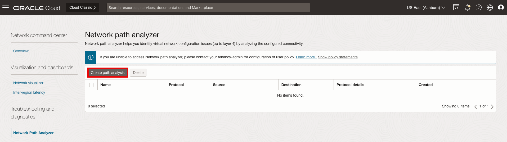
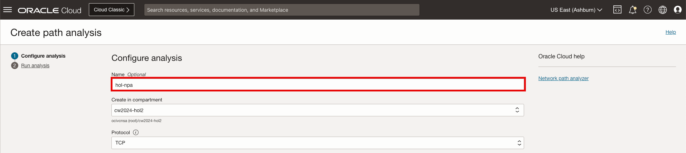
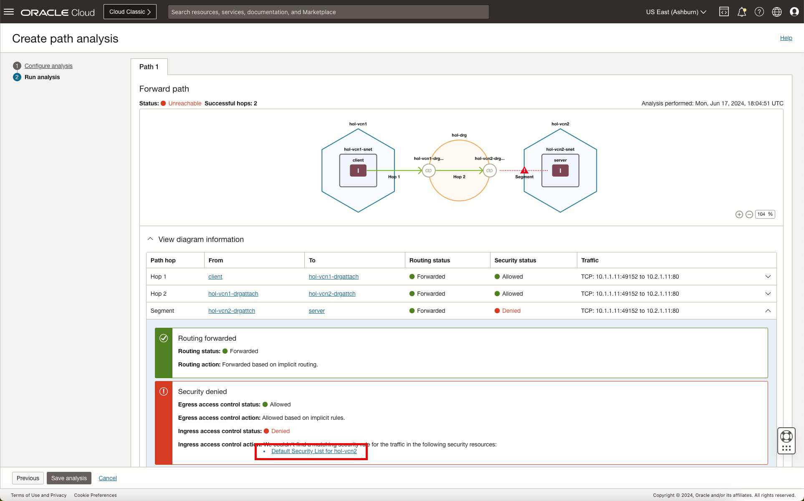

# OCI Network Visualizer and Path Analyzer

## Introduction

Estimated Time: 20 minutes

### About Network Visualizer and Path Analyzer

An Oracle virtual network is composed of virtual cloud networks (VCNs), subnets, gateways, and other resources. These entities are related and connected through routing that's often complex. These resources can also have complex relationships with other Oracle Cloud Infrastructure (OCI) services. The ability to have a concise picture of these entities and their relationships is essential for understanding the design and operation of a virtual network. The Network Visualizer provides a diagram of the implemented topology of all VCNs in a selected region and tenancy.

Network Path Analyzer (NPA) provides a unified and intuitive capability you can use to identify virtual network configuration issues that impact connectivity. NPA collects and analyzes the network configuration to determine how the paths between the source and the destination function or fail. No actual traffic is sent, instead the configuration is examined and used to confirm reachability.

### Objectives

In this lab, you will:

* Evaluate Network Visualizer to visualize your OCI network
* Evaluate Network Path Analyzer to validate the path between your client and server

  

## Task 1: Network Visualizer

We are now ready to use the **Network Visualizer** to further understand our network and the associated components.

The Network Visualizer tool diagram helps you view a high-level structure of network configuration and helps quick navigation between its core components. It provides a view of all resources in a particular combination of region and compartment.

You can view and understand the following from this diagram:

* How VCNs are interconnected
* How on-premises networks are connected (using FastConnect or Site-to-Site VPN)
* Which routing entities (DRGs and so on) control traffic routing
* How transit routing is configured

When you open a diagram for a compartment, it shows resources for all compartments nested underneath. You can also filter out objects from the compartments that you don't want to see.

You can see cross-region connections between network resources and you can also quickly change regions in the Console and see the VCNs in another region.

**Note**: No traffic is needed to provide the topology, the Network Visualizer is built out using the various configuration elements.

Let's begin.

1. On the Oracle Cloud Infrastructure Console Home page, using the Navigation menu (on top left) click **Networking** and under Load Balancers select **Network Command Center**, then **Network visualizer**.

    * Click the Navigation Menu (top left corner)
    * Click **"Networking"**
    * Click **"Network Visualizer"**

      

2. On the visual canvas, users can easily customize the desired view. Click on the **details** icon to view the legend.

    * Click **"details"**
    * Click on the **"X"** to close the window.

      

3. As shown below, Click on the **DRG** orange circle icon to see the associated status and additional details. Once selected the details will appear in the right window pane.

    * Click **"hol-drg"**

      

    * Click **"View additional resource details"**
    * Click **"Close"**

      

        **Note**: The additional details allows for direct access to view attachments, DRG route tables and teh import and export route tables accordingly.

4. As shown below, Click on the **DRG VCN Attachment** chain link icon. Once selected the details will appear in the right window pane.

    * Click **"hol-vcn1-drgattach"**

      

5. As shown below, Click on the **VCN** blue hexagon icon. Once selected the details will appear in the right window pane.

    * Click **"hol-vcn1"**

      

      **Note**: The VCN details such as the associated compartment, IPv6/IPv6, default route and DNS name are highlighted in the right window pane.

6. The **Network Visualizer** is complete, you can now move forward to the **Next Task**

    See the following options to manipulate the image.

    * Export Image - click the downward facing arrow icon to initiate the export modal.

        

    * Resize Image - click the symbols in the bottom right corner of the image canvas to resize and center the image.

        

## Task 2: Network Path Analyzer

Now that we have the network and compute deployed, let's proceed with the **Network Visualizer**.

NPA carefully examines routing and security configurations and identifies the potential network path your defined traffic traverses, along with information about virtual networking entities in the path. In addition to the path information, output of these checks includes how routing rules and network access lists (security lists, NSGs, and so on) allow or deny traffic. The sources and destinations could be within OCI, or across OCI and on-premises, or OCI and internet. NPA analyzes all the standard OCI networking elements with their associated configuration.

Using NPA, you can:

* Troubleshoot routing and security misconfigurations that are causing connectivity issues
* Validate that the logical network paths match your intent
* Verify that the virtual network connectivity setup works as expected before starting to send traffic

To achieve any of these objectives, create a test that you think should work and then run the test. You can also save this test definition to run it again later. Saved tests are displayed in the Network Path Analyzer page for you to select.

The following source and destination scenarios are supported:

* OCI to OCI
* OCI to on-premises
* On-premises to OCI
* Internet to OCI
* OCI to internet

Let's begin.

1. On the Oracle Cloud Infrastructure Console Home page, using the Navigation menu (on top left) click **Networking** and under Load Balancers select **Network Command Center**, then **Network Path Analyzer**.

    * Click the Navigation Menu (top left corner)
    * Click **"Networking"**
    * Click **"Network Path Analyzer"**

      

2. To begin, click **"Create path analysis"**.

    * Click **"Create path analysis"**

      

    In the configuration window provide a name for the path analyzer along with the source and destination.

    Name:
    * Name: **"hol-npa"**

      

    Source:
    * Source: **"Find OCI resource"**
    * Source type: **"Compute instance (VNIC)"**
    * Compute Instance (VNIC): **"client"**
    * Source IPv4 address: **"10.1.1.11"**

      

    Destination:
    * Source: **"Find OCI resource"**
    * Source type: **"Compute instance (VNIC)"**
    * Compute Instance (VNIC): **"server"**
    * Source IPv4 address: **"10.2.1.11"**
    * Destination Port: **"80"**
    * Click **"Run analysis"**

      

        **Note:** Loading may take a minute to generate the results.

3. As noted in the output, the stats of the forward path is **Unreachable**.

    * Analysis Output:

        

    * Click on the **red triangle with the exclamation point** to further understand the potential issue.

        

    From the analysis, we can see that the issue with connectivity is related to the security list entry for port 80 in server VCN, **hol-vcn2**.

4. Click **Default Security List for hol-vcn2** to view the security list and to update accordingly.

    * Click **"Default Security List for hol-vcn2"**

        

5. On the Security List page add the ingress route.

    * Click **"Add Ingress Rules"**
    * Source CIDR: **"0.0.0.0/0"**
    * Destination Port Range: **"80"**
    * Click **"Add Ingress Rules"**

        

    * Click **"Analyze"** (Scroll to the top of the previous page)

        

6. On the Security List page add the ingress route.

    

**Congratulations!** You have completed this lab.

## Acknowledgements

* **Author** - Gabriel Fontenot, Principal Cloud Architect, OCI Networking
* **Last Updated By/Date** - Gabriel Fontenot, June 2024