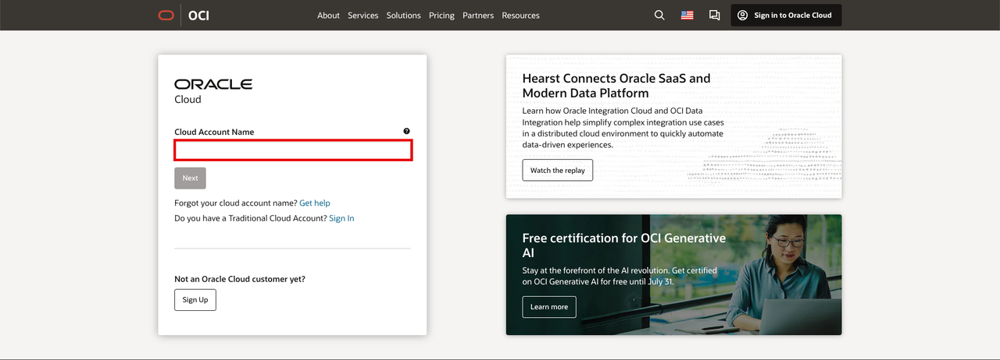
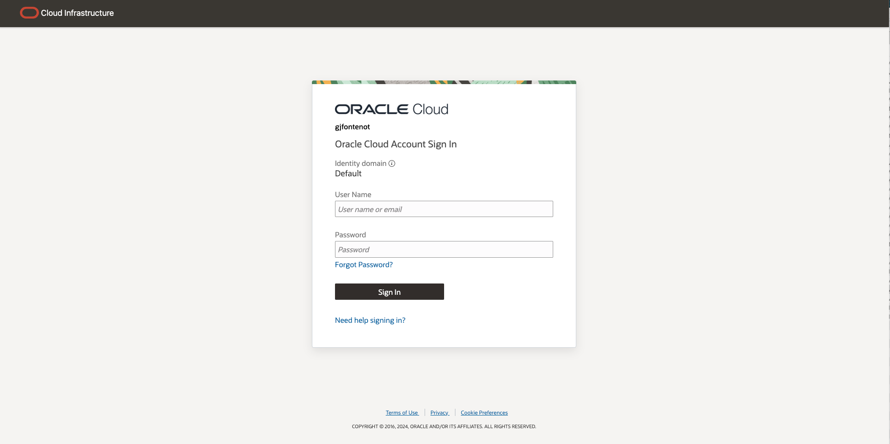
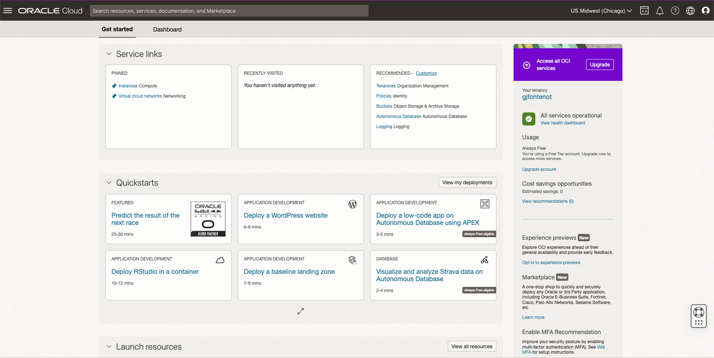

# Getting Started

### Introduction

Estimated Time: 5 minutes

### About Oracle Cloud Infrastructure

Oracle Cloud is the industry's broadest and most integrated cloud provider, with deployment options ranging from the public cloud to your data center. Oracle Cloud offers best-in-class services across Software as a Service (SaaS), Platform as a Service (PaaS), and Infrastructure as a Service (IaaS).

Oracle offers two types of Cloud Accounts:

- Free Tier Accounts: After you sign up for the free [Oracle Cloud promotion](https://docs.oracle.com/en-us/iaas/Content/network-firewall/home.htm) or sign up for a paid account, you’ll get a welcome email. The email provides you with your cloud account details and sign in credentials.

- Oracle Cloud Paid Accounts: When your tenancy is provisioned, Oracle sends an email to the default administrator at your company with the sign-in credentials and URL. This administrator can then create a user for each person who needs access to the Oracle Cloud. Check your email or contact your administrator for your credentials and account name.

**Note**: Either account type can be used to facilitate the exercises within the hands-on-lab.

### Objectives

- Learn how to log in to your Oracle Cloud Account

### Prerequisites

- Cloud Account Name - The name of your tenancy (supplied by the administrator or in your Oracle Cloud welcome email)
- Username
- Password

## Task 1: Log into Oracle Cloud

If you've signed out of the Oracle Cloud, use these steps to sign back in.

1. Go to [cloud.oracle.com](https://cloud.oracle.com/?sourceType=:ow:lp:cpo::::RC_WWMK211125P00013:llid=3872.) and enter your Cloud Account Name and click **Next**. This is the name you chose while creating your account in the previous section. It's NOT your email address. If you've forgotten the name, see the confirmation email.

    - Cloud Account Name
    - Click **"Next"**

        

2. Click **Continue** to reveal the login input fields. Enter your Cloud Account credentials and click **Sign In**. Your username is your email address. The password is what you chose when you signed up for an account.

    - Click **"Continue**
    - Click **"Sign In"**

        

3. Based on the Multi-factor authentication setup for your account, provide authentication to sign into the account. For example, click **Allow** on the app or enter your **authentication code** and click **Verify** based on the authentication setup. For more details, refer the [Managing Multifactor Authentication documentation](https://docs.oracle.com/en-us/iaas/Content/Identity/Tasks/usingmfa.htm)

    - Click **"Verify"**

        

4. After verification, you will be signed in to Oracle Cloud!

    - Log In Complete

        

**Congratulations!** You have successfully logged in. You may now **proceed to the next lab**.

## Acknowledgements

* **Author** - Gabriel Fontenot, Principal Cloud Architect, OCI Networking
* **Last Updated By/Date** - Gabriel Fontenot, June 2024