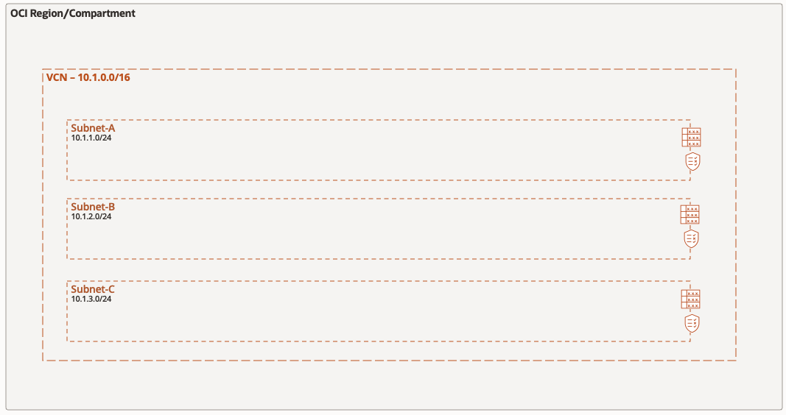
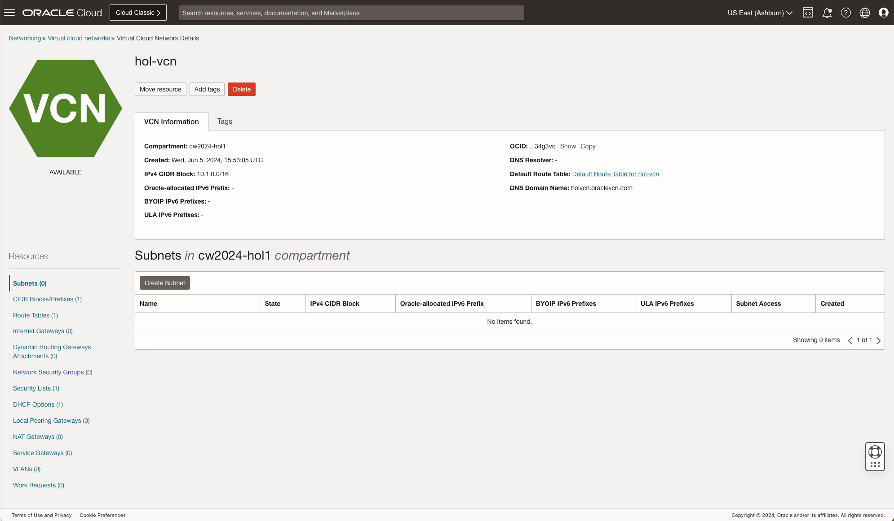
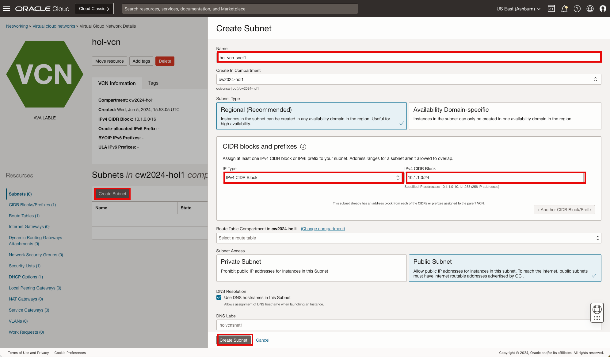
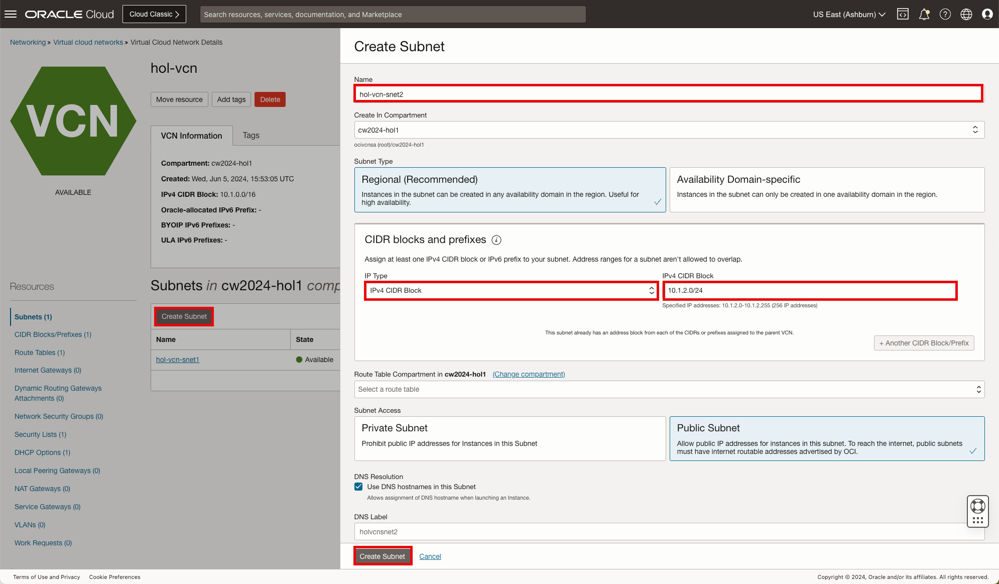
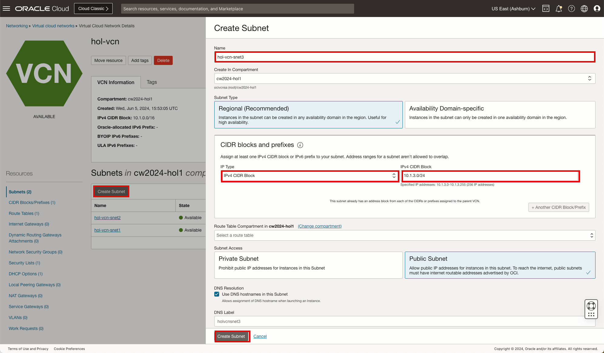
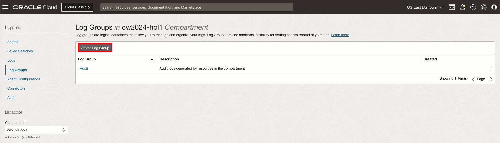
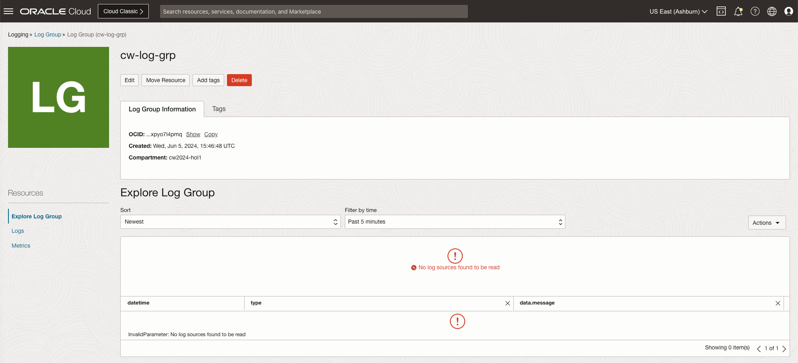
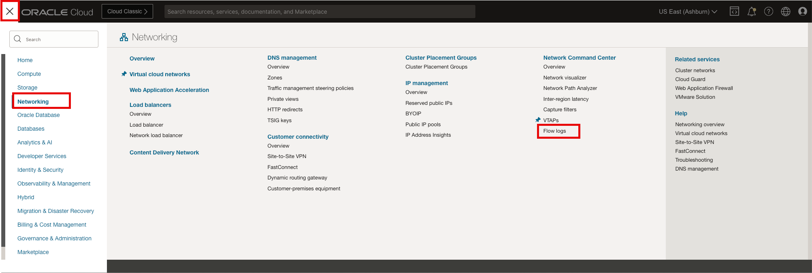
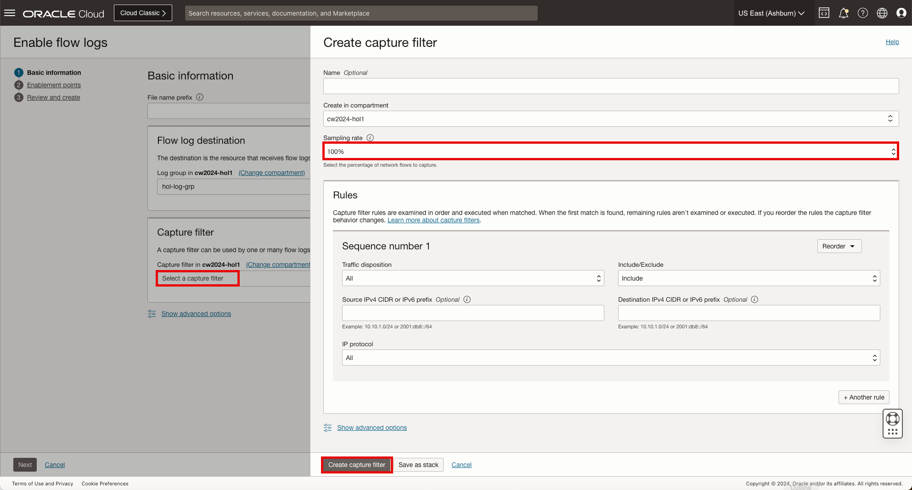
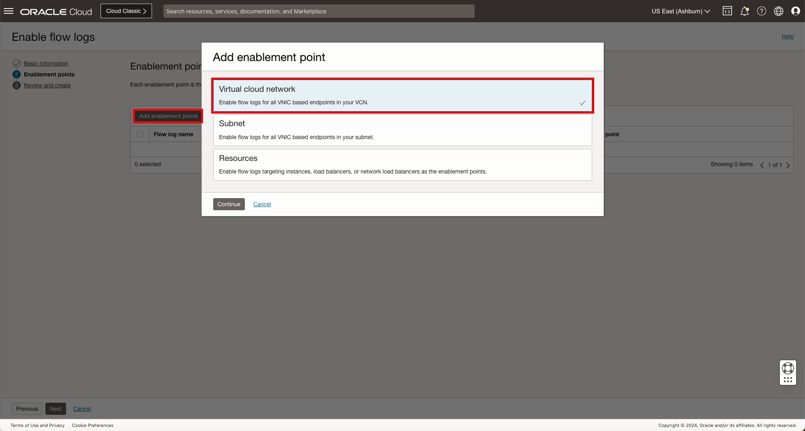

# OCI Network VCN and Subnets

## Introduction

Estimated Time: 10 minutes

### About Virtual Cloud Networks and Subnets

Virtual Cloud Networks (VCNs) provide customizable and private cloud networks in Oracle Cloud Infrastructure (OCI). Just like a traditional data center network, the VCN provides customers with complete control over their cloud networking environment. This includes assigning private IP address spaces, creating subnets and route tables. [Visit our documentation](https://docs.oracle.com/en-us/iaas/Content/Network/Tasks/Overview_of_VCNs_and_Subnets.htm) for more information on Virtual Cloud Networks.

A Subnet is a subdivision of a VCN. Each subnet in a VCN consists of a contiguous range of IPv4 addresses and optionally IPv6 addresses that do not overlap with other subnets in the VCN.

Logs contain critical diagnostic information that tells you how your resources are performing and being accessed. Log groups are logical containers for organizing logs. Logs must always be associated with log groups and you must create a log group to enable the desired log. [Visit our documentation](https://docs.oracle.com/en-us/iaas/Content/Logging/home.htm) for more information on Logging or [Visit our documentation](https://docs.oracle.com/en-us/iaas/Content/Network/Concepts/vcn-flow-logs.htm#vcn_flow_logs) for more details on VCN Flow Logs.

### Objectives

In this lab, you will:

* Create a Log Group to organize the subnet Flow Logs
* Build a Virtual Cloud Network (VCN) to provide the foundation for the network access
* Create three public subnets in the VCN to accommodate the client/server communication and the VTAP monitoring
* Enable Flow Logging for each subnet

When you complete the exercise, the network topology will look like the following, one VCN and three subnets.

### Prerequisites

* Basic knowledge of OCI Networking components and networking.

## Task 1: Select a Home Region

Let's begin.

1. To begin the lab exercise, ensure you are logged into the Oracle Cloud console and select the desired **Home Region** region. The region can be accessed on the menu bar located at top right of the screen.

    * Click **"US East (Ashburn)"**

        

        **Note**: This lab can be completed in any OCI region you have access to with the required resources. Based on your account, select the desired region to complete the exercise. For the purpose of this lab we will use the **"US East (Ashburn)"** region.

## Task 2: Create a VCN (Virtual Cloud Network)

We will start with a basic VCN deployment. One of the goals of this **livelab** is also to provide an understanding of OCI constructs needed for deploying the compute instances and creating connections to view the VTAP and Flow Logs. For this reason, we will not use the VCN Wizard which deploys all OCI Gateways and creates basic routing rules. Instead, we will manually create each artifact as needed.

Let's begin.

1. On the Oracle Cloud Infrastructure Console Home page, using the Navigation menu (on top left) click **Networking** and click on **Virtual cloud networks**.

    * Click the Navigation Menu (top left corner)
    * Click **"Networking"**
    * Click **"Virtual cloud networks"**

        

2. Make sure you have the correct Compartment selected and click **Create VCN** in the **Virtual Cloud Networks** table. The VCN will provide the network foundation for all the components related to the compute instances and required network monitoring.

    * Click **"Create VCN"**
    * Name: **"hol-vcn"**
    * IPv4 CIDR: **"10.1.0.0/16"** (Press enter)
    * Click **"Create VCN"**

        

        **Note**: If not directed to update/change a field, leave everything else as default.

3. The **VCN** is created, you can now move forward to the **Next Task**.

    

    **Note**: Upon creating the **VCN** the workflow will take you directly to the subnet creation page.

## Task 3: Create VCN Subnets

Now that we have a VCN created, we will create three subnets for the compute and network resources.

Let's begin.

1. In the Subnets table, Click **Create Subnet** to create the first subnet. The first subnet will provide network access for the compute instance representing the client.

    * Click **"Create Subnet"**
    * Name: **"hol-vcn-snet1"**
    * IP Type: **"IPv4 CIDR Block"**
    * IPv4 CIDR: **"10.1.1.0/24"**
    * Click **"Create Subnet"**

        

        **Note**: We will repeat this step for the additional subnets.

2. In the Subnets table, Click **Create Subnet** to create the second subnet. The second subnet will provide network access for the compute instance representing the server.

    * Click **"Create Subnet"**
    * Name: **"hol-vcn-snet2"**
    * IP Type: **"IPv4 CIDR Block"**
    * IPv4 CIDR: **"10.1.2.0/24"**
    * Click **"Create Subnet"**

        

3. In the **Subnets table**, Click **Create Subnet** to create the third subnet. The third subnet will provide network access for the compute instance representing the vtap monitoring host.

    * Click **"Create Subnet"**
    * Name: **"hol-vcn-snet3"**
    * IP Type: **"IPv4 CIDR Block"**
    * IPv4 CIDR: **"10.1.3.0/24"**
    * Click **"Create Subnet"**

        

4. The **subnets** are created, you can now move forward to the **Next Task**.

    

## Task 4: Create Log Group

With log groups, you do not have to rely on complex compartment hierarchies to secure your logs. We will create a log group to facilitate the flow logs in the section to come.

Let's begin.

1. On the Oracle Cloud Infrastructure Console Home page, using the Navigation menu (on top left) click **Observability and Management** and click on **Log Groups**.

    * Click the Navigation Menu (top left corner)
    * Click **"Observability and Management"**
    * Click **"Log Groups"**

        

2. In the Log Group tables, click **Create Log Group** to create the log group.

    * Click **"Create Log Group"**

        

    In the log group configuration window, use the data below to create the log group:

    * Name: **"hol-log-grp"**
    * Click **"Create"**

        

3. The **Log Group** is created, you can now move forward to the **Next Task**.

    

## Task 4: Create VCN Flow Log

With VCN Flow Logs, you can capture network traffic information to support monitoring and security needs. We will enable the flow logs in the section below.

Let's begin.

1. On the Oracle Cloud Infrastructure Console Home page, using the Navigation menu (on top left) click **Networking** and click on **Flow logs**.

    * Click the Navigation Menu (top left corner)
    * Click **"Networking"**
    * Click **"Flow logs"**

        

2. In the Flow log configurations tables, click **Enable flow logs** to create the log group.

    * Click **"Enable flow logs"**

        

3. In the Enable flow logs **"Basic information"** window, use the data below:

    Name and Flow log destination

    * File name prefix: **"hol-flow-log"**
    * Select **"hol-log-grp"**

        

    Capture filter

    * Select **"Select a capture filter"**
    * Select **"Create new capture filter"**
    * Select Sampling rate: **"100%"**

        

4. In the Enable flow logs **"Enablement points"** window, use the data below:

    * Click **"Add enablement points"**
    * Select **"Virtual cloud network"**
    * Click **"Continue"**

        

    * Virtual cloud network: **"hol-vcn"**
    * Click **"Add enablement points"**
    * Click **"Next"**

        ![loggroup-create](images/flowlogs-enablementpoints.png

5. In the Enable flow logs **"Review and create"** window, use the data below:

    * Click **"Enable flow logs"**

        ![loggroup-create](images/flowlogs-enable.png

6. **Flow Logs** are now enabled, you can now move forward to the **Next Task**.

    

    **Note**: It may take a minutes to transition to active.

7. Click **Oracle Cloud** in the top left of the menu bar to return to the home page.

    * Click **"Oracle CLoud"**

        

**Congratulations!** You have successfully created a VCN and the associated three Subnets with logging enabled. You may now **proceed to the next lab**.

## Acknowledgements

* **Author** - Gabriel Fontenot, Principal Cloud Architect, OCI Networking
* **Last Updated By/Date** - Gabriel Fontenot, June 2024