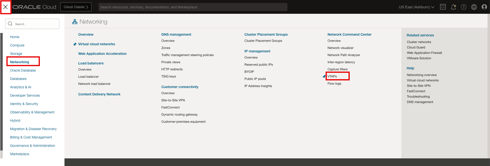
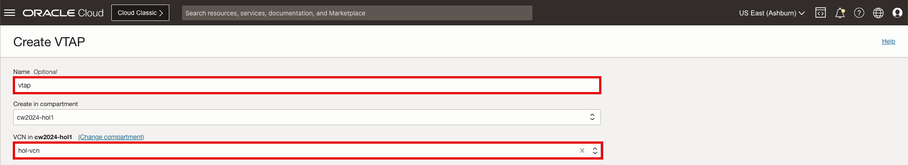
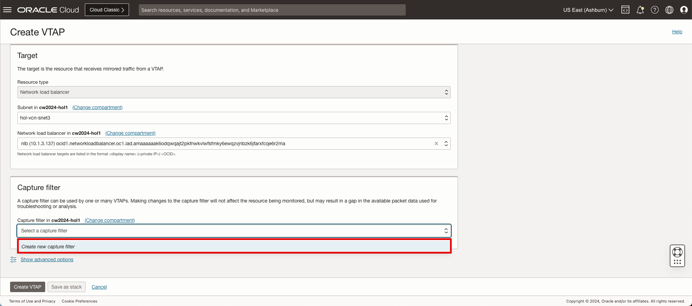
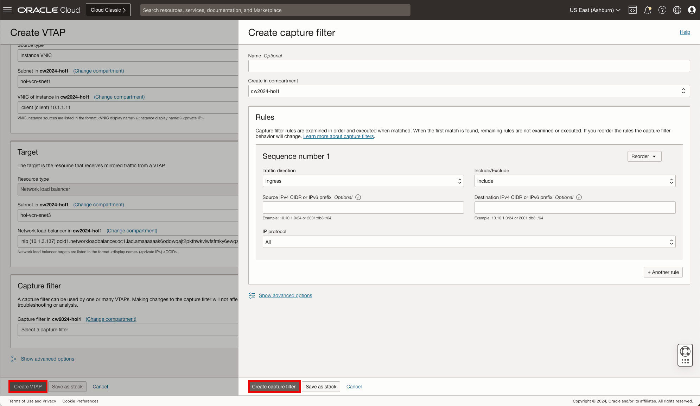
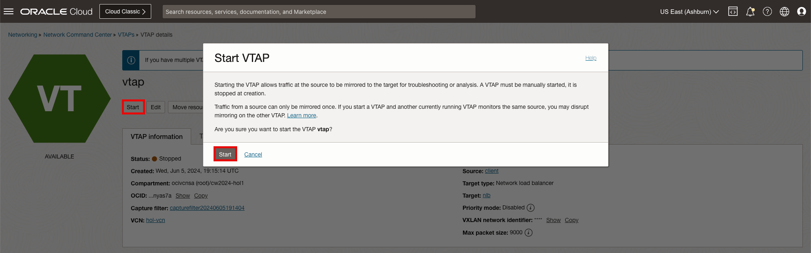
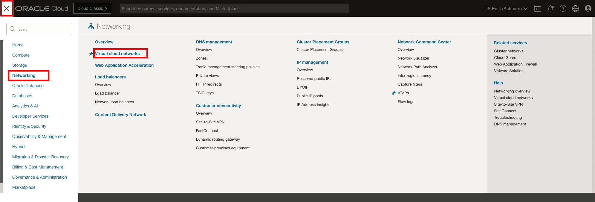
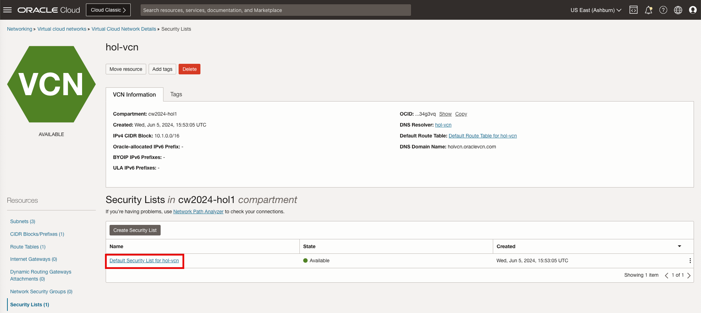
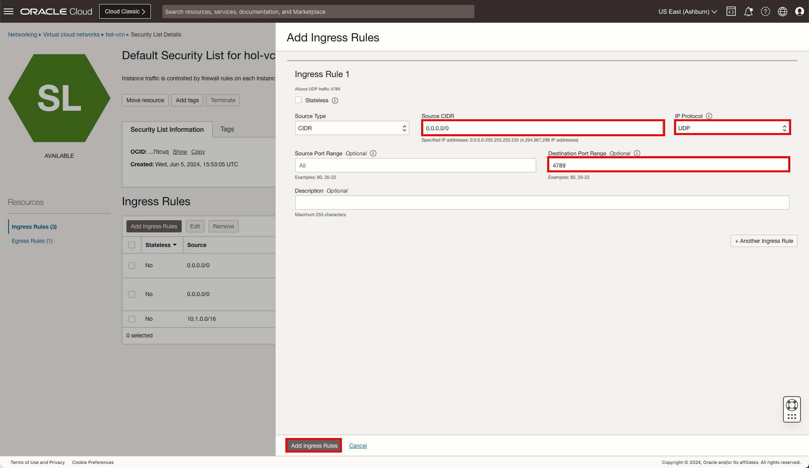
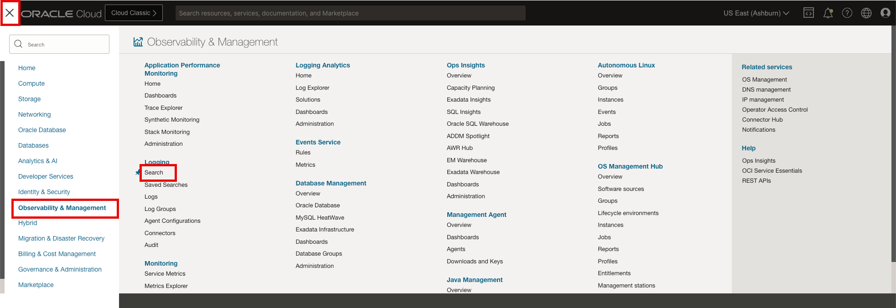
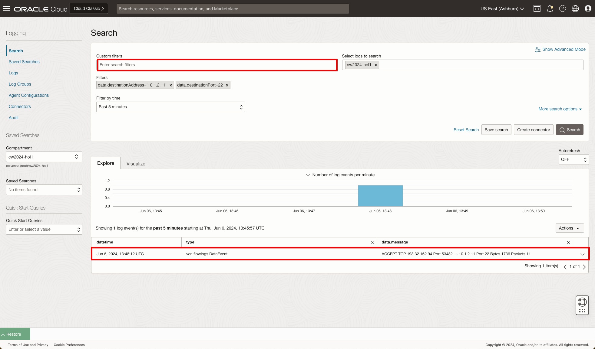

# OCI Network VTAPs and Flow Logs

## Introduction

Estimated Time: 20 minutes

### About VTAPs

Virtual Test Access Point, VTAP, functionality is sometimes referred to as traffic mirroring. It copies traffic that traverses a specific point in the network and sends the mirrored traffic to a network packet collector or network analytics tool for further analysis. A VTAP is like a virtual version of port mirroring except, instead of mirroring a port, we mirror traffic at a specific Oracle resource, such as OCI Database service, Exadata virtual machine (VM) cluster, instance virtual network interface cards (VNICs), load balancer as a service (LBaaS), or Autonomous Data Warehouse. Mirrored traffic generated at the VTAP source counts against the total available bandwidth of the VNIC. If congestion occurs, OCI prioritizes production traffic, and mirrored traffic is dropped first. [Visit our documentation](https://docs.oracle.com/en-us/iaas/Content/Network/Tasks/vtap.htm) for more information on VTAPs.

Network Load Balancer provides the benefits of flow high availability, source and destination IP addresses, and port preservation. It is designed to handle volatile traffic patterns and millions of flows, offering high throughput while maintaining ultra low latency. The Network Load Balancer will be used by the VTAP for receiving VTAP flows and distributing output for monitoring. [Visit our documentation](https://docs.oracle.com/en-us/iaas/compute-cloud-at-customer/topics/nlb/network-load-balancing.htm) for more information on NLBs.

A security list acts as a virtual firewall for an instance, with ingress and egress rules that specify the types of traffic allowed in and out. The default security list will be updated to allow the VTAP traffic to flow within the VCN. [Visit our documentation](https://docs.oracle.com/en-us/iaas/Content/Network/Concepts/securitylists.htm) for more information on Security Lists.

### Objectives

In this lab, you will:

* Deploy an instance of an NLB (Network Load Balancer) as a receiver for VTAP flows
* Create a VTAP for monitoring network communications between the client and server compute instances
* Update the default Security List to include the VTAP port
* Generate network traffic from the client to the server
* Use the VTAP monitor and Flow Logs to identify the client/server network flows

  

### Prerequisites

* Basic knowledge of OCI Networking components and networking.

## Task 1: Create NLB

We are now ready to deploy the **Network Load Balancer**, NLB, that will be used by the VTAP in the subsequent steps.

Let's begin.

1. On the Oracle Cloud Infrastructure Console Home page, using the Navigation menu (on top left) click **Networking** and under Load Balancers select **Network load balancer**, then **Create network load balancer**.

    * Click the Navigation Menu (top left corner)
    * Click **"Networking"**
    * Click **"Network load balancer"**

      

    * Click **"Create network load balancer"**

      

2. In the Network load balancer **Add details** screen, update the **Load balancer name** and scroll down to **Choose networking** section to update the subnet then click **Next**.

    * Load balancer name: **"nlb"**
    * Virtual cloud network: **"hol-vcn"**
    * Subnet: **"hol-vcn-snet3"**
    * Click **"Next"**

      

3. In the Network load balancer **Configure listener** screen, update the name and select **Specify the port** and provide the UDP port number then click **Next**.

    * Listener name: **"listener"**
    * Specify the port: **"4789"**
    * Click **"Next"**

      

4. In the Network load balancer **Choose backends** screen, update the name and select **Add backends** and update the **Specify the health check** then click ** **Next**.

    Select backends

    * Name: **"backendset"**
    * Click **"Add backends"**

      

    Add Backends

    * Select Instance: **"vtap"**
    * Click **"Add backends"**

      

    Specify Health check policy
    * Protocol: **"Protocol"**
    * Port: **"TCP Port 22"**
    * Click **"Next"**

      

5. In the Network load balancer **Review and create** screen, review the configuration and click ** **Create network load balancer**.

    * Click **"Create network load balancer"**

      

6. The **NLB** is configured, you can now move forward to the **Next Task**

## Task 2: Create VTAP

Now that we have the network load balancer deployed, let's proceed with the VTAP. The VTAP will forward matching traffic to the network load balancer for distribution to the compute instances.

Let's begin.

1. On the Oracle Cloud Infrastructure Console Home page, using the Navigation menu (on top left) click **Networking** and under Network Command Center select **VTAPs**, then in the VTAP list **Create VTAP**.

    * Click the Navigation Menu (top left corner)
    * Click **"Networking"**
    * Click **"VTAPs"**

      

2. In the menu that opens, we need to input data into multiple fields. Unless specified otherwise in this tutorial, leave the fields with the **Default** input.

    * Click **"Create VTAP"**

      

3. In the Create VTAP configuration window, provide the details to complete the configuration of the desired VTAP: Name, select the desired VCN, define the Source, Target and Capture filter.

    Name and VCN

    * Name: **"vtap"**
    * VCN: **"hol-vcn"**

      

    Source

    * Source Type: **"Instance VNIC"**
    * Subnet: **"hol-vcn-snet1"**
    * VCN Instance: **"client (client) 10.1.1.11"**

      

    Target

    * Subnet: **"hol-vcn-snet3"**
    * Network Load balancer: **"nlb (10.1.3.x)"**

      

    Capture Filter
    * Select **"Create Capture Filter"**

      

    * Click **"Create capture filter"**
    * Click **"Create VTAP"**

        

    Start VTAP

    * Click **"Start"**

        

4. The **VTAP** is configured, you can now move forward to the **Next Task**.

## Task 3: Update Security List

Unlike other security lists, the default security list comes with an initial set of stateful rules, which should in most cases be changed to only allow inbound traffic from authorized subnets relevant to the region that homes that VCN or subnet. For this exercise we will modify the default security list to include the VTAP port UDP 4789. VTAP uses this port/protocol to send collected flows to the desired monitor.

Let's begin.

1. On the Oracle Cloud Infrastructure Console Home page, using the Navigation menu (on top left) click **Networking** and click on **Virtual cloud networks**.

    * Click the Navigation Menu (top left corner)
    * Click **"Networking"**
    * Click **"Virtual cloud networks"**

      

2. Select the VCN.

    * Select VCN **"hol-vcn"**

      

3. On the VCN page, under **Resources** click **Security List**.

    * Click **"Security Lists"**

      

4. On the Security list page, click **Default Security List**

    * Click **"Default Security Lists for vcn-lab"**

      

5. On the Default Security Lists page under **Ingress Rules** click **Add Ingress Rules**.

    * Click **"Add Ingress Rules"**

      

6. On the Add Ingress Rules page configure the rule.

    * Source CIDR: **"0.0.0.0/0"**
    * Select IP Protocol: **"UDP"**
    * Destination Port Range: **"4789"**
    * Click **"Add Ingress Rules"**

      

7. The **Security List** is updated, you can now move forward to the **Next Task**

## Task 4: VTAP Monitoring

We now have the environment complete with networking and compute resources. As mentioned previously, the VCN is the foundation for the infrastructure and has three subnets simulating the client/server network and the networking monitoring segment. In this exercise, we will now utilize the cloud shell (deployed earlier) to access the client compute instance and generate ssh traffic to the server compute instance.

Once we have attempted an SSH session between the client and server, we will then access the vtap compute instance to view the network flows between the client and server. The vtap compute instance receive a mirror of all traffic on the client interface VNIC.

Let's begin.

1. On the Oracle Cloud Infrastructure Console Home page, using the Navigation menu (on top left) click **Compute** and under Compute select **Instances**. This view will articulate the compute instances and the associated ip addresses for each. We will use this data for accessing the compute instances via ssh.

    * Click the Navigation Menu (top left corner)
    * Click **"Compute"**
    * Click **"Instances"**

        

2. Click Developer Tools then Cloud Shell to open the cloud shell.

    * Click **"Developer Tools"**
    * Click **"Cloud Shell"**

      

3. Log into the VTAP server to enable tcpdump. TCPDUMP is powerful command-line packet analyzer that is part of the compute instances that will allow us to capture the client/server traffic and display the output via the command line.

    In the command shell ssh to the vtap compute instance.

      * Note the **"Private IP"** of the **"vtap"** instance

        

      * Command: SSH to the client: **"ssh -i .ssh/id_rsa opc@10.1.3.11"**
      * When prompted, "Are you sure you want to continue connecting (yes/no)? **"yes"**

        

    In the command shell issue the command to enable the TCPDUMP for the interface while listening on the VTAP port, UDP 4789.

      * Command: **"sudo tcpdump -i enp0s6 udp port 4789"**

        

        

        
<b>Additional information: TCPDUMP</b>

            Filtering hosts:
            Match any traffic involving 192.168.1.1 as destination or source:
            - tcpdump host 192.168.1.1

            As source only:
            - tcpdump src host 192.168.1.1

            As destination only:
            - tcpdump dst host 192.168.1.1

            Ports filtering:
            Match any traffic involving port 25 as source or destination:
            - tcpdump port 25

            As source only:
            - tcpdump src port 25

            As destination only:
            - tcpdump dst port 25

            Network filtering
            - tcpdump net 192.168
            - tcpdump src net 192.168
            - tcpdump dst net 192.168

            Protocol filtering
            - tcpdump ip
            - tcpdump tcp
            - tcpdump udp
            - tcpdump icmp

            Combine expressions:
            For example the following rule will match any TCP traffic on port 80 (web) with 192.168.1.254 or 192.168.1.200 as destination host:
            - tcpdump '((tcp) and (port 80) and ((dst host 192.168.1.254) or (dst host 192.168.1.200)))'

            This one will match any ICMP traffic involving the destination with physical/MAC address 00:01:02:03:04:05:
            - tcpdump '((icmp) and ((ether dst host 00:01:02:03:04:05)))'

            This will match any traffic for the destination network 192.168 except destination host 192.168.1.200:
            - tcpdump '((tcp) and ((dst net 192.168) and (not dst host 192.168.1.200)))'

        

4. In a new window/tab, log into the client to initiate traffic. Using a separate window/tab will allow us to have an SSH session open to each compute instance.

    In the command shell ssh to the client compute instance. Take note of the **"Private IP"** of the **"client"** instance

    

      * Command: SSH to the client: **"ssh -i .ssh/id_rsa opc@10.1.1.11"**
      * When prompted, Are you sure you want to continue connecting (yes/no)? **"yes"**

    In the command shell issue the command to ssh from the client to the server. This traffic will be mirrored to the VTAP compute instance for analysis.

      * Command: **"ssh 10.1.2.11"**

        

5. Now switch back to the VTAP console and view the output on the VTAP compute instance.

    

    **Note**: The mirrored traffic in the output window can be saved and downloaded for further analysis.

## Task 4: Flow Log Search

Now that we have explored the mirrored client/server communication using VTAP, let's proceed with inspecting the network traffic using the Flow Logs. Flow search provides a full view into the Flow Logs to evaluate flows to and from compute instances. The Flow Search capabilities gives you various ways to search for specific traffic. For this exercise we will use the destination ip address and the destination port.

Let's begin.

1. On the Oracle Cloud Infrastructure Console Home page, using the Navigation menu (on top left) click **Observability and Management** and click on **Logs**.

    * Click the Navigation Menu (top left corner)
    * Click **"Observability and Management"**
    * Click **"Logs"**

      

2. Under **Logging** click **Search** to begin the process of identifying matching traffic in the flow logs stored in the designated log group.

    We are interested in identifying the Flow Logs associated with the client and server connectivity, specifically on traffic destined for port 22.

    * Click **"Search"**
    * Custom filters: **"data.destinationAddress = 10.1.2.11"**
    * Custom filters: **"data.destinationPort = 22"**

      

    There are many use cases that can be addressed by collecting Flow Logs. As such the filters created can be complex and creative.

**Congratulations!** You have completed this lab.

## Acknowledgements

* **Author** - Gabriel Fontenot, Principal Cloud Architect, OCI Networking
* **Last Updated By/Date** - Gabriel Fontenot, June 2024
