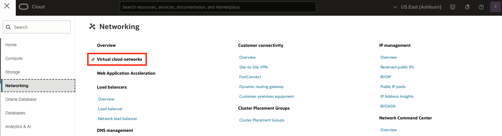
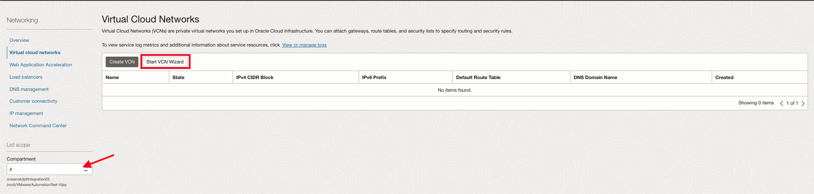
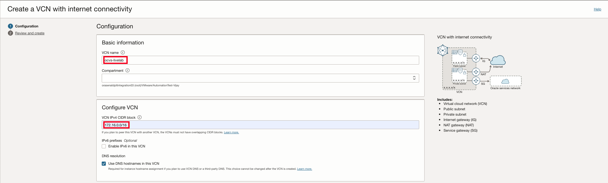
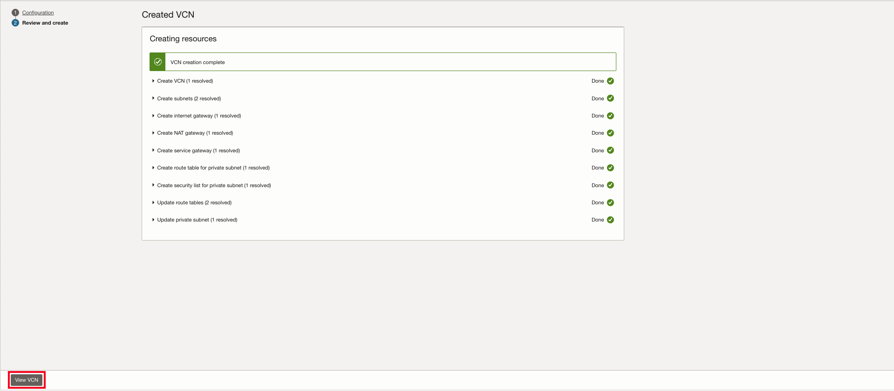
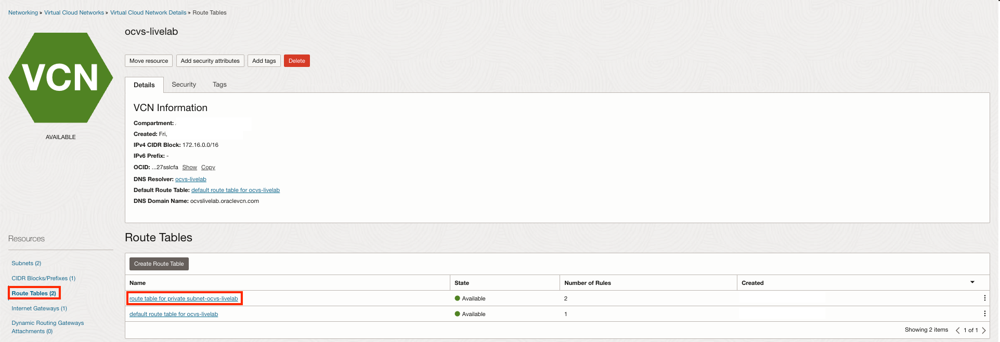
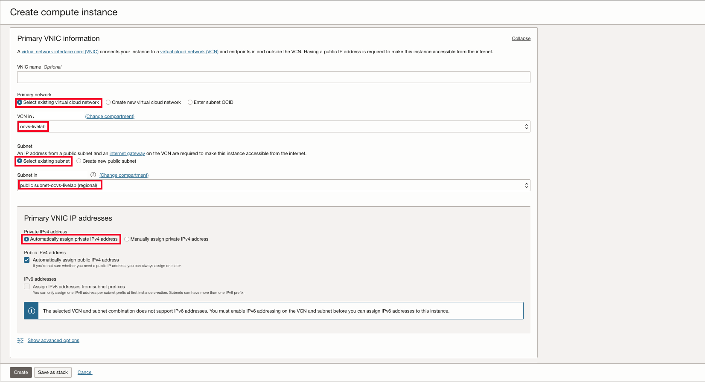

# Configure Networking and Access Components

## Introduction

In this lab we will be setting up the Virtual cloud network which will contain our two servers. The Bastion host to be able to access the Jump Server securely.

Estimated Time: 30 minutes

### About Compute Service
Oracle Cloud Infrastructure Compute lets you provision and manage compute hosts, known as instances. You can define instances as needed to meet your compute and application requirements.

### Prerequisites

This lab assumes you have:
* An Oracle account
* Familiarity with Networking is desirable, but not required
* Some understanding of cloud, networking
* Familiarity with Oracle Cloud Infrastructure (OCI) is helpful

### Objectives

In this lab, you will:
* Learn how to provision OCI resources.

## Task 1 - Create VCN

To Create a VCN on Oracle Cloud Infrastructure:

1. On the Oracle Cloud Infrastrucutre Console homepage, on the top left you will find the hamburger menu.

    

2. Select **Networking**, and then **Virtual cloud networks**.

    

    Here!!!

3. Select the **compartment** next to the **Applied filters**. Ensure you are in the correct compartment to deploy your VCN.

    

4. Select the **Actions**, and then **Start VCN Wizard**. Select **Create VCN with Internet Connectivity** and **Start VCN Wizard**.

    

5. The VCN Wizard will help provision, a VCN, a Public and Private Subnet, an Internet Gateway, NAT Gateway, and a Service Gateway. We will start by giving the VCN a name,

    ```
    <copy>
    ocvs-livelab
    </copy>
    ```

    next, you will provide the **IPv4 CIDR Blocks**,

    ```
    <copy>
    172.16.0.0/16
    </copy>
    ```

    

6. Add the **IPv4 CIDR Blocks** for the Public and Private subnets,

    ```
    <copy>
    172.16.0.0/24
    </copy>
    ```

    ```
    <copy>
    172.16.1.0/24
    </copy>
    ```

    click next to review and create.

    

## Task 2 - Configure Security Rules and Routing

1. After provisioning your VCN. Click **View VCN**.



2. Click on **Security** on the VCN details page and click on **security list for private subnet-ocvs-livelab**. Here will configure the Security Rules.

    

3. Click on **Security rules** and then **Add Ingress rules**.

    

    Here we will add the **Source CIDR** and **Port** to allow access through TCP for the jump server.

    ```
    <copy>
    172.16.0.0/16
    </copy>
    ```

    ```
    <copy>
    3389
    </copy>
    ```

    

4. Next we'll verify that our routing rules are correct. Click on the **Routing** and then on **route table for private private subnet-ocvs-livelab**.

    

    Verify the rules for the NAT and Service Gateways. The NAT Gateway will gives cloud resources without public IP addresses access to the internet without exposing those resources to incoming internet connections. A service gateway lets resources in your VCN privately access specific Oracle services, without exposing the data to an internet gateway or NAT.

    

5. Finally, verify the rules for the Internet Gateway. Click on the **Routing** and then on **default route table for ocvs-livelab**

    

    An internet gateway is an optional gateway you can add to your VCN to enable direct connectivity to the internet.

    

## Task 3: Generate SSH Key

The SSH (Secure Shell) protocol is a method for secure remote login from one computer to another. SSH enables secure system administration and file transfers over insecure networks using encryption to secure the connections between endpoints. SSH keys are an important part of securely accessing Oracle Cloud Infrastructure compute instances in the cloud.

If you already have an SSH key pair, you may use that to connect to your environment.

### **On Mac**

1. On Mac, start up the terminal by using cmd + space and typing terminal or cmd + shift + U and click on terminal

  Once in the terminal type ssh-keygen or copy and paste the command into the terminal, press enter. You will prompted to enter file to save your key. pressing enter will select default in your .ssh folder. Press enter twice for no passphrase. Remember where it is saved as we will reference this later when creating instances.

    

    ```
    <copy>
    ssh-keygen
    </copy>
    ```

### **On Windows 10**

1. Open a Powershell command window on your Windows 10 system by clicking it’s icon/tile or by typing ‘powershell’ in the search field in the Start bar.

  

2. Once in the terminal type ssh-keygen or copy and paste the command into the terminal, press enter. You will prompted to enter file to save your key. pressing enter will select default in your .ssh folder. Press enter twice for no passphrase. Remember where it is saved as we will reference this later when creating instances.

    ```
    <copy>
    ssh-keygen
    </copy>
    ```

  

### **Verifying the Keys**

To verify that your keys exist, You can use the following commands.

```
    <copy>
    cd .ssh
    </copy>
```
```
    <copy>
    ls
    </copy>
```
```
    <copy>
    cat id_rsa.pub
    </copy>
```


## Task 4 - Deploy Bastion and Jump Server Instance

1. We will be deploying a Bastion first, a Bastion instance allows you to access to the private subnet we created in the last task. Lets start by going to the hamburger menu on the top left, click on **compute** and then **instances**.

    

2. Click on **Create Instance**. Fill in the **name** for the bastion host and ensure that your in the correct **compartment**.

    

3. Click on **change image**, select Oracle Linux

    

    select **Oracle Linux**,

    

    select the Oracle linux 8 image and click **Select image**.

    

4. Next, we will be selecting the shape for our bastion. Click on **Change shape**. 

    

    Select the following; 

    **Instance type**

    ```
    Virtual machine
    ```

    **Shape series**

    ```
    AMD
    ```

    **Shape name**

    ```
    VM.Standard.E4.Flex
    ```

    and click on **Select shape** when finished.

    

5. Click **Next** to get to task 3 to set up networking for the bastion host. For the Primary networking we will be using the existing VCN we created in task 1. Ensure that you using the correct **compartment** were you created the VCN. We will also be using the existing public subnet we created in task 1.

    

6. Next we will upload our SSH public key file, select **Upload public key file (.pub)**, drop your key inside the box and select **Next** to move on to storage, which we leave at default.

    

7. Review your compute instance and click **Create** after reviewing.

    

    After creation please take note of the **Public IP address** in the details page of the bastion host instance.

    

8. We will repeat the process for the jump server, however the difference is we will be using the **Windows Server 2022 Datacenter**

    

    and placing it in our **private subnet** we created.

    

**Congratulations!**
**You may proceed to the next lab!**

## Learn More
* [VCNs & Subnets](https://docs.public.oneportal.content.oci.oraclecloud.com/en-us/iaas/Content/Network/Tasks/Overview_of_VCNs_and_Subnets.htm)
* [SSH Keys](https://docs.oracle.com/en/learn/generate_ssh_keys/index.html)
* [Compute Service](https://docs.oracle.com/en-us/iaas/Content/Compute/Concepts/computeoverview.htm)
* [Physical Architecture Concepts](https://docs.oracle.com/en-us/iaas/Content/GSG/Concepts/concepts-physical.htm)


## Acknowledgments

* **Author:** Vijay Kumar
, Cloud Engineering OCVS
* **Contributors:**
    - Chris Wegenek, Cloud Engineering
    - Karthik Meenakshi Sundaram, Cloud Engineering
    - Germain Vargas, Cloud Engineering
    - Kelly Montgomery, Cloud Engineering

* **Last Updated By/Date:** Germain Vargas, Cloud Engineering, February 2025