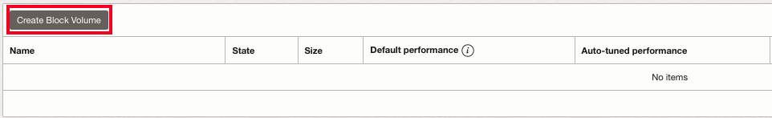
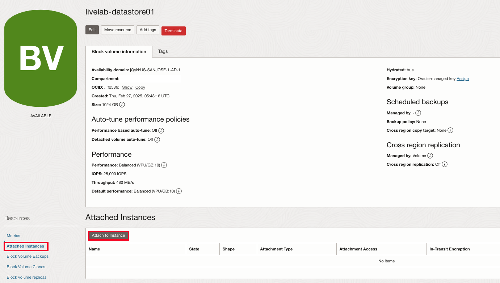
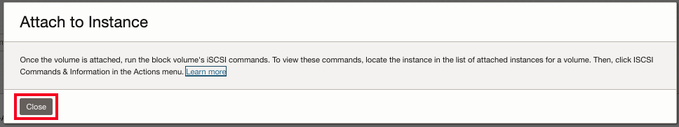
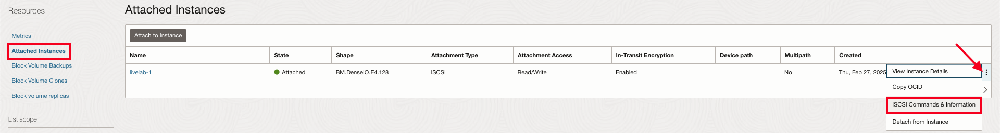
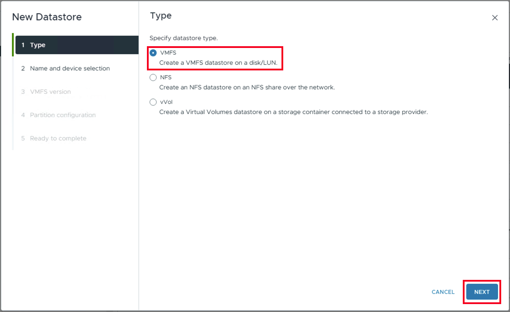

# Lab 3: Create New Datastore with OCI Block Volume

## Introduction

In this lab you will create a new OCI Block Volume, attach the volume to ESXi hosts and create a new VMFS datastore on this Block Volume, this volume will then be used to host workload virtual machines.

**Estimated Time:** 15 Minutes

### Prerequisites

It is assumed that you have access to or familiarity with following components:

- An Oracle account
- An existing OCVS environment.
- Necessary user permissions to create, attach and manage OCI Block Volumes.
- Familiarity with Oracle Cloud Infrastructure (OCI) and VMware SDDC stack.
- Familiarity with basic VMware Storage terminology will also be helpful.

### Objectives

In this lab, you will;

- Create a new OCI Block Volume.
- Attach the volume to OCVS BareMetal instance.
- Configure ESXi Storage Adapter
- Create VMFS Datastore

## Task 1: Create OCI Block Volume

The Oracle Cloud Infrastructure Block Volume service lets you dynamically provision and manage block storage volumes. You can create, attach, connect and move volumes as needed to meet your storage and application requirements. Once attached and connected to an instance, you can use a volume like a regular hard drive. Volumes can also be disconnected and attached to another instance without the loss of data.

1. Click the **Hamburger Icon** in the upper left. Navigate to **Storage**, and click **Block Storage**.

2. In Block Volume service, click **Create Block Volume**.

3. Provide the following details for the new volume;
      1. **Name:** livelab-datastore01
      2. **Compartment:** Same as OCVS compartment
      3. **Availability Domain:** It must be the same as the AD you chose for your instance
      4. **Volume size and performance**: Default
      5. **Backup policies**: No Policy
      6. **Cross region replication**: Off
      7. **Volume Encryption**: Encrypt using Oracle-managed keys
      8. Click **Create Block Volume**.

4. The volume will be ready to attach once its icon no longer lists it as **PROVISIONING** in the volume list.

## Task 2: Attach Volume to OCI Instance

Once the Block Volume is created, you can attach it to the ESXi Host instance. When attaching a Block Volume to Bare Metal instances iSCSI is the only supported attachment method.

1. Scroll down and on the left under **Resources**, select **Attached Instances**
2. Then click on the **Attach to Instance** button.

3. In the **Attach to Instance** pane;
      1. Select **iSCSI**
      2. Select **Read/Write Shareable**
      3. Accept the warning
      4. Click on **Select Instance**
      5. Under Instance, select the **ESXi host** in the drop-down menu, e.g., livelab-1
      6. Click **Attach** (This action will take ~2 minutes)

4. Click **Close**.

## Task 3: Configure ESXi Storage Adapter

After you attach the block volume to the host instance, you need to get the iSCSI IP Address and Port, and configure this in the ESXi iSCSI adapter.

1. On the **Block Volume overview** page, select **Attached Instances**.
2. Open the **vertical 3 dot ellipsis** menu to the far right of the ESXi host name.
3. Select **iSCSI Commands and Information**.

4. Under the **IP Address and Port field**, copy the **IP address**. We don't need the port as the default port is already configured in the ESXi iSCSI adapter.
5. Select **Close**.

6. Access vCenter as Described in [Review OCVS SDDC](?lab=deploy_ocvs#Task3:ReviewOCVSSDDC)
7. Expand the vCenter inventory and select the **ESXi host**, e.g., sddc-lab001-1
8. Select **Configure**
9.  Select **Storage Adapters**
10. Select the **iSCSI Software Adapter**
11. In the lower menu, select **Dynamic Discovery**
12. Click **Add**

13. Paste the **IP address** that you captured in the Text Editor during the creation of the block device.
    **Note**: You do not need the port ":3260" if you copied that as part of the IP.
14. Click **OK**.

15. Select **iSCSI Software Adapter**
16. Click **Rescan Adapter**

17. After the re-scan the new volume will be visible under the devices section of the iSCSI adapter.

## Task 4: Create VMFS Datastore
Once you configure the iSCSI Adapter, the block volume will be visible as an external disk to the ESXi host. You can use this volume to create a new VMFS datastore.

1. **Right click** the ESXi host e.g., livelab-1
2. Select **Storage**
3. Click **New Datastore**

4. Verify **VMFS** is selected
5. Click **Next**

6. Enter a **name** for the Datastore - livelab-datastore01
7. Click **Next**

8. Ensure **VMFS 6** is selected
9.  Click **Next**

10. Click **Next**

11. Click **Finish**.

12. Select the **Datastore** option and Verify the Block Volume Datastore is visible in the list.

**Congratulations! You may proceed to the next lab**

## Learn More

- [Oracle Cloud VMware Solution (OCVS) Overview](https://www.oracle.com/in/cloud/compute/vmware/)
- [OCVS Documentation](https://docs.oracle.com/en-us/iaas/Content/VMware/Concepts/ocvsoverview.htm)
- [OCVS Solution Brief](https://www.oracle.com/a/ocom/docs/understanding-oracle-cloud-vmware-solution.pdf)

## Acknowledgements

* **Author:** Vijay Kumar
, Cloud Engineering OCVS
* **Contributors:**
    - Chris Wegenek, Cloud Engineering
    - Karthik Meenakshi Sundaram, Cloud Engineering
    - Germain Vargas, Cloud Engineering
    - Kelly Montgomery, Cloud Engineering

* **Last Updated By/Date:** Vijay Kumar, Cloud Engineering OCVS, February 2025