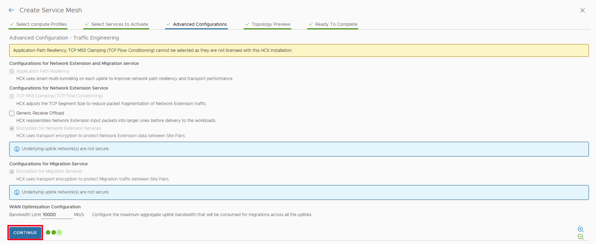
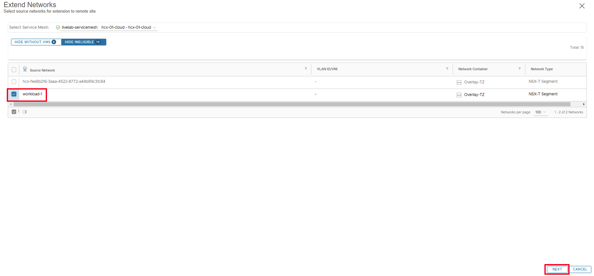
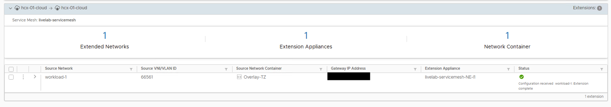

# Lab 4: Deploy and Configure HCX

**Introduction**

Migrating workloads to a public cloud is challenging because of the incompatibilities between on-premises and cloud infrastructure environments. Some of the bigger challenges for cloud adoption are:

- Incompatible, non-interoperable stacks in application dependency mapping
- Cross-site networking and security issues
- Application dependency mapping delay
- Business disruptions that require maintaining a secure, off-premises “active” infrastructure

Oracle Cloud VMware Solution overcomes these challenges by building an abstraction layer on top of existing site-specific implementations of Oracle Cloud Infrastructure using VMware HCX. In this lab we will discover how HCX can help you migrate onprem workloads to the cloud without impacting the application running in the virtual machine.

HCX supports following methods of migration;

- **Migration with vMotion:** HCX vMotion uses the standard VMware vMotion to migration virtual machines between sites without service interruptions. vMotion can be performed for both running as well as powered-off virtual machines.
- **Bulk Migrations:** Bulk migrations uses the VMware vSphere Replication protocols to move virtual machines to a destination site. This method is designed to move VMs in parallel and can be scheduled. With bulk migration the service interruption is equivalent to a virtual machine reboot.

In this lab we will deploy HCX Connector appliance, configure HCX and perform a Virtual Machine live migration.

**Estimated Time:** 30 Minutes

**Prerequisites**

It is assumed that you have access to or familiarity with following components:

- An Oracle account
- An existing OCVS environment.
- An existing VMware SDDC running in source site.
- You will need to setup forward and reverse DNS lookup entries for VMware components, ensure that lookup works from both locations onprem as well as OCVS.
- Familiarity with Oracle Cloud Infrastructure (OCI) and VMware SDDC stack.
- Familiarity with basic VMware Storage terminology will also be helpful.

**Objectives**

In this lab, you will;
    - Download the HCX Connector appliance
    - Deploy and license the connector in source vCenter
    - Configure Compute profile
    - Configure Service Mesh and Interconnect
    - (Optional) Configure Network Extension

**HCX Topology**

The following image demonstrate a high level topology of HCX deployment between On-premises datacenter and OCVS.

**Soure Site Considerations**

Before you can start with HCX Connector deployment, you need to ensure that you have following information about the source site (On-Premises SDDC)

|    **Resources**    |    **Requirement**    |
|---------------------|-----------------------|
|vSphere version|5.0 and later|
|vSphere/ESXi Cluster Networks|<ul><li>Identify the ESXi Management, vMotion, and Replication port groups (if they exist) required for network profile. Create missing network port groups, if needed.</li><li>Identify virtual standard switch (VSS) port groups or distributed port groups (DPG) names, VLANs, and subnets. If these networks vary from cluster to cluster, additional configuration is needed.</li><li>Identify available IP addresses. (HCX participates in these networks.)</li></ul>|
|NSX version and configurations|<ul><li>NSX is not required at the source site. However, verify the details of the NSX requirements for HCX appliance deployments in the VMware HCX product documentation.</li><li>NSX is required only when HCX is used to extend NSX networks.</li><li>NSX Manager URL and admin credentials.</li></ui>|
|DNS and NTP|<ul><li>Verify that DNS is configured according to the requirement listed in the Configure DNS for Oracle Cloud VMware Solution section.</li><li>Ensure that NTP is configured with all the components deployed.</li></ul>|
|vCenter and SSO|<ul><li>vCenter IP address or FQDN</li><li>SSO IP address or FQDN</li></ul>|
|Site-to-Site Connectivity|The on-premises SDDC is connected to the Oracle Cloud VMware Solution environment through a FastConnect dedicated link of 1 Gbps or 10 Gbps for best performance.|
|HCX network port requirements|	For detailed firewall port opening requirements, see HCX port requirements in the VMware documentation.|

**HCX Connector Network Requirements**

Before moving to the next section ensure that you have gathered following information about the onprem hcx connector appliance.

VM Name
IP Address
DNS
Domain Search List
Gateway
Subnet
HCX Network Portgroup
CLI Password
NTP

**Target Site Considerations**

Oracle Cloud VMware Solution (OCVS) is a one-click fully automated deployment. As part of the deployment, HCX Cloud appliance is deployed, licensed, registered with OCVS vCenter and compute profile is configured.

As part of the lab, we will not make any changes to the default HCX configurations. To ensure that both sites can communicate with each other using FQDN, ensure that both the primary and destination DNS servers have all the forward and reverse lookup entries for both sites' VMware components such as vCenter, NSX, Platform Service Controller (PSC).

**NOTE:** Before you continue with the HCX Configuration, you need to install and configure the HCX On-Prem Connector in you existing vCenter. Installing the OVA and configuring the connector is not covered in the LAB. Please follow below links to download, install and configure the connector in on-prem using steps in the following links;

1. [Downloading the HCX Connector OVA](https://techdocs.broadcom.com/us/en/vmware-cis/hcx/vmware-hcx/4-10/vmware-hcx-user-guide-4-10/installing-the-hcx-manager-appliance/about-hcx-manager-ovas/downloading-the-hcx-connector-ova.html)
2. [Deploying the HCX Controller OVA](https://techdocs.broadcom.com/us/en/vmware-cis/hcx/vmware-hcx/4-10/vmware-hcx-user-guide-4-10/installing-the-hcx-manager-appliance/deploying-the-hcx-ova-in-the-vsphere-client.html)
3. [Activating and Configuring HCX Connector](https://techdocs.broadcom.com/us/en/vmware-cis/hcx/vmware-hcx/4-10/vmware-hcx-user-guide-4-10/installing-the-hcx-manager-appliance/activate-and-configure-hcx-connector.html)
4. [Creating Network Profile](https://techdocs.broadcom.com/us/en/vmware-cis/hcx/vmware-hcx/4-10/vmware-hcx-user-guide-4-10/configuring-and-managing-the-hcx-interconnect/configuring-the-hcx-service-mesh/create-a-network-profile.html)
5. [Creating Compute Profile](https://techdocs.broadcom.com/us/en/vmware-cis/hcx/vmware-hcx/4-10/vmware-hcx-user-guide-4-10/configuring-and-managing-the-hcx-interconnect/configuring-the-hcx-service-mesh/create-a-compute-profile.html)

## Task 1: Configure Site Pairing

**NOTE:** Configuration parameters in the following steps are for reference only and actual parameters in your on-prem environment might be different.

1. Access HCX Manager UI as Described in [Lab 2 - Task 5](./../deploy_ocvs/deploy_ocvs.md/)
2. In the left-hand pane, click on **Site Pairs**, click on **NEW SITE PAIR**.

3. On the **Create Site Pair** page, provide following details
      1. **Site Type:** VMware
      2. **Remote HCX URL:** On-prem HCX Connector URL
      3. **Username:** Connector administrator user
      4. **Password:** Connector administrator user password
4. Click **CREATE**

5. On the **Certificate Warning** pop up, Click **IMPORT CERTIFICATE**.

6. Wait for the Site Pair to complete and status to change to **Connected**.

## Task 2: Configure Service Mesh and Interconnect

1. Access HCX Manager UI as Described in [Lab 2 - Task 5](./../deploy_ocvs/deploy_ocvs.md/)
2. In the left-hand pane, click on **Interconnect**, click on **Service Mesh** and click on **CREATE SERVICE MESH**.

3. Select the Site Pair you had created in the last task as source and target and click on **CONTINUE**.

4. Select the compute profile for **on-prem connector** and **OCVS HCX Manager** and click **CONTINUE**.

5. Select the below services that would be activated as part of the Service Mesh:
      1. **Hybrid Interconnect**
      2. **WAN Optimization**
      3. **Cross-cloud vMotion Migration**
      4. **Bulk Migration**
      5. **Network Extension**
      6. **Disaster Recovery**
6. Click **CONTINUE**.

7. Select the uplink network profiles for **on-prem connector** and **OCVS HCX Manager** and click **CONTINUE**.

8. Select the network container for Network Extension.
      1. It will be **overlay transport zone** for on-prem site.
      2. It will be **Overlay-TZ** for **OCVS**.
9.  Click **CONTINUE**

10. Leave the **Advanced Configuration - Traffic Engineering** to defaults and click **CONTINUE**.

11. Review the service mesh topology and click **CONTINUE**.

12. Provide user friendly name for the service mesh **livelab-sm** and click **FINISH**.

**NOTE:** Serice Mesh creation takes ~7 Minutes. Wait for the service mesh deployment to complete successfully before moving to the next step.

## Task 3: (Optional) Configure Network Extension

You can bridge networks between HCX-activated datacenters with HCX Network Extension.
With VMware HCX Network Extension (HCX-NE), you can extend the Virtual Machine networks to a VMware HCX remote site. Virtual Machines that are migrated or created on the extended segment at the remote site behave as if on the same L2 segment as virtual machines in the source environment. With Network Extension, the default gateway for the extended network is only connected at the source site. Traffic from virtual machines in remote sites that must be routed to a different L3 network will flow through the source site gateway.
Using VMware HCX Network Extension with VMware HCX Migration you can:

- Retain the IP and MAC addresses of the Virtual Machine and honor existing network policies.
- Extend VLAN-tagged networks from a VMware vSphere Distributed Switch.
- Extend NSX segments.

1. If you are not already logged in to HCX Manager, then Access HCX Manager UI as Described in [Lab 2 - Task 5](./../deploy_ocvs/deploy_ocvs.md/)
2. In the left-hand pane, Under **Services** click on **Network Extension** and click on **CREATE NETWORK EXTENSION**.

3. Select the **Service Mesh** that was created in the previous task, Select the on-prem **portgroup** to extend and click **NEXT**

4. On the Extend Networks page, provide following details;
      1. OCVS **Tier-1 gateway** as next hop.
      2. **Gateway IP address** for the extended network in the format **192.168.1.1/24**.
      3. Select the **Network Extension appliance** from source site.
      4. Source **Tier-1 gateway**.
      5. Click **Validate**.

5. After the validation is successful, click **SUBMIT**.

**NOTE:** It will take ~2 Minute for the extension operation to complete. Wait for the extension to complete successfully.

## Learn More

- VMware HCX User Guide
- HCX Port Information
- Activating and Configuring HCX
- Creating a Compute Profile
- Deploying the Installer OVA in the vSphere Client
- [Oracle Cloud VMware Solution (OCVS) Overview](https://www.oracle.com/in/cloud/compute/vmware/)
- [OCVS Networking - Getting Started](https://docs.oracle.com/en-us/iaas/Content/VMware/Tasks/ocvsmanagingl2net.htm)
- [OCVS Networking Reference Architecture](https://blogs.vmware.com/cloud/2021/04/28/oracle-cloud-vmware-solution-networking-reference-architecture/)
- [Getting Started with OCVS](https://docs.oracle.com/en-us/iaas/Content/VMware/Concepts/ocvsoverview.htm)
- [OCVS Solution Brief](https://www.oracle.com/a/ocom/docs/understanding-oracle-cloud-vmware-solution.pdf)

## Acknowledgements