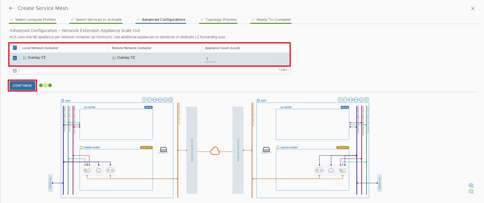
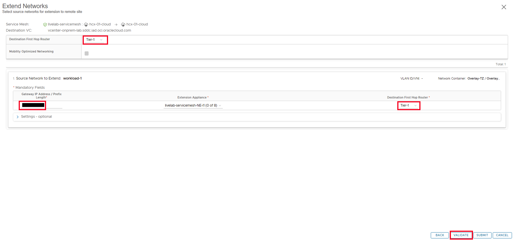

# Lab 4: Deploy and Configure HCX

## Introduction

Migrating workloads to a public cloud is challenging because of the incompatibilities between on-premises and cloud infrastructure environments. Some of the bigger challenges for cloud adoption are:

- Incompatible, non-interoperable stacks in application dependency mapping
- Cross-site networking and security issues
- Application dependency mapping delay
- Business disruptions that require maintaining a secure, off-premises “active” infrastructure

Oracle Cloud VMware Solution overcomes these challenges by building an abstraction layer on top of existing site-specific implementations of Oracle Cloud Infrastructure using VMware HCX. In this lab we will discover how HCX can help you migrate on-premises workloads to the cloud without impacting the application running in the virtual machine.

HCX supports following methods of migration;

- **Migration with vMotion:** HCX vMotion uses the standard VMware vMotion to migration virtual machines between sites without service interruptions. vMotion can be performed for both running as well as powered-off virtual machines.
- **Bulk Migrations:** Bulk migrations uses the VMware vSphere Replication protocols to move virtual machines to a destination site. This method is designed to move VMs in parallel and can be scheduled. With bulk migration the service interruption is equivalent to a virtual machine reboot.

In this lab we will deploy HCX Connector appliance, configure HCX and perform a Virtual Machine live migration.

**Estimated Time:** 30 Minutes

### Prerequisites

It is assumed that you have access to or familiarity with following components:

- An Oracle account
- An existing OCVS environment.
- An existing VMware SDDC running in source site.
- You will need to setup forward and reverse DNS lookup entries for VMware components, ensure that lookup works from both locations on-premises as well as OCVS.
- Familiarity with Oracle Cloud Infrastructure (OCI) and VMware SDDC stack.
- Familiarity with basic VMware Storage terminology will also be helpful.

### Objectives

In this lab, you will;
    - Download the HCX Connector appliance
    - Deploy and license the connector in source vCenter
    - Configure Compute profile
    - Configure Service Mesh and Interconnect
    - (Optional) Configure Network Extension

**HCX Topology**

The following image demonstrate a high level topology of HCX deployment between On-premises datacenter and OCVS.

**Soure Site Considerations**

Before you can start with HCX Connector deployment, you need to ensure that you have following information about the source site (On-Premises SDDC)

|    **Resources**    |    **Requirement**    |
|---------------------|-----------------------|
|vSphere version|5.0 and later|
|vSphere/ESXi Cluster Networks|<ul><li>Identify the ESXi Management, vMotion, and Replication port groups (if they exist) required for network profile. Create missing network port groups, if needed.</li><li>Identify virtual standard switch (VSS) port groups or distributed port groups (DPG) names, VLANs, and subnets. If these networks vary from cluster to cluster, additional configuration is needed.</li><li>Identify available IP addresses. (HCX participates in these networks.)</li></ul>|
|NSX version and configurations|<ul><li>NSX is not required at the source site. However, verify the details of the NSX requirements for HCX appliance deployments in the VMware HCX product documentation.</li><li>NSX is required only when HCX is used to extend NSX networks.</li><li>NSX Manager URL and admin credentials.</li></ui>|
|DNS and NTP|<ul><li>Verify that DNS is configured according to the requirement listed in the Configure DNS for Oracle Cloud VMware Solution section.</li><li>Ensure that NTP is configured with all the components deployed.</li></ul>|
|vCenter and SSO|<ul><li>vCenter IP address or FQDN</li><li>SSO IP address or FQDN</li></ul>|
|Site-to-Site Connectivity|The on-premises SDDC is connected to the Oracle Cloud VMware Solution environment through a FastConnect dedicated link of 1 Gbps or 10 Gbps for best performance.|
|HCX network port requirements|	For detailed firewall port opening requirements, see HCX port requirements in the VMware documentation.|

**HCX Connector Deployment Pre-Requisites**

Before moving to the next section ensure that you have gathered following information about the on-premises hcx connector appliance.

- VM Name
- IP Address
- DNS
- Domain Search List
- Gateway
- Subnet
- HCX Network Portgroup
- CLI Password
- NTP

**HCX Connector Configuration Pre-Requisites**

**Target Site Considerations**

Oracle Cloud VMware Solution (OCVS) is a one-click fully automated deployment. As part of the deployment, HCX Cloud appliance is deployed, licensed, registered with OCVS vCenter and compute profile is configured.

As part of the lab, we will not make any changes to the default HCX configurations. To ensure that both sites can communicate with each other using FQDN, ensure that both the primary and destination DNS servers have all the forward and reverse lookup entries for both sites' VMware components such as vCenter, NSX, Platform Service Controller (PSC).

**NOTE:** Before you continue with the HCX Configuration, you need to install and configure the HCX On-Prem Connector in you existing vCenter. Installing the OVA and configuring the connector is not covered in the LAB. Please follow below links to download, install and configure the connector in on-premises using steps in the following links;

## Task 1: Downloading the HCX Connector OVA

For public cloud deployments, you obtain the HCX Connector OVA from the System Updates selection in the HCX Cloud Manager UI.

1. Access HCX Manager UI as Described in [Access SDDC Components](?lab=deploy_ocvs#Task4:AccessSDDCComponents).
2. In the left hand pane, under **Administrator**, Click on **System Updates**.
3. Select **Current Version** and click on **Check for Updates**.
4. Click **Request Download Link**.
5. HCX will download the latest HCX Connector OVA.

**NOTE:** After you download the OVA, move the downloaded file to a location with access to the on-premises vCenter server. In the next step you will deploy the connector OVA in the on-prem location.

## Task 2: Deploying the HCX Connector OVA

Once you have the OVA download, follow below procedure to deploy the connector OVA in the on-premises datacenter.

1. Access on-premise vCenter vSphere Client.
2. **Right-click** any inventory object that is a valid parent object of a virtual machine (such as a data center, folder, cluster, resource pool, or host) and select **Deploy OVF Template**.

3. On the **Select an OVF template** page, select the downloaded OVA and click **NEXT**.

4. On the **Select a name and folder page**, enter a vm name and the inventory location, and click **NEXT**.

5. On the **Select a compute resource** page, select a compute resource location, and click **Next**.

6. On the **Review details** page, verify the OVA template details, and click **Next**.

7. On the **License agreements page**, read and accept the **VMware End User License Agreement**, and click **Next**.

8. On the **Select storage** page, select the **virtual disk format**, **storage policy**, **storage name**, and then click **Next**.

9.  On the **Select networks** page, select the **destination network**, and click **Next**.

10. On the Customize Template page, set the appropriate deployment properties and click **Next**
      - **Passwords** - Passwords for the CLI admin and root user.
      - **Network Properties** - Enter the network details such as IP Address, subnet, gateway
      - **Static Routes** - Add static route, if needed.
      - **DNS Server List** - Comma separated list of DNS Servers.
      - **Domain Search List** - Comma separated list of domain names.
      - **NTP Server List** - NTP Server details.
      - **Deployment** (Connector OVA installation only)

11. Review the deployment settings and click **Finish**.

## Task 3: Activating and Configuring HCX Connector

**NOTE:** Before proceeding with the task, ensure that you have collected the HCX on-premises connector activation keys as described in [Review OCVS SDDC](?lab=deploy_ocvs#Task3:ReviewOCVSSDDC)

1. Once the HCX Connector VM is powered on, wait for few minutes to initialize the appliance.
2. Open a new Browser tab and access the Connector UI at [https://<connector FQDN/IP Address>:9443](https://<connector FQDN/IP Address>:9443)
3. On the login page, login with the admin credentials that you created in the last task.

4. On the **Activate your HCX instance** page, provide the **HCX License key** and click **ACTIVATE**.

5. Verify that the key is activate. The **Type** field must show **ACTIVATION**. Click **NEXT**.

6. On the **location** page, Select the deployment location and click **CONTINUE**.

7. On the System Name page, click **CONTINUE**. The name is auto-populated based on hostname.

8. On the connection page, provide the details of your on-premises vCenter server. Optionally provide the details of on-premises NSX-T deployment if you use NSX-T on-premises.

9.  On the **Certificate Warning** page, click **IMPORT CERTIFICATE**.

10. On the success page, click **YES,CONTINUE**.

11. On the **Configure SSO/PSC** page, enter the identify source, this is generally the **PSC/vCenter URL**. Click **CONTINUE**.

12. On the last **Congratulations** page, click **RESTART** to complete the configuration.

**NOTE:** It will take a couple of minutes for the services to restart and become available. Wait for the services to stabilize before moving to next task.

## Task 4: Creating Network Profile

The Network Profile is an abstraction of a Distributed Port group, Standard Port group, or NSX Logical Switch, and the Layer 3 properties of that network. A Network Profile is a sub-component of a complete Compute Profile.

Create a Network Profile for each network you intend to use with the HCX services. The extension selects these network profiles when creating a Compute Profile and assigns one or more of four Network Profile functions.

- **Management Network**: The HCX Interconnect appliances use this network to communicate with management systems like the HCX Manager, vCenter Server, ESXi Management, NSX Manager, DNS, NTP.
- **Uplink Network**: The HCX Interconnect appliances use this network for WAN communications, like TX/RX of transport packets.
- **vMotion Network**: The HCX Interconnect appliances use this network for the traffic exclusive to vMotion protocol operations.
- **vSphere Replication Network**: The HCX Interconnect appliances use this network for the traffic exclusive to vSphere Replication.

1. Login to the on-premises HCX Connector appliance by going to [https://<onprem connector fqdn/IP address>](https://<onprem connector fqdn/IP address>)

2. In the left hand pane, under **Infrastructure**, click on **Interconnect**, Select **Network Profiles** and click on **CERATE NETWORK PROFILE**.

3. The first network profile will be for Management, provide following details based on your network configuration and click on **CREATE**.
      1. PortGroup for management traffic.
      2. 3 consecutive IP Addresses from the same VLAN as the portgroup.
      3. Prefix length for the VLAN segment, example **/28**.
      4. Default gateway for the selected network.
      5. **MTU:** 9000

4. Repeat step 2 and 3 to create the network profiles for **Uplink Network**, **vMotion Network** and **vSphere Replication Network**.

## Task 5: Creating Compute Profile

1. Login to the on-premises HCX Connector appliance by opening the connector url; **https://connector-fqdn:9443**

2. In the left hand pane, under **Infrastructure**, click on **Interconnect**, Select **Compute Profiles** and click on **CERATE COMPUTE PROFILE**.

3. On the **Create Compute Profile page 1**, provide the name of the profile and click **CONTINUE**.

4. On the **Select Services to be activated** page, select the following services and click **CONTINUE**.
      1. Hybrid Interconnect
      2. WAN Optimization
      3. Cross-Cloud vMotionMigration
      4. Bulk Migration
      5. Network Extension
      6. Disaster Recovery

5. On the **Select Service Resource** page, select the on-premises virtual datacenter and click **CONTINUE**.

6. On the **Select Deployment Resources and Reservations** page, select the on-premises cluster, datastore and folder for the HCX-IX and HCX-NE appliance.

7. On the **Management Network Profile** page, select the **management profile** that you had created in the last task. Click **CONTINUE**.

8. On the **Uplink Network Profile** page, select the **uplink profile** that you had created in the last task. Click **CONTINUE**.

9.  On the **vMotion Network Profile** page, select the **vMotion profile** that you had created in the last task. Click **CONTINUE**.

10. On the **Replication Network Profile** page, select the **Replication profile** that you had created in the last task. Click **CONTINUE**.

11. If the VMs hosted are on a NST-T overlay segment, select the **Overlay Transport Zone** as the **network container** else select the Distributed Switch as the **Network Container** and click **CONTINUE**.

12. Review the firewall rules needed for the communication and ensure that the rules are in place and click **CONTINUE**.

13. Click **FINISH** on **Ready to Complete** page.

14. You can view the newly created compute profile under **Interconnect** > **Compute Profile**.

## Task 6: Configure Site Pairing

**NOTE:** Configuration parameters in the following steps are for reference only and actual parameters in your on-premises environment might be different.

1. Access HCX Manager UI as Described in [Access SDDC Components](?lab=deploy_ocvs#Task4:AccessSDDCComponents)
2. In the left-hand pane, click on **Site Pairs**, click on **NEW SITE PAIR**.

3. On the **Create Site Pair** page, provide following details
      1. **Site Type:** VMware
      2. **Remote HCX URL:** On-prem HCX Connector URL
      3. **Username:** Connector administrator user
      4. **Password:** Connector administrator user password
4. Click **CREATE**

5. On the **Certificate Warning** pop up, Click **IMPORT CERTIFICATE**.

6. Wait for the Site Pair to complete and status to change to **Connected**.

## Task 7: Configure Service Mesh and Interconnect

1. Access HCX Manager UI as Described in [Access SDDC Components](?lab=deploy_ocvs#Task4:AccessSDDCComponents).
2. In the left-hand pane, click on **Interconnect**, click on **Service Mesh** and click on **CREATE SERVICE MESH**.

3. Select the Site Pair you had created in the last task as source and target and click on **CONTINUE**.

4. Select the compute profile for **on-prem connector** and **OCVS HCX Manager** and click **CONTINUE**.

5. Select the below services that would be activated as part of the Service Mesh:
      1. **Hybrid Interconnect**
      2. **WAN Optimization**
      3. **Cross-cloud vMotion Migration**
      4. **Bulk Migration**
      5. **Network Extension**
      6. **Disaster Recovery**
6. Click **CONTINUE**.

7. Select the uplink network profiles for **on-prem connector** and **OCVS HCX Manager** and click **CONTINUE**.

8. Select the network container for Network Extension.
      1. It will be **overlay transport zone** for on-premises site.
      2. It will be **Overlay-TZ** for **OCVS**.
9.  Click **CONTINUE**

10. Leave the **Advanced Configuration - Traffic Engineering** to defaults and click **CONTINUE**.

11. Review the service mesh topology and click **CONTINUE**.

12. Provide user friendly name for the service mesh **livelab-sm** and click **FINISH**.

**NOTE:** Serice Mesh creation takes ~7 Minutes. Wait for the service mesh deployment to complete successfully before moving to the next step.

## Task 8: (Optional) Configure Network Extension

You can bridge networks between HCX-activated datacenters with HCX Network Extension.
With VMware HCX Network Extension (HCX-NE), you can extend the Virtual Machine networks to a VMware HCX remote site. Virtual Machines that are migrated or created on the extended segment at the remote site behave as if on the same L2 segment as virtual machines in the source environment. With Network Extension, the default gateway for the extended network is only connected at the source site. Traffic from virtual machines in remote sites that must be routed to a different L3 network will flow through the source site gateway.
Using VMware HCX Network Extension with VMware HCX Migration you can:

- Retain the IP and MAC addresses of the Virtual Machine and honor existing network policies.
- Extend VLAN-tagged networks from a VMware vSphere Distributed Switch.
- Extend NSX segments.

1. If you are not already logged in to HCX Manager, then Access HCX Manager UI as Described in [Access SDDC Components](?lab=deploy_ocvs#Task4:AccessSDDCComponents)
2. In the left-hand pane, Under **Services** click on **Network Extension** and click on **CREATE NETWORK EXTENSION**.

3. Select the **Service Mesh** that was created in the previous task, Select the on-premises **portgroup** to extend and click **NEXT**

4. On the Extend Networks page, provide following details;
      1. OCVS **Tier-1 gateway** as next hop.
      2. **Gateway IP address** for the extended network in the format **192.168.1.1/24**.
      3. Select the **Network Extension appliance** from source site.
      4. Source **Tier-1 gateway**.
      5. Click **Validate**.

5. After the validation is successful, click **SUBMIT**.

**NOTE:** It will take ~2 Minute for the extension operation to complete. Wait for the extension to complete successfully.

**Congratulations! You may proceed to the next lab**

## Learn More

- [VMware HCX User Guide](https://techdocs.broadcom.com/us/en/vmware-cis/hcx/vmware-hcx/4-10/vmware-hcx-user-guide-4-10.html)
- [HCX Port Information](https://ports.broadcom.com/home/VMware-HCX)
- [Activating and Configuring HCX](https://techdocs.broadcom.com/us/en/vmware-cis/hcx/vmware-hcx/4-10/vmware-hcx-user-guide-4-10/installing-the-hcx-manager-appliance/activate-and-configure-hcx-connector.html)
- [Configuring and Managing HCX Interconnect](https://techdocs.broadcom.com/us/en/vmware-cis/hcx/vmware-hcx/4-10/vmware-hcx-user-guide-4-10/configuring-and-managing-the-hcx-interconnect.html)
- [Oracle Cloud VMware Solution (OCVS) Overview](https://www.oracle.com/in/cloud/compute/vmware/)
- [OCVS Networking - Getting Started](https://docs.oracle.com/en-us/iaas/Content/VMware/Tasks/ocvsmanagingl2net.htm)
- [OCVS Networking Reference Architecture](https://blogs.vmware.com/cloud/2021/04/28/oracle-cloud-vmware-solution-networking-reference-architecture/)
- [Getting Started with OCVS](https://docs.oracle.com/en-us/iaas/Content/VMware/Concepts/ocvsoverview.htm)
- [OCVS Solution Brief](https://www.oracle.com/a/ocom/docs/understanding-oracle-cloud-vmware-solution.pdf)

## Acknowledgements

* **Author:** Vijay Kumar
, Cloud Engineering OCVS
* **Contributors:**
    - Chris Wegenek, Cloud Engineering
    - Karthik Meenakshi Sundaram, Cloud Engineering
    - Germain Vargas, Cloud Engineering
    - Kelly Montgomery, Cloud Engineering

* **Last Updated By/Date:** Vijay Kumar, Cloud Engineering OCVS, February 2025
