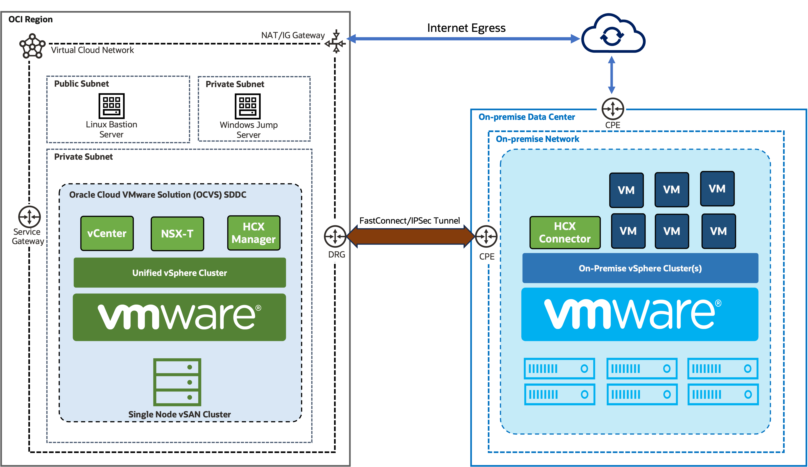

# VMware Workload Migration to Oracle Cloud VMware Solution (OCVS)

**Estimated time:** 2 Hours

## Workshop Introduction

The workshop will showcase how to deploy Oracle Cloud VMware Solution in an OCI tenancy and how to effortlessly migrate On-Prem VMware workloads to the cloud without impacting the application stack.

We will cover following topics as part of the upcoming labs.

- Oracle Cloud VMware Solution (OCVS) Deployment prerequisites
- Deploying Oracle Cloud VMware Solution (OCVS) and accessing OCVS components
- Creating new Datastore with OCI Block Volume and deploying Workload VMs
- Configuring connectivity with on-prem VMware Infrastructure
- Migrating on-prem VMware workload with HCX

## Architecture

As part of the workshop, we will be deploying a single node OCVS environment and connect it to an existing on-prem VMware environment. Following image showcases the logical architecture of the target lab.

### Prerequisites

The lab makes following assumptions:

- Familiarity with Oracle Cloud
- An Oracle Cloud Account
- A paid tenancy - Free Tier Accounts are not eligible for OCVS
- Familiarity with VMware SDDC Components ie vCenter, NSX-T, vSAN, HCX etc
- On-prem VMware infrastructure (Only required if you want to migrate workload to OCVS)

## Learn More

* [Oracle Cloud](https://www.oracle.com/cloud/)
* [Oracle Cloud VMware Solution Overview](https://www.oracle.com/in/cloud/compute/vmware/)
* [OCVS Documentation](https://docs.oracle.com/en-us/iaas/Content/VMware/Concepts/ocvsoverview.htm)

## Acknowledgements

* **Author:** Vijay Kumar
, Cloud Engineering OCVS
* **Contributors:**
    - Chris Wegenek, Cloud Engineering
    - Karthik Meenakshi Sundaram, Cloud Engineering
    - Germain Vargas, Cloud Engineering
    - Kelly Montgomery, Cloud Engineering

* **Last Updated By/Date:** Vijay Kumar, Cloud Engineering OCVS, February 2025