# Lab 5: Migrating the Virtual Machine with HCX

## Introduction

Today, large-scale enterprises run their virtualized workloads in VMware Hypervisor in on- premises data centers. Customers are currently looking for enterprise cloud migration, Datacenter exit, or Hybrid Cloud Strategy aligning with their business objectives. Oracle Cloud VMware Solution enables organizations that have a significant investment in VMware infrastructure to take advantage of the benefits of public cloud. Oracle Cloud VMware Solution gives you a fully automated implementation of a VMware Software-Defined Datacenter (SDDC) within your own Oracle Cloud Infrastructure (OCI) tenancy, running on Oracle Cloud Infrastructure bare metal instances.

The Oracle Cloud VMware Solution offers VMware HCX advanced as part of the SDDC implementation along with vSphere, vSAN, and NSX-T. The Oracle Cloud VMware Solution also offers a VMware HCX Enterprise license for additional use cases. VMware HCX is a software suite focused on application mobility and designed for simplifying application migration, rebalancing workloads, and optimizing disaster recovery across data centers and clouds.

**Estimated Lab Time:** 15 minutes

### Objectives

In this lab, you will:

* Migrate VMware workloads on-premises to OCVS.

### Prerequisites

* Complete Lab 4: Deploy and Configure HCX

* This lab environment does not include an actual on-premises environment. You must provide your own.

* It is assumed that the user possesses basic knowledge of HCX.

* It is assumed that you have either [VPN Site to Site](https://docs.public.oneportal.content.oci.oraclecloud.com/en-us/iaas/Content/Network/Tasks/workingwithIPsec.htm) or [Fastconnect](https://docs.oracle.com/en-us/iaas/Content/Network/Concepts/fastconnect.htm) already set up in your environment.

### Important Information about the lab

In the lab, both source and target SDDC's run in OCVS in different regions with one region standing in for on-premises SDDC. The screenshots used are for reference only. Actual VM's being migrated will have different name, OS and Network details.


## Task 1: Migrate Virtual Machine from On-prem to OCVS

1. In the web browser, open a new tab.
2. Paste the **vSphere Client URL** that you had captured in the [Review OCVS SDDC](?lab=deploy_ocvs#Task3:ReviewOCVSSDDC) in the **WebURL** field and press **Enter**.
3. If you receive a warning that the connection is not private, ignore the warning and proceed.
4. Click the **Launch vSphere Client** (HTML5) button.

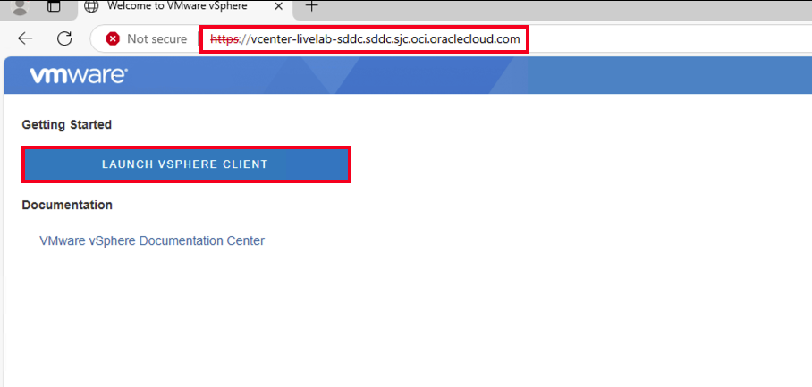

5. On the authentication page, enter the following details for the **username** and **password**.
      - **Username** :
		```
		<copy>
    	administrator@vsphere.local
    	</copy>
		```
	  - **Password**: vCenter initial password captured in [Review OCVS SDDC](?lab=deploy_ocvs#Task3:ReviewOCVSSDDC)
6. Click **Login**

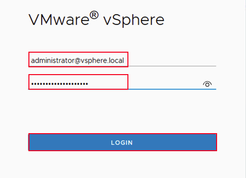

7. Select the hamburger menu in the vSphere web client.
8. Click on the drop-down option for HCX.

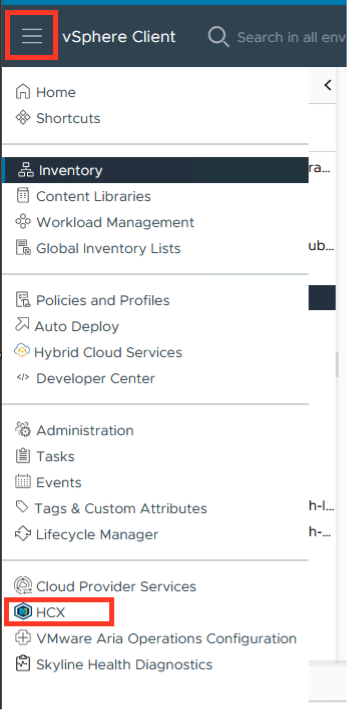

9. On the HCX UI, in the left pane, under **Services**, Click **Migration**.

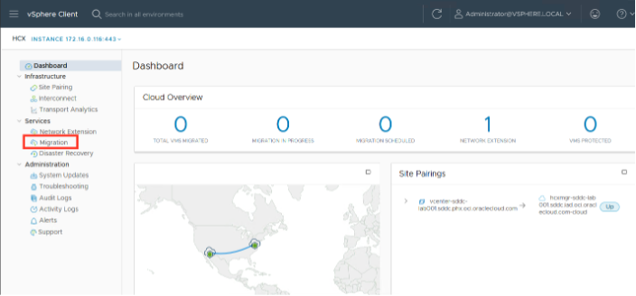

10. Click on **Migrate**.

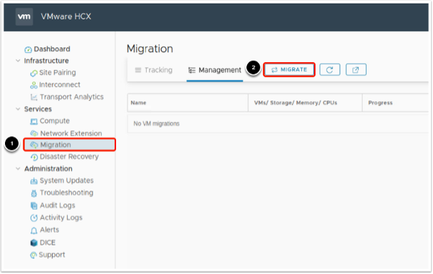

11.	From the left hand inventory, locate the VM parent and select the virtual machine for migration from the right hand list and click **ADD.**

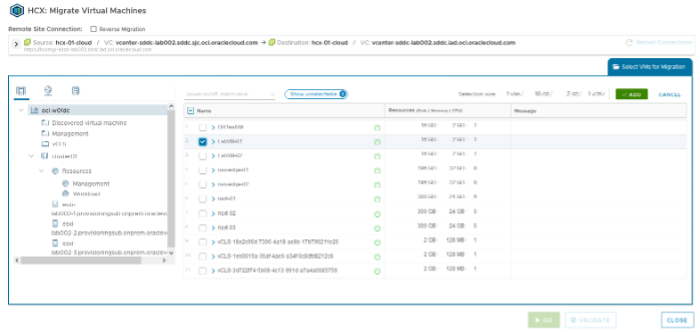

12. Click on **(Mandatory: Compute Container)**, navigate to the destination host cluster and click **SELECT**

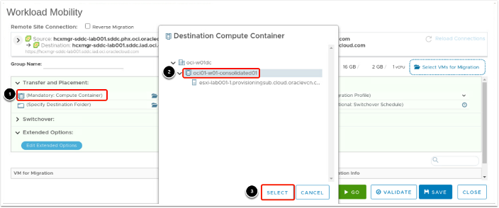

13.  Click on **(Mandatory: Storage) Option**, navigate to the target datastore/datastore cluster for the VM and click **SELECT**.

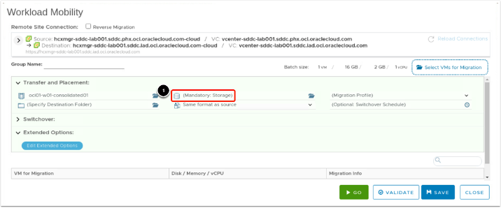


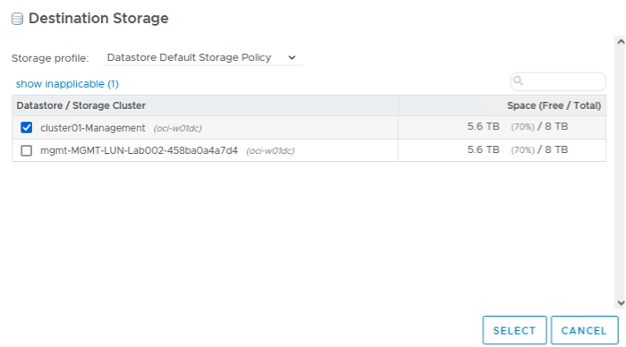


14. Select **vMotion** as the Migration Profile.

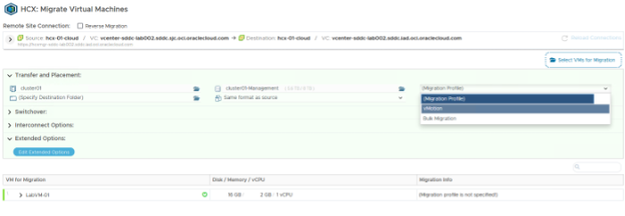

15.	Click on **Edit Extended Options**, Select **Migrate Custom Attributes**.

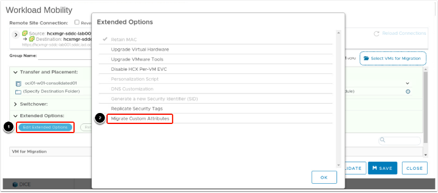

16. Select **Apply Options** and click **SAVE**.


17. Click **OK** on the confirmation screen.

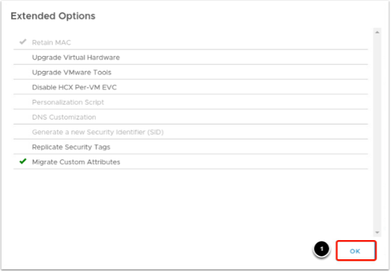

18. Validate the configuration by selecting **VALIDATE** on the bottom right of the screen.

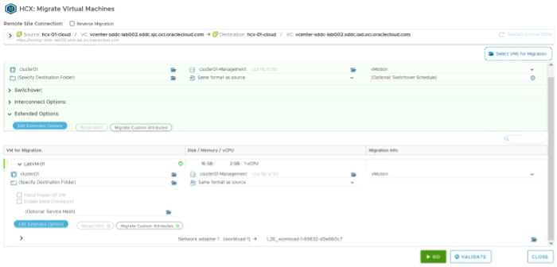

19.	Once the Validation is successful. Click on the green **GO** button to start the migration.

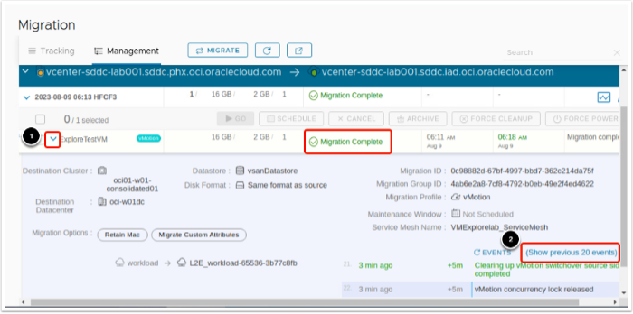

The migration will take around 7-10 minutes. Once completed it will show Migration Complete in the Status column.

**Congratulations!**

To gain an understanding of the steps taken during the migration you can:

1.	Expand the migration details by selecting the arrow next to the VM name.

2.	Click show previous 20 events to expand the steps even further.

## Task 2: Verify successful migration

Now that the migration has been reported as successful, you can verify that the machine has been relocated to the other cloud.

In the web browser, open a new tab.
1. Paste the **vSphere Client URL** that you had captured in the [Review OCVS SDDC](?lab=deploy_ocvs#Task3:ReviewOCVSSDDC) in the **WebURL** field and press **Enter**.
2. If you receive a warning that the connection is not private, ignore the warning and proceed.
3. Click the **Launch vSphere Client** (HTML5) button.


4. On the authentication page, enter the following details for the **username** and **password**.
      - **Username** :
		```
		<copy>
    	administrator@vsphere.local
    	</copy>
		```
	  - **Password**: vCenter initial password captured in [Review OCVS SDDC](?lab=deploy_ocvs#Task3:ReviewOCVSSDDC)
5. Click **Login**


6. Expand the vCenter Inventory and locate the migrated virtual machine.

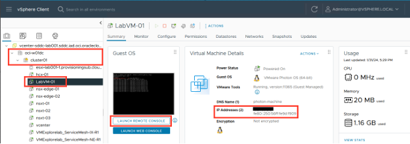

**Congratulations! You have completed this LiveLab!**

## Learn More

- [VPN Site to Site](https://docs.public.oneportal.content.oci.oraclecloud.com/en-us/iaas/Content/Network/Tasks/workingwithIPsec.htm)

- [Fastconnect](https://docs.oracle.com/en-us/iaas/Content/Network/Concepts/fastconnect.htm)

- [Migrating Virtual Machines](https://techdocs.broadcom.com/us/en/vmware-cis/hcx/vmware-hcx/4-10/vmware-hcx-user-guide-4-10/migrating-virtual-machines-with-vmware-hcx.html)

## Acknowledgements

* **Author:** Vijay Kumar
, Cloud Engineering OCVS
* **Contributors:**
    - Chris Wegenek, Cloud Engineering
    - Karthik Meenakshi Sundaram, Cloud Engineering
    - Germain Vargas, Cloud Engineering
	- Kelly Montgomery, Cloud Engineering

* **Last Updated By/Date:** Chris Wegenek, Cloud Engineering, February 2025
