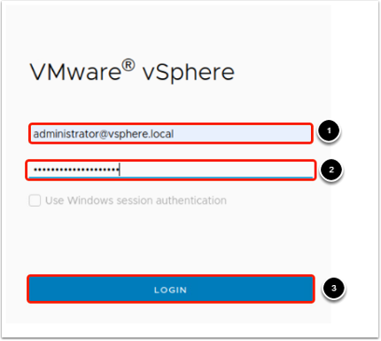
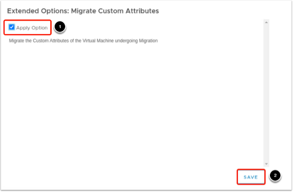

## Task 1 : Onprem connectivity with fastconnect

https://github.com/oracle-livelabs/oci/tree/main/oci-multicloud-connectivity

## Task 2: Onprem connectivity with IPSec VPN

https://www.ateam-oracle.com/post/libreswan-ipsec-bgp-frr

# Migrating the Virtual Machine with HCX 

## Introduction

Today, large-scale enterprises run their virtualized workloads in VMware Hypervisor in on- premises data centers. Customers are currently looking for enterprise cloud migration, Datacenter exit, or Hybrid Cloud Strategy aligning with their business objectives. Oracle Cloud VMware Solution enables organizations that have a significant investment in VMware infrastructure to take advantage of the benefits of public cloud. Oracle Cloud VMware Solution gives you a fully automated implementation of a VMware Software-Defined Datacenter (SDDC) within your own Oracle Cloud Infrastructure (OCI) tenancy, running on Oracle Cloud Infrastructure bare metal instances.

The Oracle Cloud VMware Solution offers VMware HCX advanced as part of the SDDC implementation along with vSphere, vSAN, and NSX-T. The Oracle Cloud VMware Solution also offers a VMware HCX Enterprise license for additional use cases. VMware HCX is a software suite focused on application mobility and designed for simplifying application migration, rebalancing workloads, and optimizing disaster recovery across data centers and clouds.

### Architecture In This Lab

Oracle Cloud VMware Solution enables organizations that have a significant investment in VMware infrastructure to take advantage of the benefits of public cloud.
Oracle Cloud VMware Solution gives you a fully automated implementation of a VMware Software-Defined Datacenter (SDDC) within your own Oracle Cloud Infrastructure tenancy, running on Oracle Cloud Infrastructure bare metal instances, that contains the following VMware components.

*	VMware vSphere ESXi

*	VMware vSAN

*	VMware vCenter

*	VMware NSX-T

**Estimated Lab Time:** 15 minutes

### **Objectives**

In this lab, you will:

* Migrate VMware workloads on-premises to OCVS.

### **Prerequisites**

* Complete Lab 3: **Insert Lab 3 Name**

* This lab environment does not include an actual on-premises environment. You Must provide your own.

* It is assumed that the user possesses basic knowledge of HCX.

### Helpful information before you Begin: 

#### Lab Environment

* The Lab consists of simulated On-Premises environment in San Jose Region and the OCVS environment in Ashburn Region. Dynamic Routing Gateways are used to connect both OCI Regions using remote peering.

* The Lab covers a vMotion Migration strategy with HCX Manager pre-deployed along with Compute Profiles, Network Profiles created during the OCVS instantiation process.

####  Important Port Groups

Below are the VLANs/Port Groups used in the simulated On-Premises environment (San Jose):
* Port Group: vSphere
    * Description: This is the vSphere Management Port Group. vCenter, NSX-T manager, HCX Components will be in this Port Group.

    * Purpose: Management of vSphere, NSX-T and HCX Components. In Addition to this, HCX Components will use this Port Group to communicate with HCX Components in OCVS.

* Port Group: vMotion
    * Description: This is the vMotion Port-Group. In Addition to ESXi, HCX IX will also have one interface associated to this Port Group.

    * Purpose: This is used for vMotion Traffic.

* Port Group: Replication
    * Description: This is the Replication Port Group. In Addition to ESXi, HCX IX will also have one interface associated to this Port- Group. In Addition to ESXi, HCX IX will also have one interface associated to this Port Group.

    * Purpose: This is used for Replication Traffic. HCX IX uses this for bulk migration.

* Port Group: Management
    * Description: This is the ESXI Management Port Group.

    * Purpose: This is used for Managing ESXi Hosts.

* Port Group: HCX
    * Description: This is the HCX Uplink Port Group.

    * Purpose: HCX-IX and HCX NE will use this Port Group to communicate with on- premises HCX-IX and HCX NE respectively. In the On-premises environment, vds- sphere01 is used.

Below are the VLANs/Port Groups that are used in OCVS environment in Ashburn:

* Port Group: vSphere01
    * Description: This is the vSphere Management Port Group. vCenter, NSX-T manager, HCX Components will be in this Port Group.

    * Purpose: Management of vSphere, NSX-T and HCX Components. HCX Manager in OCVS will use this Port Group to communicate with HCX Connector hosted in on- premises environment.

* Port Group: vMotion
    * Description: This is the vMotion Port- Group. In Addition to ESXi, HCX IX will also have one interface associated to this Port Group.

    * Purpose: This is used for vMotion Traffic.

* Port Group: Replication
    * Description: This is the Replication Port- Group. In Addition to ESXi, HCX IX will also have one interface associated to this Port Group.

    * Purpose: This is used for Replication Traffic. HCX IX also uses this for bulk migration.

* Port Group: Management
    * Description: This is the ESXi Management Port Group.

    * Purpose: This is used for Managing ESXi Hosts.

* Port Group: HCX
    * Description: This is the HCX Uplink Port  Group.

    * Purpose: HCX-IX and HCX NE will use this Port Group to communicate with on- premises HCX-IX and HCX NE respectively. In the On- premises environment, vds- sphere01 is used.

#### Migrate of VM workloads from on- premises environment to OCVS using vMotion

* VMware HCX Interconnect integrates with ESXi to perform vMotion migrations for powered on virtual machines and with Cold Migration for powered off virtual machines.

* VMware HCX vMotion can transfer a live Virtual Machine from a VMware HCX-activated vCenter Server to a VMware HCX-activated destination site (or from the VMware HCX destination site towards the local site). 

* The vMotion transfer captures the virtual machine active memory, execution state, IP and MAC address. Migration duration depends on the connectivity, including both the bandwidth available and the latency between the two sites.

## Task 1: Login to simulated On-Premises Data Center

1. After you have logged in and gone to the OCI home screen, select the **US West (San Jose)** region. Then click on the region menu in the upper right corner.

2.	In the upper left corner, click the hamburger menu icon.

3.	Navigate to **Hybrid**.

4.	Select Software-Defined Data Centers "SDDC" under the VMware Solution section.

    
    
5.	Click on your SDDC, e.g. ***SDDC-Lab001***.

    

6.	Copy the **vSphere client URL**. Paste the **vSphere Client URL** into Notepad.

7.	Copy the **vCenter initial password**. Paste the vCenter initial password into your Notepad (Note: HCX will use the same password).

8.	Copy the **HCX Manager IP address**. Paste the **HCX Manager IP address** into a Notepad.

    

9.	In your browser, open a new tab.

10.	Paste your San Jose vCenter URL copied from the previous step, into the address bar.

    

11.	Click the Launch vSphere Client (HTML5) button.

    

12. Enter the credentials:

* User name: ``administrator@vsphere.local``

* Password: (copy from Notepad)

* Select **Login**.

13. Open Web Console for the test VM.

14.	Expand the Datacenter oci-w01dc, then expand the cluster cluster01, and select the Virtual Machine LabVM-01.

15.	Take a note of the VM IP Address (feel free to add it to your Text Editor window for reference).

16. Click on **LAUNCH WEB CONSOLE**

17. Login to the test virtual machine using below credentials

    1. 	User name: ``root``

    2. 	Password: ``VMware1!``

18.  Enter command ``ping 192.168.2.1``

19.	Select the hamburger menu in the vSphere web client.

20.	Click on the drop-down option for HCX.

21.	 Click on Services > Migration.

22.	Click on Migrate (wait  about 10-15 seconds for it to load). 

23.	Select the ``VM LabVM-01``.

24.	Click **ADD**.

25. Select the Compute Container in our remote datacenter migration target.
    1.	Clicking on **(Mandatory: Compute Container)**.
    2.	Select the Destination ESXi Compute Cluster.
    3.	Click **SELECT**.

26. Select the Storage in our remote datacenter migration target.

27.	Click on **(Mandatory: Storage) Option**.

28.	Select the remote cluster01-Management where the VM workload will be hosted.

29.	Click on **SELECT**.

30.	Select vMotion as the Migration Profile.

31. Configure the extended options:
    
    1.	Click on **Edit Extended Options**.

    2.	Select **Migrate Custom Attributes**.

32.	Select **Apply Option**.

33.	Click **SAVE**.

34.	Click **OK**.

35.	Validate the configuration by selecting **VALIDATE** on the bottom right of the screen.

36.	Once the Validation is successful. Click on the green **GO** button to start the migration.

The migration will take around 7-10 minutes. Once completed it will show Migration Complete in the Status column.

**Congratulations!**

To gain an understanding of the steps taken during the migration you can:

1.	Expand the migration details by selecting the arrow next to the VM name.

2.	Click show previous 20 events to expand the steps even further.

## Task 2: Verify successful migration

Now that the migration has been reported as successful, you can verify that the machine has been relocated to the other cloud.

Recall that in the previous lesson, you moved a virtual machine from the San Jose vCenter to the Ashburn vCenter.

1.	Log into the **Ashburn vCenter Server** using the information from the **OCI SDDC UI** and recorded in module.

2. To validate the Migrated VM Details:
    1.	Expand the Datacenter **oci-w01dc**, then expand the Cluster **cluster01**.
    2.	Select the **VM LabVM-01**.
    3.	Validate that the IP Address for the VM is same after the migration.
    4.	Click on **LAUNCH WEB CONSOLE**.

3.	Stop the continuous ping ny using your keyboard to combine the keys ``ctrl+c``.

4. Now validate the number of dropped packets. The number should not be significant.

### If the number of dropped packets was low or zero you have successfully completed this lab.

# Congratulations! 
# You may procede to the next lab!

## Learn More

## Acknowledgments

* **Author:** Vijay Kumar
, Cloud Engineering OCVS
* **Contributors:** 
    - Chris Wegenek, Cloud Engineering
    - Karthik Meenakshi Sundaram, Cloud Engineering
    - Germain Vargas, Cloud Engineering

* **Last Updated By/Date:** Chris Wegenek, Cloud Engineering, February 2025