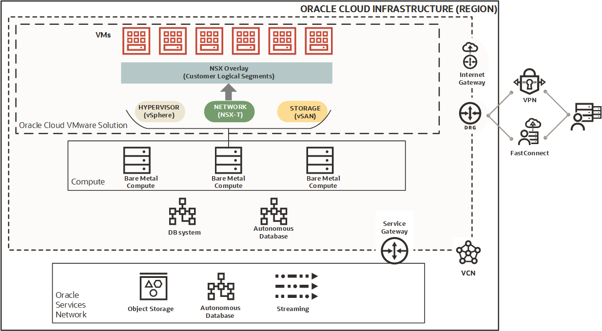

# Oracle Cloud VMware Solution Overview

Oracle Cloud VMware Solution (OCVS) effortlessly integrates VMware's familiar cloud environment with Oracle Cloud Infrastructure allowing you to build, run and manage VMware Software Defined Data-Center (SDDC) in your existing OCI tenancy. The solution is customer managed with complete control over VMware resources allowing you to use your existing operational tools that you already know.

Leverage OCVS to effortlessly migrate or extend you VMware-based workloads to the cloud without application rearchitecting, operational changes or new product investments.

## Service Overview

- **Global Availability** OCVS is available as a cloud service across all OCI regions ensuring support for global business application needs. You can choose to deploy OCVS in any OCI region of your choice based on your specific requirements.
- **Highly Available** By default, physical servers hosting OCVS components are spread across three fault domains in an availability domain, ensuring high availability. Multi-AD deployment is also a supported option for OCI Regions with multiple availability domains.
- **Scalable** With OCVS, you can start with a single 3 node cluster and create up to 15 Clusters in an SDDC with up to 64 nodes per cluster with Dense Shapes and 32 nodes per cluster with Standard Shapes. You can scale-out or scale-in existing OCVS cluster based on your application requirements, with the flexibility of scaling compute and storage independently.
- **Flexible Compute** OCVS supports a wide range of bare metal compute shapes with Intel and AMD processors. NVIDIA A10 GPU is also available for workloads with vGPU requirements.
- **Scalable Storage** OCVS offers multiple options for application storage requirements. DenseIO Bare Metal instances support vSAN as the primary storage with OCI Block and File Storage serving as secondary storage. Standard Bare Metal shapes support OCI Block as the primary as well as secondary storage.
- **High Performance Networking** OCVS is deployed in your existing VCN with close proximity to native OCI Services, providing best in class performance by avoiding complex routing and reducing network hops. OCVS is also the only cloud VMware solution with native support for VLANs for applications that need layer 2 networking in the cloud.
- **Flexible Billing Commitments** OCVS supports hourly, monthly, 1-Year and 3-Year commitment options to support different use cases ranging from seasonal workload demands, capacity expansions, Disaster Recovery to long-term steady workloads.

## Architecture

Following is the logical architecture of OCVS SDDC in an OCI region.

## VMware Components

Oracle Cloud VMware Solution (OCVS) bundles VMware components namely ESXi, vCenter, NSX-T, vSAN and HCX to support building a fully functional Software Defined Data Center (SDDC).

- **ESXi** is the VMware's flagship hypervisor that builds the foundation for the virtualization platform.
- **vCenter** is the centralized management component to manage all hypervisor and VM operations.
- **NSX-T** provides virtual networking and security capabilities.
- **vSAN** allows the ESXi hosts to share local disks from every participating host and create a shared datastore to host virtual machines.
- **HCX** HCX is an application mobility platform which abstracts the underlying infrastructure complexities and enables seamless workload migration between SDDCs.

## Single Host SDDC

OCVS offers single host SDDCs for testing and short-term development. A single hosts SDDC contains a single unified management cluster with a single ESXi host. Only BM.DenseIO Shapes are supported for single host deployments.

Single host SDDC has similar technical capabilities as a multi host cluster and can be used for faster onboarding for testing, development and proof-of-concepts. All the management components share the same host and remaining capacity can be used for workload deployment.

Single host SDDC has certain limitations as listed below;

- Only supported on DenseIO shapes, Standard Shapes are not supported.
- Not backed by any OCI SLA.
- Oracle support is limited to commercially reasonable support, VMware support is available only for the first 60 days.
- Billing options are limited to **Hourly** and **Monthly** billing options.
- Production workload is not supported on single host SDDCs as these are not designed as long term solutions and are not backed up. If the host fails, the data is lost.
- Features which depend on multiple hosts ie DRS, HA, DRM etc do not work on single host SDDC.

## Multi Host SDDC
A multi host SDDC provides full range of VMware Solution features to migrate and support production workloads. Multi Host SDDC is backed by OCI Availability SLA. **<SLA Link here>**

When creating a multi host SDDC, the first defined cluster is called **unified management cluster**, this cluster hosts all VMware solution components and needs a minimum of 3 ESXi servers. Any cluster that you create after the unified management cluster does not have the management components and can be dedicated to workload VMs.

You can create up to 15 clusters with up to 64 hosts in every cluster. Every cluster is deployed with its own networking resources to allow segregated workloads to run in the same SDDC with complete operational isolation.

## Billing Options

OCVS provides multiple pricing intervals to suit a wide range of use-case from short term capacity expansion to long term steady state workloads. Pricing interval is defined at the time of cluster creation and applies to all hosts added in the cluster at the time of cluster creation. Any host added in the cluster after the cluster has been created can have a shorter or longer pricing interval. Hosts with different pricing interval can be mixed in the same cluster.

|**Pricing Interval**|**Required Commitment**|**Notes**|
|--------------------|-----------------------|---------|
|Hourly|Hourly pricing requires a minimum of 8 hours of committed host runtime|Use this interval for test projects or short-term high utilization events where extra capacity is required for a limited time. This is the default selection for standard shape hosts.|
|Monthly|Monthly pricing requires a minimum of 1 month of committed host runtime.|This interval is a common option, and is the default selection for dense shapes.|
|Yearly|One year pricing requires a minimum of 1 year of committed host runtime.|Use this interval for long-term projects such as workload or application migration to Oracle Cloud Infrastructure.|
|Every Three Years|Three year pricing requires a minimum of 3 years of committed host runtime.|Use this interval for very long-term projects or mission-critical workloads that aren't easily migrated.|

## Learn More

- [Oracle Cloud VMware Solution (OCVS) Overview](https://www.oracle.com/in/cloud/compute/vmware/)
- [OCVS Documentation](https://docs.oracle.com/en-us/iaas/Content/VMware/Concepts/ocvsoverview.htm)
- [OCVS Solution Brief](https://www.oracle.com/a/ocom/docs/understanding-oracle-cloud-vmware-solution.pdf)

## Acknowledgements

* **Author:** Vijay Kumar
, Cloud Engineering OCVS
* **Contributors:**
    - Chris Wegenek, Cloud Engineering
    - Karthik Meenakshi Sundaram, Cloud Engineering
    - Germain Vargas, Cloud Engineering
    - Kelly Montgomery, Cloud Engineering

* **Last Updated By/Date:** Vijay Kumar, Cloud Engineering OCVS, February 2025
