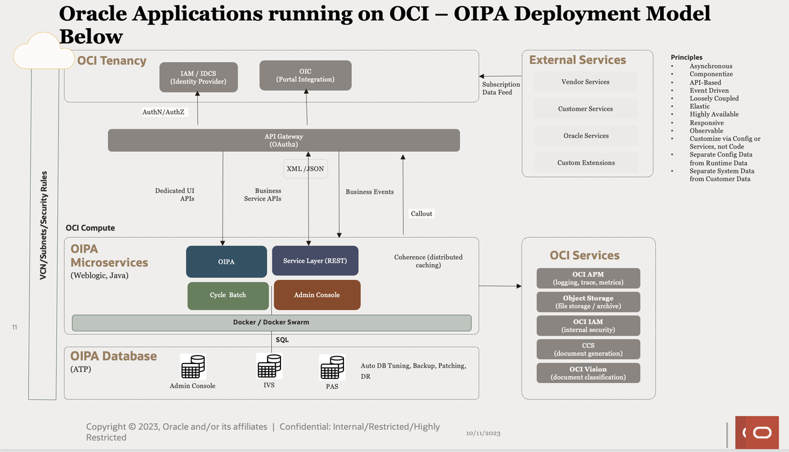

# Introduction

## About this Workshop

**Oracle Insurance Policy Adminstration (OIPA)** LiveLab. This workshop enables you to get a hands-on experience of the OIPA platform.  Users' persona can range from insurance business analysts to actuaries, customer service representatives, and configuration analysts configuring the OIPA platform.  This live lab provides an automated provisioning of an OIPA sandbox environment with simulated data. Users can expect to practice several use cases using our platform ranging from creating new insurance policies, issuing pending policies, analyzing account values, and more.  More information regarding the OIPA platform can be found at this link : https://www.oracle.com/financial-services/insurance/policy-administration/

### Objective
* Provision OIPA Sandbox Environment

OIPA LiveLabs - What is it
* Access an  OIPA instance to experience first hand the platform with insurance specific use cases
* Try Oracle Cloud free of charge while exploring the life insurance applications
* Learn a technical skill to deploy OIPA on OCI
* Create a sandbox for test-driving OIPA without creating an account or Oracle Cloud tenancy. 
* Each LiveLabs reservation provides a self-contained environment to run the workshop. 
* The environment is removed once the reservation time expires.

OIPA LiveLabs Technical Workflows

* Potential users launch workshop from Oracle LiveLabs
* Live Lab workflow will create a reservation ID and generate an email indicating the Workshop request has been accepted
* The process for creating the infrastructure is created using Teraform scripts and includes:

    * Virtual Network
    * Firewall rules
    * Security Policies
    * Application Tier
    * Autonomous Database Tier
* Once the infrastructure has been created email is sent to the user indicating the workshop/infrastructure has been created.
* The user logs back to Live Labs, OIPA URL is created which they will use to launch the OIPA application.

## Technical Architecture

## Learn More

###  Documentation
- Oracle Inurance Policy Adminstration - [documentation](https://www.oracle.com/financial-services/insurance/life-annuity)
- Oracle Inurance Policy Adminstration v12 release notes - [documentation](https://docs.oracle.com/cd/F56930_01/index.html)
- Oracle Cloud Infrastructure(OCI) Services - [documentation](https://docs.oracle.com/en-us/iaas/Content/services.htm)

## Acknowledgements
* **Author** - Paul Karam - Master Solution Architect
* **Contributors** -  Sharad Chopra - Solution Architect, Amar Pahwa - Enterprise Cloud Architect
* **Last Updated By/Date** - Amar Pahwa - April 2024