# Provision Fusion Environments

## Introduction

Click on Launch for provisioning OIPA Sandbox environment

Estimated Time: 20+ minutes

## Screen Flow

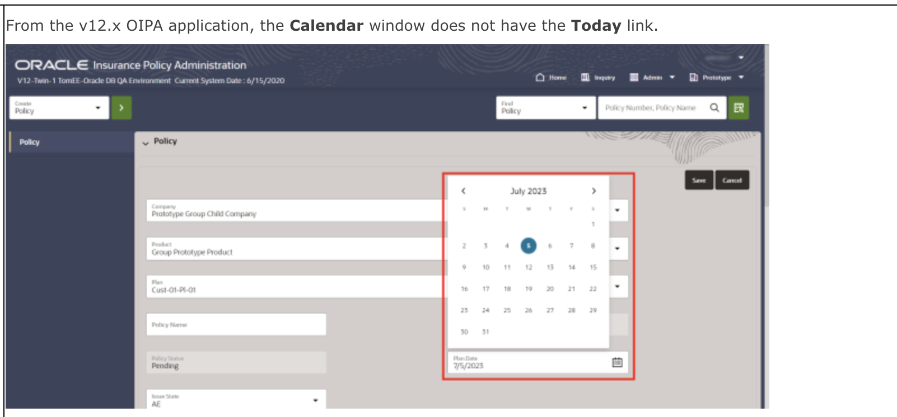
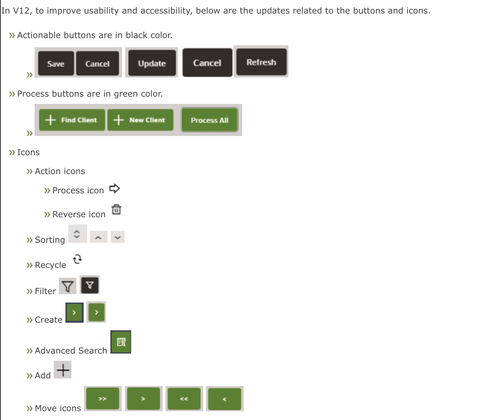
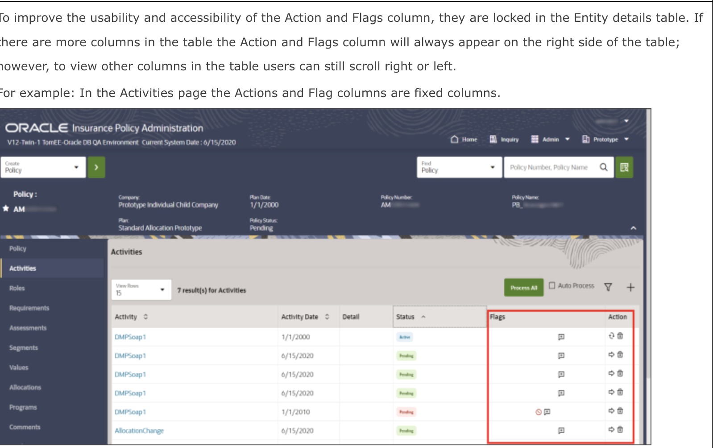
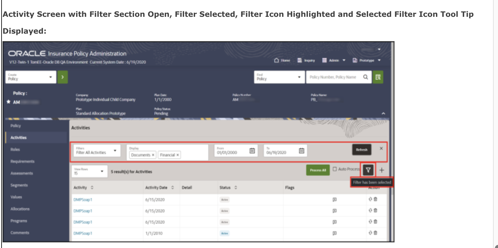
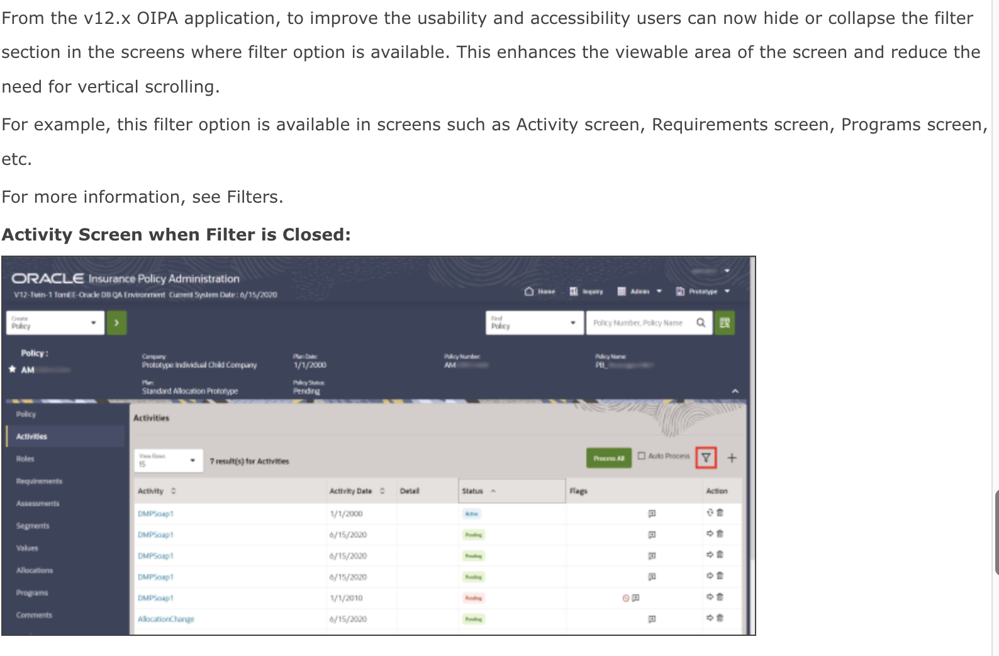
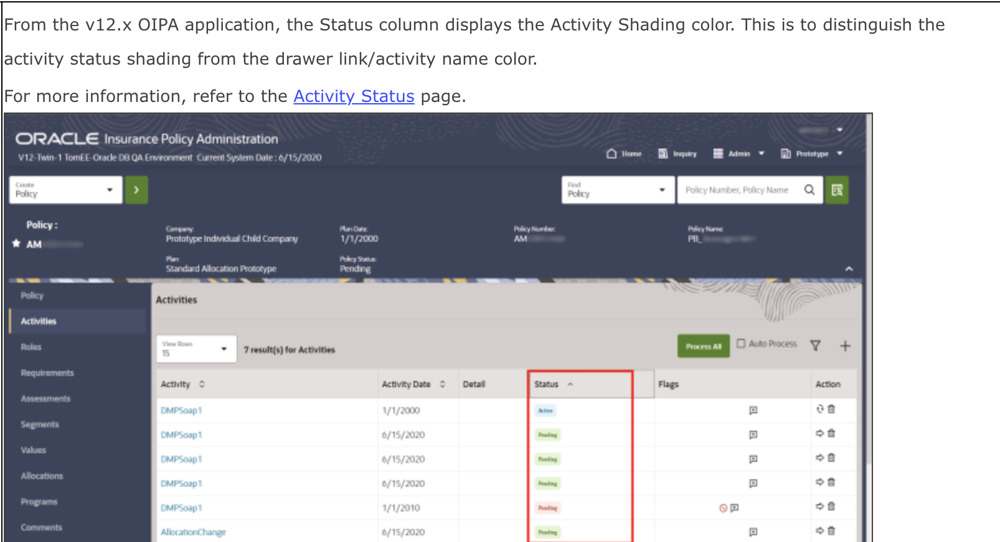

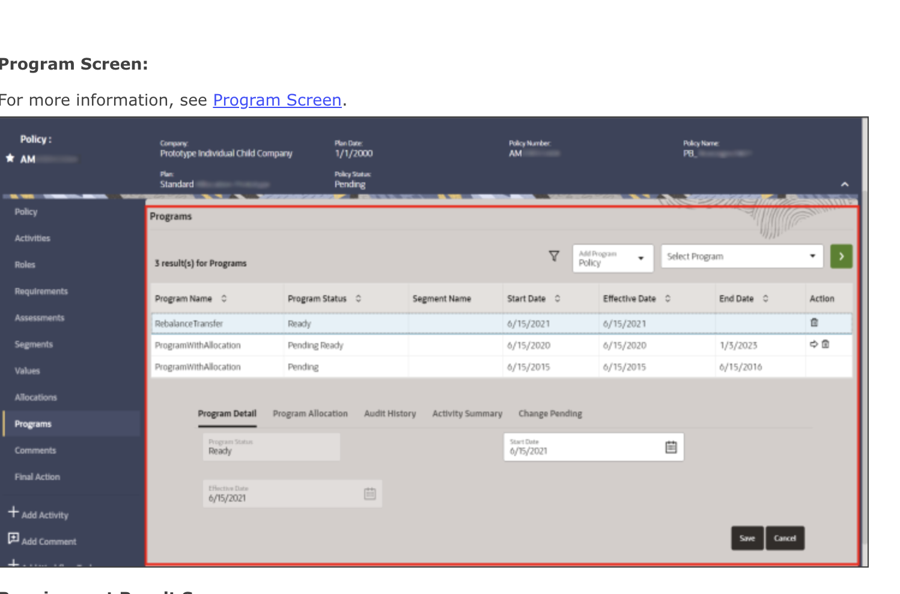
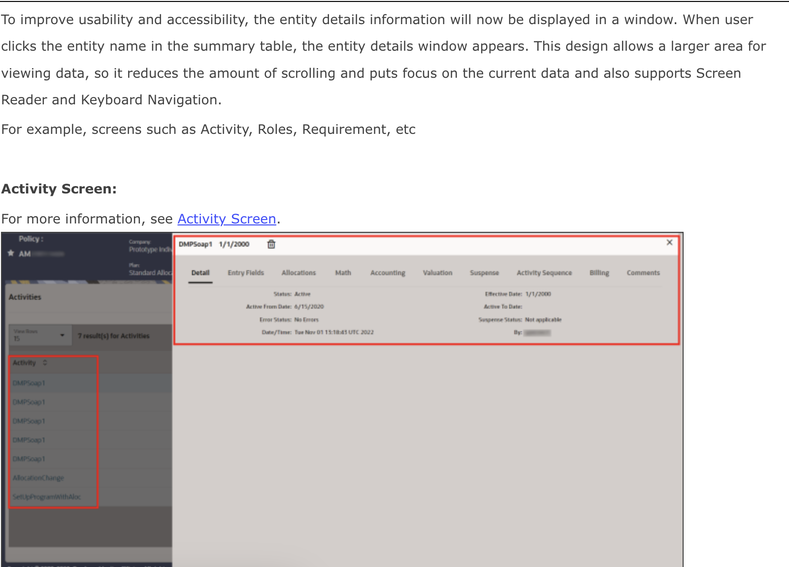
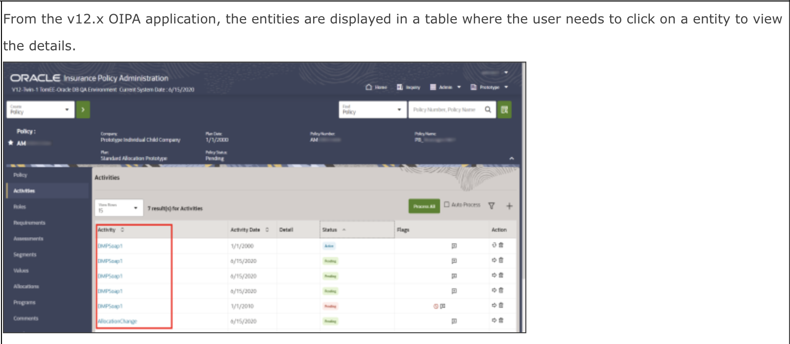
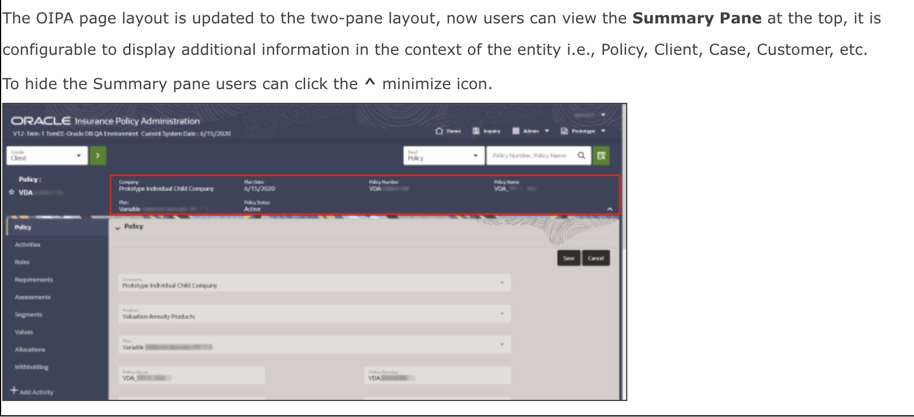
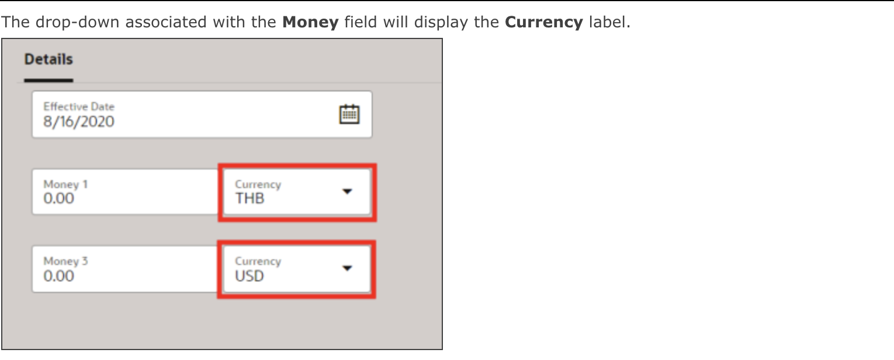

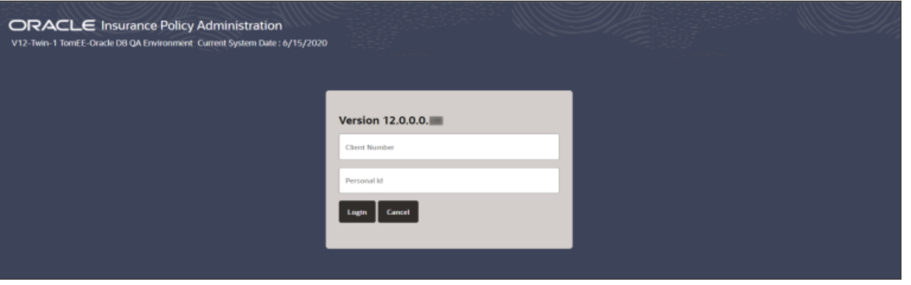
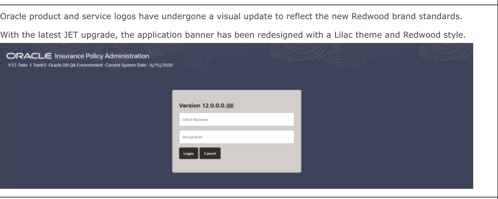

## Learn More
* See the [documentation](https://www.oracle.com/financial-services/insurance/life-annuity) on overview of Oracle Insurance Administration Policy (OIPA)

## Acknowledgements
* **Author** - Paul Karam, Functional SME
* **Contributors** -  Sharad Chopra, Amar Pahwa
* **Last Updated By/Date** - Amar Pahwa - Janurary 2024
