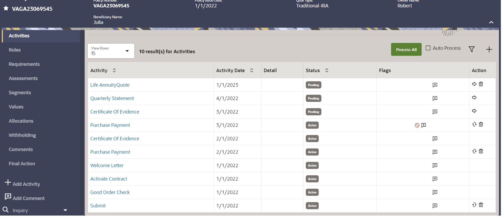

# Provision OIPA Environments

## Introduction

Click on Launch for provisioning OIPA Sandbox environment

Estimated Time: 20+ minutes

## Screen Flow
#### Landing configurable dashboard  to access all assigned contracts for individual and group insurance policies

#### Individual policy  information with left pane navigation menu

#### Contract events based life cycle  a Traditional Variable IRA/individual annuities. 

#### Real time valuation for variable unit linked investment contracts.

## Learn More
* See the [documentation](https://www.oracle.com/financial-services/insurance/life-annuity) on overview of Oracle Insurance Administration Policy (OIPA)

## Acknowledgements
* **Author** - Paul Karam - Master Solution Architect
* **Contributors** -  Sharad Chopra - Solution Architect, Amar Pahwa - Enterprise Cloud Architect
* **Last Updated By/Date** - Amar Pahwa - March 2024
