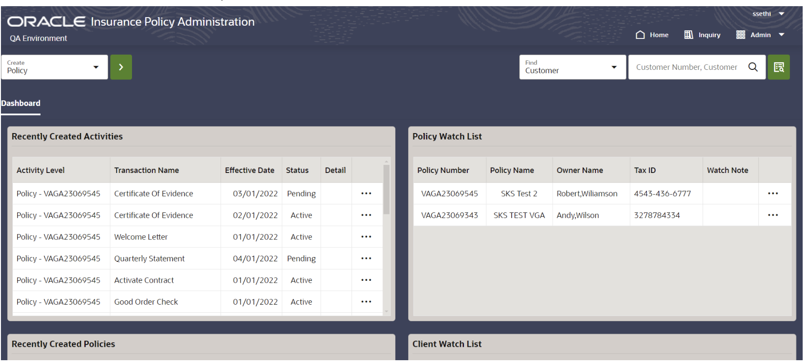

# Provision OIPA Environments

## Introduction

Click on Launch for provisioning OIPA Sandbox environment

Estimated Time: 3+ hours

#### Life Insurance Solutions
##### Get to market faster and improve your operations with flexible, rule-based policy administration. Manage new business underwriting, policy issuance, policy processing, billing, collections, and claims—all on a single life insurance system.[Take the policy administration product tour](https://docs.oracle.com/en/industries/insurance/policy-administration/oipa-gt/index.html)

#### Support individual and group administration on the same life insurance system
##### Eliminate the costs of maintaining multiple policy administration systems. Rapidly configure individual and group insurance products using a common set of business rules and administer them from a single life insurance system. [Explore Policy Administration](https://www.oracle.com/financial-services/insurance/policy-administration/)

## Screen Navigation
#### Landing configurable dashboard  to access all assigned contracts for individual and group insurance policies

#### Individual policy  information with left pane navigation menu

#### Contract events based life cycle  a Traditional Variable IRA/individual annuities. 

#### Real time valuation for variable unit linked investment contracts.

## Learn More
* See the [documentation](https://www.oracle.com/financial-services/insurance/life-annuity) on overview of Oracle Insurance Administration Policy (OIPA)

## Acknowledgements
* **Author** - Paul Karam - Master Solution Architect
* **Contributors** -  Sharad Chopra - Solution Architect, Amar Pahwa - Enterprise Cloud Architect
* **Last Updated By/Date** - Amar Pahwa - June 2024
