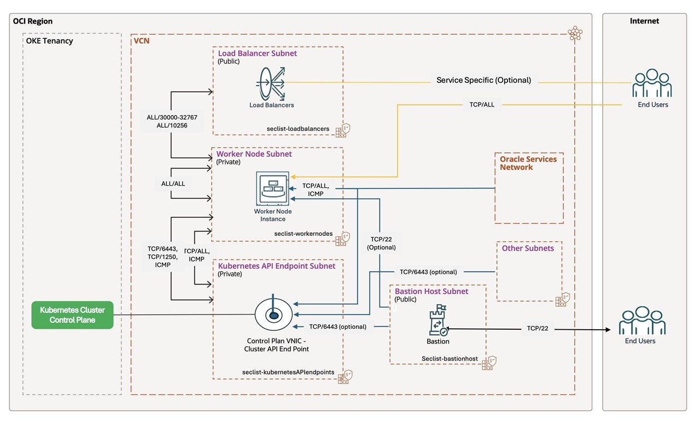

# Deploy OKE with Simple and Advanced Terraform Modules with Best Practices

## About this Workshop

This workshop presents three independent learning paths for deploying and operating Oracle Cloud Infrastructure Kubernetes Engine (OKE) with Terraform. Choose the lab that matches your experience and use case; the labs are not a mandatory linear sequence. Each deployment lab offers Terraform CLI and OCI Resource Manager (ORM) options—choose one delivery path for the environment you create.

## Choose Your Learning Path

* **Lab 1: Simple Terraform modules** is for users with a good Terraform background and a basic understanding of deploying OKE with Terraform. It uses a simpler, flat Terraform design and is also a practical starting point for learners beginning OKE deployments with Terraform.
* **Lab 2: Advanced Terraform modules** is for users who need a modular, reusable, and extensible design. It is particularly useful when part of the infrastructure already exists, such as an existing VCN and subnets that you want to reuse when creating an OKE cluster.
* **Lab 3: OKE best practices and KPO** is for mature platform and DevOps users who have already automated most aspects of OKE deployment and now want to apply selected production-oriented practices, including compartment separation, availability, node cycling, specialized node pools, and optional Karpenter Provider for OCI (KPO) capacity provisioning.

## Estimated Time

Estimated Workshop Time: **45–60 minutes for one selected lab.**

* Lab 1: 60 minutes
* Lab 2: 60 minutes
* Lab 3: 45 minutes

Do not add these estimates together unless you deliberately plan to complete all three independent labs. For Lab 1 and Lab 2, choose either the Terraform CLI path or the ORM path for your environment; do not complete both paths.

## Scope of Best Practices

The reference blogs describe a broader set of OKE best practices than a single LiveLab can demonstrate. This workshop adapts a focused subset of those recommendations. Review the reference material and implement all practices that apply to your organization’s security, reliability, operational, and cost requirements—not only the practices covered in Lab 3.

> **Important:** OKE, compute, networking, and load-balancer resources can incur charges. Complete the destroy procedure for the path you used when you finish.
### Objectives

* Prepare OCI credentials, Terraform inputs, and a safe preflight plan.
* Deploy an OKE cluster with either Terraform CLI or OCI Resource Manager.
* Verify the cluster and safely remove test resources.
* Apply reusable-module, compartment, availability, node-pool, and KPO practices.

### Prerequisites

* An OCI tenancy, supported region, and compartment permissions for networking, OKE, compute, and Resource Manager.
* Terraform and OCI CLI, or OCI Cloud Shell, for the CLI paths.
* An SSH key pair; never upload a private key or commit it to the Terraform source archive.
* Available service limits and node-shape capacity in the selected region.

## Architecture

Terraform creates or references a VCN, subnets, OKE cluster, node pools, and an optional bastion. The advanced source separates VCN, OKE, and bastion concerns into reusable modules. KPO runs in a baseline OKE node pool and creates worker capacity through the flow `OCINodeClass` → `NodePool` → `NodeClaim` → KPO-launched worker node.

## Source Packages

* [Lab 1 CLI source](https://docs.oracle.com/en/learn/oke-clstr-trfm/files/oke_terraform_for_beginners.zip)
* [Lab 1 ORM source](https://docs.oracle.com/en/learn/oke-cluster-automation/files/oke_advanced_module_orm.zip)
* [Lab 2 CLI source](https://docs.oracle.com/en/learn/oke-cluster-automation/files/oke_advanced_module.zip)
* [Lab 2 ORM source](https://docs.oracle.com/en/learn/oke-cluster-automation/files/oke_advanced_module_orm.zip)

## Learn More

* [Simple OKE Terraform tutorial](https://docs.oracle.com/en/learn/oke-clstr-trfm/index.html)
* [Advanced OKE Terraform modules tutorial](https://docs.oracle.com/en/learn/oke-cluster-automation/index.html)
* [OKE best practices and automation tutorial](https://docs.oracle.com/en/learn/oke-automate-deployment/index.html)
* [OCI Resource Manager documentation](https://docs.oracle.com/en-us/iaas/Content/ResourceManager/home.htm)
* [Karpenter Provider for OCI documentation](https://docs.oracle.com/en-us/iaas/Content/ContEng/Tasks/conteng-kpo.htm)

## Acknowledgements

* **Authors** - Mahamat H. Guiagoussou, Payal Sharma, Matthew McDaniel, and John Adewumi
* **Last Updated** - August 2026
