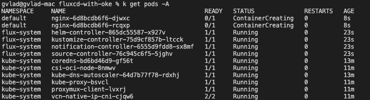
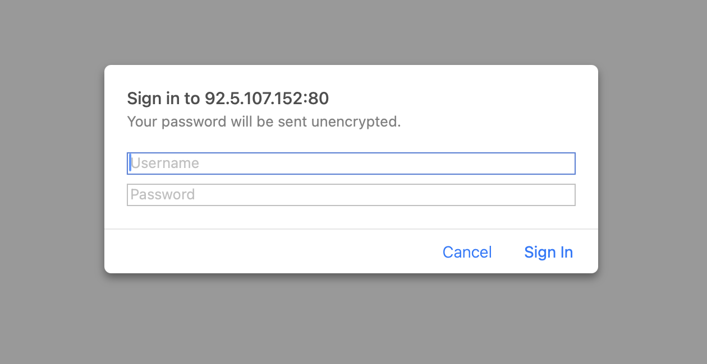

# Deployment and Update of Nginx App

## Introduction

In this lab, we will deploy an Nginx App in OKE using Flux.

Estimated Time: 20 minutes

### **Objectives**

Deploy workload in OKE cluster from changes that were pushed in Github repo.

### **Prerequisites**

This lab assumes you have:

* Bootstrap between Github repo and OKE cluster.

## Task 1: Make changes in Github repo
1. First, git clone the repo that was bootstraped with OKE cluster in previous lab.

```
git clone git@github.com:your-username/fluxcd.git
```
2. Create a folder apps/nginx and create the following manifests files in there to deploy an nginx app with authentication with password:

deployment.yaml
```
apiVersion: apps/v1
kind: Deployment
metadata:
  name: nginx
  namespace: default
spec:
  replicas: 2
  selector:
    matchLabels:
      app: nginx
  template:
    metadata:
      labels:
        app: nginx
    spec:
      containers:
        - name: nginx
          image: docker.io/nginx:1.25
          ports:
            - containerPort: 80
          volumeMounts:
            - name: nginx-html
              mountPath: /usr/share/nginx/html
            - name: nginx-conf
              mountPath: /etc/nginx/conf.d
            - name: nginx-auth
              mountPath: /etc/nginx/.htpasswd
              subPath: auth
      volumes:
        - name: nginx-html
          configMap:
            name: nginx-index
        - name: nginx-conf
          configMap:
            name: nginx-conf
        - name: nginx-auth
          secret:
            secretName: nginx-basic-auth
```

service.yaml
```
apiVersion: v1
kind: Service
metadata:
  name: nginx
  namespace: default
spec:
  selector:
    app: nginx
  ports:
    - protocol: TCP
      port: 80
      targetPort: 80
  type: LoadBalancer
```

configmap.yaml
```
apiVersion: v1
kind: ConfigMap
metadata:
  name: nginx-index
  namespace: default
data:
  index.html: |
    < html >
    < head >< title >FluxCD App on OKE</ title ></ head >
    < body >
      < h1 >Hello from FluxCD + NGINX on Oracle OKE< /h1 >
    < /body >
    < /html >
```
configmap-nginx-conf.yaml
```
apiVersion: v1
kind: ConfigMap
metadata:
  name: nginx-conf
  namespace: default
data:
  default.conf: |
    server {
        listen 80;
        server_name _;

        location / {
            auth_basic "Restricted Content";
            auth_basic_user_file /etc/nginx/.htpasswd;
            root /usr/share/nginx/html;
            index index.html;
        }
    }
```
secret-basic-auth.yaml
```
apiVersion: v1
kind: Secret
metadata:
  name: nginx-basic-auth
  namespace: default
type: Opaque
stringData:
  auth: |
    admin:$apr1$0SCumxtN$8qYOchwzq.0oxhCc/eOHi0
```

2. Create in clusters/oke folder that was originally created by Flux the following file:
nginx.yaml
```
apiVersion: kustomize.toolkit.fluxcd.io/v1
kind: Kustomization
metadata:
  name: nginx1
  namespace: flux-system
spec:
  interval: 5m
  path: ./apps/nginx
  prune: true
  sourceRef:
    kind: GitRepository
    name: flux-system

```

So this will let Flux know that this needs to be deployed in OKE.

3. Push all the changes in the github repo and wait for Flux to deploy the resources specified.

## Task 2: Watch how changes in repository triggered deployment in OKE cluster
1. You will see at some point that on your local environment the nginx pods are getting created. 

Once the pods running, use the public ip of the worker node where the nginx pods were deployed to acces it through browser on port 80. 
Here you will be prompted a authentication windows where you will use user ``admin`` and password ``mypassword``:


Once you passed the authentication you will be shown an windows of the main nginx app:


All of these resources were automatically trigerred to be deployed by Flux when they were pushed in Github repository.


## Acknowledgements

**Authors**

* **Cristian Vlad**, Principal Cloud Engineer, NACIE
* Last Updated By/Date - Cristian Vlad, October 2025