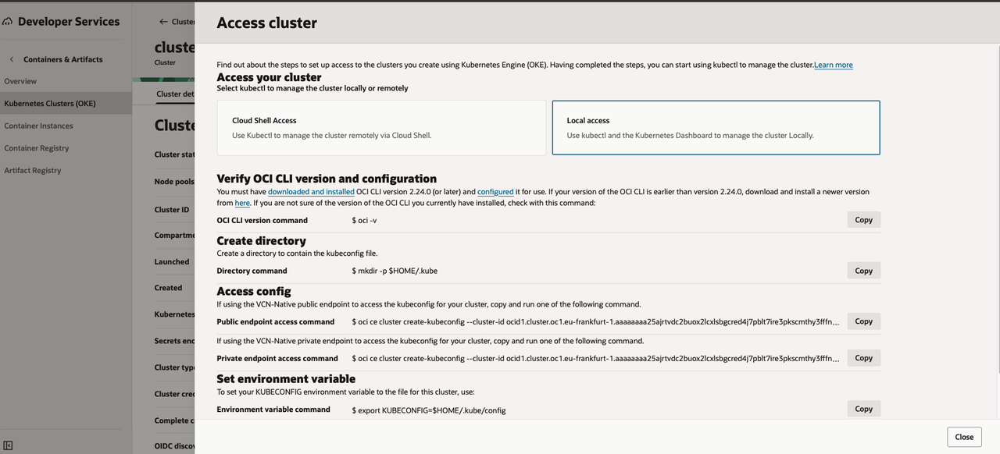
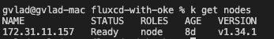
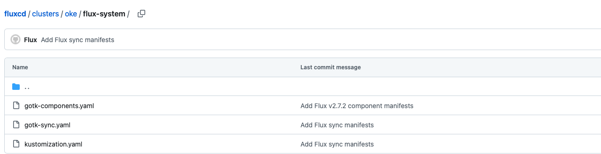
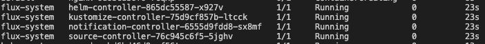

# Bootstrap Github Account with OKE cluster

## Introduction

In this lab, we will bootstrap Github account with OKE cluster using Flux.

Estimated Time: 20 minutes

### **Objectives**

Make the connection between Flux, Github and OKE Cluster.

### **Prerequisites**

This lab assumes you have:

* OKE deployment with resource manager has finished with succes

## Task 1: Get access of OKE cluster
1. In order to give FluxCD access to your cluster, you need to get access to OKE cluster on your local environment
Get to Developer Services in OCI Console -> Kubernetes Cluster (OKE) -> Click your previously created cluster -> Access cluster and follow the steps for local access to access the public endpoint of your clusters API.


2. After you copied the command from the steps which gets to your cluster context, if you try a `kubectl get nodes` you should be able to see the nodes in the cluster.


## Task 2: Setup token in Github

1. In order to give access to FluxCD to your github, you need to create a token within your github account with administrator access.

Go at https://github.com/settings/tokens and create a Personal access Token Classic which has all the roles from there for full access, and copy and memorate the token that you receive once you hit "Generate token" because it will not show up anywhere after you close that window.


2. Then run the following commands with your credentials in your local environment:
```
export GITHUB_TOKEN=your-token
export GITHUB_USER=your-username
```

## Task 3. Bootstrap Github account with OKE cluster using Flux

1. First, install flux CLI in your local environment:
For homebrew:
```
brew install fluxcd/tap/flux
```
For bash:
```
curl -s https://fluxcd.io/install.sh | sudo bash
```
For other 
2. Run these command:
```
flux bootstrap github \                                     
  --token-auth \
  --owner=your-username \
  --repository=fluxcd \
  --branch=main \
  --path=clusters/oke \
  --personal
```

3. You can verify that FluxCD has made the connection looking on your repo that you have manifests files pushed by Flux and in your cluster you have pods deployed also by Flux.



If the specified repository does not exist, Flux will create it for you as private. If you wish to create a public repository, set --private=false


## Acknowledgements

**Authors**

* **Cristian Vlad**, Principal Cloud Engineer, NACIE
* Last Updated By/Date - Cristian Vlad, October 2025