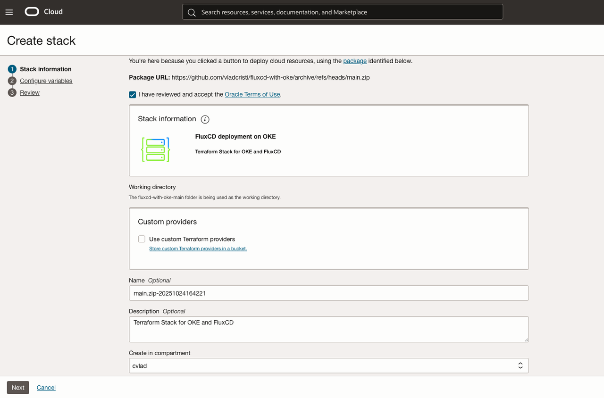
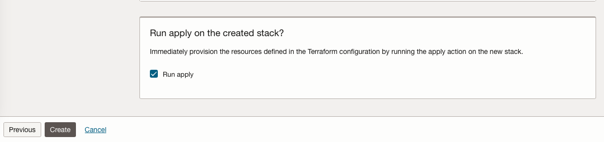

# Provision of the necessary resources

## Introduction

In this lab, we will provision the OKE resources: an OKE cluster and all his networking components needed.

Estimated Time: 30 minutes

### **Objectives**

Provisioning of the infrastructure using OCI Resource Manager.

### **Prerequisites**

This lab assumes you have:

* An Oracle Cloud account
* Administrator privileges or access rights to the OCI tenancy
* Basic Kubernetes knowledge (kubectl, manifests).
* Local setup with:
    - kubectl
    - OCI CLI configured

## Task 1: Provision resources

1. Download the  
Go to Resource manager -> Stacks -> Create Stack. Choose My configuration and upload the provided folder and click Next: [fluxcd-with-oke.zip](hhttps://github.com/vladcristi/fluxcd-with-oke/archive/refs/heads/main.zip)

    

    Or you could use the single click deployment button shown below

    

2. Provide the following information: 

**Select Compartment**: Choose the appropriate compartment for the Kubernetes cluster.

**SSH Public key**: Choose the ssh public key file or paste the key in the section.

And leave all the other variables as they are.

3. Once all of the variables are configured click **Next** and after that click apply.

4. Wait for the job to complete, which may take 15-20 minutes before the infrastructure is fully provisioned.

You may now proceed to the next lab.

## Acknowledgements

**Authors**

* **Cristian Vlad**, Principal Cloud Engineer, NACIE
* Last Updated By/Date - Cristian Vlad, October 2025