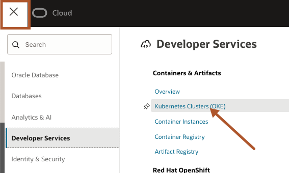
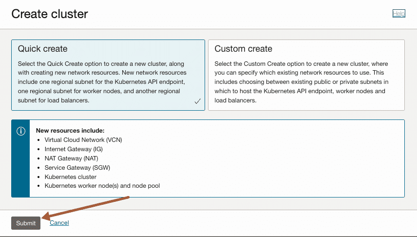

# Deploying an OKE Cluster on OCI

## Introduction

*Deploy an Kubernetes Cluster on OCI with our managed Kubernetes Engine OKE*

Estimated Lab Time: 20 minutes

### Why Deploy NIM on Oracle Kubernetes Engine (OKE)?

OKE provides a powerful, managed Kubernetes environment designed for
high-performance, scalable AI workloads. When paired with OCI’s NVIDIA
accelerated compute and networking stack, it becomes a robust platform
for deploying NIM at scale.

**Key benefits:**

1. **GPU-Optimized Infrastructure**  
Run NIM on OCI GPU instances (NVIDIA H100, A10, A100, V100) for
increased performance and throughput.

2. **Autoscaling and Load Balancing**  
OKE integrates seamlessly with OCI Load Balancers and supports
autoscaling to match inference traffic in real-time.

3. **Native Monitoring and Logging**  
Easily observe your inference metrics using OCI Logging and Monitoring
or integrate Prometheus/Grafana stacks.

4. **Security and Networking**  
Run NIM in isolated VCNs, use OCI Vault for secrets, and expose
endpoints securely with ingress controllers or API gateways.

5. **Cost-Effective Multitenancy**  
Deploy multiple NIM within a single cluster and scale horizontally,
optimizing GPU usage while maintaining separation of concerns.

**Step-by-Step: Deploying a NIM on OKE**

Let’s walk through a basic setup to deploy a Llama 3-based NIM on OKE.

## Prerequisites 

Before you begin, ensure you have:

- Access to an OCI tenancy with proper permissions

- A running OKE cluster (v1.26 or later) with GPU nodes

- kubectl configured for your cluster

- Helm installed

- An NVIDIA API key – please follow [<u>these
  instructions</u>](https://nvdam.widen.net/s/kfshg7fpsr/create-build-account-and-api-key-4)

- Docker or OCI container registry access (for custom container pulls if
  needed)

## Create an OKE Cluster with GPU Nodes

You can create an OKE cluster via the OCI Console or CLI. Use
**GPU-enabled shapes**, such as:

- BM.GPU.H100.8

- BM.GPU.A10.4

- BM.GPU.A100.8

Ensure your node pool uses a GPU shape and that the
“nvidia-container-runtime” is configured. Oracle’s GPU
[<u>Marketplace</u>](https://cloudmarketplace.oracle.com/marketplace/en_US/listing/182674476)
images already have this pre-installed.

To begin, click **OCI menu - Developer Services** - **Kubernetes
Clusters (OKE)**.




Click** Create Clusters**.


Check **Quick create** is selected and click **Submit**.




For this lab, we will pick a Public endpoint, Managed node type and
Private workers as the worker nodes.


Select Node shape, **BM.GPU.A10.4** and node count as **2**. You can
adapt the shapes according to your needs. For further references on
compute shapes visit
https://docs.oracle.com/en-us/iaas/Content/Compute/References/computeshapes.htm


The default volume size is 50GB, so we need to increase it to 500GB.
Click **Show advanced options** and change boot volume size
to **500GB** and click next.


Click **Create cluster**.


Check **node pool status** is waiting for cluster. You should see the
cluster is being created and will take **around 10 to 15 minutes** to
complete.

Once the process is complete, click Access **Cluster**.


Now you can use the command Kubernetes commands such as **kubectl** to
manage your Kubernetes cluster.

You can run this locally using OCI CLI or leverage Cloud Shell

Cloud Shell provides:

- An ephemeral machine to use as a host for a Linux shell,
  pre-configured with the latest version of the OCI Command Line
  Interface (CLI) and several useful tools

- 5GB of encrypted persistent storage for your home directory

- A persistent frame of the Console which stays active as you navigate
  to different pages of the console


For this example, we will use Cloud Shell because of its simplicity and
easy access to OCI resources.

Click **Launch Cloud Shell** and then **copy-and-paste** the command to
the Cloud Shell and press enter.


````shell
<copy>
kubectl get nodes
</copy>
````

````shell
<copy>
kubectl get pods --all-namespaces
</copy>
````


The output should list 2 nodes and the kubernetes systems pods.

By now you should have access to your OKE cluster.

Check for taints that may prevent deploying to these nodes.

Kubernetes taints are a way to mark a node so that only specific pods
can be scheduled on to it, preventing other pods from using that node
unless they tolerate the taint.

````shell
<copy>
kubectl describe nodes | grep -i taints
</copy>
````


If you identified Taints, remove the **nvidia.com/gpu:NoSchedule** with
the following command.

````shell
<copy>
kubectl taint nodes --all nvidia.com/gpu:NoSchedule-
</copy>
````


You may now **proceed to the next lab**

## Acknowledgements
- **Created By** -  Alejandro Casas OCI Product Marketing; Julien Lehmann, OCI Product Marketing
- **Contributors** - Dimitri Maltezakis Vathypetrou, NVIDIA Developer Relations; Anurag Kuppala, NVIDIA AI Solution Architect
- **Last Updated By/Date** - Dec 12th, Alejandro Casas, Julien Lehmann