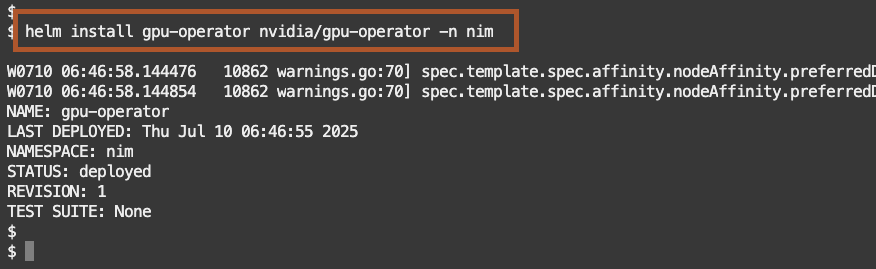
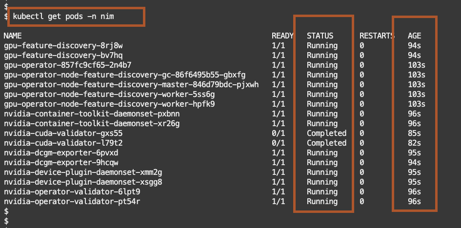

# NVIDIA GPU Operator 

## Introduction

*We install NVIDIA GPU Operator that manages NVIDIA GPU resources in a Kubernetes cluster and automates tasks related to bootstrapping GPU nodes*

Estimated Lab Time: 20 minutes


## Installing NVIDIA GPU Operator

When the cluster is ready, create the namespace in Kubernetes.

````shell
<copy>
kubectl create namespace nim
</copy>
````


Replace &lt;insert your NGC\_API\_KEY&gt; with your NGC API key, then
paste the updated command into the Cloud Shell and press Enter.

````shell
<copy>
export NGC_API_KEY=<insert your NGC_API_KEY>
</copy>

````
EY>`

1.  **<u>Install GPU Operator</u>**

Install the GPU Operator - NVIDIA GPU Operator manages NVIDIA GPU
resources in a Kubernetes cluster and automates tasks related to
bootstrapping GPU nodes

Add the NVIDIA repository


````shell
<copy>
helm repo add nvidia https://helm.ngc.nvidia.com/nvidia \\
&& helm repo update
</copy>

````


````shell
<copy>
helm install gpu-operator nvidia/gpu-operator -n nim
</copy>

````




Check the pods.

````shell
<copy>
kubectl get pods -n nim
</copy>

````


The **GPU Operator** installed successfully within 2 minutes.




2.  **<u>Install NIM Operator</u>**

Install the NIM Operator - NIM Operator is a Kubernetes operator that
manages the deployment and lifecycle of NVIDIA NIM

Install NIM-Operator

````shell
<copy>
helm install nim-operator nvidia/k8s-nim-operator -n nim
</copy>

````


Check the pods.

````shell
<copy>
kubectl get pods -n nim
</copy>

````


3.  **<u>Create Secrets</u>**

Create a secret with specified type.

- A **docker-registry** type secret is for accessing the NGC registry.

- The **generic** type of secret is for accessing NGC catalog.

````shell
<copy>
kubectl create secret docker-registry ngc-secret \
  --namespace nim-0c9981ce-1713-4d78-b72d-c6aad3bdf974\
  --docker-server=nvcr.io \
  --docker-username='$oauthtoken' \
  --docker-password="$NGC_API_KEY"
</copy>

````

````shell
<copy>
kubectl create secret generic ngc-api-secret \
  --namespace nim-0c9981ce-1713-4d78-b72d-c6aad3bdf974\
  --from-literal=NGC_API_KEY="$NGC_API_KEY" \
  --from-literal=NVIDIA_API_KEY="$NGC_API_KEY"
</copy>

````


Check the secret was successfully created within the Kubernetes cluster.

````shell
<copy>
kubectl get secrets -n nim
</copy>

````

You may now **proceed to the next lab**


## Acknowledgements
- **Created By** -  Alejandro Casas OCI Product Marketing; Julien Lehmann, OCI Product Marketing
- **Contributors** - Dimitri Maltezakis Vathypetrou, NVIDIA Developer Relations; Anurag Kuppala, NVIDIA AI Solution Architect
- **Last Updated By/Date** - Dec 12th, Alejandro Casas, Julien Lehmann
