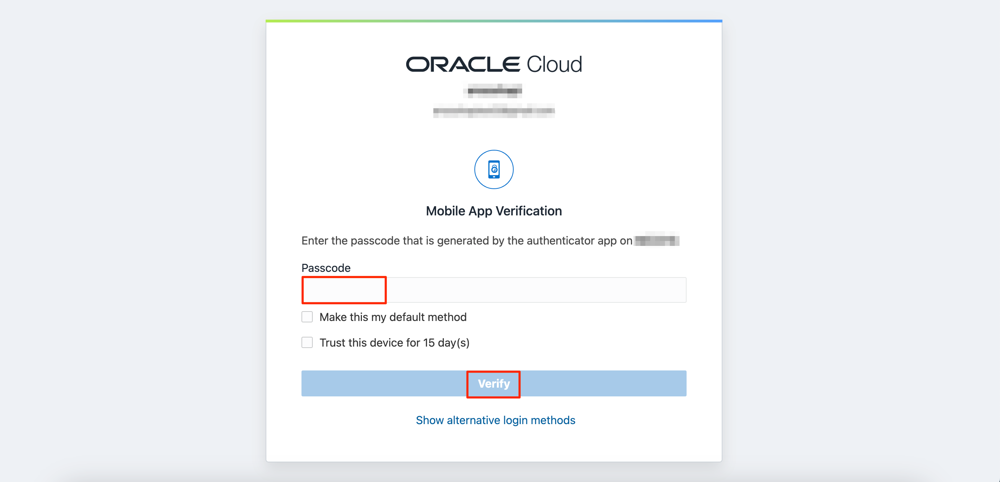
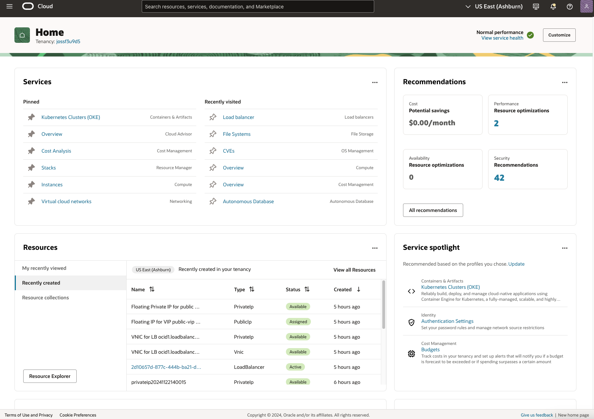

# Get started

## Introduction

Oracle Cloud is a leading, integrated cloud provider offering services across SaaS, PaaS, and IaaS, with deployment options for public and private environments.

**Estimated Time:** 5 minutes

### Types of Cloud Accounts

1. **Free Tier Accounts**: Details provided in a welcome email after signing up.
2. **Paid Accounts**: Credentials sent to your company's default administrator, who assigns user access.

### Objectives

- Learn to log in to your Oracle Cloud account.

### Prerequisites

- **Cloud Account Name**: Provided by your administrator or welcome email.
- **Username**: Your Oracle Cloud user ID.
- **Password**: Set during account creation.

## Task 1: Signing into Oracle Cloud

Follow these steps to log in if you've signed out:

1. Navigate to [cloud.oracle.com](https://cloud.oracle.com) and enter your **Cloud Account Name** and click **Next**.

    

2. Select your **Identity Domain** and click **Next**.

    

    

3. Enter your Cloud Account credentials:

    - **Username:** Your email address.
    - **Password:** The one chosen during signup.

    

4. Complete Multi-factor Authentication (MFA) based on your setup (e.g., approve in the app or enter a code).

    

    

    Once verified, you'll access the OCI Console Home Page and can continue your tasks!

    

You may now proceed to the next lab.

## Acknowledgements

- **Author** - JP Santana, Master Cloud Architect, Oracle
- **Last Updated By/Date** - JP Santana, November 2024
