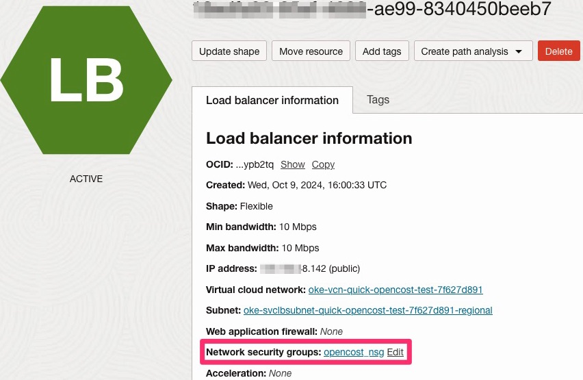
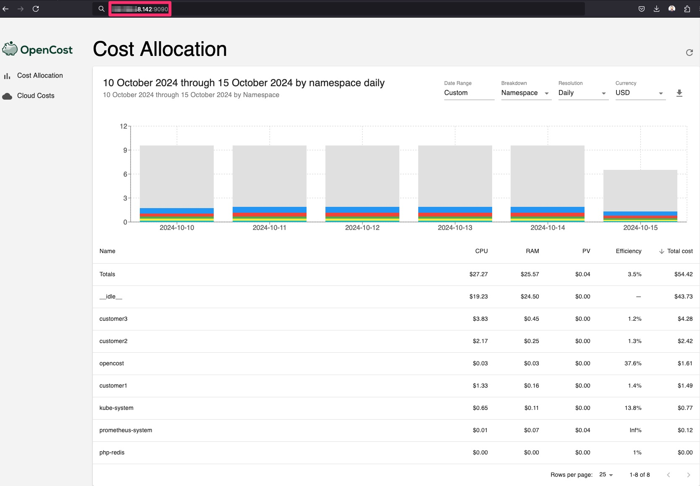

# Setup OpenCost on your OKE cluster

## Introduction

In this lab, you will set up OpenCost on your Oracle Kubernetes Engine (OKE) cluster to track and manage costs for Kubernetes workloads. You'll install the necessary components, and deploy OpenCost to monitor cost allocation.

Estimated Lab Time: 20 minutes

### Objectives

In this lab, you will:

* Deploy OpenCost on your OKE cluster.
* Configure external access to your OpenCost environment.

### Prerequisites

This lab assumes you have:
* An Oracle Cloud account.
* An OKE active cluster. All these steps are described in the previous labs.

## Task 1: Install Prometheus

Install Prometheus via Helm by running the following command:

```bash
helm install prometheus --repo https://prometheus-community.github.io/helm-charts prometheus \
  --namespace prometheus-system --create-namespace \
  --set prometheus-pushgateway.enabled=false \
  --set alertmanager.enabled=false \
  -f https://raw.githubusercontent.com/opencost/opencost/develop/kubernetes/prometheus/extraScrapeConfigs.yaml
```

## Task 2: Install OpenCost on Your OKE Cluster

1. Create the OpenCost namespace for your installation.

```bash
    kubectl create namespace opencost
```

2. Install OpenCost into the OpenCost namespace.

```bash
helm install opencost --repo https://opencost.github.io/opencost-helm-chart opencost --namespace opencost
```

3. Update OpenCost.

```bash
helm upgrade opencost --repo https://opencost.github.io/opencost-helm-chart opencost --namespace opencost
```

4. Update the service so that an external IP address is assigned to the OCI Load Balancer.

```bash
kubectl patch svc opencost -n opencost -p '{"spec": {"type": "LoadBalancer"}}'
```

To access OpenCost publicly, we need to create a Network Security Group (NSG), configure an ingress rule to open the required port, and associate it with the OCI Load Balancer.

5. Create the Network Security Group (NSG). Be sure to replace `YOUR_COMPARTMENT_ID` with your actual compartment ID and `YOUR_VCN_ID` with your VCN ID. You can retrieve this information from the OCI Console.

```bash
oci network nsg create --compartment-id [YOUR_COMPARTMENT_ID] --vcn-id [YOUR_VCN_ID] --display-name opencost_nsg
```

6. Create an ingress rule that allows TCP traffic on port `9090` from the internet. You can download the `opencost-nsg-rule.json` file from here: [opencost-nsg-rule.json](./files/opencost-nsg-rule.json).

```bash
oci network nsg rules add --nsg-id [YOUR_NSG_ID] --from-json file://opencost-nsg-rule.json
```

7. Attach the newly created Network Security Group (NSG) to the OCI Load Balancer. Replace `YOUR_LB_ID` with your load balancer ID and `YOUR_NSG_ID` with your Network Security Group ID.

```bash
oci lb nsg update --load-balancer-id [YOUR_LB_ID] --nsg-ids '[ "[YOUR_NSG_ID]" ]'
```



9. Retrieve the external IP address and use it to access OpenCost using your web browser. Run the `kubectl get svc -n opencost` command.



## Learn More

To get familiar with the OpenCost UI see [Video: See How OpenCost Tracks Your Kubernetes Costs and Cloud Billing](https://youtu.be/lCP4Ci9Kcdg).

## Acknowledgements

* **Author** - JP Santana, Master Cloud Architect, Oracle
* **Last Updated By/Date** - JP Santana, November 2024
