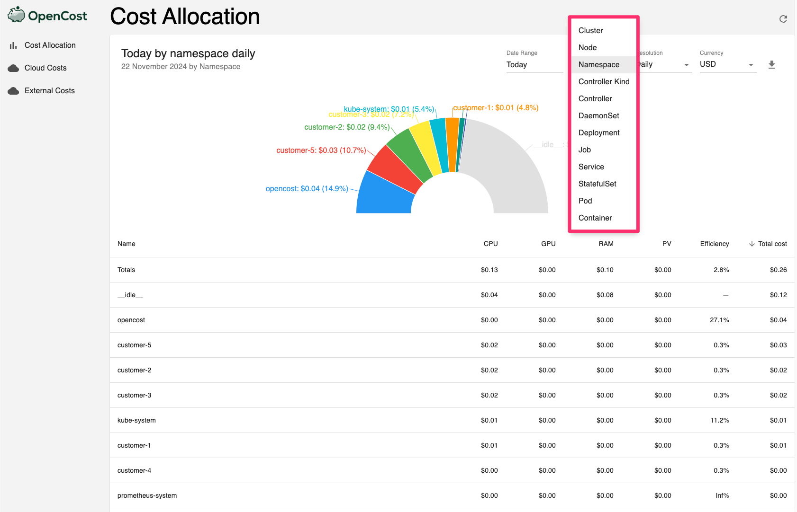
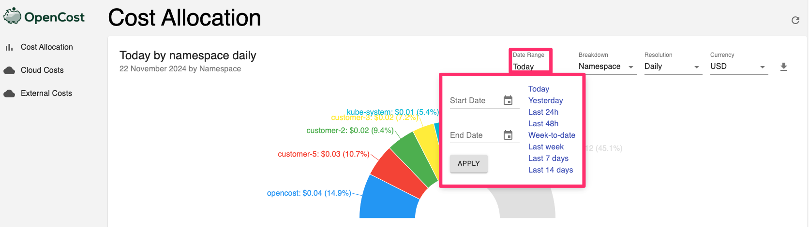

# Use OpenCost to explore your Kubernetes costs

## Introduction

Discover how to use OpenCost for detailed insights into your Kubernetes cluster's cost structure. OpenCost offers visibility into resource usage and spending across Kubernetes resources such as namespaces, nodes, deployments, and others. This enables accurate analysis and optimized resource allocation. Dive in to better manage and control your Kubernetes costs!

Estimated Lab Time: 20 minutes

### Objectives

In this lab, you will:

* Utilize OpenCost to analyze Kubernetes costs across various resources.
* Identify areas for cost optimization within your Kubernetes environment.
* View costs broken down per customer to assess and enhance cost-efficiency for each.

### Prerequisites

Before starting this lab, ensure that you have completed all previous parts of the workshop.

## Task 1: Access OpenCost

1. From the OCI Console, navigate to **Networking > Load Balancers**.

  

2. Find the Load Balancer created for OpenCost and click on it.

3. Copy the **Public IP Address** of the Load Balancer.

  

4. Open a new browser tab and enter the following URL: `http://<Load-Balancer-Public-IP>:9090`.

  

5. This will take you to the OpenCost dashboard, where you can explore your Kubernetes costs.

## Task 2: Exploring Kubernetes Costs in OpenCost

1. In the OpenCost UI, you will see an overview of your Kubernetes cluster's cost data.
2. Use the various filters and options available to break down the costs by Kubernetes resources, such as namespaces, nodes, deployments, and more.

  

3. Filter the costs by time ranges to analyze cost trends over specific periods.

  

4. Identify idle resources that are driving up costs and optimize your workloads by adjusting pod resource requests and limits for greater cost-efficiency.

  

5. Identify cost patterns and explore areas for potential cost optimization across your cluster. For example, focus on the "Efficiency" column to review the cost breakdown per customer and assess resource utilization efficiency.

  

## Task 3: Delete the Resources

1. To navigate back to your OCI Console window, click **Developer Services** > **Kubernetes Clusters (OKE)**.

  

2. Navigate to your cluster. Click the action icon and **Delete** and click **Delete** in the confirmation window.

  

3. From OCI services menu Click **Virtual Cloud Networks** under Networking, list of all VCNs will appear.

  

4. Locate your VCN , click the action icon and then **Terminate**. Click **Terminate All** in the Confirmation window. Click **Close** once VCN is deleted.

  

**Congratulations! You have successfully completed the lab.**

## Learn More

To get familiar with the OpenCost UI see [Video: See How OpenCost Tracks Your Kubernetes Costs and Cloud Billing](https://youtu.be/lCP4Ci9Kcdg).

## Acknowledgements

* **Author** - JP Santana, Master Cloud Architect, Oracle
* **Last Updated By/Date** - JP Santana, November 2024
