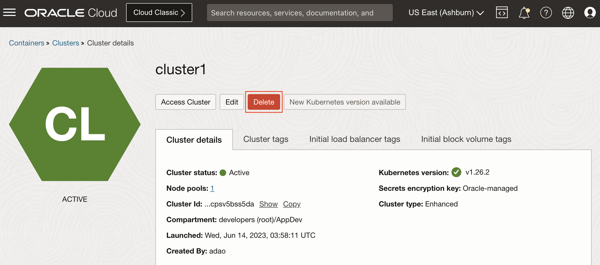
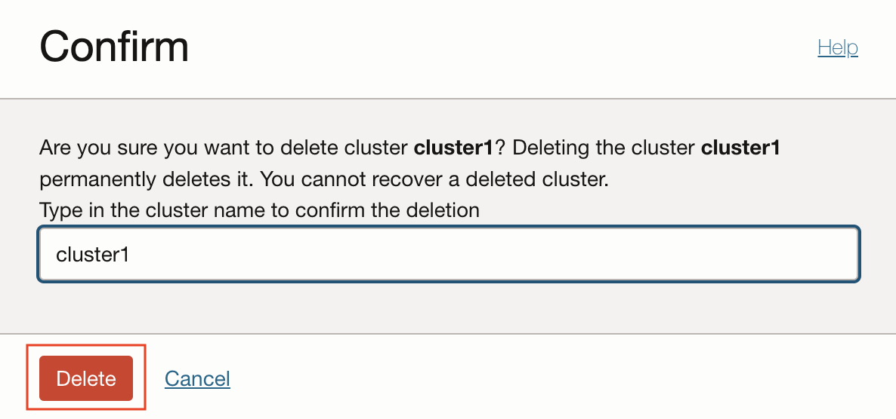

# Cleanup

## Introduction

The following steps represents cleanup operations, which may vary depending on the actions performed for setup and deployment of MuShop.

Estimated Time: 10 minutes

### Objectives

* Log into OCI Tenancy.
* Undeploy the MuShop App using helm delete
* Terminate Oracle Cloud Infrastructure (OCI) components.

## Task 1: List any helm releases that may have been installed

1. To get a better look at all the installed Helm Charts by using the **helm list** command.

    ````shell
    <copy>
    helm list --all-namespaces
    </copy>
    ````

    Sample response:

    ````shell
    NAME                    NAMESPACE               REVISION        UPDATED                                 STATUS          CHART                           APP VERSION
    mushop                  mushop                  1               2020-01-31 21:14:48.511917 -0600 CST    deployed        mushop-0.1.0                    1.0
    oci-broker              mushop-utilities        1               2020-01-31 20:46:30.565257 -0600 CST    deployed        oci-service-broker-1.3.3
    mushop-utils            mushop-utilities        1               2020-01-31 20:32:05.864769 -0600 CST    deployed        mushop-setup-0.0.1              1.0
    ````

## Task 2: Clean Up MuShop App

1. Remove the application from Kubernetes where --name mushop was used during install.

    ````shell
    <copy>
    helm delete mushop
    </copy>
    ````

## Task 3: Terminate the OKE Cluster and Worker Nodes

1. Delete the OKE Cluster



1. Confirm



This action will delete the Kubernetes Cluster and the Node Pool, terminating the worker nodes Compute Instances

## Acknowledgements

* **Author** - Adao Oliveira Junior, Solutions Architect
* **Contributors** -  Adao Oliveira Junior, Solutions Architect
* **Last Updated By/Date** - Adao Oliveira Junior, Jun 2023
