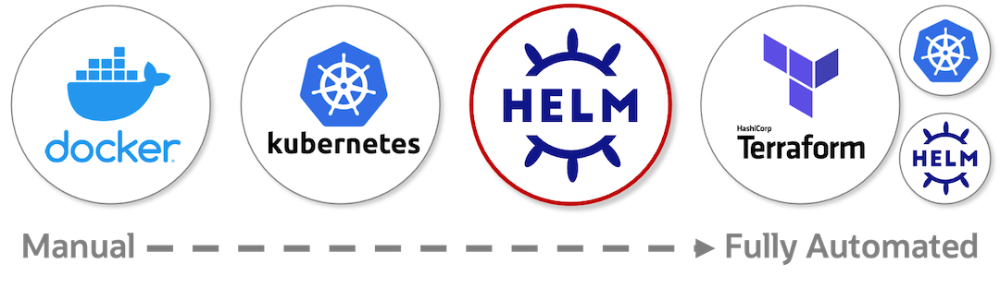
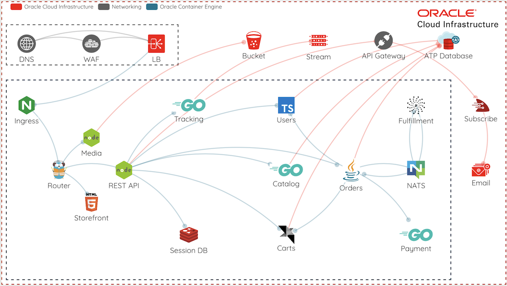
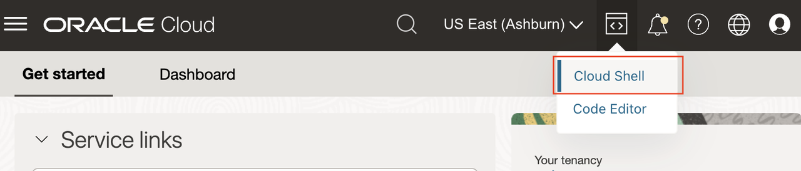
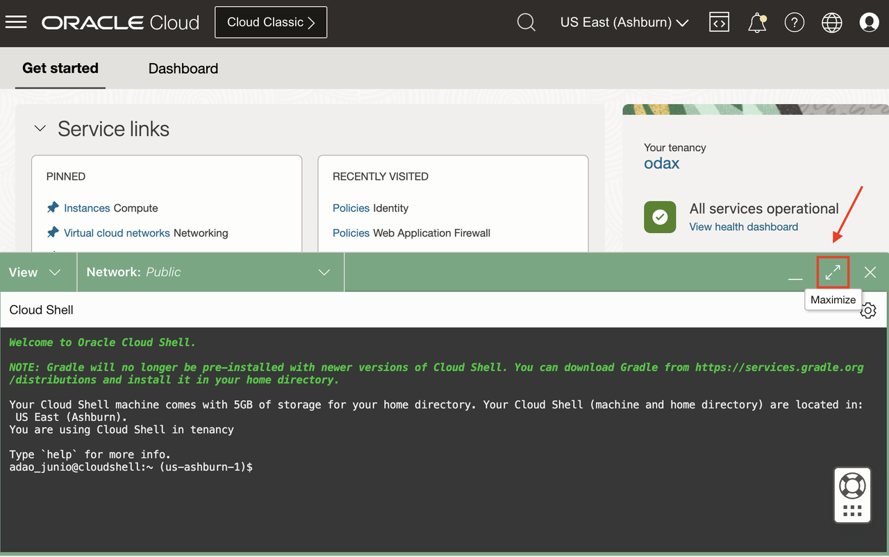
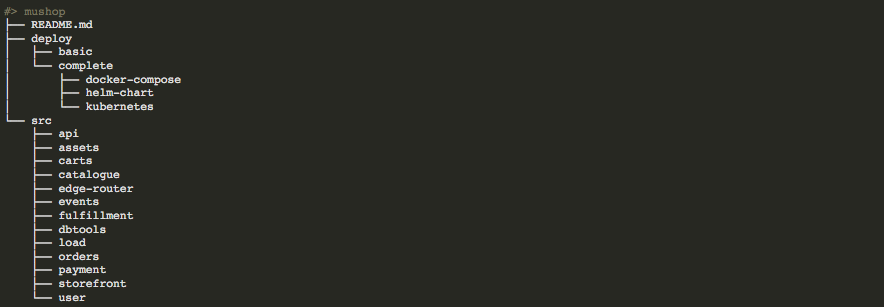

# Deploy a sample eCommerce application (MuShop) to the cluster

## Introduction

There are four options for deploying MuShop. They range from manual (docker), automated (Helm) to fully automated (Terraform).



Designing in microservices offers excellent separation concerns and provides developer independence.  While these benefits are clear, they can often introduce some complexity for the development environment.  Services support configurations that offer flexibility, when necessary, and establish parity as much as possible.  It is essential to use the same tools for development to production.


*Note: This diagram contains services not covered by these labs.*

Estimated Time: 10 minutes

### Objectives

In this lab, you will:

* Download Source Code
* Deploy MuShop to the OKE Virtual Nodes Cluster
* Expose your app publicly

### Prerequisites

* Completed the [Provisioning](../provision/provision.md) lab
* Completed the [Setup](../setup/setup.md) lab

## Task 1: Open Cloud Shell

1. On OCI Console, Top-Right, click the  icon and select **Cloud Shell**.

    

    > Note: For better terminal experience, you can maximize the Cloud Shell window by clicking the maximize icon on the top right of the Cloud Shell window.

    

## Task 2: Obtain MuShop source code

1. On the Cloud Shell and clone the github repo.

    ````shell
    <copy>
    git clone https://github.com/oracle-quickstart/oci-cloudnative.git mushop
    </copy>
    ````

    Sample response:

    ````shell
    Cloning into 'mushop'...
    remote: Enumerating objects: 23629, done.
    remote: Counting objects: 100% (429/429), done.
    remote: Compressing objects: 100% (230/230), done.
    remote: Total 23629 (delta 265), reused 343 (delta 198), pack-reused 23200
    Receiving objects: 100% (23629/23629), 28.26 MiB | 31.69 MiB/s, done.
    Resolving deltas: 100% (14463/14463), done.
    ````

1. Change to the mushop directory

    ````shell
    <copy>
    cd mushop
    </copy>
    ````

    

    *./deploy:* Collection of application deployment resources
    *./src:* MuShop individual service code, Dockerfile, etc

1. Check **kubectl** context

    ````shell
    <copy>
    kubectl config current-context
    </copy>
    ````

    Sample response:

    ````shell
    cluster-c4daylfgvrg
    ````

1. Check pods running on the newly created OKE Virtual Nodes cluster

    ````shell
    <copy>
    kubectl get pods --all-namespaces
    </copy>
    ````

    Sample response:

    ````shell
    NAMESPACE     NAME                                   READY   STATUS    RESTARTS   AGE
    kube-system   coredns-78d485568-rjvnk                0/1     Pending   0          18m
    kube-system   csi-oci-node-4mwhl                     0/1     Pending   0          18m
    kube-system   csi-oci-node-c5n8m                     0/1     Pending   0          18m
    kube-system   csi-oci-node-wqhlj                     0/1     Pending   0          18m
    kube-system   kube-dns-autoscaler-7464f65c5c-zgtls   0/1     Pending   0          18m
    kube-system   kube-proxy-6w465                       0/1     Pending   0          18m
    kube-system   kube-proxy-h8mkq                       0/1     Pending   0          18m
    kube-system   kube-proxy-wqhsl                       0/1     Pending   0          18m
    ````

    >Note: You may see the `kube-proxy` and `csi-oci-node` pods pending or terminating.  This is expected.

## Task 3: Deploy the eCommerce App with Helm

Remembering that helm provides a way of packaging and deploying configurable charts, next we will deploy the application in "mock mode" where cloud services are mocked, yet the application is fully functional

1. Deploy the application in "mock mode" where cloud services are mocked, yet the application is fully functional

    ````shell
    <copy>
    helm upgrade --install mushop ./deploy/complete/helm-chart/mushop -f ./deploy/complete/helm-chart/mushop/values-virtual-nodes.yaml
    </copy>
    ````

1. Please be patient. It may take a few moments to download all the application images.

    ````shell
    <copy>
    kubectl get pods --watch
    </copy>
    ````

    >Note: To leave the _watch_ press `CTRL-C` anytime. If do not want to keep watching and just see the current list of PODS, just use `kubectl get pods`

1. Make sure all the pods are in the `Running` state.

    ````shell
    <copy>
    kubectl get pods
    </copy>
    ````

    Sample response:

    ````shell
    NAME                                  READY   STATUS      RESTARTS   AGE
    mushop-api-6cbb9957fc-smmqf           1/1     Running     0          3m3s
    mushop-assets-687c574c68-r2wf6        1/1     Running     0          3m3s
    mushop-assets-deploy-1-kbnj5          0/1     Completed   0          3m3s
    mushop-edge-645bc886c7-8m52n          1/1     Running     0          3m3s
    mushop-fulfillment-76f98cddbb-vnp6h   1/1     Running     0          3m2s
    mushop-session-67bc86d446-jnq8w       1/1     Running     0          3m3s
    mushop-storefront-5747bd4644-tdn4v    1/1     Running     0          3m3s
    ````

1. Find the EXTERNAL-IP assigned to the edge microservice.  Open the IP address in your browser.

    ````shell
    <copy>
    kubectl get svc edge
    </copy>
    ````

    Sample response:

    ````shell
    NAME   TYPE           CLUSTER-IP     EXTERNAL-IP     PORT(S)        AGE
    edge   LoadBalancer   10.96.74.116   143.47.123.86   80:32756/TCP   3m31s
    ````

1. Open to the MuShop Storefront by using your browser connecting to http://< EXTERNAL-IP >

    

## Task 4: Explore the deployed app

When you create a Deployment, you'll need to specify the container image for your application and the number of replicas that you want to run.

Kubernetes created a Pod to host your application instance. A Pod is a Kubernetes abstraction that represents a group of one or more application containers (such as Docker), and some shared resources for those containers. Those resources include:

* Shared storage, as Volumes
* Networking, as a unique cluster IP address
* Information about how to run each container, such as the container image version or specific ports to use

The most common operations can be done with the following kubectl commands:

* **kubectl get** - list resources
* **kubectl describe** - show detailed information about a resource
* **kubectl logs** - print the logs from a container in a pod
* **kubectl exec** - execute a command on a container in a pod

You can use these commands to see when applications were deployed, what their current statuses are, where they are running and what their configurations are.

1. Check the microservices deployments for MuShop

    ````shell
    <copy>
    kubectl get deployments
    </copy>
    ````

1. Check the pods deployed

    ````shell
    <copy>
    kubectl get pods
    </copy>
    ````

1. Get the last created pod to inspect

    ````shell
    <copy>
    export POD_NAME=$(kubectl get pods -o go-template --template '{{range .items}}{{.metadata.name}}{{"\n"}}{{end}}'|awk '{print $1}'|tail -n 1) && \
    echo Using Pod: $POD_NAME
    </copy>
    ````

1. View what containers are inside that Pod and what images are used to build those containers

    ````shell
    <copy>
    kubectl describe pod $POD_NAME
    </copy>
    ````

1. Anything that the application would normally send to `STDOUT` becomes logs for the container within the Pod. We can retrieve these logs using the `kubectl logs` command:

    ````shell
    <copy>
    kubectl logs $POD_NAME
    </copy>
    ````

1. Execute commands directly on the container once the Pod is up and running.

    ````shell
    <copy>
    kubectl exec $POD_NAME env
    </copy>
    ````

1. List the content of the Pod’s container work folder:

    ````shell
    <copy>
    kubectl exec -ti $POD_NAME -- ls
    </copy>
    ````

    *Note:* You can also start a `bash` session on the Pod's container, just change the `ls` to `bash`. Remember that you need to type `exit` to exit the bash session.

## Task 5: Under the Hood

1. To get a better look at all the installed Kubernetes manifests by using the template command.

    ````shell
    <copy>
    mkdir ./out
    <copy>
    ````

    ````shell
    <copy>
    helm template mushop ./deploy/complete/helm-chart/mushop -f ./deploy/complete/helm-chart/mushop/values-virtual-nodes.yaml --output-dir ./out
    <copy>
    ````

1. Explore the files, and see each output.

You may now **proceed to the next lab**.

## Learn More

* [MuShop Github Repo](https://github.com/oracle-quickstart/oci-cloudnative)
* [MuShop Deployment documentation](https://oracle-quickstart.github.io/oci-cloudnative/cloud/)

## Acknowledgements

* **Author** - Adao Oliveira Junior, Solutions Architect
* **Contributors** -  Adao Oliveira Junior, Solutions Architect
* **Last Updated By/Date** - Adao Oliveira Junior, Jun 2023
