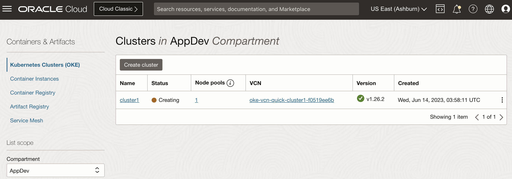

# Provision of Oracle Container Engine for Kubernetes (OKE) with Virtual Nodes

## Introduction

On this lab, you will provision the infrastructure needed to run the Oracle Managed Kubernetes Cluster, including the Virtual Nodes Pool.

Estimated Time: 5 minutes

### About OKE Virtual Nodes

Virtual nodes provide a serverless Kubernetes experience, enabling you to run containerized applications at scale without the operational overhead of managing, scaling, upgrading, and troubleshooting the node infrastructure. Virtual nodes provide granular pod-level elasticity and pay-per-use pricing. As a result, you can scale deployments without taking into consideration the cluster's capacity, simplifying the execution of scalable workloads such as high-traffic web applications and data-processing jobs. You create virtual nodes by creating virtual node pools in enhanced clusters.

Virtual nodes provide you with the flexibility to satisfy application requirements. You can control the Kubernetes pod placement based on an availability needs, selecting the Compute processor shape, CPU, and memory most suited for an application. Hypervisor-level isolation for pods enables you to run any type of application on virtual nodes, including untrusted workloads.

Container Engine for Kubernetes with virtual nodes delivers seamless upgrades of Kubernetes clusters. The Kubernetes software is upgraded and security patches are applied while respecting application availability requirements.

Virtual nodes enable you to optimize the cost of running Kubernetes workloads. You pay for the exact compute resources consumed by each Kubernetes pod instead of paying for whole servers that might have unused capacity.

### Objectives

In this lab, you will:

* Use the Quick Create workflow to provision an OKE cluster with Virtual Nodes
* Execute the pre-requisite steps (IAM Policies and Security Rules)
* Wait for the cluster to be ready
* Check for Security Rules

## Task 1: Create Kubernetes Cluster

1. From the OCI Services menu (), click **Developer Services** > **Kubernetes Clusters (OKE)**.

  

1. Under **List Scope**, select the compartment in which you would like to create a cluster, then Click **Create Cluster**.

    > Note: You can select the root compartment if using a trial or test tenancy, but is recommended to create a new compartment for better organization.

    

1. Choose **Quick Create** and click **Submit**.

    

1. Fill out the form.

    * Name: Provide a name (cluster1 in this example)
    * Compartment: Choose your compartment (You can leave the default if select on the previous step)
    * Kubernetes Version: Choose the most recent version (Minimum 1.26.2 for OKE Virtual Nodes)
    * Kubernetes API Endpoint: Public Endpoint (default)
    * Node type: **Virtual** (Need to select option to enable Virtual Nodes)
    * Node count: 3
    * Pod shape: Pod.Standard.E4.Flex

  Click **Next**

  

  You will be presented with the **Resources to be created** page. This page shows the resources that will be created when you create the cluster.

1. Click on thebutton.

    **We now have a OKE cluster with 3 node Virtual node pool and Virtual Cloud Network with all the necessary resources and configuration needed**

    

    You can close this window.

## Task 2: Check that the OKE Cluster started the provisioning

1. (If already on the Cluster Information Screen, jump to the step 3) From the OCI Services menu , click **Developer Services** > **Kubernetes Clusters (OKE)**.

    

    > **Note:** This is the same step as the previous task, you may already be on that page.

1. Check the status of the just created OKE Cluster.

    

1. Click the just created OKE Cluster.

    

> Note: The cluster will take a few minutes to be ready. You can go to the next lab while the cluster is being provisioning.

You may now **proceed to the next lab**.

## Learn More

* [Comparing Virtual Nodes with Managed Nodes](https://docs.oracle.com/en-us/iaas/Content/ContEng/Tasks/contengcomparingvirtualwithmanagednodes_topic.htm#contengusingvirtualormanagednodes_topic)

## Acknowledgements

* **Author** - Adao Oliveira Junior, Solutions Architect
* **Contributors** -  Adao Oliveira Junior, Solutions Architect
* **Last Updated By/Date** - Adao Oliveira Junior, May 2023
