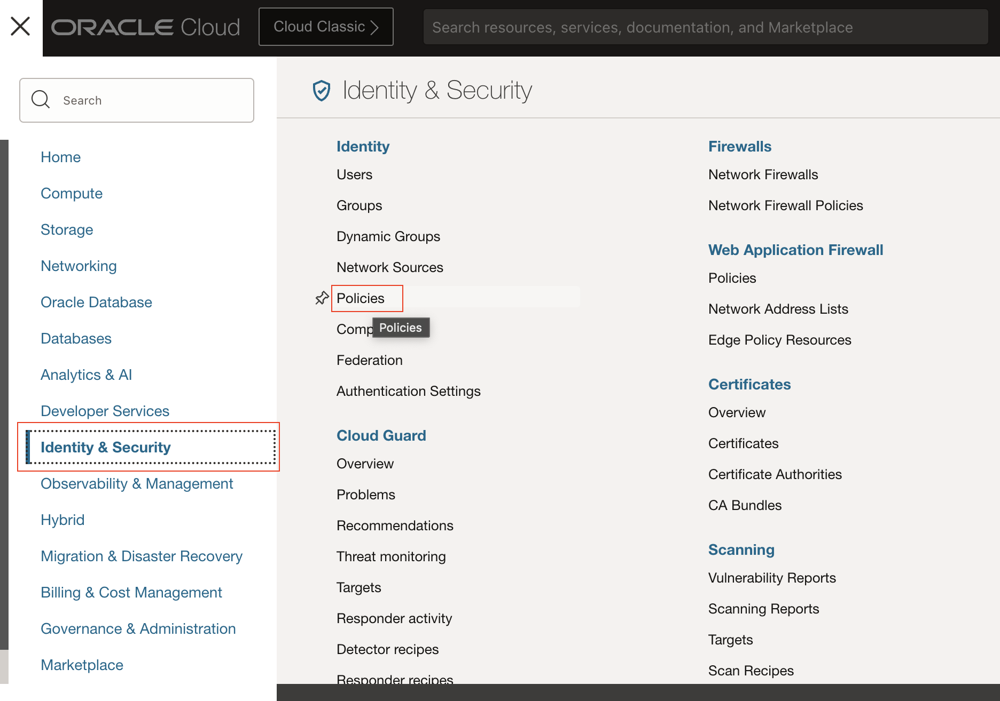
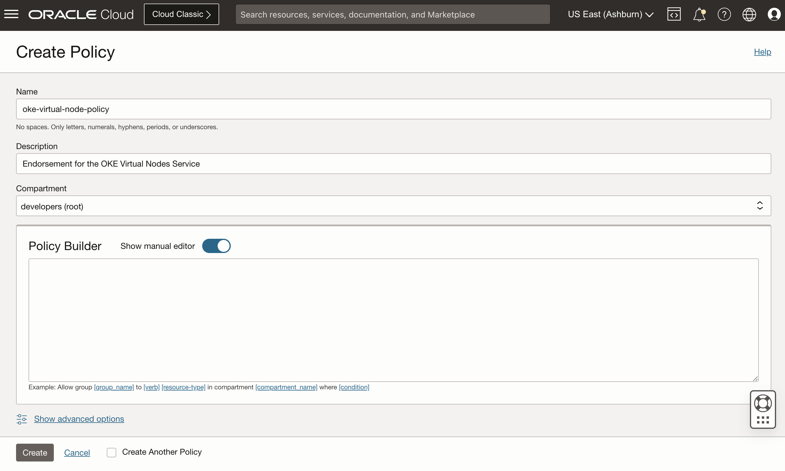
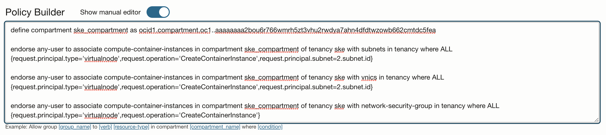
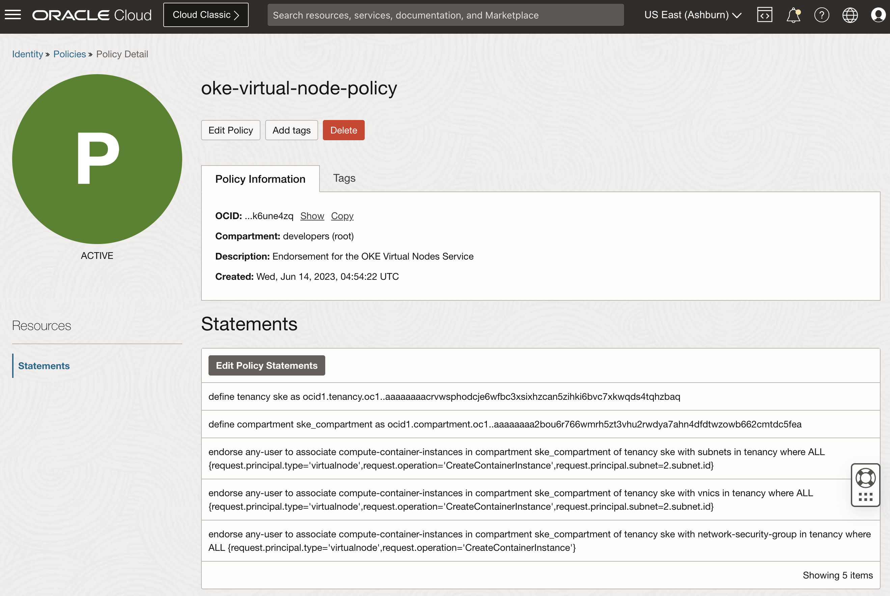
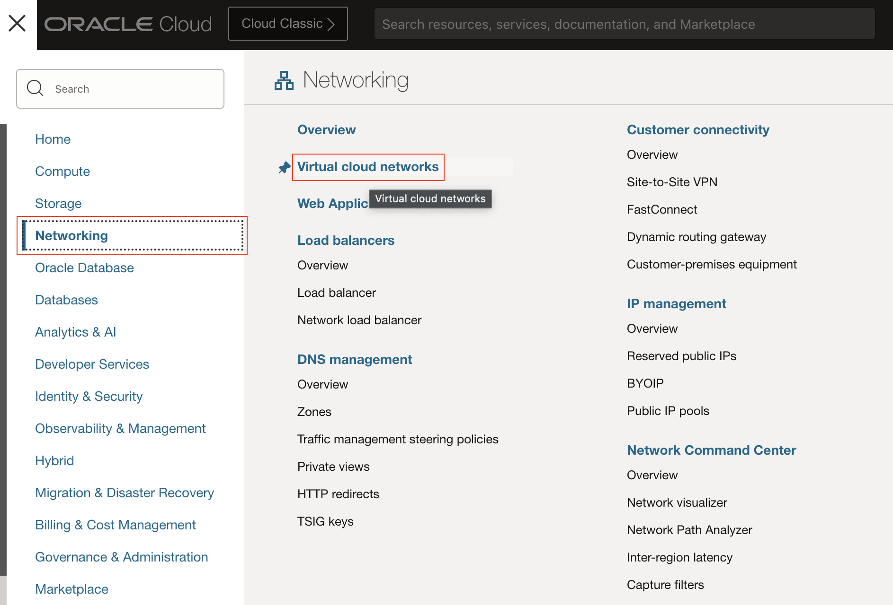
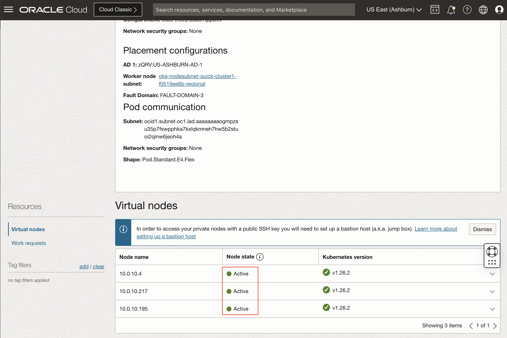

# Setup the Environment

## Introduction

On this lab, you will create the required IAM Policies for Using Virtual Nodes, Update Network Security Lists and wait for full provisioning of the OKE cluster and the Virtual Node Pool.

Estimated Time: 25 minutes

### Objectives

In this lab, you will:

* Enter the IAM polices required for the service OKE Virtual Nodes
* Navigate to the Virtual Cloud Network(VCN) and update the LoadBalancer Security list
* Configure the Kubernetes Cluster access on the OCI Cloud Shell
* Wait for the provisioning of the OKE cluster and the Virtual Node Pool

### Prerequisites

This lab assumes you have:

* Admin Access to the Tenancy or rights to create policies on the root compartment

> **Note:** If you do not have necessary rights, you need to have that steps previously setup by the tenancy admin, or the demo application may not deploy correctly

## Task 1: Enter the Required IAM Policies for Using Virtual Nodes

To create and use clusters with virtual nodes and virtual node pools, you must endorse the Container Engine for Kubernetes service to allow virtual nodes to create container instances in the Container Engine for Kubernetes service tenancy with a VNIC connected to a subnet of a VCN in your tenancy.

1. From the OCI Services menu (), click **Identity & Security** > **Policies**.

    

1. Under **List Scope**, select the (root) compartment. Click  button.

    > Note: This policy can only be created on the root compartment. If you do not have access, you need to contact your tenancy administrator to create for you.

    

1. Fill out the form.

    * Name: Provide a name (`oke-virtual-node-policy` in this example)
    * Description: Endorsement for the OKE Virtual Nodes Service
    * Compartment: Choose the (root) compartment
    * On the Policy Builder, switch to **Show manual editor**

    

1. On the **Policy Builder** box, enter the exactly policies as shown below:

    ```text
    <copy>
    define tenancy ske as ocid1.tenancy.oc1..aaaaaaaacrvwsphodcje6wfbc3xsixhzcan5zihki6bvc7xkwqds4tqhzbaq

    define compartment ske_compartment as ocid1.compartment.oc1..aaaaaaaa2bou6r766wmrh5zt3vhu2rwdya7ahn4dfdtwzowb662cmtdc5fea

    endorse any-user to associate compute-container-instances in compartment ske_compartment of tenancy ske with subnets in tenancy where ALL {request.principal.type='virtualnode',request.operation='CreateContainerInstance',request.principal.subnet=2.subnet.id}

    endorse any-user to associate compute-container-instances in compartment ske_compartment of tenancy ske with vnics in tenancy where ALL {request.principal.type='virtualnode',request.operation='CreateContainerInstance',request.principal.subnet=2.subnet.id}

    endorse any-user to associate compute-container-instances in compartment ske_compartment of tenancy ske with network-security-group in tenancy where ALL {request.principal.type='virtualnode',request.operation='CreateContainerInstance'}
    </copy>
    ```

    > **Note:** Do not change any of the OCIDs, copy as is

    

1. Click **Create**

    You should see the policy created showing 5 items.

    

## Task 2: Update Network Security List for LoadBalancer

1. From the OCI Services menu, click **Networking** > **Virtual cloud networks**.

  

1. Under **List Scope**, select the same compartment used to create a cluster. Click on the vcn created for the OKE Cluster

  

1. Click on the Security Lists and select something similar to **oke-svclbseclist-quick-cluster1-aaaaaaaaaa**.

  

1. Click on the Egress Rules and click **Add Egress Rules** button.

  

1. Enter the **Egress Rule 1**.

    * Destination Type: `CIDR`
    * Destination CIDR: `10.0.10.0/24`
    * IP Protocol: `TCP`
    * Source Port Range: `30000`
    * Destination Port Range: `32767`
    * Description: `Traffic to pod and health check node port traffic for external-traffic-policy=local`

    Click **Add Egress Rules** button

  

1. Enter the **Egress Rule 2**.

    * Destination Type: `CIDR`
    * Destination CIDR: `10.0.10.0/24`
    * IP Protocol: `TCP`
    * Source Port Range: `ALL`
    * Destination Port Range: `10256`
    * Description: `Allow OCI load balancer or network load balancer to communicate with kube-proxy on worker nodes.`

    Click **Add Egress Rules** button

1. Your Egress Rules should looks like this:

  

## Task 3: Configure the Kubernetes Cluster access on the OCI Cloud Shell

1. (If already on the Cluster Information Screen, jump to the step 3) From the OCI Services menu , click **Developer Services** > **Kubernetes Clusters (OKE)**.

    

    > **Note:** This is the same step as the previous task, you may already be on that page.

1. Click on the OKE Cluster.

    

1. On the **Cluster details**, click on the **Access Cluster** button.

    

1. On the **Access Your Cluster**, click on the **Launch Cloud Shell** button to launch the OCI Cloud Shell.

    

1. On the **Access Your Cluster**, click on the **Copy** button to copy the oci-cli command.

    

1. Paste to the OCI Cloud Shell and press enter.

    

## Task 4: Check OKE Cluster and Virtual Node pool provisioning completion

1. (If already on the Cluster Information Screen, jump to the step 3) From the OCI Services menu , click **Developer Services** > **Kubernetes Clusters (OKE)**.

    

    > **Note:** This is the same step as the previous task, you may already be on that page.

1. Click on the OKE Cluster.

    

    > **Note:** If the cluster is showing _Active_, means that the controlplane have been provisioned, but the worker nodes may still being provisioned. You can check on the next step if the worker nodes are ready as well.

1. On the **Cluster details**, check the **Cluster Status**. If is not _Active_, wait until it is to proceed to the next step.

    

1. With **Cluster Status** showing _Active_, Click on the Node pools and check if the **Node pool status** is showing _Active_. If is not _Active_, wait until it is to proceed to the next step.

    

1. To verify that the Virtual nodes are on the **Node state** _Active_, click on the Virtual Node pool details, or click on the total number of nodes to go directly to the nodes, as shown on the image bellow.

    

1. If all the Virtual Nodes are showing **Node state** _Active_, you are ready to proceed to the next Lab.

    

You may now **proceed to the next lab**.

## Learn More

* [Required IAM Policies for Using Virtual Nodes](https://docs.oracle.com/en-us/iaas/Content/ContEng/Tasks/contengvirtualnodes-Required_IAM_Policies.htm)
* [Using Cloud Shell](https://docs.oracle.com/en-us/iaas/Content/API/Concepts/devcloudshellgettingstarted.htm)

## Acknowledgements

* **Author** - Adao Oliveira Junior, Solutions Architect
* **Contributors** -  Adao Oliveira Junior, Solutions Architect
* **Last Updated By/Date** - Adao Oliveira Junior, Jun 2023
