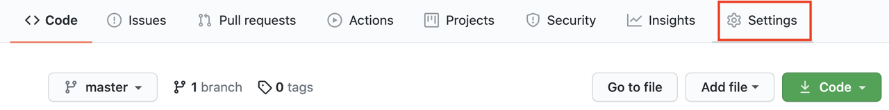
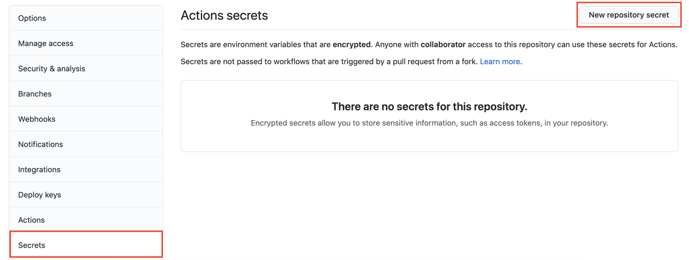
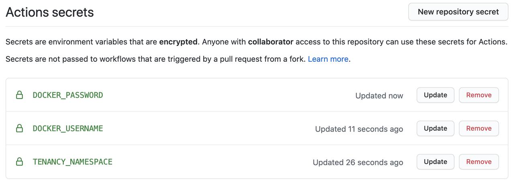
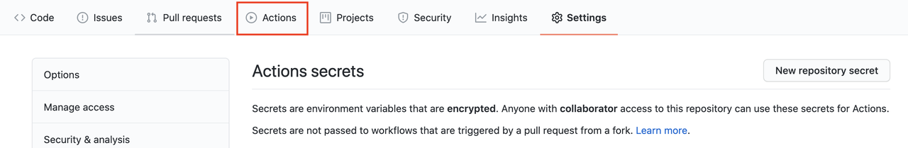
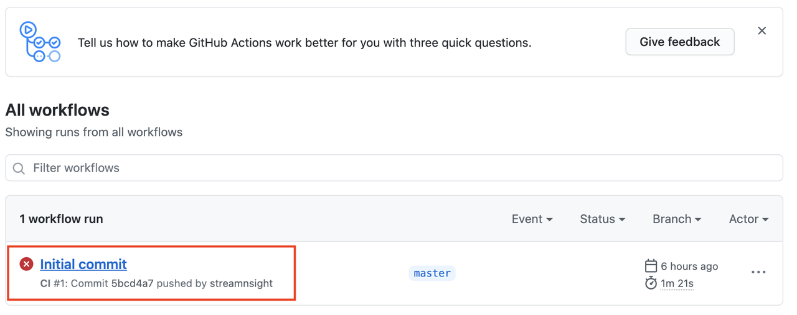
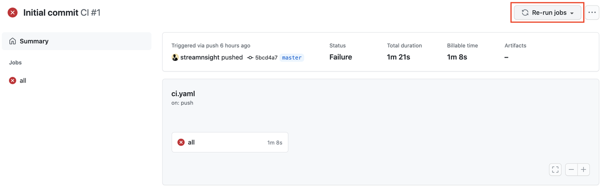

# Continuous Integration/Continuous Deployment (CI/CD) with GitHub Actions

## Introduction

Github actions let you run specific tasks when a git event occurs, such as a commit to a branch, a PR being opened, or a release being cut.

Continuous Integration / Continuous Deployment (CI/CD) principles take advantage of git automation to run test, and deploy code upon these action happening.

We'll look at configuring GitHub actions to test our code and optionally deploy it to staging or production.

Estimated Lab Time: 20 minutes.

### Objectives

In this lab you will:

- Configure GitHub actions to perform tests upon committing to the development or master branch.
- Optionally we'll configure GitHub actions to deploy to production upon creating a new release.

## Task 1: GitHub Actions Overview

1. GitHub Actions are available to run tasks, using a yaml configuration file under `.github/workflow`.

2. GitHub Actions use Secrets to provide the task with credentials. This is a potential security risk if you do not trust GitHub to hold credentials to your Docker Image registry or Kubernetes Cluster.

    Note that you can use other preferred methods to do CI/CD, like other CI services or your own Jenkins instance.

    Check out the quickstart guide to deploy a Jenkins server here: [https://github.com/oracle-quickstart/oci-arch-jenkins](https://github.com/oracle-quickstart/oci-arch-jenkins).

3. In this lab we will use GitHub Actions directly.

4. The action script provided includes:

    ```yaml
    # This is a basic workflow to help you get started with Actions

    name: CI

    # Controls when the action will run. 
    on:
    # Triggers the workflow on push or pull request events but only for the master branch
    push:
        branches: [ development, master ]
        # paths: [ src/ ]
    pull_request:
        branches: [ development, master ]
        # paths: [ src/ ]
    release:
        types: [published]

    # Allows you to run this workflow manually from the Actions tab
    workflow_dispatch:

    # A workflow run is made up of one or more jobs that can run sequentially or in parallel
    jobs:
    all:
        # The type of runner that the job will run on
        runs-on: ubuntu-latest

        env: 
        SERVICE: ${{ matrix.service }}
        DOCKER_USERNAME: '${{ secrets.DOCKER_USERNAME }}'
        DOCKER_PASSWORD: '${{ secrets.DOCKER_PASSWORD }}'
        TENANCY_NAMESPACE: '${{ secrets.TENANCY_NAMESPACE }}'
        OCI_CONFIG: ${{ secrets.OCI_CONFIG }}
        CI_USER_KEY: ${{ secrets.CI_USER_KEY }}
        KUBE_CONFIG_SECRET: ${{ secrets.KUBE_CONFIG }}


        # Steps represent a sequence of tasks that will be executed as part of the job
        steps:
        # Checks-out your repository under $GITHUB_WORKSPACE, so your job can access it
        - name: git clone
            uses: actions/checkout@v2

        - name: Setup
            run: |
            ./scripts/setup.sh

        - name: Cache python
            uses: actions/cache@v2
            env:
            cache-name: cache-python
            with:
            path: ~/.cache/pip
            key: ${{ runner.os }}-build-${{ env.cache-name }}-${{ hashFiles('**/requirements.*.txt') }}
            restore-keys: |
                ${{ runner.os }}-build-${{ env.cache-name }}-
                ${{ runner.os }}-build-
                ${{ runner.os }}-

        - name: lint
            run: |

            echo "TENANCY_NAMESPACE=${TENANCY_NAMESPACE}" > creds.env
            echo "DOCKER_USERNAME=${DOCKER_USERNAME}" >> creds.env
            echo "DOCKER_PASSWORD=${DOCKER_PASSWORD}" >> creds.env
            
            echo ${{ github.event_name }}
            echo ${{ github.event.type }}
            echo ${{ github.ref }}
            ${{ github.event.pull_request.base.ref }}
            
            make install-all
            make lint-all

        - name: unit tests
            run: |
            echo "tests of the code before building the image"

        # Runs a set of commands using the runners shell
        - name: Build / publish docker images with digest
            run: |
            make repo-login
            make build

        - name: image tests
            run: |
            echo "tests of the built images here"

        # - name: deploy development
        #   if: ${{ github.ref == '/refs/heads/development'  && github.event_name != 'release' }}
        #   run: |
        #     # deploy to dev when pushing to pushing or merging to development

        #     export DEPS=${HOME}/deps
        #     export PATH=$PATH:~/bin/:$DEPS
        #     # set KUBECONFIG env variable for kubectl to use as it won't find the file here.
        #     export KUBECONFIG=./kube_config

        #     make namespace NS=staging-ns
        #     make secrets NS=staging-ns
        #     make deploy ENVIRONMENT=staging

        # - name: deploy staging
        #   if: ${{ github.ref == '/refs/heads/master' && github.event_name != 'release' }}
        #   run: |
        #     # deploy to staging when pushing to pushing or merging to master

        #     export DEPS=${HOME}/deps
        #     export PATH=$PATH:~/bin/:$DEPS
        #     # set KUBECONFIG env variable for kubectl to use as it won't find the file here.
        #     export KUBECONFIG=./kube_config

        #     make namespace NS=staging-ns
        #     make secrets NS=staging-ns
        #     make deploy ENVIRONMENT=staging

        # - name: deploy to prod
        #   if: ${{ github.ref == '/refs/heads/master' && github.event_name == 'release' }}
        #   run: |
        #     # deploy to production on published release

        #     export DEPS=${HOME}/deps
        #     export PATH=$PATH:~/bin/:$DEPS
        #     # set KUBECONFIG env variable for kubectl to use as it won't find the file here.
        #     export KUBECONFIG=./kube_config

        #     make namespace NS=prod-ns
        #     make secrets NS=prod-ns
        #     make deploy ENVIRONMENT=production

    ```

## Task 2: GitHub Secrets

1. The GitHub actions is already present in the `.github/workflow/ci.yaml`. 

2. You need to provide the secrets to your GitHub repo fort this action script to work properly. (you may already have received a failure notification when you created the repository from the template).

3. Go to the **Settings -> Secrets**.

    

    

4. Click **New Repository Secret**.

5. Create 3 secrets for your OCIR Docker Image Registry on OCI:

    - DOCKER_USERNAME
    - DOCKER_PASSWORD
    - TENANCY_NAMESPACE

    These 3 values can be retrieved from the generated `creds.env` file at the root of the repo folder.

    They look something like:

    ```
    TENANCY_NAMESPACE=ociaateam
    DOCKER_USERNAME=ociaateam/ocir_pusher_9ec1_23
    DOCKER_PASSWORD=j{+VsO7e_I3_Gl5}SM\#l
    ```

    


6. If you want to make use of the commented out actions that deploy to your Kubernetes cluster, you will also need to provide the following:

    - KUBE_CONFIG: the `kubeconfig` file for the Kubernetes cluster.
    - OCI_CONFIG: the OCI config file (`cluster_admin_user_xxxx_oci_config.txt`).
    - CI_USER_KEY: the OCI user private key (`cluster_admin_user_xxx_rsa_private_key.pem`).

    These files can be found in the `terraform` folder.

## Task 3: Test the Action

1. Click the **Actions** menu.

    

2. There you should find the original action that failed.

    

3. Click the failed action, then click **Re-run Jobs**.

    

    This time the action should run without failure.

4. To test the deployment actions, you'll need to:

    - Uncomment the commented yaml in the `ci.yaml` file.
    - Create a development branch in git, and push some changes.
    - Create a Pull Request (PR) from development to master, which should trigger a deployment to the `stage-ns` namespace in the cluster.
    - Merge the Pull Request, and create a release based on master, which should trigger a deployment to the `prod-ns` namespace.

    This is left as an exercise to the user.

You may proceed to the next lab.

## Acknowledgements

 - **Author** - Emmanuel Leroy, February 2021
 - **Last Updated By/Date** - Emmanuel Leroy, February 2021
