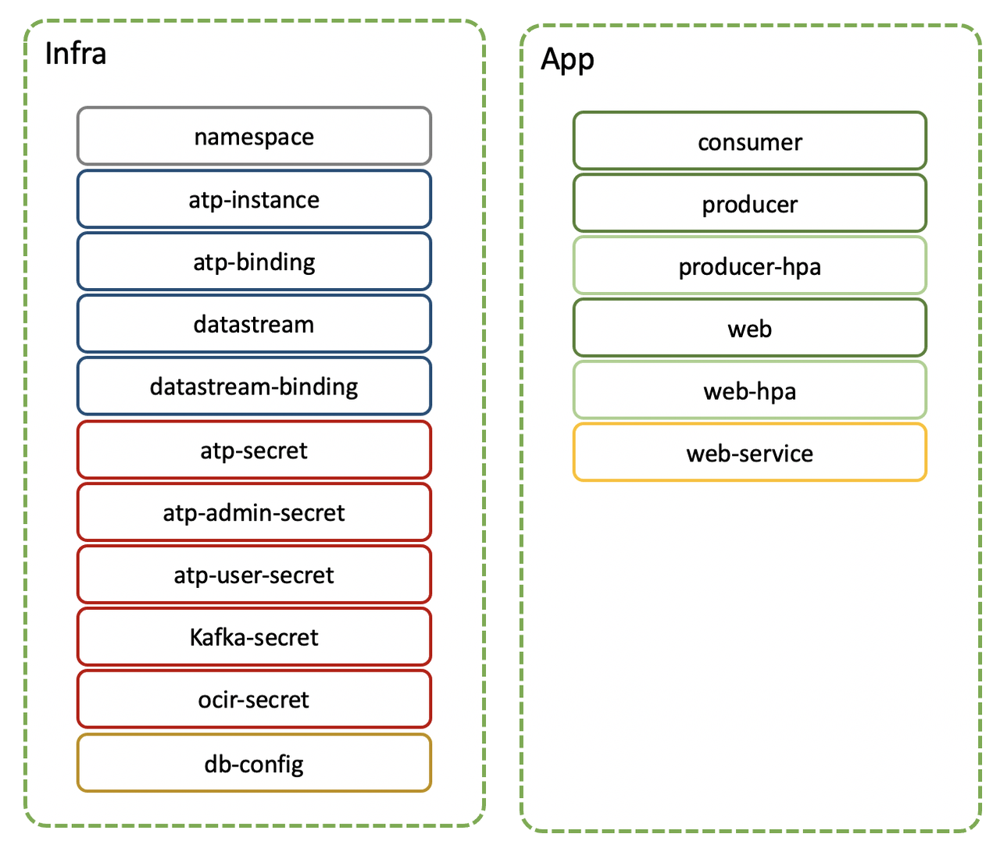

# Using Kustomize for Templated Environments

## Introduction

In the overview of the project, we saw how the repo is structured with **base** Kubernetes resource manifests and **overlays**. 

In this lab we will look into more details at how the repo is structured to use Kustomize to produce Kubernetes resource manifests for each environment.

Kustomize uses a set of **base** templates that define resources to be templated, and **overlays** which includes patches for the base resources. Patches may include adding a prefix, or a suffix to resources names, changing a variable, or adding an entire section to the Kubernetes manifest, like a volume mount, environment variables or secrets.

Kustomize also includes the concept of **components** that can be added to a set of resources. A **component** can be an add-on such as an additional service (be it a cache service, a LDAP service etc.) or it can be a shared **overlay** that should be applied to multiple configurations.


Estimated Lab Time: 10 minutes.

### Objectives

In this lab you will:

- Review the project structure for templating with **Kustomize**.
- Learn how to use Kustomize to generate manifests for various environments.


The components are separated into 2 groups: `infra` and `app` as illustrated below.




We'll go over the template files and how they are arranged together. It can be a little tedious looking at YAML files, so below is a quick visual of the infra templates, with the **base** templates on the left, the **overlay** applied in the middle, and the final rendering on the right, with colored text showing the differences and their overlay origin.

  

You can also look at the files themselves that are well commented.

## Task 1: The Base Templates

The base templates are separated into 3 folders:

- *`infra`*.
- *`app`*.
- *`components`*.

One of the challenges of developing on a live cluster is that pods need to be refreshed when code changes. Often pods have dependencies, like *ConfigMaps* or *Secrets* that need reloading.

For that reason, the development tools like **Skaffold** (which we will cover in a later lab) assume that a development environment is meant to be brought up and torn down at each launch/stop of the tool. This is default behavior, and although it can be overriden, it is also best practice to insure components are up-to-date.

However that does not play well with infrastructure like PaaS services that take time to provision, like the Oracle Autonomous Database.

It makes sense to separate the *`infrastructure`* components of the deployment (Streaming Service, Autonomous Database) from the *`app`* to be actively developed.

This brings another challenge though: if infrastructure resources get renamed (i.e. prefixed or suffixed for an specific environment) and are deployed separately, they are no longer referenced in the application manifests, and those name changes need to be patched in.

We'll look at how resources get patched for each environment, but first let's look at the base templates:

## Task 2: The Base *`infra`* Templates

1. The *`infra`* templates:

    ```
    │   │   └── infra
    │   │       ├── atp-admin.Secret.yaml
    │   │       ├── atp-user.Secret.yaml
    │   │       ├── atp.Secret.yaml
    │   │       ├── atp.ServiceBinding.yaml
    │   │       ├── atp.ServiceInstance.yaml
    │   │       ├── common.Namespace.yaml
    │   │       ├── db-config.Job.yaml
    │   │       ├── kafka.Secret.yaml
    │   │       ├── kustomization.yaml
    │   │       ├── kustomizeconfig
    │   │       │   └── custom.yaml
    │   │       ├── ocir.Secret.yaml
    │   │       ├── streaming.ServiceBinding.yaml
    │   │       └── streaming.ServiceInstance.yaml
    ```

Note all the resources are named with their base name and the Type, so they are easy to recognize.

2. *`common.Namespace.yaml`* describes the base namespace: the name is *`ns`* and will be prefixed with *`dev-`*, *`stage-`* or *`prod-`* when templating.

3. *`ocir.Secret.yaml`* is generated by Terraform. It provides the credentials to pull images. It is used by all the pods in the project.

4. The Autonomous Database resources include:

    - *`atp-admin.Secret.yaml`*: ATP admin user credentials, needed to provision the database.

    - *`atp-user.Secret.yaml`*: Regular database user credentials. It will be used by the application.

    - *`atp.Secret.yaml`*: OSB-formatted database admin credentials.
    
    - *`atp.ServiceBinding.yaml`*: defines a secret the OSB will generate for an instance (will contain the wallet to connect to the database).

    - *`atp.ServiceInstance.yaml`*: ATP instance parameters (CPU cores, storage, and so on).

4. The Streaming resources include:

    - *`kafka.Secret.yaml`*: username and token to connect to the Streaming Service. Generated by Terraform.

    - *`streaming.ServiceBinding.yaml`*: defines a secret with the streaming Stream id, name and poolId to use by the *`consumer`* and *`producer`* services. It references the stream instance.

    - *`streaming.ServiceInstance.yaml`*: The stream to create, including # of partitions.

        ***It requires the OCID of the compartment to use. This value was automatically injected when running the  Terraform.***

5. Finally we have the *`kustomization.yaml`* file and *`kustomizeconfig/custom.yaml`* file. Let's have a closer look at those.

## Task 3: The Base *`kustomization.yaml`* File for *`infra`*

1. The *`kustomization.yaml`* file contains the following:

    ```yaml
    apiVersion: kustomize.config.k8s.io/v1beta1
    kind: Kustomization

    commonLabels:
      app: demo

    configurations:
    - kustomizeconfig/custom.yaml

    resources:
    - ocir.Secret.yaml
    - kafka.Secret.yaml
    - atp-admin.Secret.yaml
    - atp-user.Secret.yaml
    - atp.Secret.yaml
    - atp.ServiceBinding.yaml
    - atp.ServiceInstance.yaml

    - common.Namespace.yaml
    - db-config.Job.yaml

    - streaming.ServiceInstance.yaml
    - streaming.ServiceBinding.yaml
    ```

    In the *`base`*, we're only defining what resources need to be included (under *`resources`*) and what common labels should be applied to all resources (under *`commonLabels`*).

    We also include custom configuration files under *`configurations`*.


2. The *`kustomizeconfig/custom.yaml`* is needed for **Kustomize** to understand our **Custom Resource Definitions (CRDs)**.

    The *`ServiceInstance`* and *`ServiceBinding`* resources are **Custom Resource Definitions**, which means they are not recognized as part of the default APIs of Kubernetes. As such, we need to tell Kustomize what values can be used as references in other templates.

    The *`kustomizeconfig/custom.yaml`* looks like:

    ```yaml
    #################################################################################
    # CRDs custom name references to insure proper prefixing/suffixing of resources #
    #################################################################################
    nameReference:
    # CRD source values
    - kind: ServiceInstance
      # field path and type where the name being referenced needs to be transformed
      fieldSpecs:
      - path: spec/instanceRef/name
        kind: ServiceBinding
      - path: spec/parameters/name
        kind: ServiceInstance

    # references of the secret name generated by ServiceBinding in Deployment, Jobs and Pods
    # as a secret volume mount, env value or envFrom value
    - kind: ServiceBinding
      fieldSpecs:
        # env: valueFrom
      - path: spec/template/spec/containers/env/valueFrom/secretKeyRef/name
        kind: Deployment
      - path: spec/template/spec/containers/env/valueFrom/secretKeyRef/name
        kind: Job
      - path: spec/containers/env/valueFrom/secretKeyRef/name
        kind: Pod
        # volume: secret
      - path: spec/template/spec/volumes/secret/secretName
        kind: Deployment
      - path: spec/template/spec/volumes/secret/secretName
        kind: Job
      - path: spec/volumes/secret/secretName
        kind: Pod
        # envFrom: secretRef
      - path: spec/template/spec/containers/envFrom/secretRef/name
        kind: Deployment
      - path: spec/template/spec/containers/envFrom/secretRef/name
        kind: Job
      - path: spec/containers/envFrom/secretRef/name
        kind: Pod

    # reference secret name in ServiceBinding
    - kind: Secret
      fieldSpecs:
      - path: spec/parametersFrom/secretKeyRef/name
        kind: ServiceBinding
      - path: spec/parametersFrom/secretKeyRef/name
        kind: ServiceInstance
    ```

    A *`nameReference`* defines all the possible places where the *`name`* of a resources can be used in other resources, so that it can be *`prefixed`* or *`suffixed`* properly.

    The *`kind`* defines the resource where the *`name`* comes from, and the *`path`* and nested *`kind`* defines where the name may be referenced in other resources.

    For example, the *`ServiceBinding`* name can be referenced in a *`Deployment`* under the path *`spec/template/spec/containers/env/valueFrom/secretKeyRef/name`*, which corresponds to referencing a secret as value for an environment variable.

    Inversely, kustomize needs to know how regular resources are used in the custom resource. For example, the last bloc explains how a *`Secret`* is referenced within the *`ServiceBinding`* or *`ServiceInstance`* under the *`parametersFrom`* key.

## Task 4: The Base *`app`* Templates

The same goes for the *`app`* templates:

1. The *`base/app`* folder looks like:

    ```
    │   │   ├── app
    │   │   │   ├── consumer.Deployment.yaml
    │   │   │   ├── consumer.HorizontalPodAutoscaler.yaml
    │   │   │   ├── kustomization.yaml
    │   │   │   ├── producer.Deployment.yaml
    │   │   │   ├── web.Deployment.yaml
    │   │   │   ├── web.HorizontalPodAutoscaler.yaml
    │   │   │   └── web.Service.yaml
    ```

2. Here we have some pretty standard Deployment files, which include Deployments for the *`consumer`*, *`producer`* and  *`web`* apps, with a *`web.Service`* to expose the web app to the outside through a load balancer.

3. Note the 2 *`HorizontalPodAutoscaler`* which are here to show the use of autoscaling pod capability on OKE. The metrics server required for the HPA to work was provisioned as part of the Terraform deployment earlier.

4. The *`kustomization.yaml`* file is very basic, with only *`resources`*.

## Task 5: The Base *`components`* Templates

1. The *`base/components`* folder includes components that are used in both *`infra`* and *`app`* deployments.

    Specifically, the use of ATP via the OCI Service Broker requires the use of an *`InitContainer`* to decode the wallet credentials. This is an artifact of how Secrets are encoded with the OSB.

    The component folder includes a single component, in a sub-folder, and its *`kustomization.yaml`* definition:

    ```
    │   │   ├── components
    │   │   │   └── db-init-container
    │   │   │       ├── decode-wallet.InitContainer.yaml
    │   │   │       ├── kustomization.yaml
    ```

2. The *`decode-wallet.InitContainer.yaml`* is a *`patch`* yaml file, which defines only the *`initContainer`* definition to be injected into all the *`Deployments`* or *`Jobs`* that need it.

3. The *`kustomization.yaml`* file looks like:

    ```yaml
    apiVersion: kustomize.config.k8s.io/v1alpha1
    kind: Component

    configurations:
    - kustomizeconfig/custom.yaml

    patches:
    # Inject the Init container to decode credentials into all pods that need it.
    # Those are referred by the label use_db=yes
    - path: decode-wallet.InitContainer.yaml
      target:
        labelSelector: use_db=yes
    # Inject database creds volume needed for database use into all the pods that need it
    - target:
        labelSelector: use_db=yes
      patch: |-
        - op: add
        # Inject database wallet creds volume
        path: /spec/template/spec/containers/0/volumeMounts/-
        value: { "name": "creds", "mountPath": "/instantclient_21_1/network/admin" }
    ```

    Here we see 2 patches:

    - The *`decode-wallet.InitContainer.yaml`* is a patch defined by a file *`path`* and targetting resources using a *`labelSelector`* referencing a label called *`use_db`* with the value *`yes`*. That means ANY resource that has the label will get this InitContainer injected into it.
    
        Using a label as target allows to target different types of resources (in our case, we have *`Deployments`* and a *`Job`*). The label is affixed to the resources that will need the patch. This includes the *`db-config.Job`*, the *`consumer.Deployment`* and the *`web.Deployment`*; all 3 need the database access credentials decoded for them.

    - The second patch also targets the label *`use_db=yes`*, but is an *`inline`* patch. It is used to inject the mount path for the wallet. It defines:
        - An operation *`op`* (*`add`*, which means the patch will be inserted, as opposed to *`replace`* another value).
        - A *`path`* where the value needs to be inserted (here we're adding an entry to the *`volumeMounts`* array; note the *`/-`* syntax to indicate we're adding to an array).
        - A *`value`*, here an object in JSON syntax, which defines the location where credentials need to be mounted for the app.

## Task 6: Overlays

1. With base templates defining the general composition of our 2 different deployments (*`infra`* and *`app`*) for the purpose of separating the deployment of the PaaS services and the app to be developed, we can now build our different environments with overlays.

2. Overlays are used to augment a base deployment with labels, defining a namespace, or renaming resources by adding a prefix or a suffix, as well as patch resources with different values (for example different CPU, mem requirements, a different number of replicas in prod compared to dev and so on).

3. We use 3 main overlays to define 3 main environments: *`development`*, *`staging`* and *`production`*.

    The patches in each environment are very similar, so we'll describe the common ones for dev. Feel free to browse the other overlay files to see the differences.

4. An Overlay uses a Kustomization.yaml file that targets a **base** and then applies patches.

## Task 7: The *`infra`* Overlays

1. The infra overlay in each environment has the following files:

    ```
    │       │   └── infra
    │       │       ├── atp.ServiceInstance.patch.yaml
    │       │       ├── db.ConfigMap.yaml
    │       │       └── kustomization.yaml
    ```

2. The *`atp.ServiceInstance.patch.yaml`* is a patch for the atp.ServiceInstance, which updates the *`dbName`* parameter. 
    This value needs to be unique per tenancy, so it needs to be mapped for each environment. It also cannot contain `-` or *`_`* characters so using a resolved parameter like the namespace does not work. For dev it is called *`devk8satp`*, for staging *`stagek8satp`*, for production it is *`prodk8satp`*.

3. The *`db.ConfigMap.yaml`* is a new resource added to the deployment that specifies the name of the database service to use (the *`TNS_NAME`*). This ConfigMap resource is specific to the namespace as it needs to include the *`dbName`* and a suffix, so it is added to the deployment in the overlay.

4. The deployment configuration is put together in the `kustomization.yaml` file, which looks like:

    ```yaml
    apiVersion: kustomize.config.k8s.io/v1beta1
    kind: Kustomization
    namePrefix: dev-

    # this namespace name is the composed name using the ns name and the prefix
    namespace: dev-ns

    bases:
    - ../../../base/infra/

    # shared patches
    components:
    # add patch to add init container to all pods that need it.
    - ../../../base/components/db-init-container/
    # add patch to add database credential volumes to all pods that need it
    - ../components/db-creds/
    # add patch to set ImagePullSecrets to the namespaced ocir-secret
    - ../components/imagePullSecrets/

    resources:
    - db.ConfigMap.yaml

    patchesStrategicMerge:
    - atp.ServiceInstance.patch.yaml
    ```

    - We see the *`namePrefix`* value of `dev-` applied to all resources names. 
    
    Note that this also prefixes the *`Namespace`* resource in *`base/infra`*, which was called *`ns`*, which results in the final namespace name being `dev-ns`.

    - We then define the *`namespace`* to use for all resources as the prefixed namespace *`dev-ns`*.

    - We call on the *`base/infra`* folder to use as base.

    - We can see the new resource (db.ConfigMap) under the *`resources`* key, and the patch for *`atp.ServiceInstance`* under *`patchesStrategicMerge`*.

    - We call the components from the base (db-init-container), as well as 2 other components specific to the environment (*`db-creds`* and *`imagePullSecrets`*) as those patch secret names with the proper prefix.

## Task 8: The *`app`* Overlays

1. The *`app`* overlay is very similar to the *`infra`* overlay as it composes the environment with the *`base/app`*, the *`base/components`* and the namespaced specific *`overlay/development/components`*.

2. The difference is in a few additional patches: as explained early on, as we separated *`infra`* from *`app`* deployment, the *`infra`* resources are not available to be referenced when templating the *`app`* resources, therefore the names of the infra resources used in the *`app`* deployment need to be patched to match the prefix applied to them.

3. The additional patches for *`app`* look like:

    ```yaml
    patches:
    # Inject environment variables needed for streaming into all the pods that need it
    # Those are referred by the label use_streaming=yes
    - target:
        labelSelector: use_streaming=yes
      patch: |-
        - op: add
          # Inject streamPoolId and entrypoint from secret
          path: /spec/template/spec/containers/0/envFrom/-
          value: {secretRef: { name: dev-datastream-binding }}
        - op: add
          # Inject USERNAME and KAFKA_PASSWORD from secret
          path: /spec/template/spec/containers/0/envFrom/-
          value: {secretRef: { name: dev-kafka-secret }}
        - op: add
          # Inject TOPIC name from configMap
          path: /spec/template/spec/containers/0/envFrom/-
          value: {configMapRef: { name: kafka }}    
    ```

4. This patches the name references of the Streaming service Secrets, as well as the Secret generated by the Terraform, in all the resources using streaming, as specified by the *`target`* *`labelSelector`* using the label *`use_streaming=yes`*.

5. The *`kafka`* ConfigMap reference is not prefixed as it can be looked up by Kustomize in this case, and we'll take advantage of this later. it is included here as a patch instead of added to each resource that needs it.

## Task 9: The *`components`* Overlays

1. Finally we have the *`components`* used in both *`infra`* and *`app`* overlays, which include patching the PaaS service secret names for the use of the database service, and adding the *`imagePullSecrets`* secret value for all pods, prefixed by the environment name.

2. The *`db-creds`* component patch looks like:

    ```yaml
    - target:
        labelSelector: use_db=yes
      patch: |-
        - op: add
          # Inject DB_USER and DB_PASSWORD from secret
          path: /spec/template/spec/containers/0/envFrom/-
          value: {secretRef: { name: dev-atp-user-secret}}
        - op: add
          # Inject TNS_NAME from configMap
          path: /spec/template/spec/containers/0/envFrom/-
          value: {configMapRef: { name: dev-db }}
        - op: add
          path: /spec/template/spec/volumes/-
          # Volume for mouting the credentials file from Secret created by binding request.
          value: { name: creds-raw, secret: { secretName: dev-atp-binding } }
    ```

3. The imagePullSecret patch, which targets all resources with the label *`use_ocir=yes`* looks like:

    ```yaml
    - target:
        labelSelector: use_ocir=yes
      patch: |-
        - op: add
          # Inject DB_USER and DB_PASSWORD from secret
          path: /spec/template/spec/imagePullSecrets/-
          value: {name: dev-ocir-secret }
    ```

## Task 10: Let's Kustomize

1. By now you probably have yaml overdose, so let's jump to actual commands:

    To render the deployment resources for the development environment infra, just use:

    ```bash
    <copy>
    kustomize build k8s/overlays/development/infra
    </copy>
    ```

    This will render the full template as shown above and give you a preview of what we will deploy.


## Task 11: Deploying with Kustomize

1. Luckily, we only need to read this when we debug. To actually deploy this *`infra`* stack for *`development`*, we can simply pipe it to *`kubectl`* like: 

    Don't run this just yet though, it will fail.

    ```bash
    kustomize build k8s/overlays/development/infra | kubectl apply -f -
    ```

2. Running this command as is will fail because our Docker image names in our manifests are simply the service names.

 In order to deploy successfully, we would need to define the full image path (including the registry) and an image tag in each Pod.

3. We will actually add another layer to this tool, by using **Skaffold**, which accepts a *`default-repo`* flag when rendering. This will automatically fill in the image repository for us, as well as computed image tags. So just a little more patience before we actually deploy.

## Task 12: streaming.ServiceInstance.yaml Template

1. As mentioned in step 2.4, the *`base/infra/streaming.ServiceInstance.yaml`* requires the OCID of the compartment the project will live in.

  It should have been injected by the Terraform. Have a look to make sure it is correct.

## Task 13: Debugging Templates

1. What's important to understand at this point, is how to check for the effect of a patch. To see what **Kustomize** did to our original templates, we can look at the rendered output in the shell. 

2. Or we can pipe it to a file to review in an editor, like:

    ```bash
    <copy>
    kustomize build k8s/overlays/development/infra > deployment.yaml
    kustomize build k8s/base/infra > base.yaml
    </copy>
    ```

    Then open it in your code editor or diff tool of choice to highlight the differences.

3. Another way, if you enjoy reading shell output, is to use the *`diff`* tool to inspect changes, like:

    ```bash
    <copy>
    diff <(kustomize build k8s/base/infra) <(kustomize build k8s/overlays/development/infra)
    </copy>
    ```

    This will produce:

    ```bash
    <   name: ns
    ---
    >   name: dev-ns
    > ---
    > apiVersion: v1
    > data:
    >   ENVIRONMENT: DEVELOPMENT
    >   TNS_NAME: devk8satp_tp
    > kind: ConfigMap
    > metadata:
    >   name: dev-db
    >   namespace: dev-ns
    16c25,26
    <   name: atp-admin-secret
    ---
    >   name: dev-atp-admin-secret
    >   namespace: dev-ns
    26c36,37
    <   name: atp-secret
    ---
    >   name: dev-atp-secret
    >   namespace: dev-ns
    36c47,48
    <   name: atp-user-secret
    ---
    >   name: dev-atp-user-secret
    >   namespace: dev-ns
    46c58,59
    <   name: kafka-secret
    ---
    >   name: dev-kafka-secret
    >   namespace: dev-ns
    56c69,70
    <   name: ocir-secret
    ---
    >   name: dev-ocir-secret
    >   namespace: dev-ns
    66c80,81
    <   name: db-config
    ---
    >   name: dev-db-config
    >   namespace: dev-ns
    85c100
    <               name: atp-binding
    ---
    >               name: dev-atp-binding
    88c103,107
    <             name: atp-admin-secret
    ---
    >             name: dev-atp-admin-secret
    >         - secretRef:
    >             name: dev-atp-user-secret
    >         - configMapRef:
    >             name: dev-db
    91,92c110,127
    <         volumeMounts: []
    <       imagePullSecrets: []
    ---
    >         volumeMounts:
    >         - mountPath: /instantclient_21_1/network/admin
    >           name: creds
    >       imagePullSecrets:
    >       - name: dev-ocir-secret
    >       initContainers:
    >       - command:
    >         - sh
    >         - -c
    >         - for i in `ls -1 /tmp/creds | grep -v user_name`; do cat /tmp/creds/$i  | base64 -d > /creds/$i; done; ls -l /creds/*;
    >         image: alpine:3.13.1
    >         name: decode-creds
    >         volumeMounts:
    >         - mountPath: /tmp/creds
    >           name: creds-raw
    >           readOnly: false
    >         - mountPath: /creds
    >           name: creds
    93a129,134
    >       volumes:
    >       - emptyDir: {}
    >         name: creds
    >       - name: creds-raw
    >         secret:
    >           secretName: dev-atp-binding
    100c141,142
    <   name: atp-binding
    ---
    >   name: dev-atp-binding
    >   namespace: dev-ns
    103c145
    <     name: atp-instance
    ---
    >     name: dev-atp-instance
    107c149
    <       name: atp-secret
    ---
    >       name: dev-atp-secret
    114c156,157
    <   name: datastream-binding
    ---
    >   name: dev-datastream-binding
    >   namespace: dev-ns
    117c160
    <     name: datastream
    ---
    >     name: dev-datastream
    124c167,168
    <   name: atp-instance
    ---
    >   name: dev-atp-instance
    >   namespace: dev-ns
    132c176
    <     dbName: demo
    ---
    >     dbName: devk8satp
    136c180
    <     name: atp-instance
    ---
    >     name: dev-atp-instance
    141c185
    <       name: atp-secret
    ---
    >       name: dev-atp-secret
    148c192,193
    <   name: datastream
    ---
    >   name: dev-datastream
    >   namespace: dev-ns
    154c199
    <     name: datastream
    ---
    >     name: dev-datastream
    ```

    It makes it easy to confirm prefixes, suffixes or insertion happened properly, although if a patch was not applied somewhere, it would not show.

Now we know how to produce templated deployment for each environment, let's learn how to deploy and develop.

You may proceed to the next lab.

## Acknowledgements

 - **Author** - Emmanuel Leroy, February 2021
 - **Last Updated By/Date** - Emmanuel Leroy, February 2021
