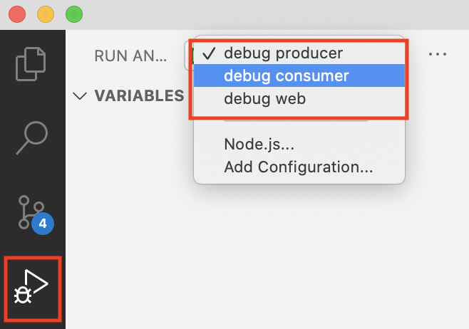
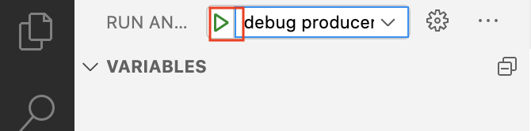

# Debug Remote Containers

## Introduction

**Skaffold** offers advanced capabilities to debug remote containers by injecting a debugger container in the service Pod.

In this lab we'll look at how to use this feature.

Estimated Lab Time: 10 minutes.

### Objectives

In this lab you will configure VSCode to use the debugger run by **Skaffold**.

## Task 1: Skaffold Debug Config

1. The *`debug`* profile in the `skaffold.yaml` config patches the artifacts like for `dev`. It uses the *`debug`* build stage of the Docker image, and prefixes the image *tag* with *`dbg-`*.

    ```yaml
    - name: debug
        activation:
        # activate this profile when using skaffold debug
        - command: debug
        deploy:
        kustomize:
            paths:
            - k8s/overlays/branch
        patches:
        # add tag prefix to avoid rebuilding over the same hash
        - op: add
            path: /build/tagPolicy/gitCommit/prefix
            value: dbg-
        # change the target image to use debugger from skaffold 
        # requires that python
        - op: add
            path: /build/artifacts/0/docker/target
            value: debug
        - op: add
            path: /build/artifacts/1/docker/target
            value: debug
        - op: add
            path: /build/artifacts/2/docker/target
            value: debug
    ```

2. It also add a *`portForward`* section that defines remote debugger port mapping to the local machine.

    ```yaml
        portForward:
        - resourceType: Deployment
            resourceName: dev-producer
            port: 5678
            localPort: 5678
        - resourceType: Deployment
            resourceName: dev-consumer
            port: 5678
            localPort: 5679
        - resourceType: Deployment
            resourceName: dev-web
            port: 5678
            localPort: 5680
    ```

## Task 2: VSCode Config

1. The `.vscode` folder include the `launch.json` file needed to debug each of the containers in this repo. Ports mapped in the skaffold config are mapped to each service, and the source files of each service are mapped from local to remote location to allow the debugger to display line breakpoints.

    ```json
    {
        // Use IntelliSense to learn about possible attributes.
        // Hover to view descriptions of existing attributes.
        // For more information, visit: https://go.microsoft.com/fwlink/?linkid=830387
        "version": "0.2.0",
        "configurations": [
        {
            "name": "debug producer",
            "type": "python",
            "request": "attach",
            "connect": {
            "host": "localhost",
            "port": 5678
            },
            "pathMappings": [
            {
                "localRoot": "${workspaceFolder}/images/producer/src",
                "remoteRoot": "/src"
            }
            ]
        },
        {
            "name": "debug consumer",
            "type": "python",
            "request": "attach",
            "connect": {
            "host": "localhost",
            "port": 5679
            },
            "pathMappings": [
            {
                "localRoot": "${workspaceFolder}/images/consumer/src",
                "remoteRoot": "/src"
            }
            ]
        },
        {
            "name": "debug web",
            "type": "python",
            "request": "attach",
            "connect": {
            "host": "localhost",
            "port": 5680
            },
            "pathMappings": [
            {
                "localRoot": "${workspaceFolder}/images/web/src",
                "remoteRoot": "/src"
            }
            ]
        }
        ]
    }
    ```

2. If you open the repository folder in VSCode, these debugger profiles should automatically be loaded for you in your launch configurations.

## Task 3: Run Skaffold Debug

1. To launch a debugging session, run the command:

    ```bash
    <copy>
    make debug
    </copy>
    ```

2. This will build, push and deploy the containers with the `dbg-` tag prefix. It will attach the debugger container to each pod to debug, and map the remote debugger port to your local machine.

3. In VSCode, choose the container service to debug, and click the run icon to debug.

    

    

4. One caveat is that the code starts running before the debugger is attached, which may make it difficult to debug startup code, unless a delay is voluntarily inserted. Debugging effectively starts when the local VSCode is connected to the remote debugger.

5. You can insert a breakpoint in the code of the service you chose to debug, for example within the loop of the producer or consumer message handling, to see the debugger in action.

6. Note also that in debug mode, the file sync is not active, as code reload would reset the debugger at each file sync.


You may proceed to the next lab.

## Acknowledgements

 - **Author** - Emmanuel Leroy, February 2021
 - **Last Updated By/Date** - Emmanuel Leroy, February 2021
