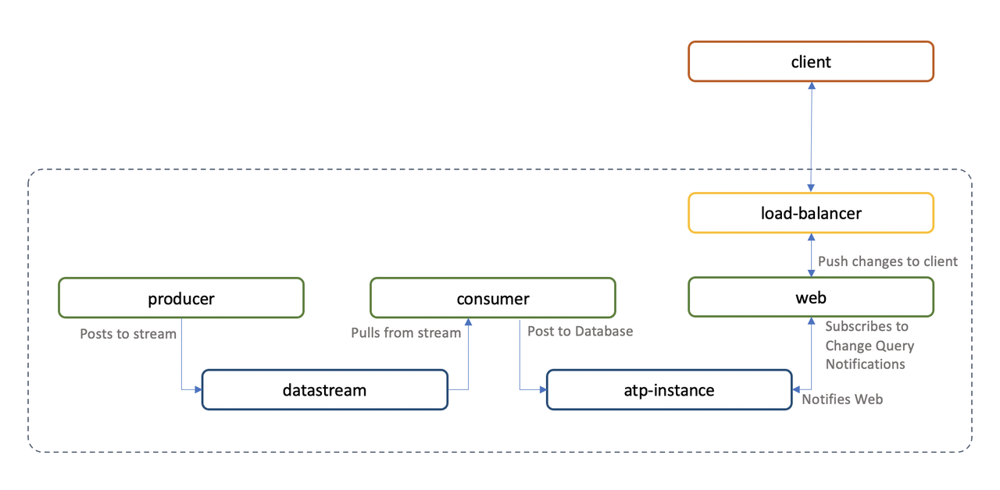
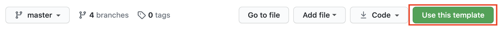

# Understanding the Demo Project

## Introduction

In this lab we will clone the demo repository code and look into the various components to understand its structure.

The Demo project consists in a simple application based on micro-services and making use of **Oracle Streaming Service** and **Oracle Autonomous Database**, managed within Kubernetes via the **OCI Service Broker**.

The application includes a *`producer`* service that generates numeric data for demo purposes. Think of it as an IoT device streaming measurements, or a monitoring service streaming metrics. 

The *`producer`* pushes data to the Oracle Streaming Service, and a *`consumer`* service picks it up at the other end, to post it into the Autonomous Database.

A *`web`* application is used to display the data in real-time: the server gets notified through the Change Query Notification capability of the database that new data is available, and uses Server Sent Events (i.e. Server Push) to push the data to a subscribed client browser.




Estimated Lab Time: 10 minutes.

### Objectives

In this lab you will:

- Copy the demo template to your own GitHub.
- Review the demo project structure.
- Provision the required users with Terraform.

## Task 1: Use the Template

The demo project repository is located at [https://github.com/oracle-quickstart/oke-k8s-atp-boilerplate](https://github.com/oracle-quickstart/oke-k8s-atp-boilerplate)

1. To use the template, click **Use this Template**.

    

2. Choose a name.

3. **For security reasons, we recommend always making your repo PRIVATE**.

4. Click **Create repository from template**.

5. Then under the **Code** button, copy the git URL and clone your repository locally with:

    ```bash
    <copy>
    git clone <your_git_url>
    </copy>
    ```

6. Get into the folder:

    ```bash
    <copy>
    cd ./<name of your repo>
    </copy>
    ```

## Task 2: Review the Project Structure

1. The project has the following folder structure:

    ```bash
    ├── images
    │   ├── consumer
    │   ├── db-config
    │   ├── producer
    │   └── web
    ├── k8s
    │   ├── base
    │   │   ├── app
    │   │   ├── components
    │   │   └── infra
    │   └── overlays
    │       ├── branch
    │       ├── development
    │       │   ├── app
    │       │   ├── components
    │       │   └── infra
    │       ├── production
    │       │   ├── app
    │       │   ├── components
    │       │   └── infra
    │       └── staging
    │           ├── app
    │           ├── components
    │           └── infra
    ├── makefile
    ├── makefile.common
    ├── makefile.python
    ├── README.md
    ├── creds.env.template
    ├── global.env
    ├── skaffold.yaml
    ├── scripts/
    └── terraform/
    ```

2. The *`images`* folder contains the project applications/services, with their respective code and Dockerfile.

3. The *`k8s`* folder contains the Kubernetes resource templates:

    - The *`k8s/base`* folder contains base templates used for the whole deployment, and includes:
        - An *`app`* folder describing the application resources.
        - An *`infra`* folder describing the PaaS services.
        - A *`components`* folder that contains resources used in both *`infra`* and *`app`*.

    - The *`k8s/overlays`* folder contains the changes to apply to the base templates to configure different environments:
        - A *`development`* environment.
        - A *`staging`* environment.
        - A *`production`* environment.
        - A *`branch`* overlay which uses the *`development`* overlay to produce a branch-suffixed environment within the *`development`* namespace.


4. The *`terraform`* folder contains templates to create the *`users`* and *`credentials`* needed to publish Docker images to the Oracle Container Image Registry (OCIR) and to access the Oracle Streaming Service, as well as a user that can interact with the Kubernetes cluster to use for Continuous Integration / Continuous Deployment (CI/CD) pipelines.

## Task 3: Get into the Terraform Folder

1. Get into the terraform folder:

    ```bash
    <copy>
    cd ./terraform
    </copy>
    ```

## Task 4: Populate the *`terraform.tfvars`* File

1. Generate a *`terraform.tfvars`* from the *`terraform.tfvars.template`*:

    ```bash
    <copy>
    cp terraform.tfvars.template terraform.tfvars
    </copy>
    ```

2. Populate the required variables:

    If you are not able to create users, you will need to provide the *`user_ocid`* of users that are part of groups with the proper policies (see below).
    If you are able to create users but not groups or policies, provide the group_ocid for each user.

    Provide the *`cluster_id`* of the cluster created in lab 2, which was output in the Terraform output.

    ```bash
    tenancy_ocid = "ocid1.tenancy.oc1..."
    compartment_ocid = "ocid1.compartment.oc1..."

    region           = "us-ashburn-1"
    cluster_id = "ocid1.cluster.."


    # If you do not have permission to create users, provide the user_ocid of a user 
    # that has permission to create OKE clusters
    ci_user_ocid        = null

    # If you have permission to create users, and a group already exists with policies 
    # to create OKE cluster, you can provide the ci_users_group_ocid 
    # and a new user will be created and be made a member of this group
    # Ignored if you are providing a ci_user_ocid
    ci_users_group_ocid = null

    # If you do not have permission to create users, provide the user_ocid of a user 
    # that has permission to push images to OCI Registry
    ocir_pusher_ocid        = null

    # If the ocir_pusher_ocid user already has an auth_token to use, provide it here. 
    # If null a new token will be created. 
    # This requires that the user has 1 token at most already (as there is a limit of 2 tokens per user)
    ocir_pusher_auth_token = null

    # If you have permission to create users, and a group already exists with policies 
    # to push images to OCI Registry, you can provide the ocir_pushers_group_ocid 
    # and a new user will be created and be made a member of this group
    # Ignored if you are providing a ocir_pusher_ocid
    ocir_pushers_group_ocid = null


    # If you do not have permission to create users, provide the user_ocid of a user 
    # that has permission to create Streams
    streaming_user_ocid        = null

    # If the streaming_user_ocid user already has an auth_token to use, provide it here. 
    # If null a new token will be created. 
    # This requires that the user has 1 token at most already (as there is a limit of 2 tokens per user)
    # Since we create 2 tokens in this template, 
    # !!! If the same user is used for all users, this requires that this user has 0 token
    streaming_user_auth_token = null

    # If you have permission to create users, and a group already exists with policies 
    # to create Streams, you can provide the streaming_group_ocid 
    # and a new user will be created and be made a member of this group
    # Ignored if you are providing a streaming_user_ocid
    streaming_group_ocid = null
    ```

    The Terraform will provision a user in a OCIR pusher group with the following policies (provided here for reference for your tenancy administrator if they need to create them for you).

    ```bash
    <copy>
    allow group ocir_pusher_group_name to use repos in tenancy
    allow group ocir_pusher_group_name to manage repos in tenancy where ANY {request.permission = 'REPOSITORY_CREATE', request.permission = 'REPOSITORY_UPDATE'}
    </copy>
    ```

    The Terraform will provision a user in a Streaming Service group with the following policies:

    ```bash
    <copy>
    allow group streaming_group_name to use stream-pull in tenancy
    allow group streaming_group_name to use stream-push in tenancy
    </copy>
    ```

    The Terraform will provision a user in a Cluster user group with the following policies:

    ```bash
    <copy>
    allow group ci_group_name to use clusters in tenancy where request.region = '{region}'
    </copy>
    ```

## Task 5: Run the Terraform Script

1. Init the Terraform project:

    ```bash
    <copy>
    terraform init
    </copy>
    ```

2. Apply the terraform:

    ```bash
    <copy>
    terraform apply
    </copy>
    ```

3. Type *`yes`* at the prompt

3. The Terraform outputs the following useful info:

    - The *`OCIR_pusher_username`* and *`token`* required to login to the OCIR image registry.

4. You should also find the following artifacts in the folder for the CI user:

    - A *`cluster_admin_user_xxxx_rsa_private_key.pem`* file for a CI user to access the cluster via the OCI CLI.
    - A corresponding *`cluster_admin_user_xxxx_oci_config.txt`* file.
    - A *`kubeconfig`* file.

## Task 6: Docker Login 

1. The Terraform creates a `creds.env` file on the root of the project.

2. Go back to the root folder:

    ```bash
    <copy>
    cd ..
    </copy>
    ```

4. Log in to the Docker OCIR repository.

    You can do so with the helper function:

    ```bash
    <copy>
    make repo-login
    </copy>
    ```

    This uses the `creds.env` and `gobal.env` files and runs the `docker login <region>.ocir.io/<tenancy_namespace>` command with the credentials saved in `creds.env`.

You may proceed to the next lab.

## Acknowledgements

 - **Author** - Emmanuel Leroy, February 2021
 - **Last Updated By/Date** - Emmanuel Leroy, February 2021
