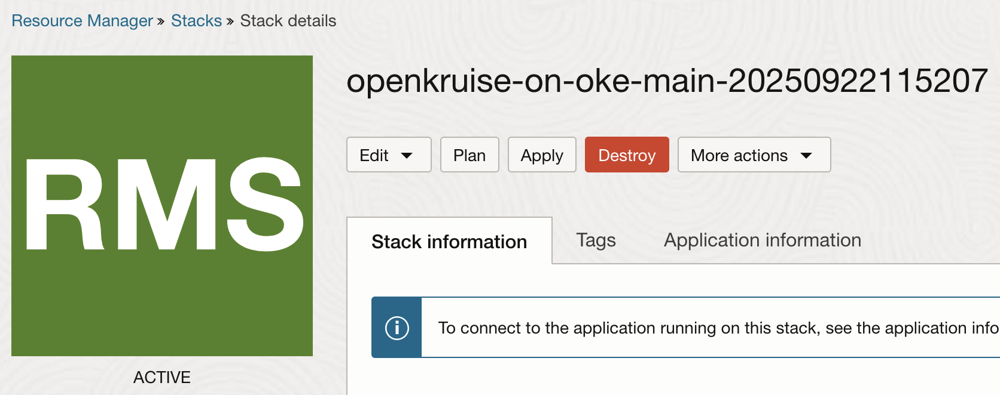

# Clenaup

## Introduction

Once the workshop is complete, you should remove the resources to avoid unnecessary costs.

Estimated Time: 30 minutes

### **Objectives**

Delete workloads, OpenKruise, and OKE cluster resources.

### **Prerequisites**

This lab assumes you have:

* An Oracle Cloud account
* Administrator privileges or access rights to the OCI tenancy
* Basic Kubernetes knowledge (kubectl, Helm, manifests).
* Local setup with:
    - kubectl
    - helm
    - oci CLI configured

## Task 1: Cleanup the resoruces

1. In order to cleanup the resources, simply go to Resource Manager in the OCI Web Console and select **Destroy**. This will destroy all of the provisioned resources.

2. Wait for the job to finish and then from **More Actions** menu select **Delete Stack**

End of LiveLab – You have successfully deployed OpenKruise on OKE and tested three advanced use cases!

## Acknowledgements

**Authors**

* **Dragos Nicu**, Senior Cloud Engineer, NACIE
* **Last Updated By/Date** - Dragos Nicu, September 2025
