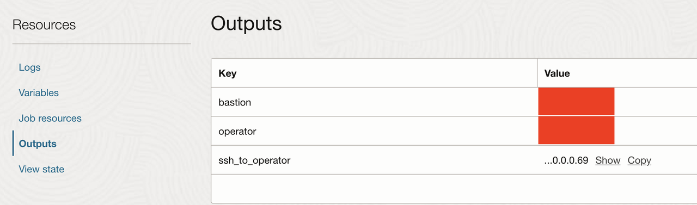
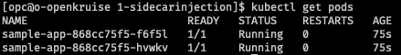
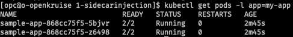
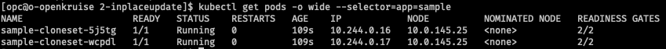
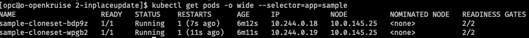

# Explore OpenKruise use cases 

## Introduction

In this chapter, we will explore three real-world scenarios where OpenKruise enhances Kubernetes workloads.

Estimated Time: 30 minutes

### **Objectives**

Hands-on experience with:

- Sidecar injection
- In-place update with CloneSet
- Enhanced StatefulSet

### **Prerequisites**

This lab assumes you have:

* An Oracle Cloud account
* Administrator privileges or access rights to the OCI tenancy
* Basic Kubernetes knowledge (kubectl, Helm, manifests).
* Local setup with:
    - kubectl
    - helm
    - oci CLI configured

## Task 1: Sidecar Injection

1. Once the job finishes running, go to the outputs sections and copy the ssh_to_operator value and run in it in your terminal.



2. In the terminal, you will be loged into the operator machine where you need to go to the kruise folder.

```
cd kruise
```

3. Once in the kruise folder go to the **1-sidecarinjection** folder

```
cd 1-sidecarinjection
```
4. In this folder there are three files. We need to apply them one by one. First we need to apply the appdeployment.yaml:

```
kubectl apply -f appdeployment.yaml
```

And then check if the app was deployed succesfully:

```
kubectl get pods
```

You should be able to see two pods running each with only one container(1/1).



5. Now we can apply the fluentd-configmap.yaml and then the sidecar.yaml.

```
kubectl apply -f fluentd-configmap.yaml
kubectl apply -f sidecar.yaml
```

6. Because the SidecarSet uses an admission webhook, it will inject the sidecar into new pods that match the selector. Let's scale the deployment down and then back up to trigger the injection.

```
kubectl scale deployment sample-app --replicas=0
```

Wait for pods to terminate and then scale the app back up:

```
kubectl scale deployment sample-app --replicas=2
```

7. Now if we check the pods we will now see that each pod has two containers: **main-app** and **fluentd-agent**.

```
kubectl get pods -l app=my-app
kubectl describe pod <pod-name>
```



This demonstrates the decoupled nature of SidecarSet, allowing you to add operational capabilities without touching the application's core deployment definition.

## Task 2: In-place Update using CloneSet

1. We now need to move to the second folder in the kruise parent folder. If you followed the instructions from the previous task, you should be able to switch to the second folder by executing this command:

```
cd ../2-inplaceupdate
```

2. In this folder there is a single file. Let's apply the cloneset.yaml file:

```
kubectl apply -f cloneset.yaml
```

3. Once applied, we can check the status of the initial state by using this command:

```
kubectl get pods -o wide --selector=app=sample
```

You should see two pods running. Take note of their details.



4. Now we can perform the in-place update by editing the cloneset.yaml file and changing the nginx image to a newer version for example to nginx:1.21.6. After that apply the cloneset using the same command as on point 2.

5. We can observe the "After" state by quickly getting the pods details again:

```
kubectl get pods -o wide --selector=app=sample
```
You will notice that the pod names, IP addresses, and start times have not changed. However, if you describe one of the pods:

```
kubectl describe pod <your-pod-name>
```

and look at the container status, you will see that the image has been updated. This confirms the in-place update.



## Task 3: Enhanced Statefullset

This demo highlights the AdvancedStatefulSet, an enhanced version of the native StatefulSet. A key feature is the ability to perform parallel updates using the maxUnavailable field, which can significantly speed up the rollout of stateful applications where ordered updates are not strictly necessary.

1. For the last use case we need to change the directory to 3-enhancedstatefullset.

```
cd ../3-enhancedstatefullset
```

2. In this folder we have only one file. We can run it by executing the following command:

```
kubectl apply -f enhancedstatefulset.yaml
```

3. Let's check the status of the EnhancedStatefulSet:

```
kubectl get pods -l app=my-stateful-app
```

You should be able to see 4 pods running.


4. Now we will trigger a Rolling Update by modifying the enhancedstatefulset.yaml to use a different image. Change the image from `nginx:1.21.6`.
Apply the updated YAML:
```
kubectl apply -f enhancedstatefulset.yaml
```

5. Quickly watch the pods being updated. You will notice that up to two pods (maxUnavailable: 2) are terminating and recreating with the new image at the same time.

```
kubectl get pods -l app=my-stateful-app
```

This is a significant improvement over the default StatefulSet behavior, which updates pods one by one. This parallel update capability can drastically reduce deployment times for large stateful applications.

You may now proceed to the next lab.

## Acknowledgements

**Authors**

* **Dragos Nicu**, Senior Cloud Engineer, NACIE
* **Last Updated By/Date** - Dragos Nicu, September 2025
