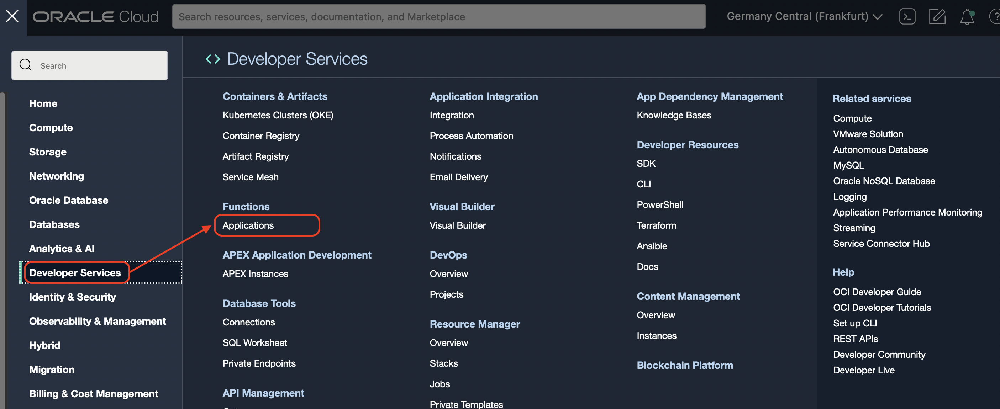
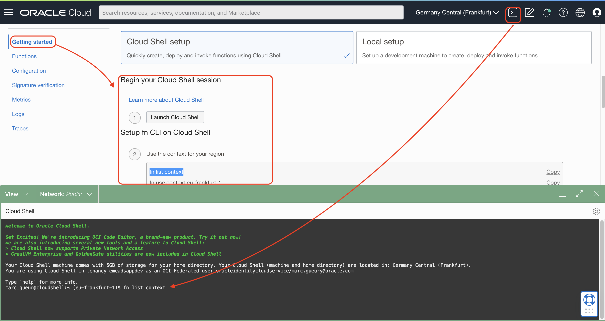

# Create a Function to parse the documents

## Introduction

Estimated time: 10 min

### Objectives

- Deploy a Java Serverless function to parse documents like Excel, Word, PDF and extract their content in a text format.

### Prerequisites

## Task 1: Create the Application

The function will take a binary file as input (Word, PDF, ...), parse it and give his content in text back.

Go the menu
- Developer Services
- Functions / Application



- Check that you are in the right compartment (livelab in this case)
- Click *Create Application*
- Name: *opensearch-application*
- VCN: *opensearch-vn*
- Subnet : *Private Subnet-opensearch-vcn*
- Click Create


You will see a getting Started. This is what we will follow.

## Task 2: Build the Function in the Cloud Shell

Look at the getting started. This is what we will use.

I will you my instruction. Please adapt the steps based on the instructions given in *your Getting started for you*.

Remark:
- Use *opensearch* as the "repo-name-prefix". 
- You will also need to generate a token to log to the container registry. 
  Keep note of it *##AUTH_TOKEN##*
- Start the cloud Shell (notice that you can upload and download files from it)



``` 
<copy>
fn list context
fn list contextfn use context eu-frankfurt-1
fn update context oracle.compartment-id ocid1.compartment.oc1..aaaaaaaanmnbbbbbbbb
fn update context registry fra.ocir.io/xxxxxx/opensearch
docker login -u 'xxxxx/oracleidentitycloudservice/name@domain.com' fra.ocir.io
git clone https://github.com/mgueury/oci-opensearch-livelab.git
cd oci-opensearch-livelab/tika_parser
fn -v deploy --app opensearch-application
</copy>
```


After building the code, it will create a function tikaparser in the opensearch-application
- Go back to the *opensearch-application*
- Click *Functions*
- Click the name of the function *tikaparser*


- In this screen, check that 
    - the memory is well *2048 MB* 
    - the timeout is *300 sec*
    - Take note of the value of *Invoke Endpoint* *##FUNCTION_ENDPOINT##*.


## Acknowledgements

- **Author**
    - Marc Gueury
    - Badr Aissaoui
    - Marek Krátký 
- **History** - Creation - 27 Sep 2022

