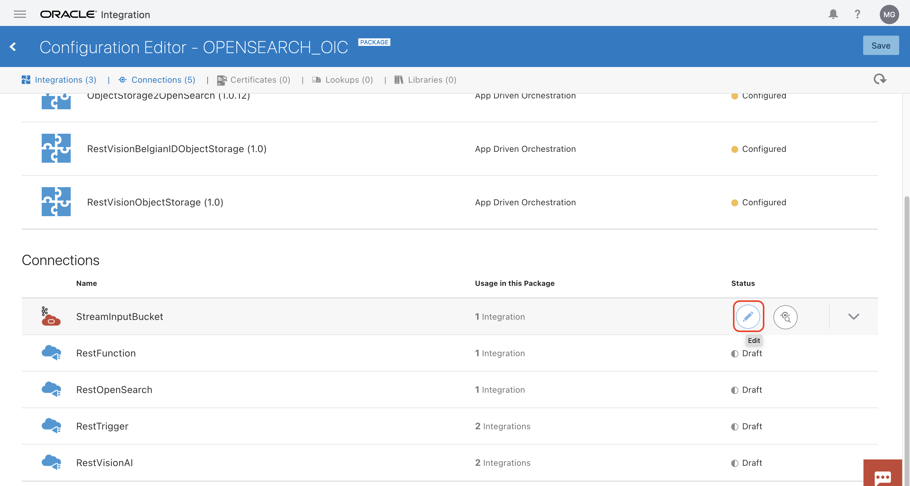
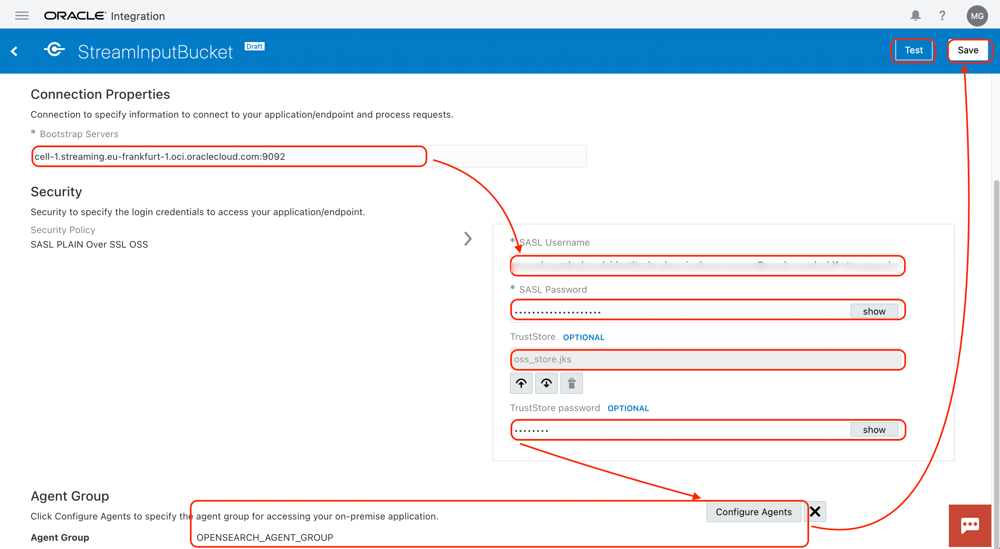
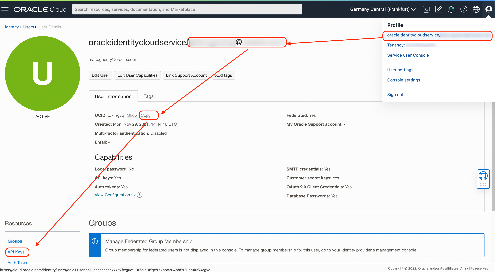
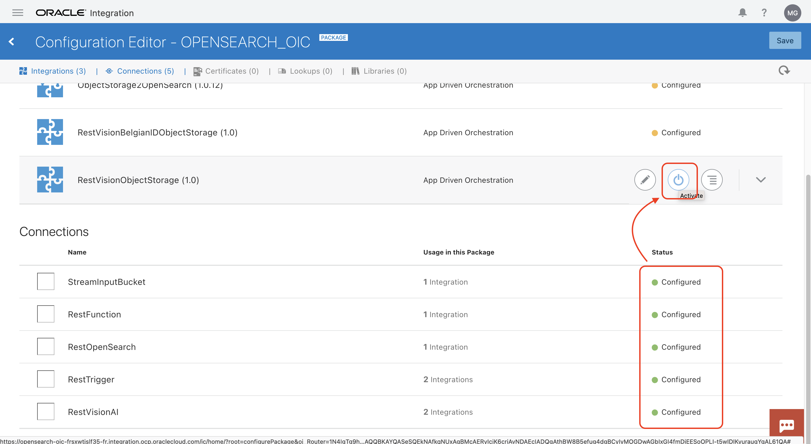

# Integrate to the Components together

## Introduction

Estimated time: 20 min

### Objectives

- Integrate all the components together

### Prerequisites

- To make your life easier, you should store the sample files on your laptop. If not possible, you can get them from the cloud console. It is the same directory that we used for the function.
- Please run this:

````
<copy>
git clone https://github.com/mgueury/oci-opensearch-livelab.git
</copy>
````

It will mostly give the files to upload later in OIC, Visual Builder and samples files to parse.

## Task 1: Enable Visual Builder

Let's enable Visual Builder.

Go the the menu
- Developer Services
- Application Integration
- Choose *opensearch-oic*
- Click *Service Console* to open a new browser tab with OIC 
- Go back to the previous tab
- In the screen: click Visual Builder *Enable*
- Click *Enable* again


## Task 2: Create an Agent Group

To communicate with OpenSearch in the private network, we have to install the OIC agent on the compute.

First, 
- Go to the Oracle integration Cloud console that you opened just above
- Take note of the hostnale in the browser URL,  *##OIC_HOSTNAME##*
    - Ex: opensearch-oic-xxxxxx-fr.integration.ocp.oraclecloud.com 

Create the Agent Group
- On the left menu, choose *Integration*
- Then *Agent* 
- Click *Create Agent Group*
- Name: *OPENSEARCH\_AGENT\_GROUP* 
- Identifier: *OPENSEARCH\_AGENT\_GROUP*
- Then *Create*


## Task 3: Install the OIC Agent on the compute

Take data collected in lab1. 
- *##COMPUTE_PRIVATE-KEY##* 
- and *##COMPUTE_PUBLIC-IP##*

If you do not have SSH installed on your laptop, please use the Cloud Shell instead.

Please follow this. Practically, you need to set the env variables at the top of the script and run the rest of the commands.

```
<copy>
ssh opc##COMPUTE_PUBLIC-IP## -i ##COMPUTE_PRIVATE-KEY##

# Env
export OCI_USER=your_user@domain.com
export OCI_PASSWORD=<The password you use to log to the OCI Web Console>
export OIC_HOST=opensearch-oic-xxxxxx-fr.integration.ocp.oraclecloud.com 
export OPENSEARCH_HOST=amaaaaaauevftmqa74stxxxxxx.opensearch.eu-frankfurt-1.oci.oraclecloud.com

# Download the OIC_agent
curl -X GET  $OIC_HOST/ic/api/integration/v1/agents/binaries/connectivity -u $OCI_USER:$OCI_PASSWORD -o $HOME/oic_connectivity_agent.zip

# Unzip it
mkdir oic_agent
cd oic_agent
unzip ../oic_connectivity_agent.zip

#  Configure it
mv InstallerProfile.cfg InstallerProfile.orig
cat > ./InstallerProfile.cfg << EOT
# Required Parameters
# oic_URL format should be https://hostname:sslPort
oic_URL=$OIC_HOST
agent_GROUP_IDENTIFIER=OPENSEARCH_AGENT_GROUP

#Optional Parameters
oic_USER=$OCI_USER
oic_PASSWORD=$OCI_PASSWORD

# Proxy Parameters
# proxy_NON_PROXY_HOSTS: a list of hosts that should be reached directly, bypassing the proxy. This is a list of patterns separated by '|'.
proxy_HOST=
proxy_PORT=
proxy_USER=
proxy_PASSWORD=
proxy_NON_PROXY_HOSTS=
EOT

# Install JDK 11
sudo yum install java-11-openjdk-devel -y

# Get the SSL certificate of OpenSearch since it is invalid
echo -n | openssl s_client -connect $OPENSEARCH_HOST:9200 -servername $OPENSEARCH_HOST | openssl x509 > /tmp/opensearch.cert
cat /tmp/opensearch.cert 
cd agenthome/agent/cert/ 
ls keystore.jks
keytool -importcert -keystore keystore.jks -storepass changeit -alias opensearch -noprompt -file /tmp/opensearch.cert
cd ../../..

# Create a start command
echo 'java -jar connectivityagent.jar > agent.log 2>&1 &' > start.sh
chmod +x start.sh

./start.sh

# Check that it works
cat agent.log
exit
</copy>
```

## Task 4: Import the integration

We will upload the integration.

- Go to the Oracle integration Cloud console that you opened just above
- On the left menu, choose *Integration*
- Then *Package*
- Click *Import*
- Browse: choose *OPENSEARCH_OIC.par*
- Click: *Import and Configure*


## Task 5: Configure the connections

Lets configure the connections. You will need to get back value from your notes:


### A. StreamInputBucket

First, you will need to create a truststore file, *oss_store.jks*.

```
<copy>
echo -n | openssl s_client -connect ##STREAM_BOOSTRAPSERVER## | sed -ne  '/-BEGIN CERTIFICATE-/,/-END CERTIFICATE-/p' > ociStreaming.cert
keytool -keystore oss_store.jks -alias OSSStream -import -file ociStreaming.cert -storepass changeit -noprompt
</copy>
```

Click to edit the connection *StreamInputBucket*



Use this info:
  - Bootstrap servers = *##STREAM_BOOSTRAPSERVER##*
  - SASL Username = *##STREAM_USERNAME##*
  - SASL Password = *##AUTH_TOKEN##*
  - Truststore = *oss_store.jks created above*
  - TrustStore password = *changeit* 
  - Configure agent = *OPENSEARCH_AGENT*
  - *Save / Test / Save* until 100%



### B. RestFunction

First, we need data about your tenancy and user.
- On the top, right, click *Tenancy: name*
- Copy the tenancy OCID *##TENANCY_OCID##*


Then, we need data about the user
- On the top, right, click *Your username*
- Copy the username *##USERNAME##* (without oracleidentitycloudservice )
- Copy the user OCID *##USER OCID##*
- Click on *API Keys*



- Click *Add API Key*
- Generate one
- Download it *##PRIVATE_KEY##*
- Copy the *##FINGERPRINT##*


Then fill the Connection details:
- Connection URL = *##FUNCTION_ENDPOINT##* without /action/invoke at the end.
    - ex: https://xxxx.eu-frankfurt-1.functions.oci.oraclecloud.com/20181201/functions/ocid1.fnfunc.oc1.eu-frankfurt-1.aaaaaaabbbbb
- Tenancy OCID = *##TENANCY_OCID##*
- User OCID = *##USER_OCID##*
- Private KEY =  *##PRIVATE_KEY##*
- Finger Print = *##FINGERPRINT##*
- *Save / Test / Save* until 100%


### C. RestOpenSearch

Fill the Connection details:
- Connection URL = *##FUNCTION_ENDPOINT##* without /action/invoke at the end.
    - ex: https://xxxx.eu-frankfurt-1.functions.oci.oraclecloud.com/20181201/functions/ocid1.fnfunc.oc1.eu-frankfurt-1.aaaaaaabbbbb
- Agent Group: *OPENSEARCH\_AGENT\_GROUP*
- *Save / Test / Save* until 100%


### D. Resttrigger

There is no connection details to enter
- *Save / Test / Save* until 100%

### E. RestVisionAI

First, we need to get the AI Vision rest API. ##AI_VISION_URL##
You can find it here [https://docs.oracle.com/en-us/iaas/api/#/en/vision/20220125/](https://docs.oracle.com/en-us/iaas/api/#/en/vision/20220125/)

Fill the Connection details:
Then fill the Connection details:
- Connection URL = *##AI_VISION_URL##*
    - ex: https://vision.aiservice.eu-frankfurt-1.oci.oraclecloud.com
- Tenancy OCID = *##TENANCY_OCID##*
- User OCID = *##USER_OCID##*
- Private KEY =  *##PRIVATE_KEY##*
- Finger Print = *##FINGERPRINT##*
- *Save / Test / Save* until 100%

### F. Activate the integration

All connections should be valid. Let's activate the integrations:



Click on the activation buttons for each integration and active them.
All integrations should be up and running.

## Test OIC

Go back to the bucket.
Upload some file in the Object Storage Bucket (You got them in the Function git repository)


Check the result in OIC. 
- Go to Integration
- Then Monitoring 
- Then Integration


## Acknowledgements

- **Author**
    - Marc Gueury
    - Badr Aissaoui
    - Marek Krátký 
- **History** - Creation - 27 Sep 2022