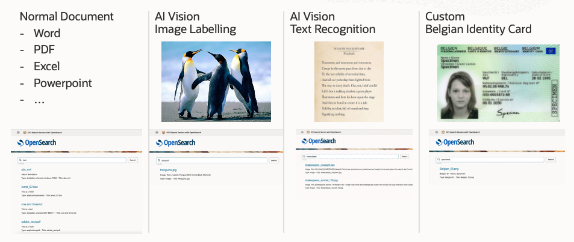
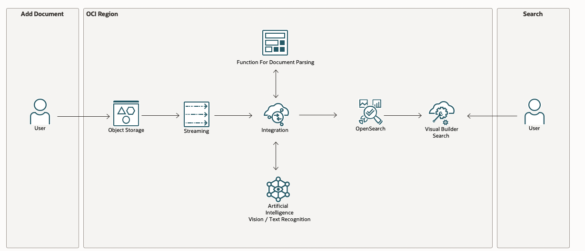
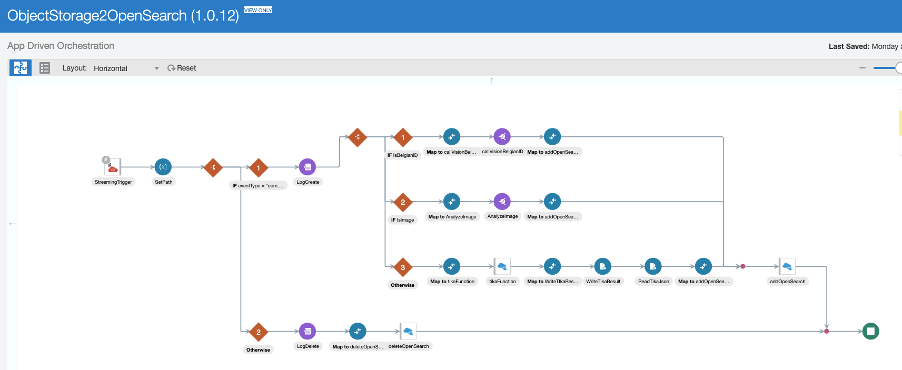

# Introduction

Estimated time: 120 minutes

### Goal: Search Documents uploaded to Object Storage in a Google like search engine

Using LowCode tools, we will develop a program to search Documents uploaded to Object Storage in a Google like search engine.

Documents like: 
- Word, Excel, PDF, ... 
- Images with text. Using AI and Text Recognition
- Images without text. Using AI Vision and Labelling
- Custom document: Images of Belgian ID cards

### Architecture

### How

It works like this:
- A document is uploaded in the Object Storage
- An event is raised and queued in Streaming (Kafka)
- The events are processed by Oracle Integration Cloud (OIC)
- Based on the file type, OIC will process them in the right way
- The result is uploaded to OpenSearch

An end-user can look for these documents in Google like search page created with Visual Builder.

The internal processing is designed with OIC, a LowCode tool.

### Objectives

- Create the Components
    - Compartment, Object Storage Bucket, Stream, Event, OpenSearch, ...
- Create an OCI Function to parse the documents
- Integrate to the Components together
- Create a Google like user interface

## Acknowledgements 

- **Author**
    - Marc Gueury
    - Badr Aissaoui
    - Marek Krátký 
- **History** - 27 Mar 2023