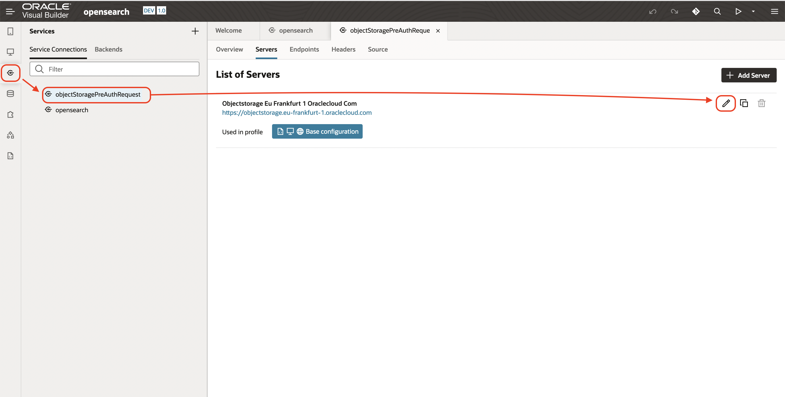
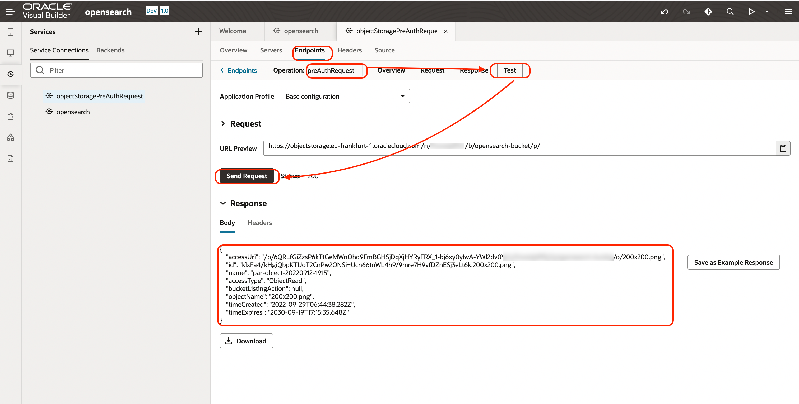
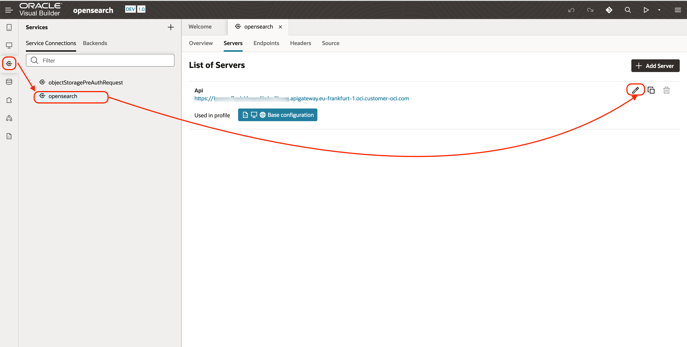

# Create a Google like user interface

## Introduction

Estimated time: 20 min

### Objectives

- Create a user interface with Visual Buidler

### Prerequisites

## Task 1: Import the project

First, lets go in Visual Builder. Go back to the homepage of Oracle Integration Cloud and choose Visual Builder

Then let's import the project from the file that you downloaded before in the "Function" lab.
- Click *Import*
- Choose the file *opensearch-1.0*
- Name: *opensearch*
- Description: *opensearch*
- Click *Import*

##Task 2: Edit the connections

Let's edit the connection to connect to our server.

### A. Connection *objectStoragePreAuthRequest*

Go to the imported application.
- Click on the *Service icon*
- Choose the *objectStoragePreAuthRequest* connection 
- Click on *Servers* tab 
- Then *Edit icon*

Search first your Object Storage API based on your region, [here](https://docs.oracle.com/en-us/iaas/api/#/en/objectstorage/20160918/)

You have the other values from the previous labs.

- In the instance URL, type
   *https://objectstorage.(YOUR REGION PREFIX).oraclecloud.com*
- Edit the *Key ID*
  - In the *Key ID*, type
    *##TENANCY\_OCID##/##USER\_OCID/##FINGERPRINT##*
  - In the Private Key, paste your OCI Private Key *##PRIVATE_KEY##*
  - Click *Save*
- Click *Save* again

You can also test the connection:
- Tab *Endpoints*
- Then *Post Get one*
- Tab *Test*
- Click *Send Request*

### B. Connection opensearch

Redo this for the second connection:
- Click on the *Service icon*
- Choose the *objectStoragePreAuthRequest* connection 
- Click on *Servers* tab 
- Then *Edit icon*

- Instance URL: *https://##APIGW_HOSTNAME##*
  Ex: https://xxxxxxxx.apigateway.eu-frankfurt-1.oci.customer-oci.com
- Click *Save*

You can also test the connection:
- Tab *Endpoints*
- Then *Get Get Many*
- Tab *Test*
- Click *Send Request*

## Test the application

Click on the run button on the top

- Type *test* : This will return the PDF, word, excel uploaded 
- Type *penguin* : This will return the image of a penguin recognized via Artificial Intelligence
- Type *shakespeare* : This will return the image of a text scanned by the Text Recognition
- Type *specimen* : This will return the belgian ID card with the name Specimen
 

## Acknowledgements

- **Author**
  - Marc Gueury
  - Badr Aissaoui
  - Marek Krátký 
- **History** - Creation - 27 Sep 2022

