# Add members to the DR Protection groups

## Introduction

In this lab, we will add members to the DR Protection groups created and associated in the previous lab. Ashburn is a primary region, and Phoenix is the standby region.

Estimated Time: 10 Minutes

Watch the video below for a quick walkthrough of the lab.

[Add members to DRPG](videohub:1_vhwdwhfk)

### Objectives

- Add members to Ashburn DRPG (Primary)
- Add members to Phoenix DRPG (Standby)

In Ashburn (Primary), members to add ATP ( Primary DB), 2 MuShop Compute VM's, 2 Volume groups( Boot volumes of MuShop Compute VM's)
In Phoenix (Standby), members to add ATP ( Standby DB)

As part of the MuShop architecture, FSDR will create the MuShop VMs on the fly during the Switchover.

## Task 1: Add members to Ashburn DRPG (Primary)

1. Login into OCI Console with your provided Credentials. The primary region should be **Ashburn**.

  

2. Select **Migration and Disaster Recovery** from the Hamburger menu, then **Disaster Recovery** -> **DR Protection Groups**. Verify the region in **Ashburn**

  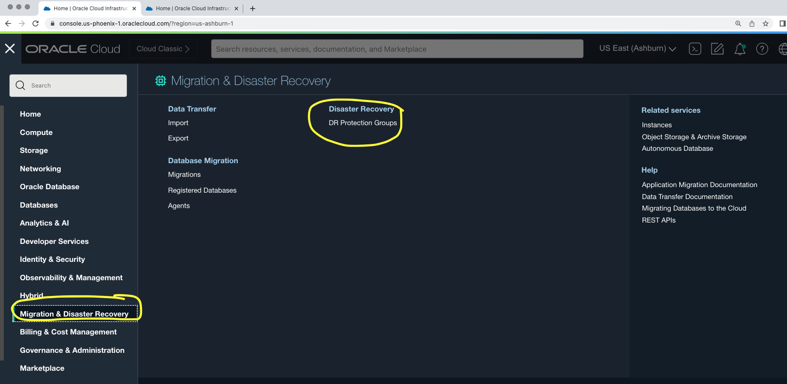

3. You will land on the Disaster Recovery Protection group home page; make sure you have selected *the Ashburn* region.

  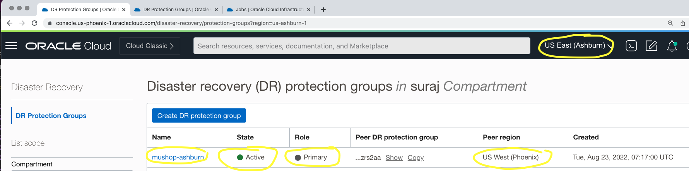

4. In the Ashburn region DRPG page, add the members required in the **mushop-ashburn** DRPG. *We will add ATP Primary Database, two mushop compute VMs, and two-volume groups for the boot volumes of mushop compute VMs*. Let's add those details.

5. Add ATP Primary Database. 

Select **mushop-ashburn** DRPG, navigate to **Members** in the *Resources* section, and hit **Add Member**

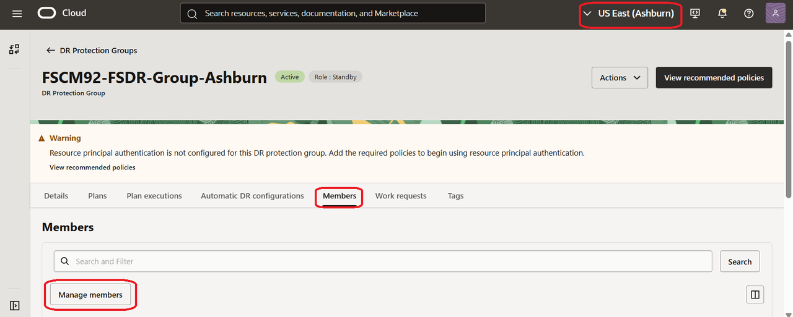

It will show various resource types and select **Autonomous Database**

Select the Database in your compartment; it will have MushopDB-XXXXX. Verify it and hit add. Make sure to check the box **"I understand that all existing plans will be deleted"**

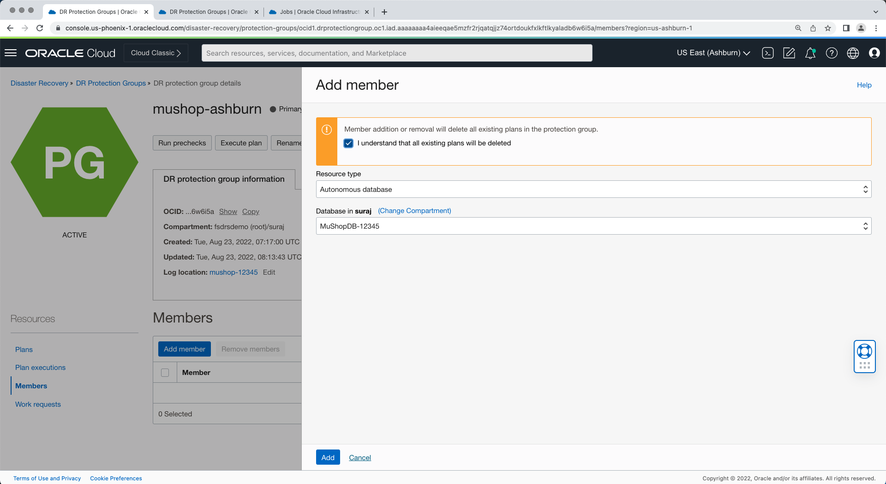

**mushop-ashburn** DRPG status will change to updating; wait for a few seconds. You should see that the ATP database is added as a member. Refresh the DRPG page if required. You can monitor the request's status in the **Work requests** section under Resources.

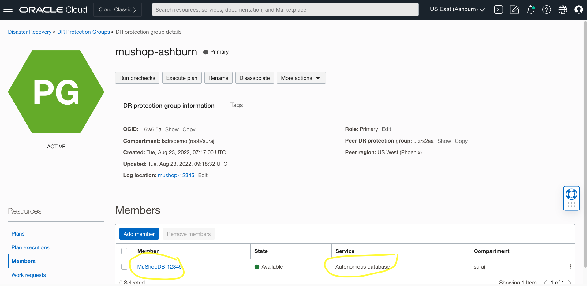

Navigate back to the DR Protection group page; the status of DRPG should be active.

6. Add first Compute instance **mushop-xxxxx-0**

Select **mushop-ashburn** DRPG, navigate to **Members** in the *Resources* section, and hit **Add Member**

It will show various resource types and select **Compute**

- Resource Type as Compute
- Make sure to check the box **"I understand that all existing plans will be deleted"**
- Instances in Compartment, select *mushop-xxxxx-0*
- Click the checkmark in the Move instance on switchover or failover.
- Destination compartment, select your compartment name
- Ignore the Destination dedicated VM host section
- Click Add VNIC mapping. This will pop up inputs for Add VNIC mapping
- Select VNIC as *primaryvnic*
- Destination subnet as *mushop-main-xxxxx*
- Ignore Network security groups
- Click Add

  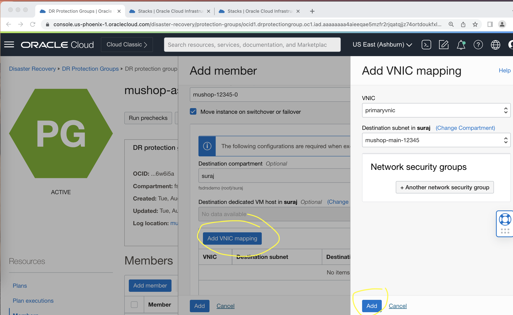

- You should be able to able to add VNIC details, verify and click Add

  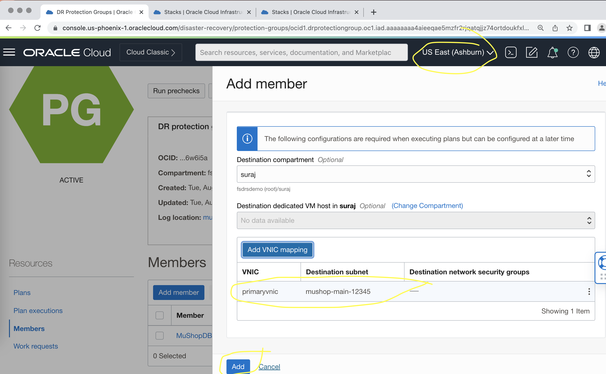

**mushop-ashburn** DRPG status will change to updating; wait for a few seconds. DRPG status will change to active.You should be able to see that compute instance **mushop-xxxxx-0** has been added as a member. Refresh the DRPG page if required. You can monitor the status in the *Work requests* section under Resources.

  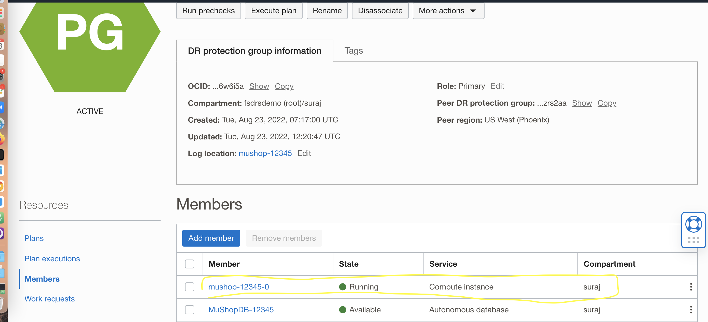

Navigate back to the DR Protection group page; the status of DRPG should be active.

7. Add second Compute instance **mushop-xxxxx-1**

Select **mushop-ashburn** DRPG, navigate to **Members** in the *Resources* section, and hit **Add Member**

It will show various resource types and select **Compute**

- Resource Type as Compute
- Make sure to check the box **"I understand that all existing plans will be deleted"**
- Instances in Compartment, select *mushop-xxxxx-1*
- Click the checkmark in the Move instance on switchover or failover.
- Destination compartment, select your compartment name
- Ignore the Destination dedicated VM host section
- Click Add VNIC mapping. This will pop up inputs for Add VNIC mapping
- Select VNIC as *primaryvnic*
- Destination subnet as *mushop-main-xxxxx*
- Ignore Network security groups
- Click Add

  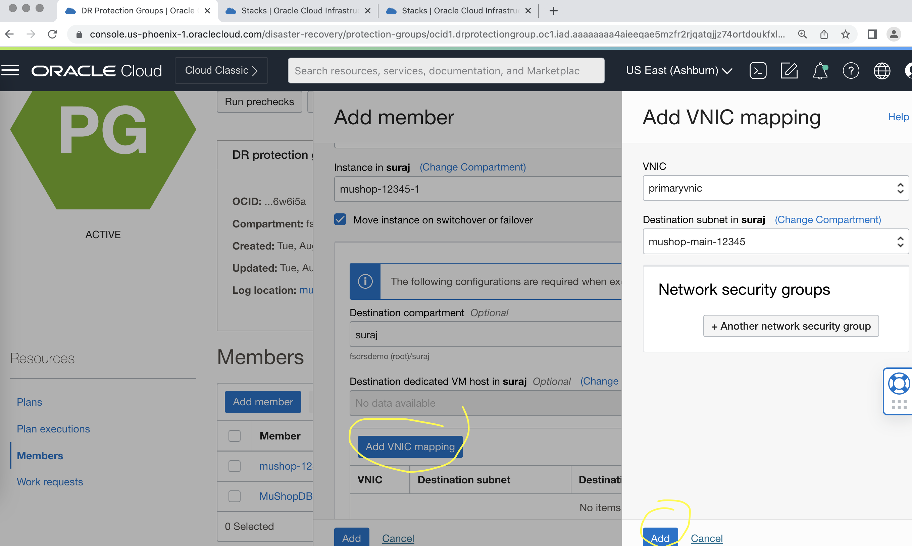

- You should be able to able to add VNIC details, verify and click Add

  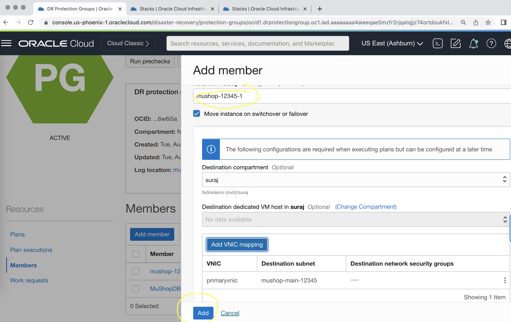

**mushop-ashburn** DRPG status will change to updating; wait for a few seconds. DRPG status will change to active.You should be able to see that compute instance **mushop-xxxxx-1** has been added as a member. Refresh the DRPG page if required. You can monitor the status in the *Work requests* section under Resources.

  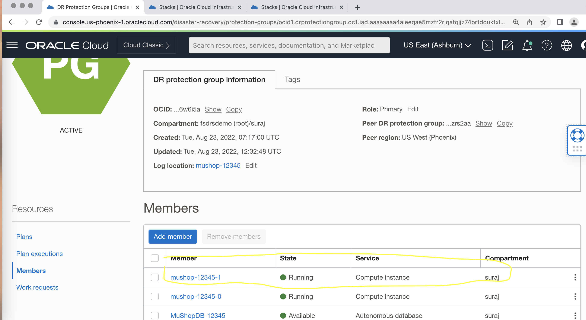

Navigate back to the DR Protection group page; the status of DRPG should be active.

8. Add the first volume group  **mushop-volume-group-0**. This volume group consists of the boot volume of mushop-xxxx-0 VM and has cross-region replication configured to the phoenix region.

Select **mushop-ashburn** DRPG, navigate to **Members** in the *Resources* section, and hit **Add Member**

It will show various resource types and select **Volume group**

- Resource Type as Volume Group
- Make sure to check the box **"I understand that all existing plans will be deleted"**
- Select volume group **mushop-volume-group-0**
- Verify and add

  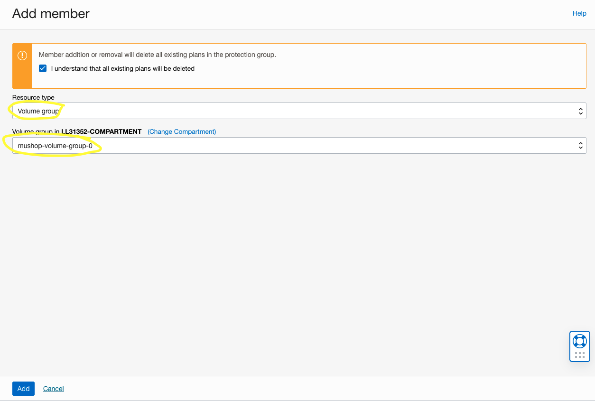

**mushop-ashburn** DRPG status will change to updating; wait for a few seconds. DRPG status will change to active.You should be able to see that volume group **mushop-volume-group-0** has been added as a member. Refresh the DRPG page if required. You can monitor the status in the *Work requests* section under Resources.

  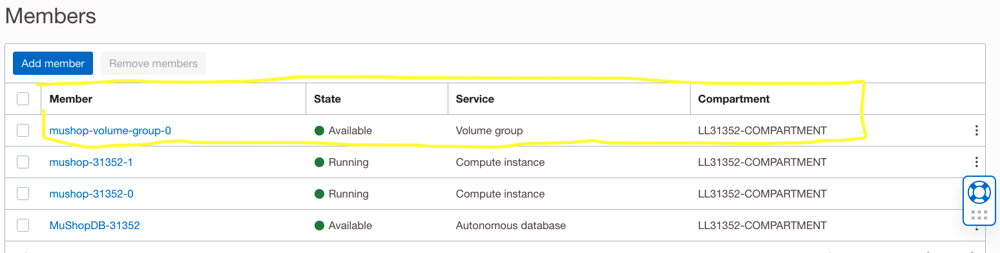

Navigate back to the DR Protection group page; the status of DRPG should be active.

9. Add the second volume group **mushop-volume-group-1**. This volume group consists of the boot volume of mushop-xxxx-1 VM, and it has cross-region replication configured to the phoenix region.

Select **mushop-ashburn** DRPG, navigate to **Members** in the *Resources* section, and hit **Add Member**

It will show various resource types and select **Volume group**

- Resource Type as Volume Group
- Make sure to check the box **"I understand that all existing plans will be deleted"**
- Select volume group **mushop-volume-group-1**
- Verify and add

  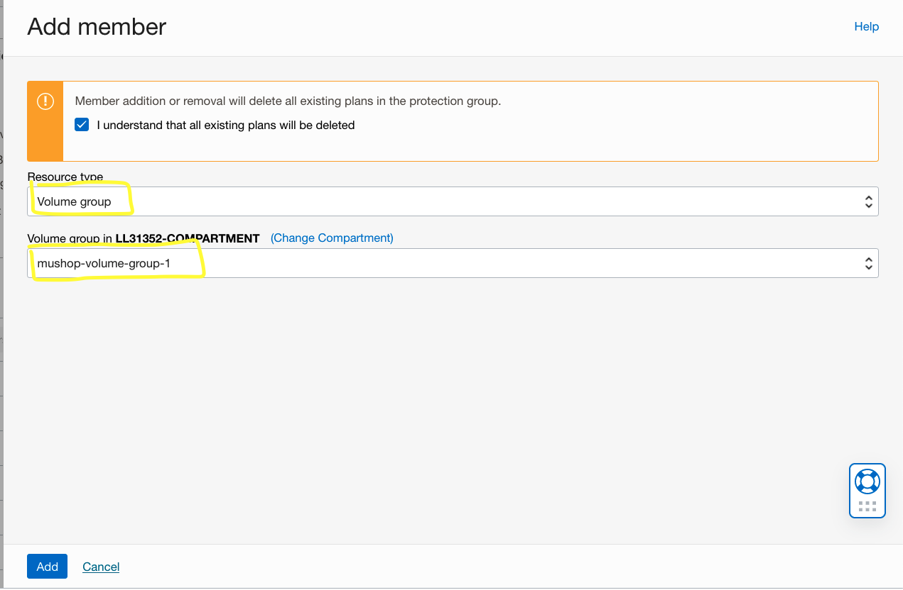

**mushop-ashburn** DRPG status will change to updating; wait for a few seconds. DRPG status will change to active.You should be able to see that volume group **mushop-volume-group-1** has been added as a member. Refresh the DRPG page if required. You can monitor the status in the *Work requests* section under Resources.

   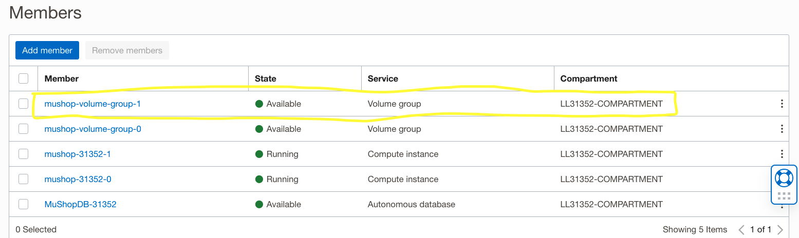

Navigate back to the DR Protection group page; the status of DRPG should be active.

10. We have added all the required members in the **mushop-ashburn** DRPG. It should show ATP Database, 2 Compute Instances, and 2 Volume groups.

    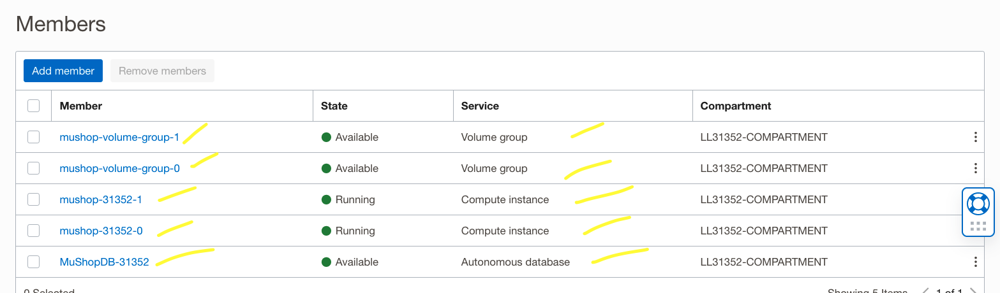

## Task 2: Add members to Phoenix DRPG (Standby)

1. Login into OCI Console with your provided Credentials. The Standby region should be **Pheonix**.

  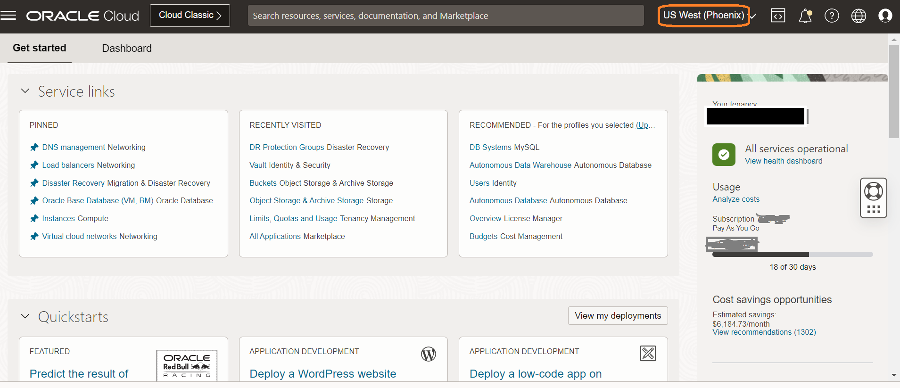

2. Select **Migration and Disaster Recovery** from the Hamburger menu, then **Disaster Recovery** -> **DR Protection Groups** Verify the region in **Phoenix**

  

3. You will land on the Disaster Recovery Protection group home page; make sure you have selected the Phoenix region.

  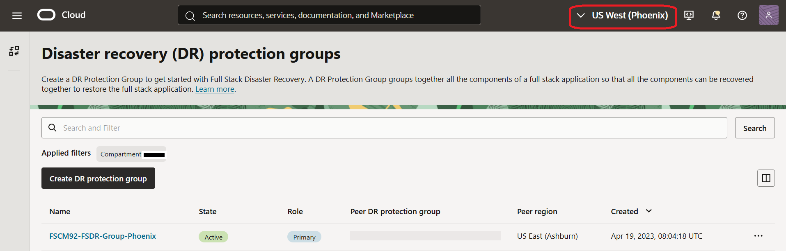

4. In the Phoenix region DRPG page, add the members required in the **mushop-phoenix** DRPG. *We will be adding only ATP Standby Database*. Let's add those details.  **We don't need to add compute and volume groups, as those will be created automatically during the DR switchover process by FSDR**

6. Add ATP Standby Database. Select **mushop-phoenix** DRPG, navigate to **Members** in the *Resources* section, and hit **Add Member**

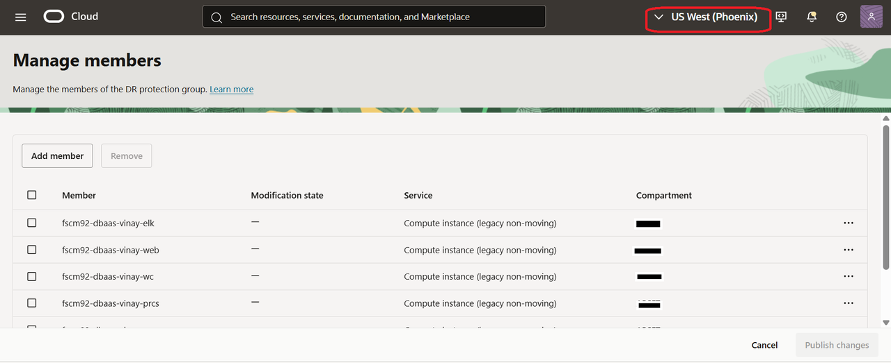

It will show various resource types and select **Autonomous Database**
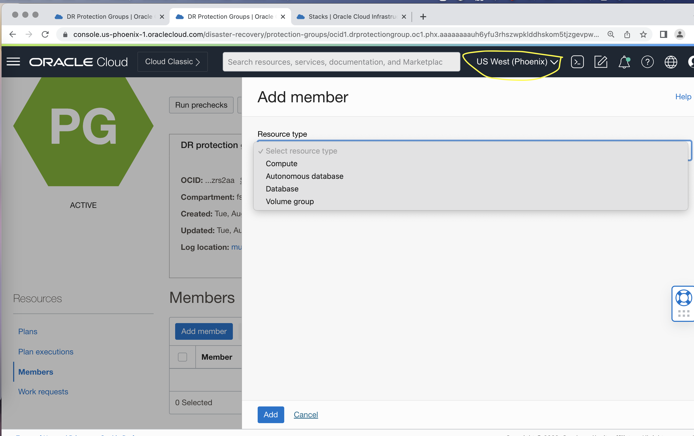

Select the Database in your compartment; it will have **MushopDB-XXXXX**. Verify it and hit add. Make sure to check the box **"I understand that all existing plans will be deleted"**

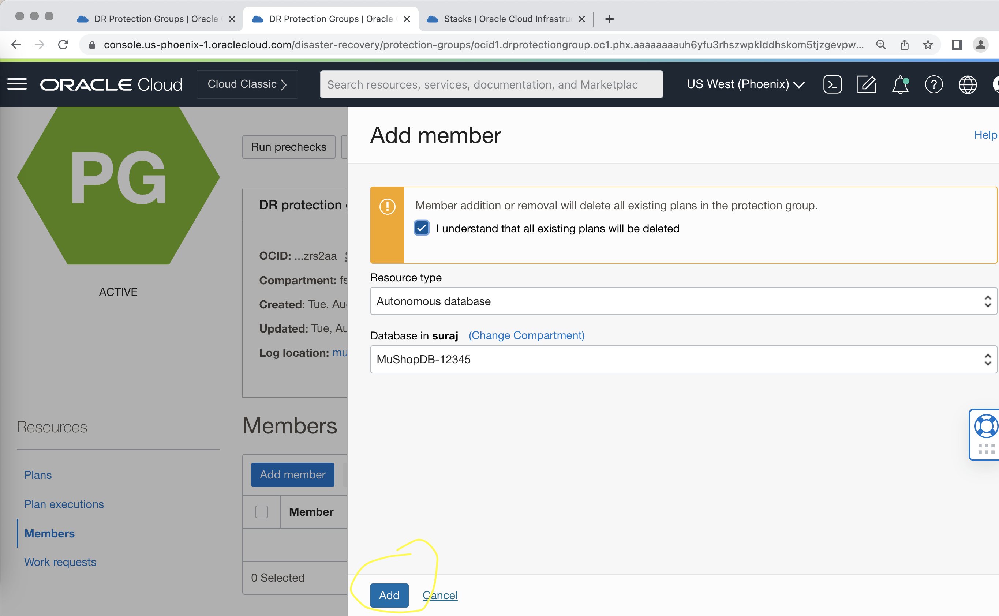

**mushop-phoenix** DRPG status will change to updating; wait for a few seconds. You should be able to see ATP database has been added as Member. Refresh the DRPG page if required. You can monitor the status in the *Work requests* section under Resources.

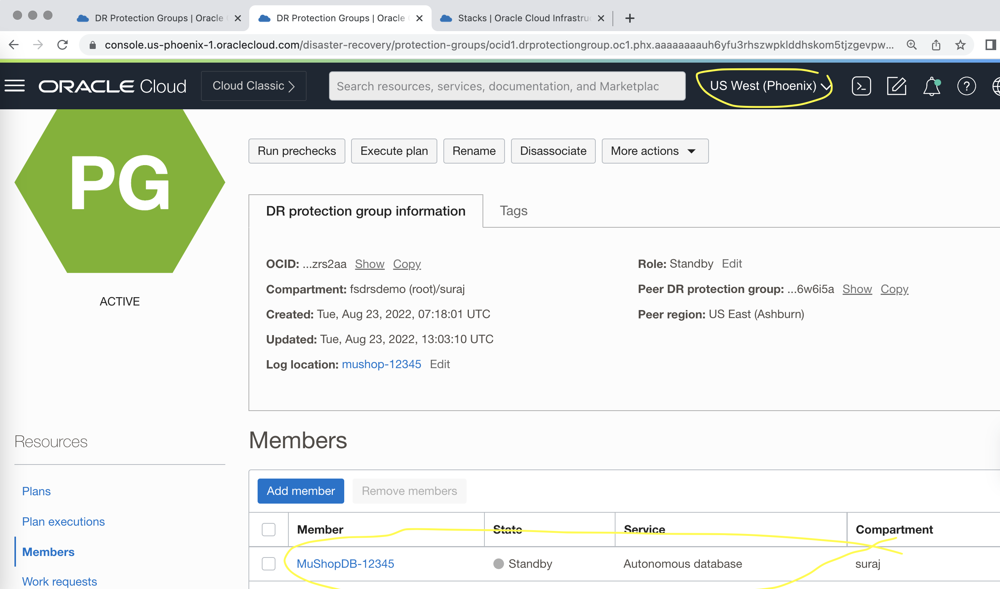

Navigate back to the DR Protection group page; the status of DRPG should be active.

7. Now, we have added all the required members in the **mushop-phoenix** DRPG. It should show ATP Database.

    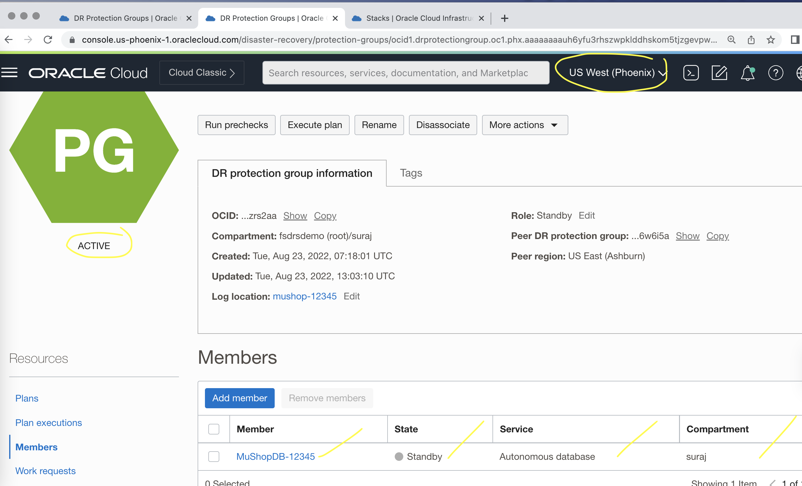

You may now **proceed to the next lab**.

## Troubleshooting tips

1. After adding the member, in case if the member is not showing up. Re-add the member again.

## Acknowledgements

- **Author** -  Suraj Ramesh, Principal Product Manager
- **Last Updated By/Date** -  Suraj Ramesh,September 2022
