# Add members to the DR Protection groups

## Introduction

In this lab, we will add members to the DR Protection groups created and associated in the previous lab. Ashburn is the primary region and Phoenix is the standby region.

Estimated Time: 20 Minutes

### Objectives

- Add members to Ashburn DRPG (Primary)
- Add members to Phoenix DRPG (Standby)

In Ashburn (Primary) region, members to be added are below. 
 
- PeopleSoft Active Database hosted on DbaaS / DBCS platform
- PeopleSoft Application Server Compute Instance (Linux)
- PeopleSoft Process Scheduler Server Compute Instance (Linux)
- PeopleSoft Process Scheduler Server Compute Instance (Windows)
- PeopleSoft Web Server Compute Instance (Linux)
- Elastic Search and Kibana Server (Linux)

In Phoenix (Standby), members to be added are below.

- PeopleSoft Standby Database hosted on DbaaS / DBCS platform
- PeopleSoft Application Server Compute Instance (Linux)
- PeopleSoft Process Scheduler Server Compute Instance (Linux)
- PeopleSoft Process Scheduler Server Compute Instance (Windows)
- PeopleSoft Web Server Compute Instance (Linux)
- Elastic Search and Kibana Server (Linux)

## Task 1: Add members to Ashburn DRPG (Primary)

1. Login into OCI Console. The primary region should be **Ashburn**.

   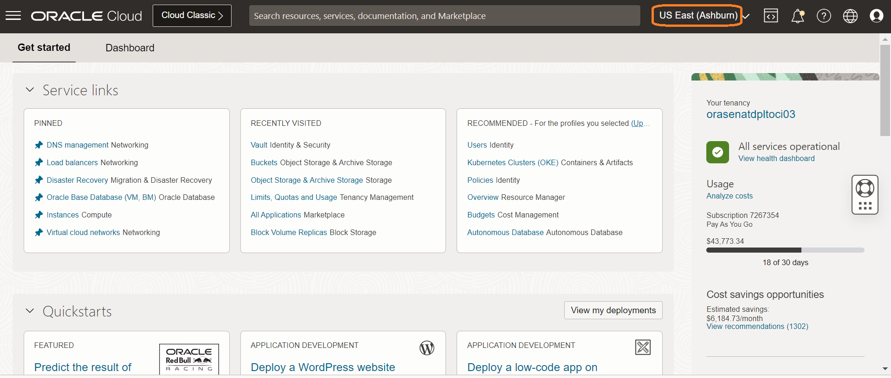

2. Select **Migration and Disaster Recovery** from the Hamburger menu, then **Disaster Recovery** -> **DR Protection Groups**. Verify the region is **Ashburn**

   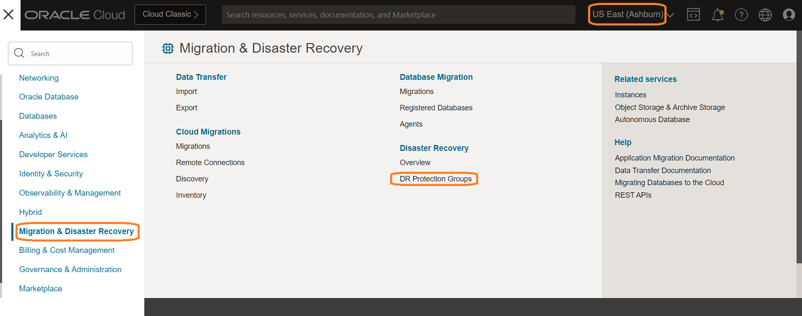

3. You will land on the Disaster Recovery Protection group home page; make sure you have selected *the Ashburn* region. Click on **FSCM92-FSDR-Group-Ashburn** DRPG.

   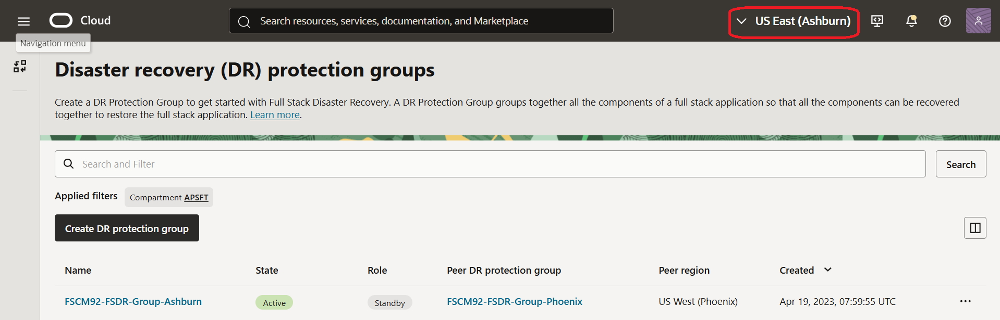

  In the Ashburn region DRPG page, add the members required in the **FSCM92-FSDR-Group-Ashburn** DRPG. 

4. Add Primary DBCS / DbaaS Database. 

  Select **FSCM92-FSDR-Group-Ashburn** DRPG, navigate to **Members** in the *Resources* section, and hit **Add Member**

  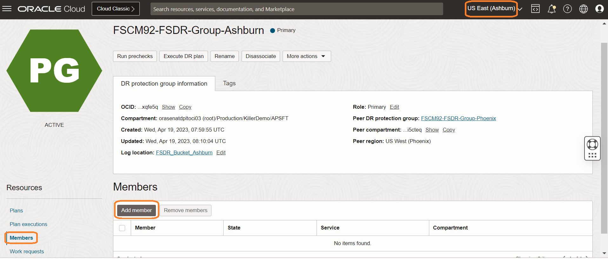

 - Resource Type is **Database**
 - Database Type is **Oracle Base Database**
 - Database System will be PeopleSoft Primary Application Database
 - Database Home will be auto-populated
 - Database will be auto-populated
 - Database password secret will be the secret created in Lab 1.

  Make sure to check the box **"I understand that all existing plans will be deleted"**.

Click on **Add**.

   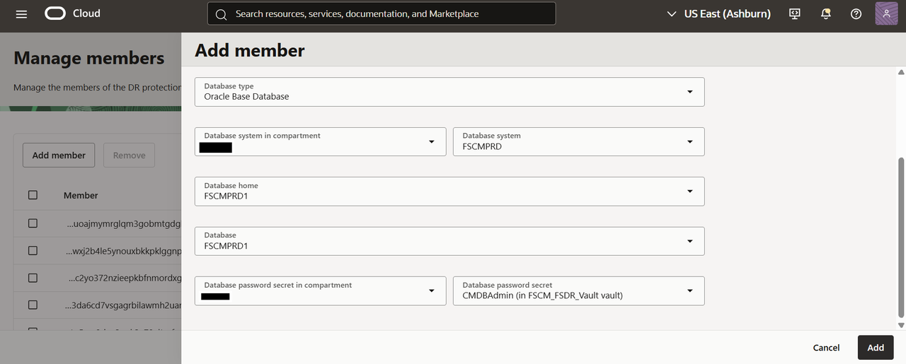

  **FSCM92-FSDR-Group-Ashburn** DRPG status will change to updating; wait for a few seconds. You should see that the database is added as a member. Refresh the DRPG page if required. You can monitor the request's status in the **Work requests** section under Resources.

  Navigate back to the DR Protection group page; the status of DRPG should be active.

   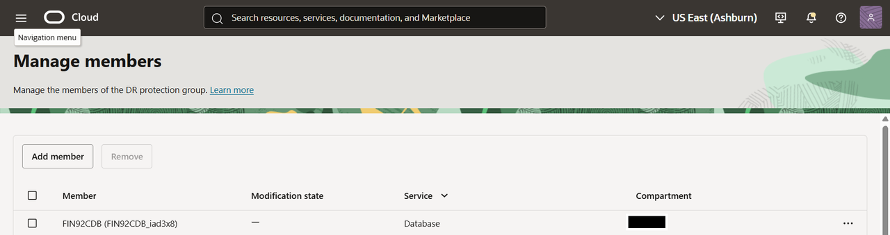

6. Add PeopleSoft Application Server Compute instance.

  Select **FSCM92-FSDR-Group-Ashburn** DRPG, navigate to **Members** in the *Resources* section, and hit **Add Member**

   

  It will show various resource types and select **Compute**
   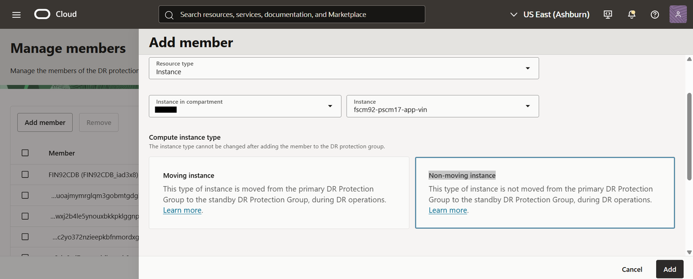

- Resource Type is **Compute**
- Make sure to check the box **"I understand that all existing plans will be deleted"**
- Instances in Compartment, select PeopleSoft Application Server Compute Instance
- **Uncheck** the checkmark of **Move instance on switchover or failover**.
- Click Add

  **FSCM92-FSDR-Group-Ashburn** DRPG status will change to updating; wait for a few seconds. DRPG status will change to active.You should be able to see that PeopleSoft Application Server compute instance has been added as a member. Refresh the DRPG page if required. You can monitor the status in the *Work requests* section under Resources.

   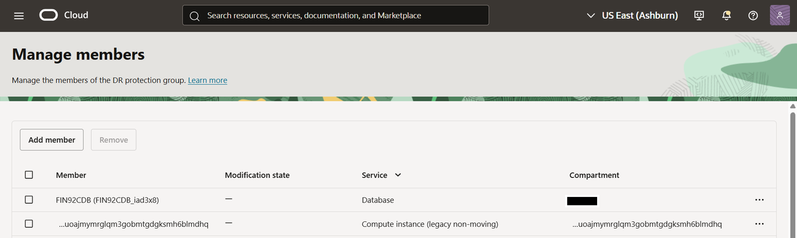

  Navigate back to the DR Protection group page; the status of DRPG should be active.

7. Add PeopleSoft Process Scheduler Server Compute instance (Linux).

  Select **FSCM92-FSDR-Group-Ashburn** DRPG, navigate to **Members** in the *Resources* section, and hit **Add Member**

   

  It will show various resource types and select **Compute**
   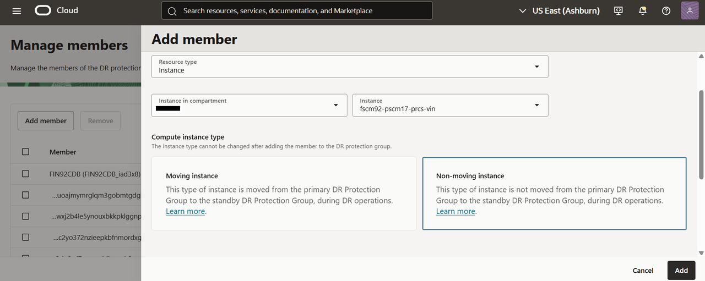

- Resource Type is **Compute**
- Make sure to check the box **"I understand that all existing plans will be deleted"**
- Instances in Compartment, select PeopleSoft Process Scheduler Server Compute Instance (Linux)
- **Uncheck** the checkmark of **Move instance on switchover or failover**
- Click Add

  **FSCM92-FSDR-Group-Ashburn** DRPG status will change to updating; wait for a few seconds. DRPG status will change to active.You should be able to see that PeopleSoft Process Scheduler Server compute instance (Linux) has been added as a member. Refresh the DRPG page if required. You can monitor the status in the *Work requests* section under Resources.

  Navigate back to the DR Protection group page; the status of DRPG should be active.

  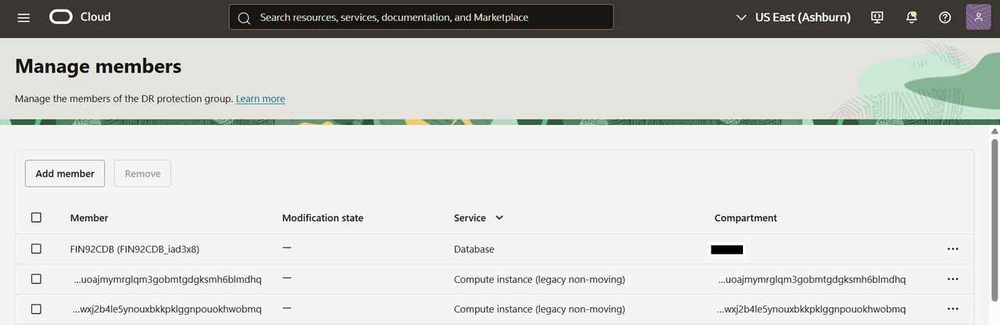

8. Add PeopleSoft Process Scheduler Server Compute instance (Windows).

  Select **FSCM92-FSDR-Group-Ashburn** DRPG, navigate to **Members** in the *Resources* section, and hit **Add Member**

   

  It will show various resource types and select **Compute**
   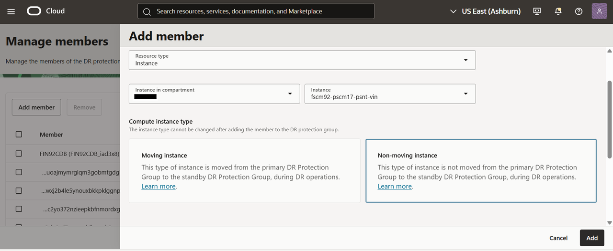

- Resource Type is **Compute**
- Make sure to check the box **"I understand that all existing plans will be deleted"**
- Instances in Compartment, select PeopleSoft Process Scheduler Server Compute Instance (Linux)
- **Uncheck** the checkmark of **Move instance on switchover or failover**
- Click Add

  **FSCM92-FSDR-Group-Ashburn** DRPG status will change to updating; wait for a few seconds. DRPG status will change to active.You should be able to see that PeopleSoft Process Scheduler Server compute instance (Windows) has been added as a member. Refresh the DRPG page if required. You can monitor the status in the *Work requests* section under Resources.

  Navigate back to the DR Protection group page; the status of DRPG should be active.

  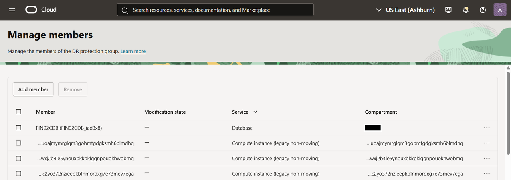

9. Add PeopleSoft Process Web Server Compute instance.

  Select **FSCM92-FSDR-Group-Ashburn** DRPG, navigate to **Members** in the *Resources* section, and hit **Add Member**

   

  It will show various resource types and select **Compute**
   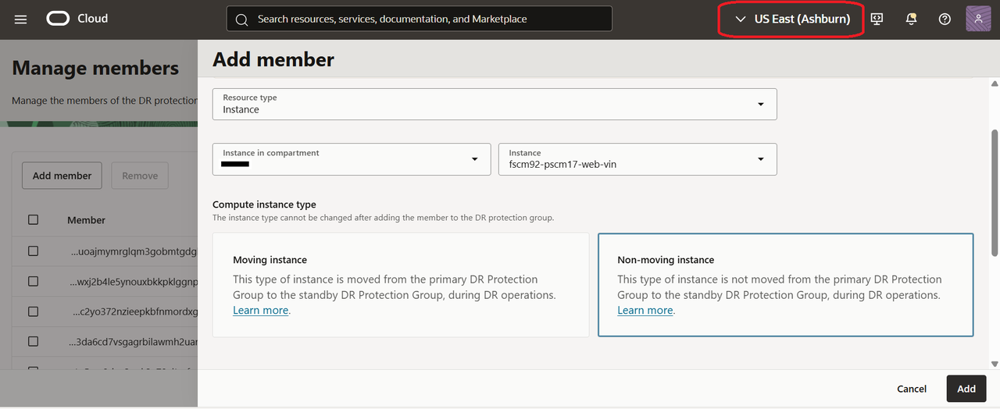

- Resource Type is **Compute**
- Make sure to check the box **"I understand that all existing plans will be deleted"**
- Instances in Compartment, select PeopleSoft Process Scheduler Server Compute Instance (Linux)
- **Uncheck** the checkmark of **Move instance on switchover or failover**
- Click Add

  **FSCM92-FSDR-Group-Ashburn** DRPG status will change to updating; wait for a few seconds. DRPG status will change to active.You should be able to see that PeopleSoft Web Server compute instance has been added as a member. Refresh the DRPG page if required. You can monitor the status in the *Work requests* section under Resources.

  Navigate back to the DR Protection group page; the status of DRPG should be active.

  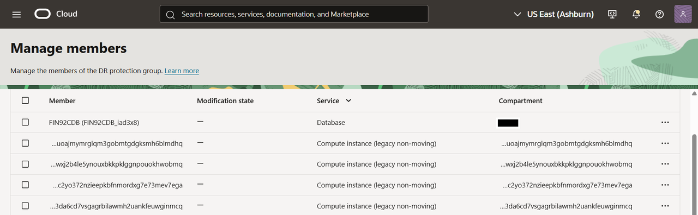

10. Add Elastic Search and Kibana Services Compute instance.

  Select **FSCM92-FSDR-Group-Ashburn** DRPG, navigate to **Members** in the *Resources* section, and hit **Add Member**

   

  It will show various resource types and select **Compute**
   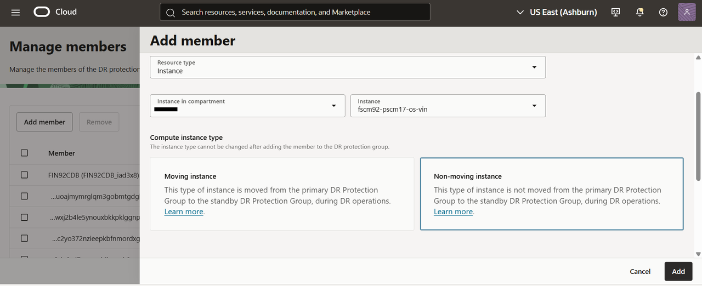

- Resource Type is **Compute**
- Make sure to check the box **"I understand that all existing plans will be deleted"**
- Instances in Compartment, select PeopleSoft Process Scheduler Server Compute Instance (Linux)
- **Uncheck** the checkmark of **Move instance on switchover or failover**
- Click Add

  **FSCM92-FSDR-Group-Ashburn** DRPG status will change to updating; wait for a few seconds. DRPG status will change to active.You should be able to see that Elastic Search & Kibana Service compute instance has been added as a member. Refresh the DRPG page if required. You can monitor the status in the *Work requests* section under Resources.

  Navigate back to the DR Protection group page; the status of DRPG should be active.

  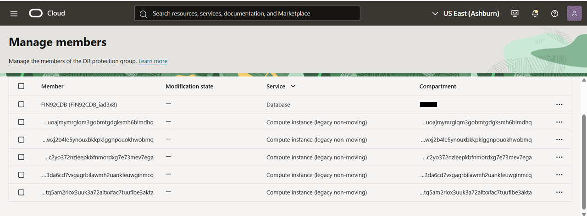

## Task 2: Add members to Phoenix DRPG (Standby)

1. Login into OCI Console. The standby region should be **Phoenix**.

   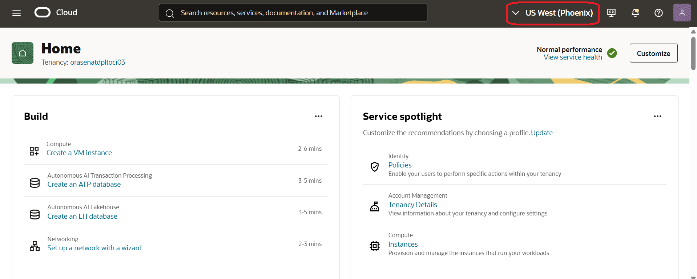

2. Select **Migration and Disaster Recovery** from the Hamburger menu, then **Disaster Recovery** -> **DR Protection Groups**. Verify the region is **Phoenix**.

   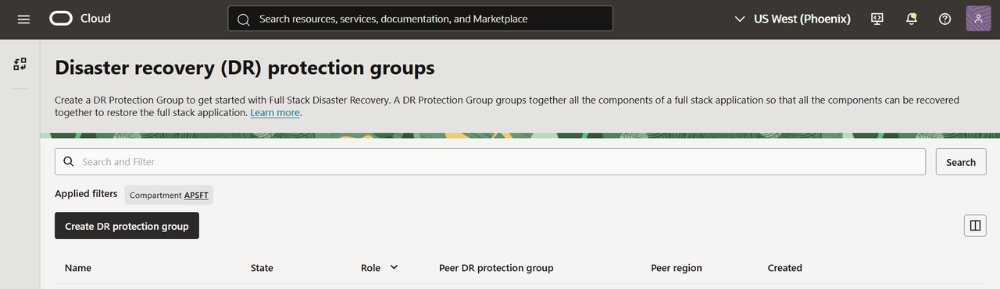

3. You will land on the Disaster Recovery Protection group home page; make sure you have selected the *Phoenix* region. Click on **FSCM92-FSDR-Group-Phoenix** DRPG.

   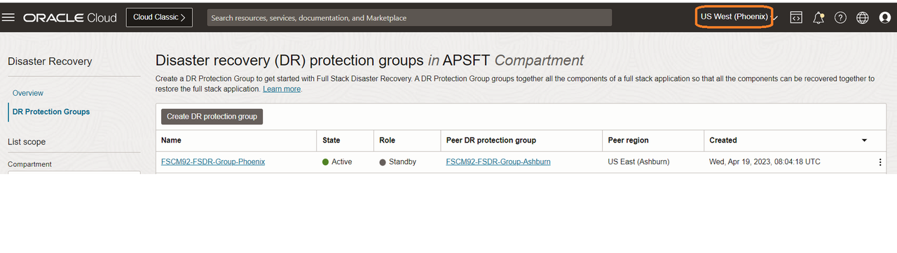

  In the Phoenix region DRPG page, add the members required in the **FSCM92-FSDR-Group-Phoenix** DRPG. 

4. Add Standby DBCS / DbaaS Database. 

  Select **FSCM92-FSDR-Group-Phoenix** DRPG, navigate to **Members** in the *Resources* section, and hit **Add Member**

  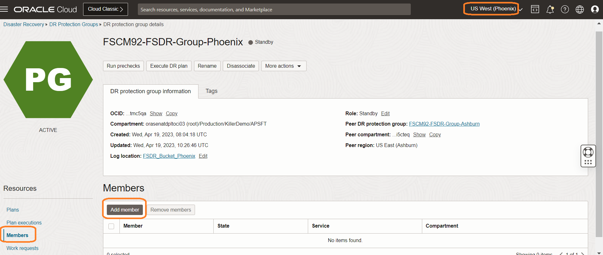

 - Resource Type is **Database**
 - Database Type is **Oracle Base Database**
 - Database System will be PeopleSoft Application Standby Database
 - Database Home will be auto-populated
 - Database will be auto-populated
 - Database password secret will be the secret created in Lab 1.

  Make sure to check the box **"I understand that all existing plans will be deleted"**.

Click on **Add**.

   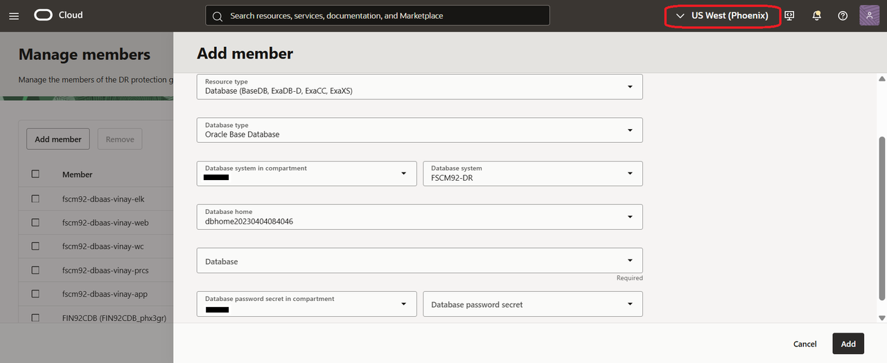

  **FSCM92-FSDR-Group-Phoenix** DRPG status will change to updating; wait for a few seconds. You should see that the database is added as a member. Refresh the DRPG page if required. You can monitor the request's status in the **Work requests** section under Resources.

  Navigate back to the DR Protection group page; the status of DRPG should be active.

   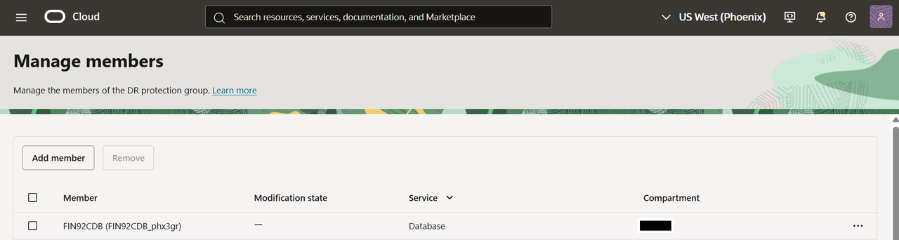

6. Add Standby PeopleSoft Application Server Compute instance.

  Select **FSCM92-FSDR-Group-Phoenix** DRPG, navigate to **Members** in the *Resources* section, and hit **Add Member**

   

  It will show various resource types and select **Compute**
   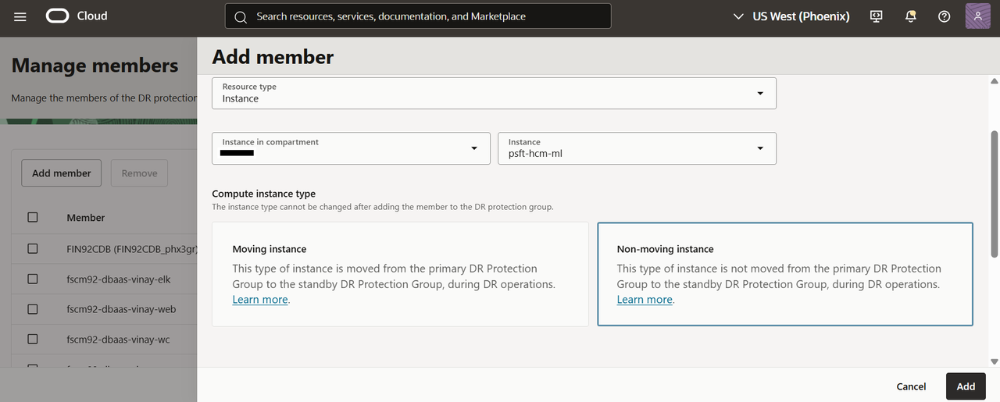

- Resource Type is **Compute**
- Make sure to check the box **"I understand that all existing plans will be deleted"**
- Instances in Compartment, select PeopleSoft Application Server Compute Instance
- **Uncheck** the checkmark of **Move instance on switchover or failover**.
- Click Add

  **FSCM92-FSDR-Group-Phoenix** DRPG status will change to updating; wait for a few seconds. DRPG status will change to active.You should be able to see that Standby PeopleSoft Application Server compute instance has been added as a member. Refresh the DRPG page if required. You can monitor the status in the *Work requests* section under Resources.

   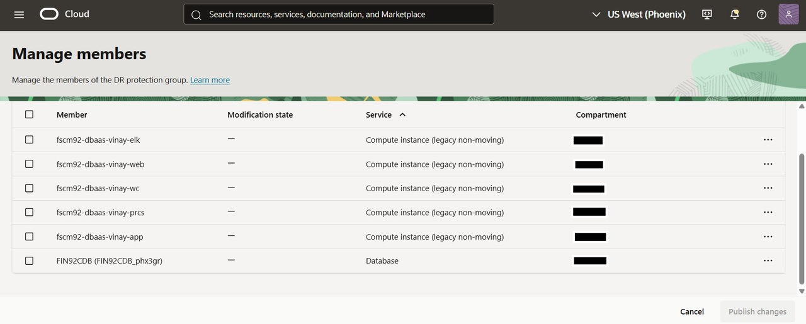

  Navigate back to the DR Protection group page; the status of DRPG should be active.

7. Add Standby PeopleSoft Process Scheduler Server Compute instance (Linux).

  Select **FSCM92-FSDR-Group-Phoenix** DRPG, navigate to **Members** in the *Resources* section, and hit **Add Member**

   

  It will show various resource types and select **Compute**
   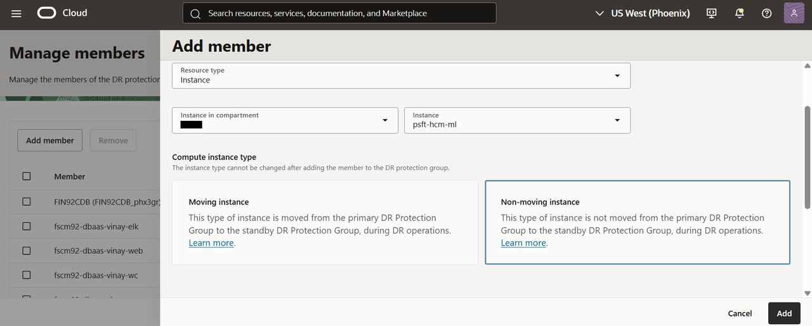

- Resource Type is **Compute**
- Make sure to check the box **"I understand that all existing plans will be deleted"**
- Instances in Compartment, select PeopleSoft Application Server Compute Instance
- **Uncheck** the checkmark of **Move instance on switchover or failover**.
- Click Add

  **FSCM92-FSDR-Group-Phoenix** DRPG status will change to updating; wait for a few seconds. DRPG status will change to active.You should be able to see that Standby PeopleSoft Process Scheduler Server compute instance (Linux) has been added as a member. Refresh the DRPG page if required. You can monitor the status in the *Work requests* section under Resources.

   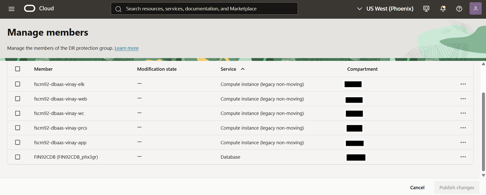

  Navigate back to the DR Protection group page; the status of DRPG should be active.

8. Add Standby PeopleSoft Process Scheduler Server Compute instance (Windows).

  Select **FSCM92-FSDR-Group-Phoenix** DRPG, navigate to **Members** in the *Resources* section, and hit **Add Member**

   

  It will show various resource types and select **Compute**
   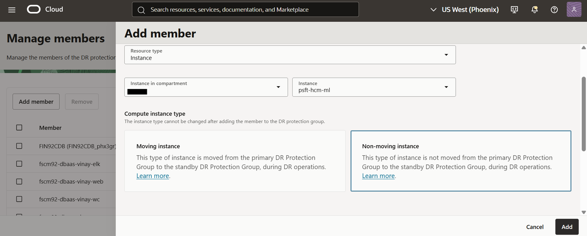

- Resource Type is **Compute**
- Make sure to check the box **"I understand that all existing plans will be deleted"**
- Instances in Compartment, select PeopleSoft Application Server Compute Instance
- **Uncheck** the checkmark of **Move instance on switchover or failover**.
- Click Add

  **FSCM92-FSDR-Group-Phoenix** DRPG status will change to updating; wait for a few seconds. DRPG status will change to active.You should be able to see that Standby PeopleSoft Process Scheduler Server compute instance (Windows) has been added as a member. Refresh the DRPG page if required. You can monitor the status in the *Work requests* section under Resources.

   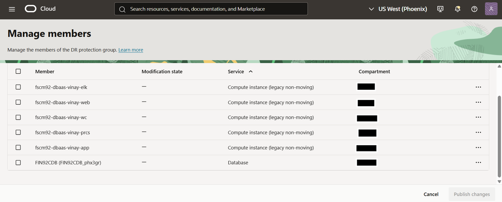

  Navigate back to the DR Protection group page; the status of DRPG should be active.

9. Add Standby PeopleSoft Web Server Compute instance.

  Select **FSCM92-FSDR-Group-Phoenix** DRPG, navigate to **Members** in the *Resources* section, and hit **Add Member**

   

  It will show various resource types and select **Compute**
   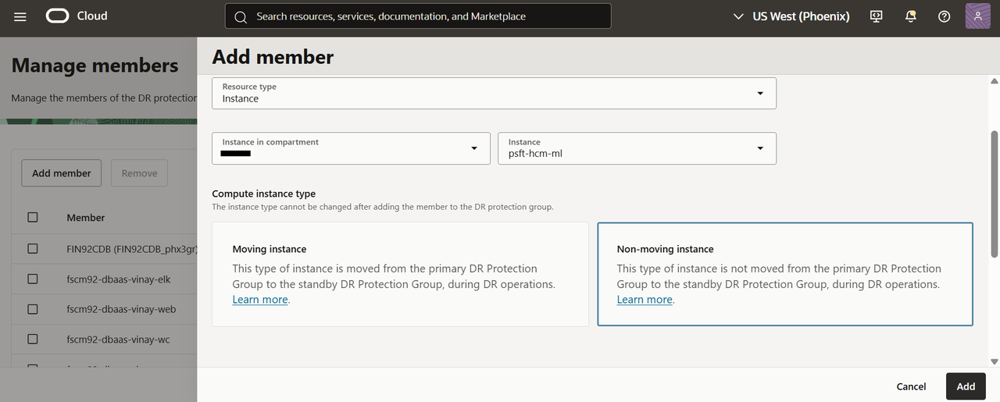

- Resource Type is **Compute**
- Make sure to check the box **"I understand that all existing plans will be deleted"**
- Instances in Compartment, select PeopleSoft Application Server Compute Instance
- **Uncheck** the checkmark of **Move instance on switchover or failover**.
- Click Add

  **FSCM92-FSDR-Group-Phoenix** DRPG status will change to updating; wait for a few seconds. DRPG status will change to active.You should be able to see that Standby PeopleSoft Web Server compute instance has been added as a member. Refresh the DRPG page if required. You can monitor the status in the *Work requests* section under Resources.

   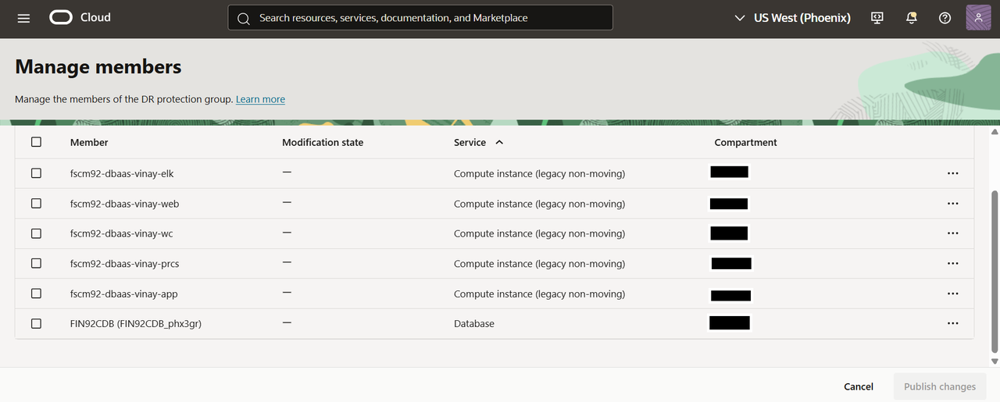

  Navigate back to the DR Protection group page; the status of DRPG should be active.

10. Add Standby Elastic Search and Kibana Service Compute instance.

  Select **FSCM92-FSDR-Group-Phoenix** DRPG, navigate to **Members** in the *Resources* section, and hit **Add Member**

   

  It will show various resource types and select **Compute**
   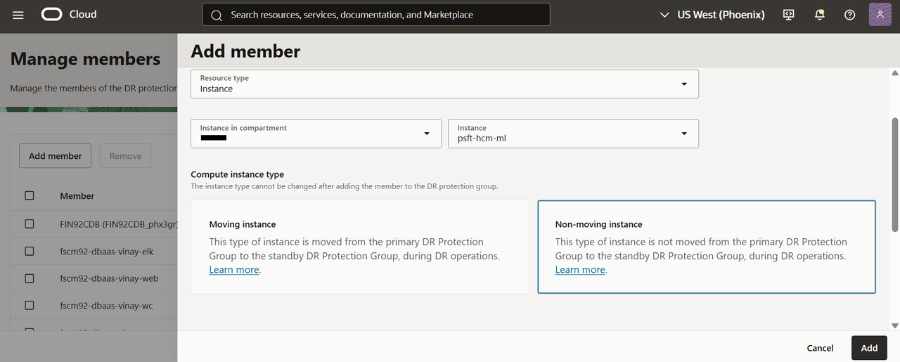

- Resource Type is **Compute**
- Make sure to check the box **"I understand that all existing plans will be deleted"**
- Instances in Compartment, select PeopleSoft Application Server Compute Instance
- **Uncheck** the checkmark of **Move instance on switchover or failover**.
- Click Add

  **FSCM92-FSDR-Group-Phoenix** DRPG status will change to updating; wait for a few seconds. DRPG status will change to active.You should be able to see that Standby Elastic Search & Kibana Service compute instance has been added as a member. Refresh the DRPG page if required. You can monitor the status in the *Work requests* section under Resources.

   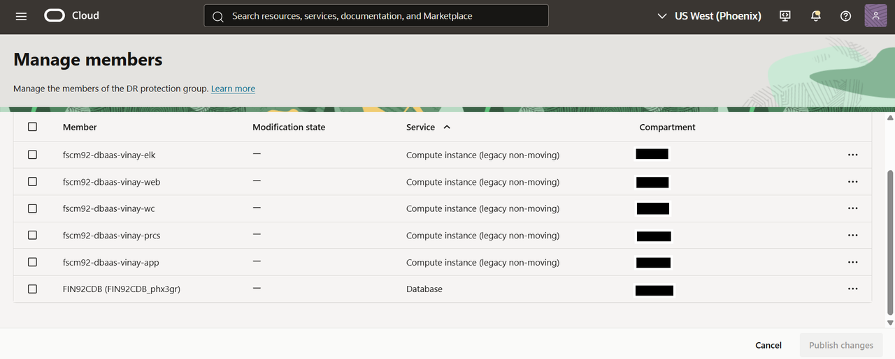

  Navigate back to the DR Protection group page; the status of DRPG should be active.

You may now **proceed to the next lab**.

## Troubleshooting tips

1. After adding the member, in case if the member is not showing up. Re-add the member again.

## Acknowledgements

- **Author** -  Vinay Shivanna, Principal Cloud Architect
- **Last Updated By/Date** -  Vinay Shivanna, Principal Cloud Architect, April 2023
