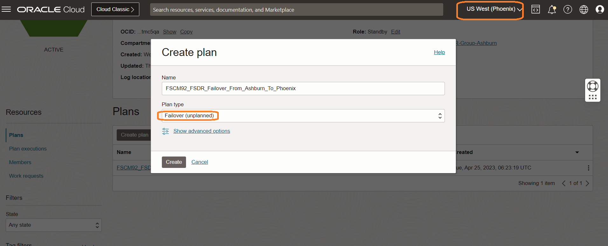
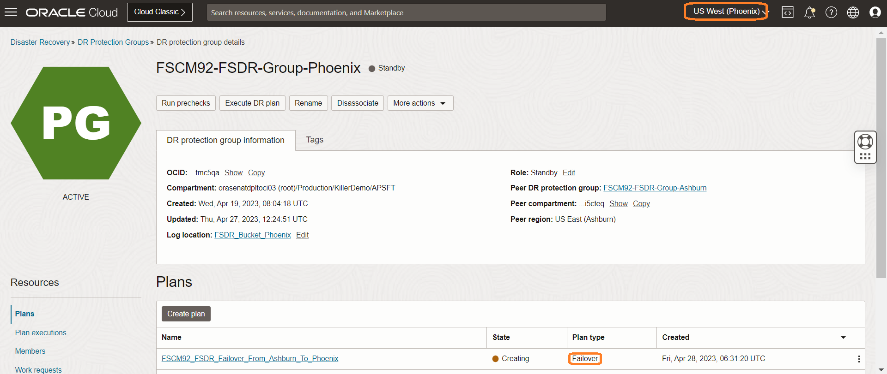
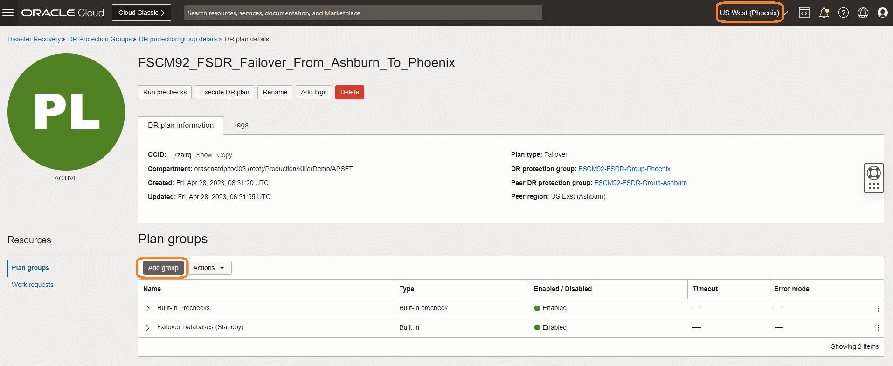
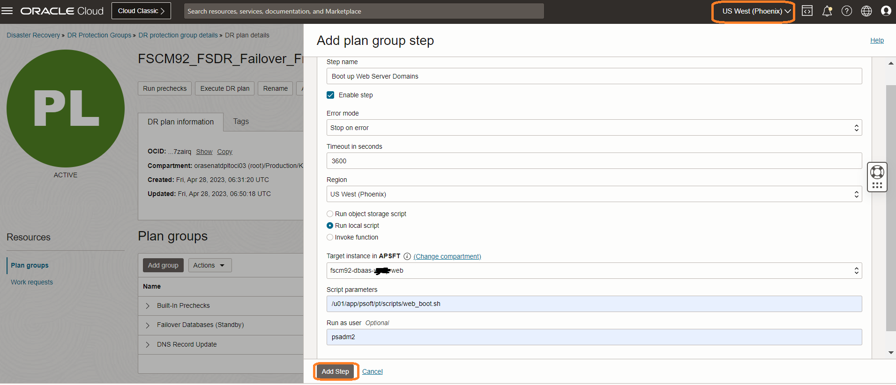

# Create and Customize the DR Failover Plan

## Introduction

In this lab, we will create a DR Failover plan and customize the plan with the additional steps. Ashburn is the primary region and Phoenix is the standby region. FSDR provides two types of plan

- Switchover (Maintenance/Planned Disaster Recovery)
- Failover   (Actual Disaster Recovery/Unplanned)

Failover is the process of transferring mission-critical workloads from the primary production center and recovering the system at an off-site location (DR region). The main goal of failover is to mitigate the negative impact of a disaster or service disruption on business services and customers. Hence all of the tasks as part of this failover lab will be executed in the DR region which is Phoenix.

This lab will focus on how to create a Failover plan and customize the plan as per PeopleSoft application requirements. 

**DR Plan *must* be created in the standby region (Phoenix)**. It is because, in the case of the worst-case scenario, the entire primary region outside the FSDR will not be accessible from the primary region.

Estimated Time: 60 Minutes

### Objectives

- Create a Failover plan
- Customize the Failover plan - Add DNS Record Update Script
- Customize the Failover plan - Add PeopleSoft Application boot up group in Phoenix
- Customize the Failover plan - Add Elastic Search Service boot up group in Phoenix
- Customize the Failover plan - Add Kibana Service boot up group in Phoenix
- Customize the Failover plan - Enable files synchronization (rsync) jobs in Phoenix 
- Customize the Failover plan - DR Plan Re-Ordering

## Task 1: Create a Failover plan

1. Login into OCI Console. Select region as **Phoenix**.

  

2. Select Migration and Disaster Recovery from the Hamburger menu, then **Disaster Recovery** -> **DR Protection Groups**. Verify the region is **Phoenix**

  

3. You will land on the Disaster Recovery Protection group home page; make sure you have selected the Phoenix region. **DR Plans always be created in the Standby DRPG (Phoenix region)**

  

4. Select the **FSCM92-FSDR-Group-Phoenix** DRPG and click on Plans. Click on Create Plan.

  

  Provide a name for the Failover Plan.

  Select Plan type as **Failover (planned)**.

  

  The plan will start creating.

  

  Refresh the DR Plan page if required. You can monitor the request's status in the **Work requests** section under Resources. Within few minutes, the plan will get created, and it should be in *active* State.

  Select the **FSCM92\_FSDR\_Failover\_From\_Ashburn\_To\_Phoenix** plan, and you should be able to see the built-in plan groups.

  Based on the members we added in both primary and standby DRPG, FSDR created these built-in plans.

- **Built-in Prechecks** - These are the prechecks for the DB Failover.
- **Failover Databases (Standby)** - Database Failover.

  

## Task 2: Customize the Failover plan - Add DNS Record Update Script

1. Click on Manage plan groups.

    

2. Add "DNS Record Update" User defined group. Click on Add Step.

    

  - Add *Update DNS Record* in Step name
  - Add *Update DNS Record* in Step name
  - Select configurations as **Run local script**
  - In the region, select "**US West (Phoenix)**"
  - Select the Server instance in "Target instance in compartment" where you have placed the DNS Record update script
  - In the script parameters, add the location of the DNS Record update script
  - Run as user will be the user who has access to update DNS records

  Click on Add.

## Task 3: Customize the Failover plan - Add PeopleSoft Application Boot-up Group in Phoenix

1. Click on Manage plan groups.

  

2. Add "Start Application Server Domains" User defined group. We will now add PeopleSoft Application Server boot up step. Click on Add Step.

    

  - Add *Start PeopleSoft Application in Phoenix* in Group name
  - Add *Boot of Application Server Domains* in Step name
  - Select configurations as **Run local script**
  - In the region, select "**US West (Phoenix)**"
  - Select the Application Server instance in "Target instance in compartment" where you have placed the Application Server Domain start-up script
  - In the script parameters, add the location of the Application Server Domain start-up script.
  - Run as user will be the user who has access to start-up
  - Select Error mode as "Stop on error"
  - Leave the default "3600" seconds in Timeout in seconds
  - Enable step

Click on Add.
 
3. We will now add PeopleSoft Process Scheduler (Linux) boot up step.

    

  - Add *Boot up Process Scheduler Domains (Linux)* in Step name
  - Select configurations as **Run local script**
  - In the region, select "**US West (Phoenix)**"
  - Select the Process Scheduler Server instance in "Target instance in compartment" where you have placed the Process Scheduler Server Domain start-up  script
  - In the script parameters, add the location of the Process Scheduler Server Domain start-up  script
  - Run as user will be the user who has access to start-up 
  - Select Error mode as "Stop on error"
  - Leave the default "3600" seconds in Timeout in seconds
  - Enable Step

Click on Add.
 
4. We will now add PeopleSoft Process Scheduler (Windows) boot up step. Click on Add Step.

     

  - Add *Boot up Process Scheduler Domains (Windows)* in Step name
  - Select configurations as **Run local script**
  - In the region, select "**US West (Phoenix)**"
  - Select the Process Scheduler Server instance in "Target instance in compartment" where you have placed the Process Scheduler Server Domain start-up  script
  - In the script parameters, add the location of the Process Scheduler Server Domain start-up  script
  - Run as user will be the user who has access to start-up 
  - Select Error mode as "Stop on error"
  - Leave the default "3600" seconds in Timeout in seconds
  - Enable Step
 
Click on Add.

5. We will now add Web Server Boot up step.

     

  - Add *Boot up Web Server Domains* in Step name
  - Select configurations as **Run local script**
  - In the region, select "**US West (Phoenix)**"
  - Select the Web Server instance in "Target instance in compartment" where you have placed the Web Server   Domain start-up script
  - In the script parameters, add the location of the Web Server Domain start-up script. Below is an example of Web Server Domain start-up script, please write a start-up shell script according to your setup and configurations
  - Run as user will be the user who has access to start-up
  - Select Error mode as "Stop on error"
  - Leave the default "3600" seconds in Timeout in seconds
  - Enable Step

  Click on Add.

## Task 4: Customize the Failover plan - Add Elastic Search Services Boot-up Scripts in Phoenix
    
1. Click on Manage plan groups. Provide a name to the group as Start Elastic Search Services.

    

2. We will now add Elastic Search boot up script. Click on Add Step.

    

  - Add *Start Elastic Search Services* in group name
  - Add *Boot up Elastic Search Services* in Step name
  - Select configurations as **Run local script**
  - In the region, select "**US West (Phoenix)**"
  - Select the Web Server instance in "Target instance in compartment" where you have placed the Elastic Search Server Domain start-up script
  - In the script parameters, add the location of the Elastic Search Server Domain start-up script
  - Run as user will be the user who has access to start-up
  - Select Error mode as "Stop on error"
  - Leave the default "3600" seconds in Timeout in seconds
  - Enable Step

  Click on Add.

## Task 5: Customize the Failover plan - Add Kibana Services Boot-up Scripts in Phoenix

1. Click on Manage plan groups. Provide a name to the group as Start Kibana Services.

    

2. We will now add Kibana Services boot up script. Click on Add Step.

    

  - Add *Start Kibana Services* in group name
  - Add *Boot up Kibana Services* in Step name
  - Select configurations as **Run local script**
  - In the region, select "**US West (Phoenix)**"
  - Select the Web Server instance in "Target instance in compartment" where you have placed the Kibana  services start-up script
  - In the script parameters, add the location of the Kibana services start-up script
  - Run as user will be the user who has access to start-up
  - Select Error mode as "Stop on error"
  - Leave the default "3600" seconds in Timeout in seconds
  - Enable Step

  Click on Add.

   
## Task 6: Customize the Failover plan - Enable files synchronization (rsync) jobs in Phoenix

 As part of this task, we will enable synchronization (rsync) jobs in Phoenix to reverse the sync from Phoenix to Ashburn post Failover as the roles (priamry and standby) will be reversed.

 1. Click on Manage plan groups.

    

2. We will enable cronjob (rsync) in Application Server. Add "Enable\_rsync\_in\_Phoenix" User defined group. Click on Add Step.

        

    - Add *Enable-rsync-in-Phoenix-App* in Step name
    - Select configurations as **Run local script**
    - In the region, select "**US West (Phoenix)**"
    - Select the Server instance in "Target instance in compartment" where you have placed the cronjob (rsync) enable script
    - In the script parameters, add the location of the cronjob (rsync) enable script
    - Run as user will be the user who has access to enable cronjobs
    - Leave the Enable Step as ticked
  
    Click on Add Step.

3. We will now enable cronjob (rsync) in Process Scheduler Server. Click on Add Step.

    

        

    - Add *Enable-rsync-in-Phoenix-PRCS* in Step name
    - Select configurations as **Run local script**
    - In the region, select "**US West (Phoenix)**"
    - Select the Server instance in "Target instance in compartment" where you have placed the cronjob (rsync) enable script
    - In the script parameters, add the location of the cronjob (rsync) enable script
    - Run as user will be the user who has access to enable cronjobs
    - Leave the Enable Step as ticked

    Click on Add Step.

4. We will now enable cronjob (rsync) in Web Server. Click on Add Step.

    

        

    - Add *Enable-rsync-in-Phoenix-WEB* in Step name
    - Select configurations as **Run local script**
    - In the region, select "**US West (Phoenix)**"
    - Select the Server instance in "Target instance in compartment" where you have placed the cronjob (rsync) enable script
    - In the script parameters, add the location of the cronjob (rsync) enable script
    - Run as user will be the user who has access to enable cronjobs
    - Leave the Enable Step as ticked

  Click on Add.

DR Failover plan is now updated with customized steps.

   

   You may now **proceed to the next lab**.

## Acknowledgements

- **Author** -  Vinay Shivanna, Principal Cloud Architect
- **Last Updated By/Date** -  Vinay Shivanna, Principal Cloud Architect, November 2025
