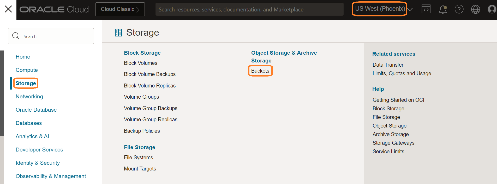
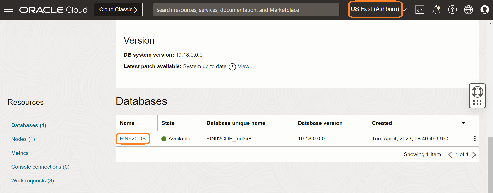
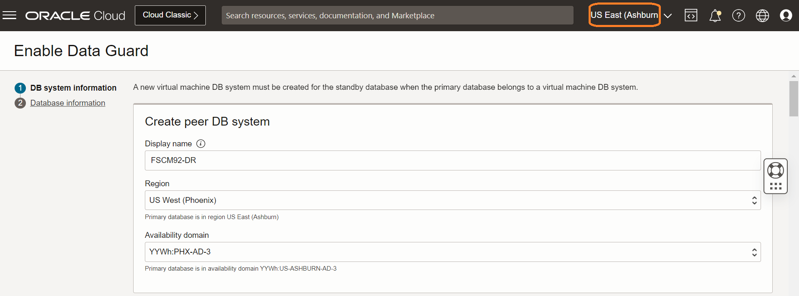
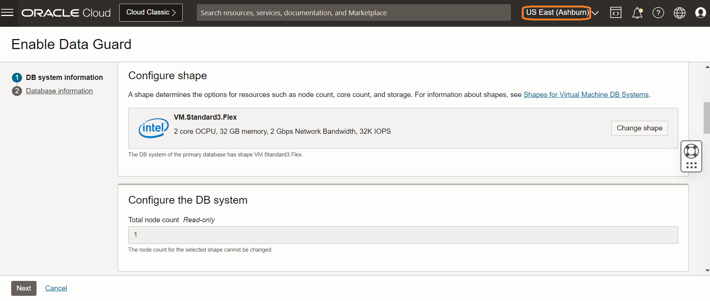
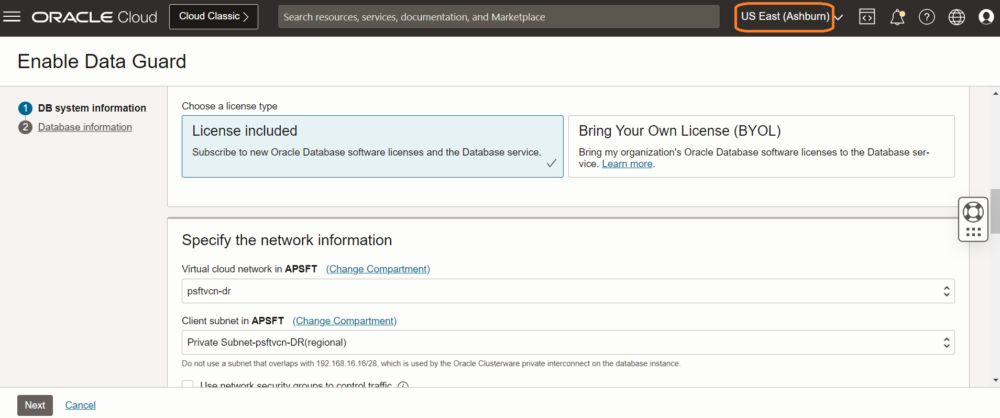
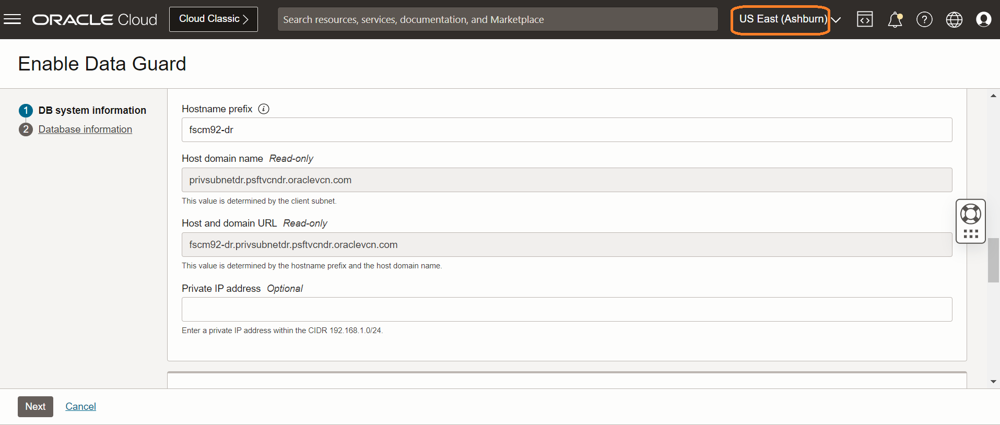
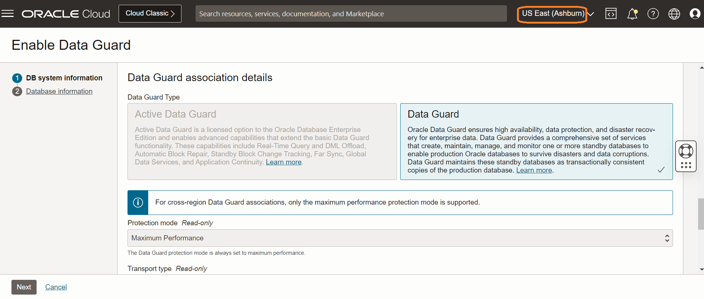
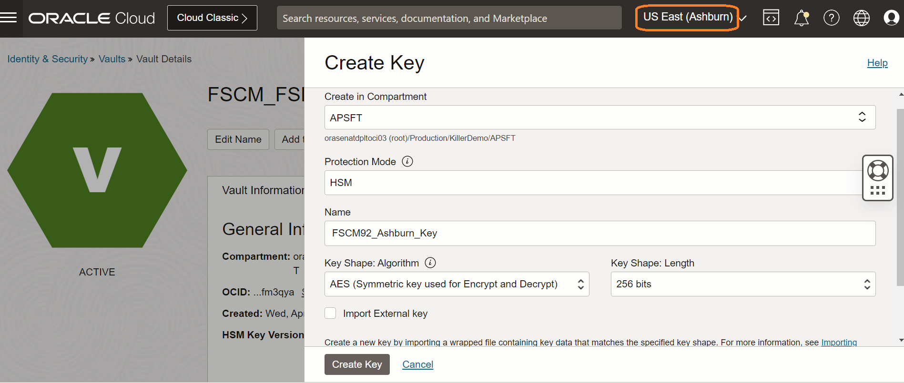
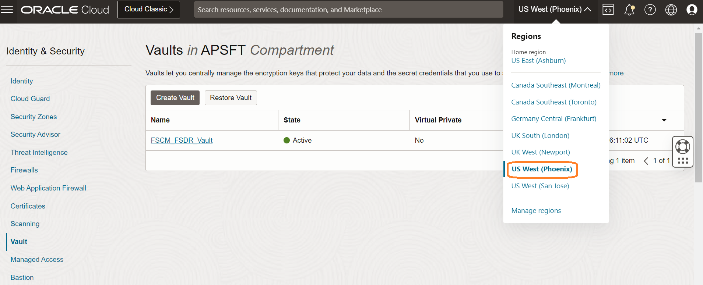
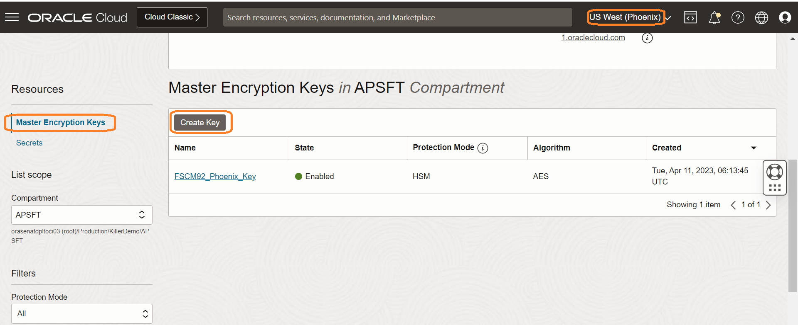

# Pre-requisites for Full Stack Disaster Recovery

## Introduction

In this lab, we will complete the pre-requisites setup work for Full Stack Disaster Recovery.

Estimated Time: 30 Minutes

### Objectives

- Prepare Object Storage Buckets for Operation Logs.
- Prepare Oracle Databases for Full Stack Disaster Recovery.

## Task 1: Preparing Object Storage Buckets for Operation Logs

Full Stack Disaster Recovery (FSDR) configurations use Object Storage to store Disaster Recovery (DR) operation logs.

Before you create any DR configurations, you must create Object Storage buckets in both Ashburn (primary) and Phoenix (standby) regions to include in the DR configuration process.

Oracle recommends that you follow these guidelines when creating the Object Storage bucket:

- Use a separate dedicated bucket for each DR protection group.
- Use Standard storage tier, not **Archive**.
- Do not set up replication for this object store bucket.
- Do not use this bucket to write other data, reserve it exclusively for use for logs for one DR protection group.
- Ensure that the object store bucket is writable by the user running DR plan executions.

1. Login into OCI Console. The primary region should be **Ashburn**.

    

 2. Select **Storage** from the Hamburger menu, then **Buckets**. Verify the region is **Ashburn**.

    

3. Click on Create Bucket and provide a name for the bucket and select the Default Storage Tier as **Standard**.

    

4. Change the region to **Phoenix**. Select **Storage** from the Hamburger menu, then **Buckets**. Verify the region is **Phoenix**.

    

5. Click on Create Bucket and provide a name for the bucket and select the Default Storage Tier as **Standard**.

    

## Task 2: Preparing Oracle Databases for Full Stack Disaster Recovery

1. From the Ashburn region OCI console, select **Oracle Database** from the Hamburger menu then **Oracle Base Database (VM, BM)**.

    

2. Click on the relevant DB System. Click on the Database.

    

3. Under Resources section, click on Data Guard Assosciations.

    

4. Click on Enable Data Guard.

    

5. Provide a peer DB display name, select the DR standby region in this case it will be Phoenix, select the Availability Domain (recommended to host in the same Availability Domain which is hosting the PeopleSoft Application Tier).

    

    Select the shape same as the primary DB.

    

    Choose the license type and select the correct VCN and subnet from the drop down.

    

    Provide a hostname prefix.

    

    Select the Data Guard Association type. Active Data Guard requires an Oracle Active Data Guard license.

    

    Leave other fields as default and click Next.

    

6. Enter the database administrator password of the primary database in the Database password field. Use this same database administrator password for the standby database. Click on Enable Data Guard.

    

7. Create a vault in the Ashburn (primary) region. From the Ashburn region OCI console, select **Identity & Security** from the Hamburger menu then **Vault**.

    

8. Click on Create Vault. Select the right compartment and provide a name for the Vault.

    

9. Under Resources, click on Master Encryption Keys and click on Create Key.

    

10. Select the right compartment, Protection Mode will be **HSM** and provide a name for the Key, Key Shape:Algorithm will be **AES (Symmetric key used for Encrypt and Decrypt)** and Key Shape:Lenght will be 256 bits. Click on Create Key.

    

11. Under Resources, click on Secrets and click on Create Secrets.

    

12. Select the right compartment, provide a name for the secret, a description for the secret, select the Master Encryption Key created in the previous task from the drop down, **Secret Type Template** will be Plain-Text, provide the DB SYS user password in plain text format in the **Secret Contents**.

    

13. Change the region to Phoenix. 

    

14. Create a vault in the Phoenix (standby) region. From the Phoenix region OCI console, select **Identity & Security** from the Hamburger menu then **Vault**.

    

15. Click on Create Vault. Select the right compartment and provide a name for the Vault.

    

16. Under Resources, click on Master Encryption Keys and click on Create Key.

    

17. Select the right compartment, Protection Mode will be **HSM** and provide a name for the Key, Key Shape:Algorithm will be **AES (Symmetric key used for Encrypt and Decrypt)** and Key Shape:Lenght will be 256 bits. Click on Create Key.

    

18. Under Resources, click on Secrets and click on Create Secrets.

    

19. Select the right compartment, provide a name for the secret, a description for the secret, select the Master Encryption Key created in the previous task from the drop down, **Secret Type Template** will be Plain-Text, provide the DB SYS user password in plain text format in the **Secret Contents**.

    

   You may now **proceed to the next lab**.

## Acknowledgements

- **Author** -  Vinay Shivanna, Principal Cloud Architect
- **Last Updated By/Date** -  Vinay Shivanna, Principal Cloud Architect, April 2023
