# Pre-requisites for Full Stack Disaster Recovery

## Introduction

In this lab, we will complete the pre-requisites setup work for Full Stack Disaster Recovery.

Estimated Time: 60 Minutes

### **Objectives**

- Prepare Object Storage Buckets for Operation Logs.
- Prepare Oracle Databases for Full Stack Disaster Recovery.

### **Prerequisites and General Information**

An Oracle Data Guard implementation requires two DB systems, one containing the primary database and one containing the standby database. When you enable Oracle Data Guard for a virtual machine DB system database, a new DB system with the standby database is created and associated with the primary database. For a bare metal DB system, the DB system with the database that you want to use as the standby must already exist before you enable Oracle Data Guard.

- Both DB systems must be in the same compartment.
- The DB systems must be the same shape type (for example, if the shape of the primary database is a virtual machine, then the shape of the standby database can be any other virtual machine shape).
- The database versions and editions must be identical. Oracle Data Guard does not support Oracle Database Standard Edition. (Active Data Guard requires Enterprise Edition - Extreme Performance.)
- Each database in a Data Guard association must have a unique name (DB\_UNIQUE\_NAME) value that is not in use by other databases in the DB systems the house the Data Guard association. However, the primary and standby database can use the same database name DB\_NAME value.
- The database edition determines whether Active Data Guard (ADG) can be used. ADG is only available with Enterprise Edition Extreme Performance. If you are using the BYOL licensing model and if your license does not include Active Data Guard, then you must ensure that Active Data Guard is not enabled when configuring Data Guard for Enterprise Edition Extreme Performance. Alternately, you can use Enterprise Edition or Enterprise Edition High Performance, which do not enable ADG by default. See Use Oracle Data Guard with the Database CLI.
- If your primary and standby databases are in the same region, then both must use the same virtual cloud network (VCN).
- If your primary and standby databases are in different regions, then you must peer the virtual cloud networks (VCNs) for each database. See [Remote VCN Peering using an RPC](https://docs.oracle.com/pls/topic/lookup?ctx=en/cloud/paas/bm-and-vm-dbs-cloud/dbscb&id=oci-remote-VCN-peering).
- Configure the security list ingress and egress rules for the subnets of both DB systems in the Oracle Data Guard association to enable TCP traffic to move between the applicable ports. Ensure that the rules you create are stateful (the default).
    For example, if the subnet of the primary DB system uses the source CIDR 10.0.0.0/24 and the subnet of the standby DB system uses the source CIDR 10.0.1.0/24, then create rules as shown in the subsequent example.

## Task 1: Preparing Object Storage Buckets for Operation Logs

Full Stack Disaster Recovery configurations uses Object Storage to store Disaster Recovery (DR) operation logs.

Before you create any DR configurations, you must create Object Storage buckets in both Ashburn (primary) and Phoenix (standby) regions to include in the DR configuration process.

Oracle recommends that you follow these guidelines when creating the Object Storage bucket:

- Use a separate dedicated bucket for each DR protection group.
- Use Standard storage tier, not **Archive**.
- Do not set up replication for this object store bucket.
- Do not use this bucket to write other data, reserve it exclusively for use for logs for one DR protection group.
- Ensure that the object store bucket is writable by the user running DR plan executions.

1. Login into OCI Console. The primary region should be **Ashburn**.

    

 2. Select **Storage** from the Hamburger menu, then **Buckets**. Verify the region is **Ashburn**.

    

3. Click on Create Bucket and provide a name for the bucket and select the Default Storage Tier as **Standard**. Click on Create.

    

4. Change the region to **Phoenix**. Select **Storage** from the Hamburger menu, then **Buckets**. Verify the region is **Phoenix**.

    

5. Click on Create Bucket and provide a name for the bucket and select the Default Storage Tier as **Standard**. Click on Create.

    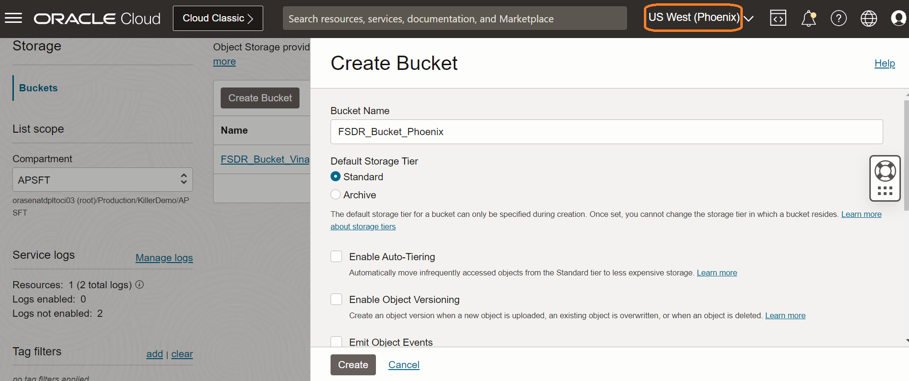

## Task 2: Preparing Oracle Databases for Full Stack Disaster Recovery

1. From the Ashburn region OCI console, select **Oracle Database** from the Hamburger menu then **Oracle Base Database (VM, BM)**.

    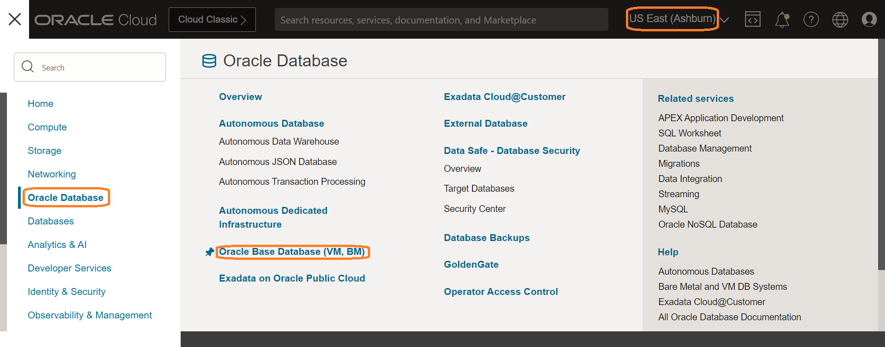

2. Click on the relevant PeopleSoft DB System. Click on the Database.

    

3. Under Resources section, click on Data Guard Associations.

    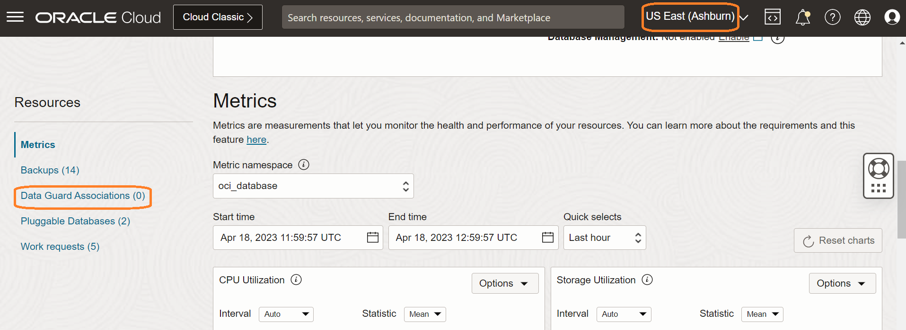

4. Click on Enable Data Guard.

    

5. Provide a peer DB display name, select the DR standby region in this case it will be Phoenix, select the Availability Domain (recommended to host in the same Availability Domain where PeopleSoft Application Tiers are hosted).

    

    Select the shape same as the primary DB.

    

    Choose the license type and select the correct VCN and subnet from the drop down.

    

    Provide a hostname prefix.

    

    Select the Data Guard Association type. Active Data Guard requires an Oracle Active Data Guard license.

    

    Leave other fields as default and click Next.

    

6. Enter the database administrator password of the primary database in the Database password field. Click on Enable Data Guard.

    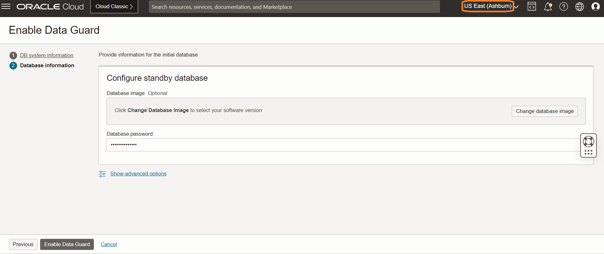

    Data Guard is now in enabled status.

    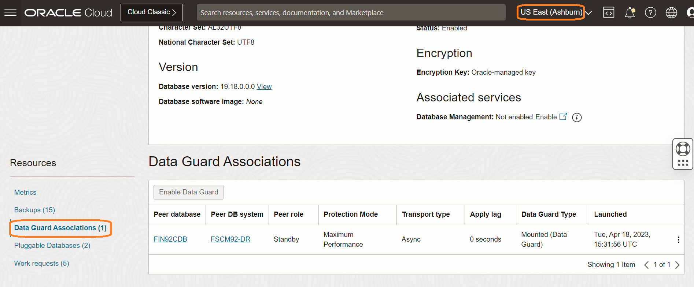

We will now create Vaults in both *Ashburn* and *Phoenix* regions to store Database Admin passwords which will be used during DR operations.

7. Create a vault in the Ashburn (primary) region. 

    From the Ashburn region OCI console, select **Identity & Security** from the Hamburger menu then **Vault**.

    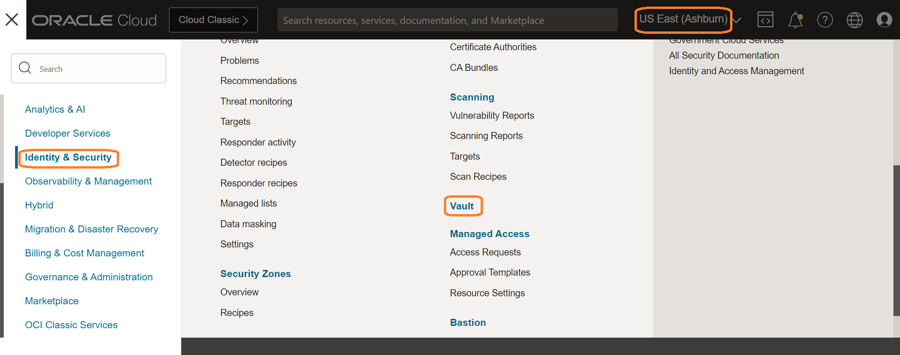

8. Click on Create Vault. Select the right compartment and provide a name for the Vault. Click on Create Vault. Vault will now be created.

    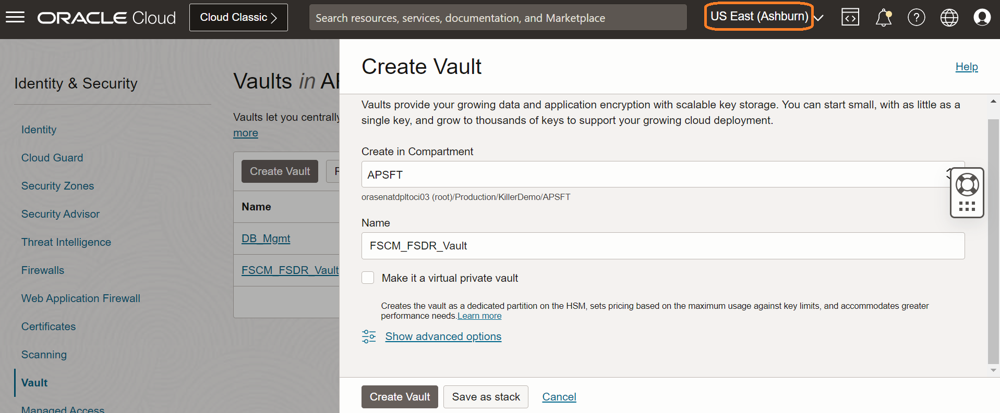

9. Click on newly created Vault and Under Resources, click on Master Encryption Keys and click on Create Key.

    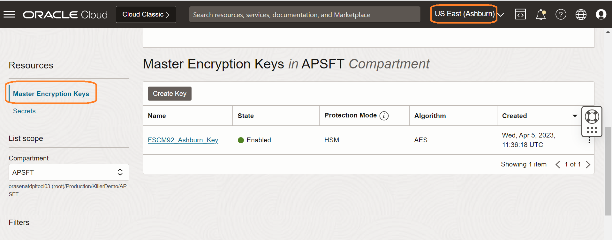

10. Select the right compartment, Protection Mode will be **HSM** and provide a name for the Key, Key Shape:Algorithm will be **AES (Symmetric key used for Encrypt and Decrypt)** and Key Shape:Length will be **256** bits. Click on Create Key.

    

11. Under Resources, click on Secrets and click on Create Secrets.

    

12. Select the right compartment, provide a name for the secret, a description for the secret, select the Master Encryption Key created in the previous task from the drop down, **Secret Type Template** will be Plain-Text, provide the DB SYS user password in plain text format in the **Secret Contents**.

    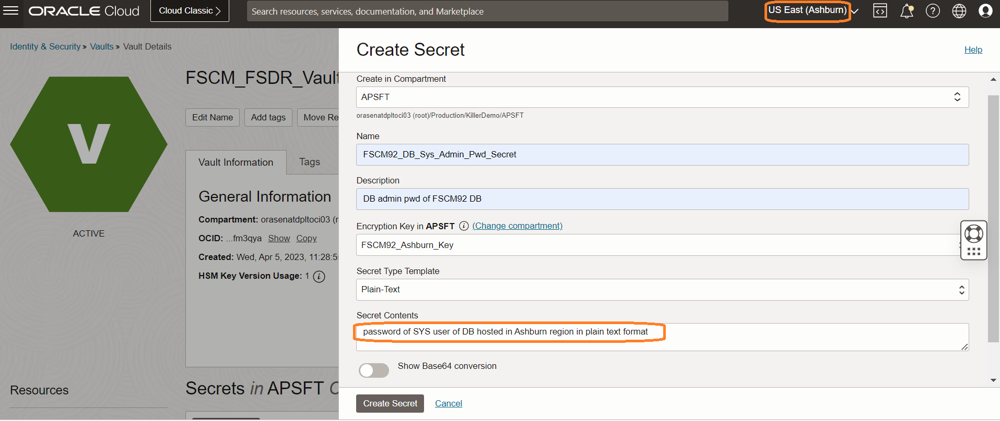

13. Change the region to Phoenix. 

    

14. Create a vault in the Phoenix (standby) region. 

    From the Phoenix region OCI console, select **Identity & Security** from the Hamburger menu then **Vault**.

    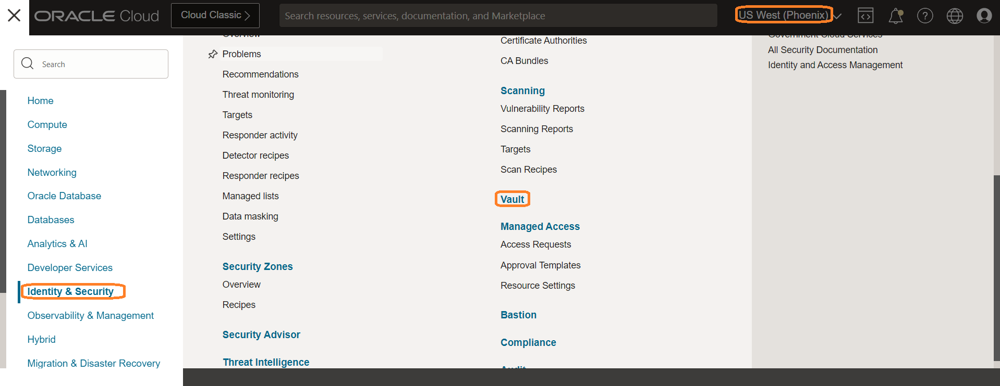

15. Click on Create Vault. Select the right compartment and provide a name for the Vault. Click on Create Vault.

    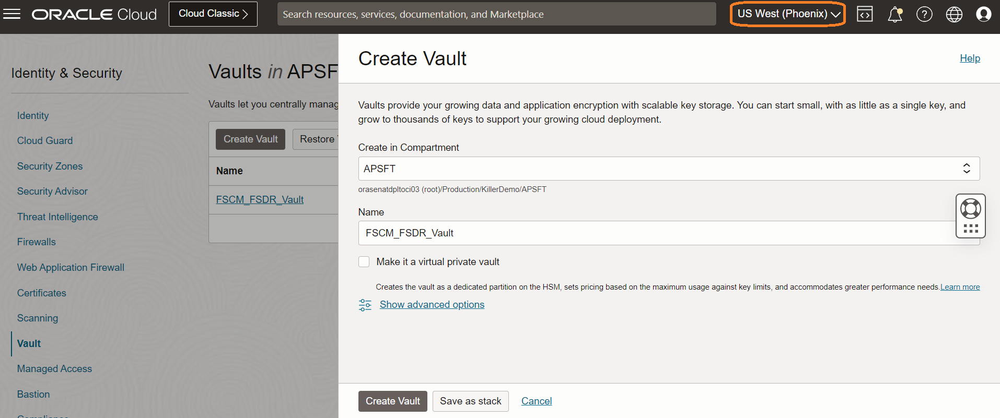

16. Under Resources, click on Master Encryption Keys and click on Create Key.

    

17. Select the right compartment, Protection Mode will be **HSM** and provide a name for the Key, Key Shape:Algorithm will be **AES (Symmetric key used for Encrypt and Decrypt)** and Key Shape:Length will be **256** bits. Click on Create Key.

    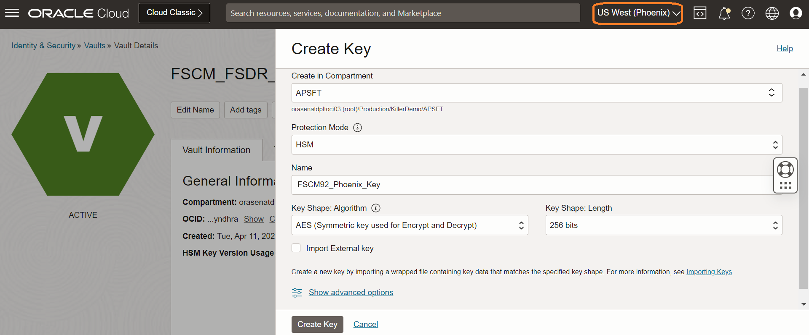

18. Under Resources, click on Secrets and click on Create Secrets.

    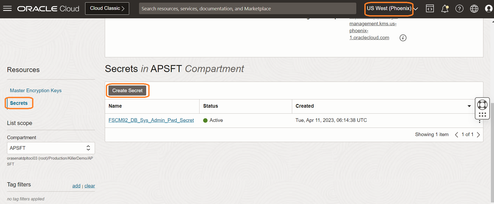

19. Select the right compartment, provide a name for the secret, a description for the secret, select the Master Encryption Key created in the previous task from the drop down, **Secret Type Template** will be Plain-Text, provide the DB SYS user password in plain text format in the **Secret Contents**.

    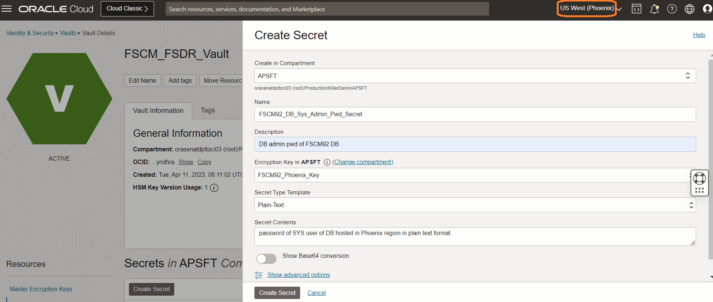

   You may now **proceed to the next lab**.

## Acknowledgements

- **Author** -  Vinay Shivanna, Principal Cloud Architect
- **Last Updated By/Date** -  Vinay Shivanna, Principal Cloud Architect, April 2023
