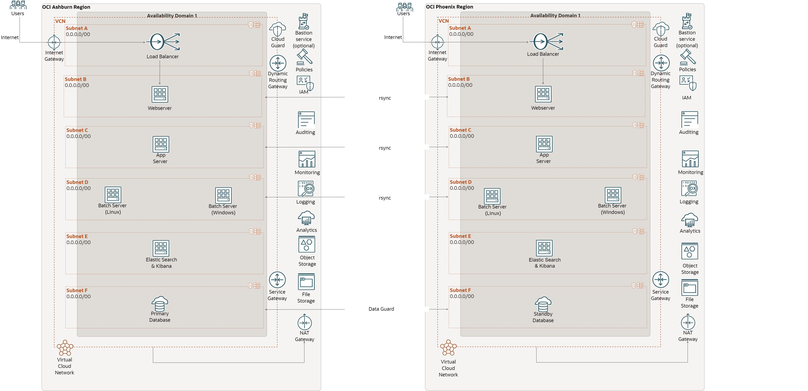

# **Protect PeopleSoft Application using Oracle Full Stack Disaster Recovery**

## Overview of OCI Full Stack Disaster Recovery

Full Stack Disaster Recovery Service is a fully managed OCI disaster recovery orchestration and management service that provides comprehensive disaster recovery capabilities for all layers of an application stack, including infrastructure, middleware, database, and application across  **OCI regions**.

Throughout this workshop, we will use FSDR to denote OCI Full Stack Disaster recovery.

- FSDR assures comprehensive business continuity from a variety of data center outages. Using Disaster Recovery Service for disaster recovery ensures that organizations are minimally impacted if there is a region-wide outage or Availability Domain outage.

- FSDR provides fully automated, end-to-end disaster recovery for the entire Oracle stack, including the infrastructure, databases, engineered systems, virtual infrastructure, storage, and full-stack applications in OCI. It integrates with underlying replication mechanisms that synchronize primary and standby environments and protects mission-critical data.

- FSDR is flexible and integrates with various Oracle platforms and non-Oracle applications and infrastructure. It generates, runs, and monitors disaster recovery plans for services and applications deployed in your tenancy. Disaster recovery operations are at the service level, so there is no impact on running other services in your tenancy. You can customize the disaster recovery plans generated by FSDR based on your specific needs.

Below are some of the critical functionalities of Full Stack Disaster Recovery Service

- Create and automate DR run books and make them more flexible.
- Manage DR operations (Switchover and Failover) using a single pane of glass.
- Provide comprehensive logs with error management and recovery.
- Perform pre-checks before the DR execution plan.
- Provide a framework to customize DR operations.

## Benefits of OCI Full Stack Disaster Recovery

Full Stack Disaster Recovery provides multiple benefits in the area of business continuity.

- Provides comprehensive disaster protection for the entire Application( Oracle/Non-Oracle) stack, including databases, VMs, attached volumes, storage, and applications across different OCI regions.
- Minimizes Recovery Time Objectives (RTO).
- Automates disaster recovery operations.
- Eliminates the need for domain specialists and dedicated administrators for disaster recovery.
- Provides highly flexible and customized disaster recovery plans. You can integrate your custom automation into the DR workflow.
- Provides a comprehensive dashboard for monitoring disaster recovery readiness and launching DR workflows.
- Executes scalable and reliable complete stack switchover and failover operations with a button.
- Operates at the service level instead of requiring the customer to manually failover VMs, databases, middleware, applications, storage, and load balancers.

## About the Workshop

In this workshop, we will see how easily Full Stack Disaster Recovery will help to orchestrate DR switchover operations for a PeopleSoft Application deployed in OCI across two OCI regions.

## Estimated Workshop Time

Approximately 4 hrs

## Workshop Objectives

- Verify the status of the PeopleSoft environments in Ashburn (Primary) and Phoenix (Standby) regions for using the FSDR.
- Create DR Protection groups (DRPG) in Ashburn (Primary) and Phoenix (Standby) regions.
- Associate Ashburn DRPG as Primary and Phoenix DRPG as Standby.
- Add members to Ashburn DRPG. Application Virtual machines and DBCS (Database Cloud Services) database.
- Add members to Phoenix DRPG. Standby DBCS Database.
- Create and Customize DR Switchover Plan in Phoenix( Standby) DRPG
- Run DR Switchover Pre-checks in Phoenix( Standby) DRPG
- Run DR Switchover Plan in Phoenix( Standby) DRPG
- Verify the PeopleSoft application accessiblity from Phoenix (New Primary) region.

## Prerequisites

- An active PeopleSoft applications hosted in Ashburn region (Primary) with below PeopleSoft components.
    - PeopleSoft Database hosted on OCI Database as a Service (DbaaS) platform / Database Cloud Service(DBCS)
    - PeopleSoft Application Server domain hosted on Linux
    - PeopleSoft Process Scheduler domain hosted on Linux
    - PeopleSoft Process Scheduler domain hosted on Windows
    - PeopleSoft Web Server domain hosted on Linux
    - Elastic Search and Kibana services hosted on Linux
- A standby PeopleSoft applications hosted in Phoenix region (Standby) with below PeopleSoft components.
    - PeopleSoft Application Server domain hosted on Linux
    - PeopleSoft Process Scheduler domain hosted on Linux
    - PeopleSoft Process Scheduler domain hosted on Windows
    - PeopleSoft Web Server domain hosted on Linux
    - Elastic Search and Kibana services hosted on Linux
- Files and folders synchronization enabled between Ashburn (Primary) and Phoenix (Standby) for all customisations and psreports.
- Load Balancer running in Ashburn (Primary) and Phoenix (Standby) regions.
- DNS record pointing to public IP of Ashburn (Primary) Load Balancer.

## PeopleSoft Architecture

Below is the architecture of PeopleSoft environment running on Oracle Cloud Infrastructure(OCI) which will be used in this workshop.

## Environment details

- **Ashburn** is the Primary region, and **Phoenix** is the Standby region.
* **PeopleSoft Application** - FSCM 9.2.47
* **PeopleTools** - 8.60.03
* **Database** - 19.17.0.0.0
* **Oracle WebLogic** - 14.1.1
* **Tuxedo** - 12.2.2.0.0
* **Elastic Search** - 7.10.0

## Disclaimer

The following is intended to outline our general product direction. It is intended for information purposes only, and may not be incorporated into any contract. It is not a commitment to deliver any material, code, or functionality, and should not be relied upon in making purchasing decisions. The development, release, and timing of any features or functionality described for Oracle’s products remains at the sole discretion of Oracle.

You may now **proceed to the next lab.**

## Acknowledgements

- **Author** -  Vinay Shivanna, Principal Cloud Architect
- **Contributors** - 
- **Last Updated By/Date** -  Vinay Shivanna, April 2023

