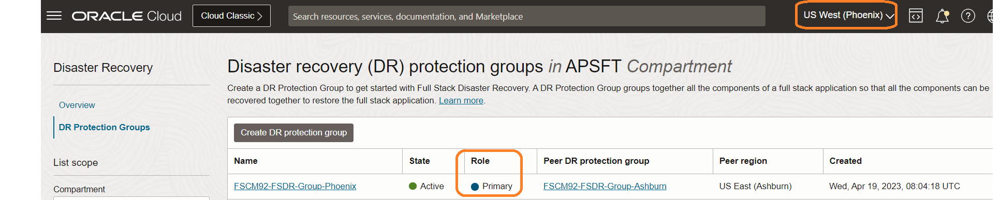
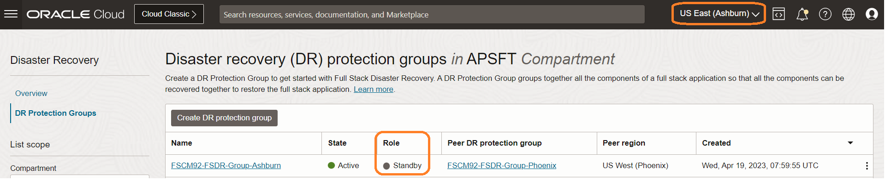

# Verify the DR Protection group status and PeopleSoft Application post switchover

## Introduction

We will verify the DR Protection Group (DRPG) status and PeopleSoft Application post switchover.

Estimated Time: 15 Minutes

### Objectives

- Verify the DRPG status
- Access the PeopleSoft Application from the phoenix region
- Verify DNS domain record and PeopleSoft Process Instances

## Task 1: Verify the DRPG status

1. Login into OCI Console. Select region as **Pheonix**.

  

2. Select Migration and Disaster Recovery from the Hamburger menu, then **Disaster Recovery** -> **DR Protection Groups**. Verify the region is **Phoenix**

  

3. Notice the *Role* of the **FSCM92-FSDR-Group-Phoenix** DRPG; it has automatically changed to *Primary*. Now we have our new primary region as *Phoenix region*

  

4. Change the region to **Ashburn**.

  

5. Select Migration and Disaster Recovery from the Hamburger menu, then **Disaster Recovery** -> **DR Protection Groups**. Verify the region is **Ashburn**

  

6. Notice the *Role* of the **FSCM92-FSDR-Group-Ashburn** DRPG; it has automatically changed to *Standby*. Now we have our new standby region as *Ashburn region*

  

## Task 2: Access PeopleSoft Application from the phoenix region

1. From the Hamburger menu, select **Networking**, then **Load Balancers** .Verify the region is **Phoenix**
  
     

  The Overall Health status of the Load Balancer will be OK.

     

2. Open a tab in your browser and access the PeopleSoft Application. You should be able to see that the application is working as expected from the Phoenix region.

      

  **PeopleSoft application is accessible from the new primary region (Phoenix)**

## Task 3: Verify DNS domain record and PeopleSoft Process Instances

1. Run nslookup command to verify that DNS domain record is resolving to public IP of Phoenix Load Balancer.

     

2. Login to PeopleSoft application and go to Process Monitor to check and verify that Processes which were ran in Ashburn region are still present and accessible after switching to Phoenix region.

     

We have now achieved the complete automation of switching over a PeopleSoft application (Full Stack) from Ashburn region to Phoenix region with a single click of a button.

## Acknowledgements

- **Author** -  Vinay Shivanna, Principal Cloud Architect
- **Last Updated By/Date** -  Vinay Shivanna, Principal Cloud Architect, April 2023
