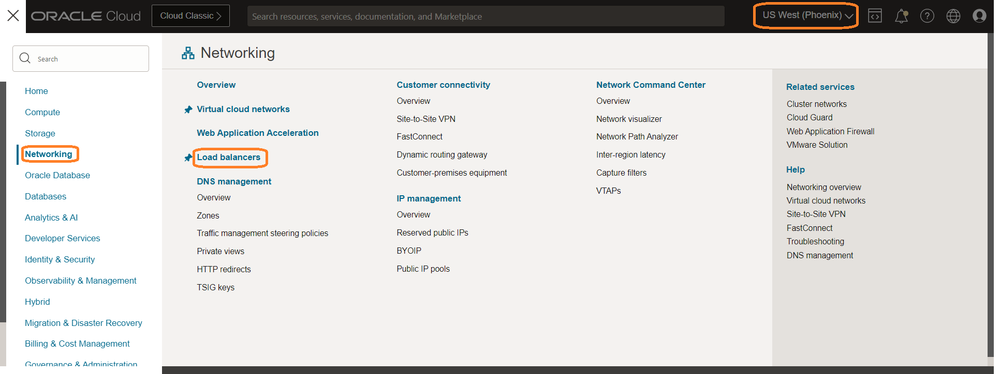

# Verify the DR Protection group status and MuShop Application post switchover

## Introduction

We will verify the DR Protection Group (DRPG) status and MuShop Application post switchover.

Estimated Time: 5 Minutes

Watch the video below for a quick walkthrough of the lab.

[Post Switchover tasks](videohub:1_o4qx53ec)

### Objectives

- Verify the DRPG status
- Access the MuShop Application from the phoenix region

## Task 1: Verify the DRPG status

1. Login into OCI Console with your provided Credentials. Select region as **Pheonix**.

  

2. Select Migration and Disaster Recovery from the Hamburger menu, then **Disaster Recovery** -> **DR Protection Groups**. Verify the region is **Phoenix**

  

3. Notice the *Role* of the **mushop-phoenix** DRPG; it has automatically changed to *Primary*. Now we have our new primary region as *Phoenix region*

  

4. Login into OCI Console with your provided Credentials. Select region as **Ashburn**.

  

5. Select Migration and Disaster Recovery from the Hamburger menu, then **Disaster Recovery** -> **DR Protection Groups**. Verify the region is **Ashburn**

  

6. Notice the *Role* of the **mushop-ashburn** DRPG; it has automatically changed to *Standby*. Now we have our new standby region as *Ashburn region*

  

## Task 2: Access MuShop Application from the phoenix region

1. From the Hamburger menu, select **Networking**, then **Load Balancers** .Verify the region is **Phoenix**
  
     

 Gather the Public IP address of the Load Balancer

     

  Open a tab in your browser and verify the Mushop Application using the gathered public IP address. You should be able to see that the application is working as expected from the Phoenix region.

      

**Mushop application is accessible from the new primary region (Phoenix)**

This concludes the lab Protect your business using Oracle Full Stack Disaster Recovery Service. We have seen the complete automation of switching over a MuShop application (Full Stack) from the Ashburn region to the Phoenix region with a single click of a button! 

## Acknowledgements

- **Author** -  Suraj Ramesh, Principal Product Manager
- **Last Updated By/Date** -  Suraj Ramesh,September 2022
