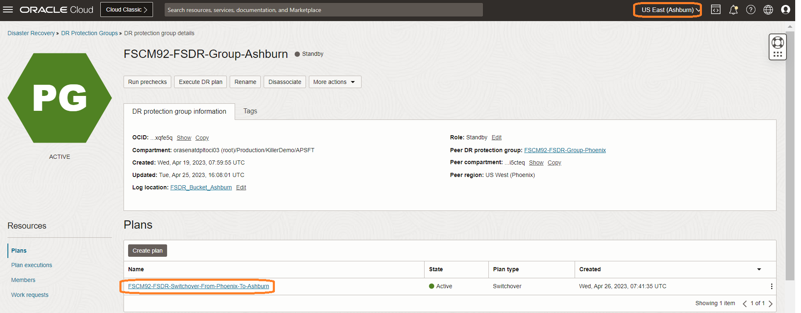
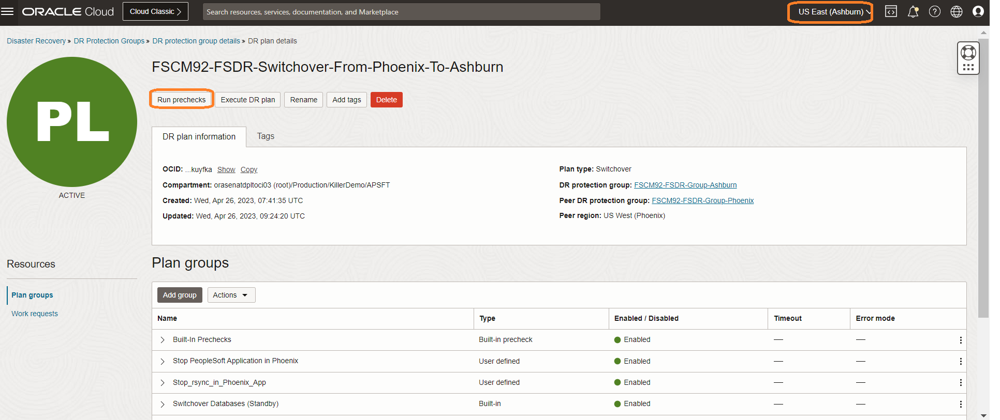
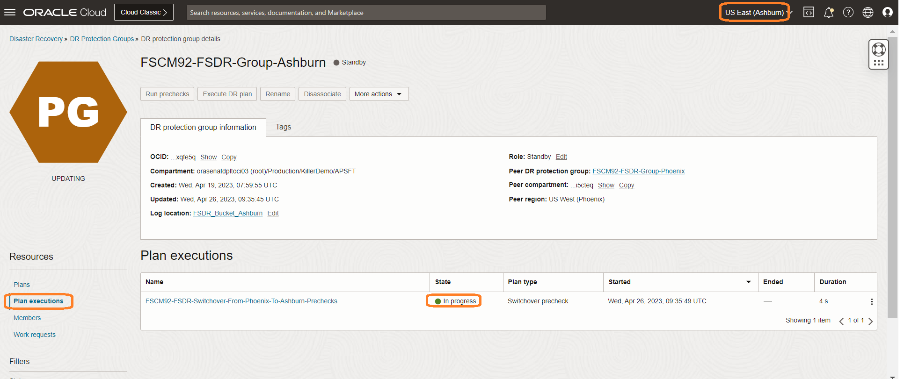

# Perform pre-checks for the DR Switchover (Rollback) Plan

## Introduction

In this lab, we will execute **Run Prechecks** for the **FSCM92-FSDR-Switchover-From-Phoenix-To-Ashburn** switchover plan, which we have created in lab 8.

Execute **Run Prechecks**  will perform only the *pre-checks* and not the actual execution. Having the pre-checks completed successfully is essential as a pre-requisite for running the actual switchover plan.

Estimated Time: 15 Minutes

### Objectives

- Perform Run prechecks for the FSCM92-FSDR-Switchover-From-Phoenix-To-Ashburn plan
- Monitor the executed prechecks plan
- Verify the executed prechecks plan

## Task 1: Perform Run prechecks for the Switchover plan

1. Login into OCI Console. Select region as **Ashburn**.

  

2. Select Migration and Disaster Recovery from the Hamburger menu, then **Disaster Recovery** -> **DR Protection Groups**. Verify the region is **Ashburn**

  

3. You will land on the Disaster Recovery Protection group home page; make sure you have selected the Ashburn region.

  

4. Select the **FSCM92-FSDR-Group-Ashburn** DRPG and select **FSCM92-FSDR-Switchover-From-Phoenix-To-Ashburn** plan

  

5. Click on **Run prechecks** section, which will be right below the **FSCM92-FSDR-Switchover-From-Phoenix-To-Ashburn** plan

  

6. In the **Run prechecks** window, provide the Plan execution name as **FSCM92-FSDR-Switchover-From-Phoenix-To-Ashburn-Prechecks** and hit **Run prechecks**

  

## Task 2: Monitor the executed prechecks plan

1. Navigate to **Plan executions** section under **Resources** and select the **FSCM92-FSDR-Switchover-From-Phoenix-To-Ashburn-Prechecks** plan execution.Initially, it will show all the **Built-in Prechecks** as *queued or in-progess*

  

2. After 2-3 mins, **Built-in Prechecks**  will be completed successfully. You can verify the duration of each step, status, duration of entire prechecks, etc. *It is essential to have successful completion of pre-check execution*

      

   You may now **proceed to the next lab**.

## Acknowledgements

- **Author** -  Vinay Shivanna, Principal Cloud Architect
- **Last Updated By/Date** -  Vinay Shivanna, Principal Cloud Architect, April 2023
