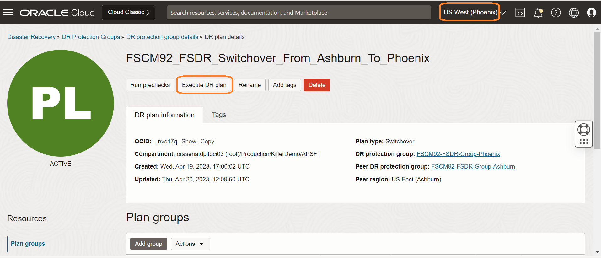
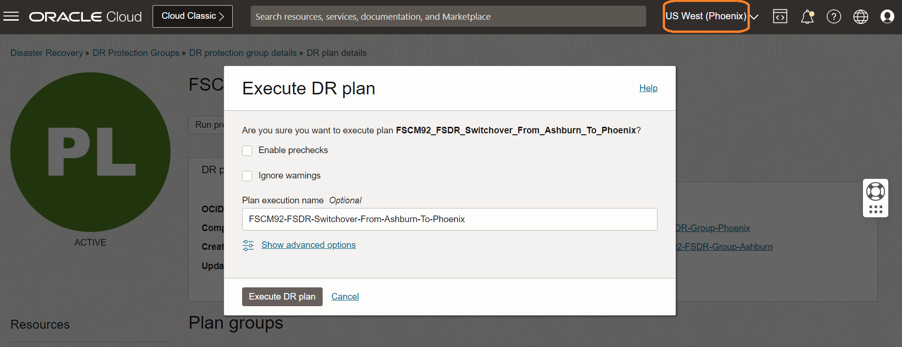
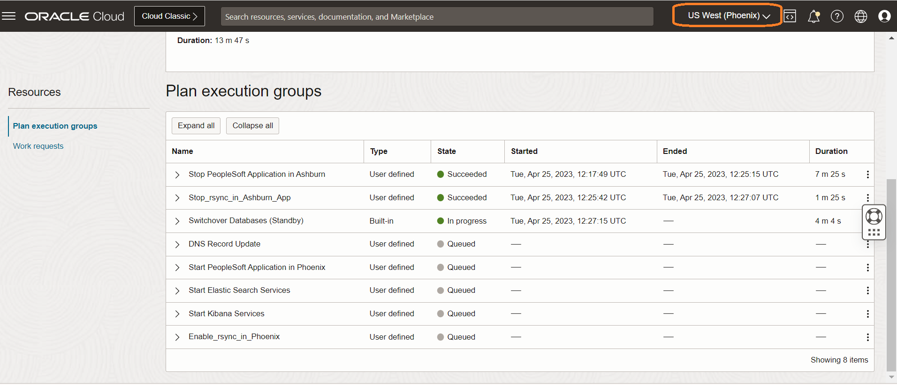
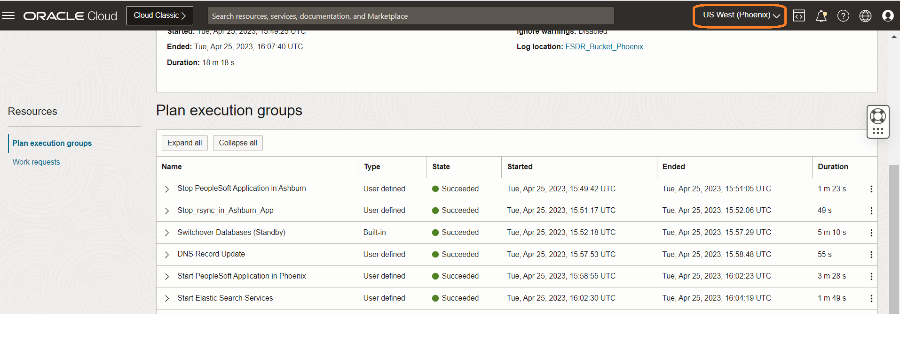
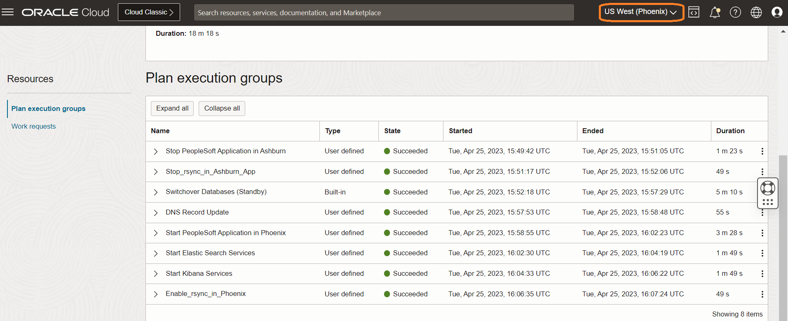

# Execute DR Switchover Plan

## Introduction

In this lab, we will execute the actual switchover plan  **FSCM92\_FSDR\_Switchover\_From\_Ashburn\_To\_Phoenix**, which we have created in lab 4. The switchover plan will execute the series of steps as per the order.

Estimated Time: 25 Minutes

### Objectives

- Verify PeopleSoft Application status in Ashburn
- Execute the switchover plan
- Monitor the executed switchover plan
- Verify the executed switchover plan

## Task 1: Check and verify PeopleSoft Application status in Ashburn

1. Do a nslookup to PeopleSoft Application DNS domain name and notice that it resolves to public IP of Ashburn Load Balancer.

    

2. Run a sample process in PeopleSoft Application running in Ashburn region and make an note of the Process Instance number and report output.

    

## Task 2: Execute the switchover plan

1. Login into OCI Console. Select region as **Phoenix**.
 
    

2. Select Migration and Disaster Recovery from the Hamburger menu, then **Disaster Recovery** -> **DR Protection Groups**. Verify the region is **Phoenix**

    

3. You will land on the Disaster Recovery Protection group home page; make sure you have selected the Phoenix region.

    

4. Select the **FSCM92-FSDR-Group-Phoenix** DRPG and select **FSCM92\_FSDR\_Switchover\_From\_Ashburn\_To\_Phoenix** plan

    

5. Click on **Actions** and click on **Execute Plan** section.

    

6. In the **Execute Plan** window

- Provide a name for the Plan execution like **FSCM92-FSDR-Switchover-From-Ashburn-To-Phoenix**
- Uncheck the **Enable prechecks**  (  Prechecks were executed successfully in Lab 5)
- Leave the **Ignore warnings** as it is
- Verify and hit **Execute DR Plan**

    

## Task 3: Monitor the executed switchover Plan

1. Navigate to **Plan executions** section under **Resources** and select the **FSCM92-FSDR-Switchover-From-Ashburn-To-Phoenix** plan execution.Initially, it will show all the steps as *Queued*.

  Refresh the page; within a few seconds, the **State** will change from *Queued* to *In Progress*.

3. All the *plan groups* will run serially, but steps inside each *plan group* will be parallel. Monitor the various plan group and steps which are running. Navigate to the three dots section for the respective plan group step and click. You get the option to view the log and download the log. These logs are stored in the object storage bucket provided during the DRPG creation. You can monitor the Progress and download the log if necessary for troubleshooting.

     

5. Once each plan group is executed successfully, it will move on to the next group for execution. 

     

6. Keep monitoring the rest of the groups and steps; each step will complete depending on the actual task.

     

7. Wait for all the steps to complete successfully.  It is important to monitor the progress of each step and take actions in case of any failures. 

## Task 4: Verify the executed switchover plan

1. From the plan execution detail, verify the duration of each step, status, duration of the entire switchover plan, etc. *It is essential to have successful completion of all steps*. Use the Expand all button to expand all the steps and the Collapse all button for collapsing. Use the view or download log option to see step execution details.

      

   **The entire DR Switchover operation took around 18 minutes to complete**. This time will vary based on various factors like custom scripts execution, number of compute instances involved in DR operations etc.

You may now **proceed to the next lab**.

## Acknowledgements

- **Author** -  Vinay Shivanna, Principal Cloud Architect
- **Last Updated By/Date** -  Vinay Shivanna, Principal Cloud Architect, November 2025

