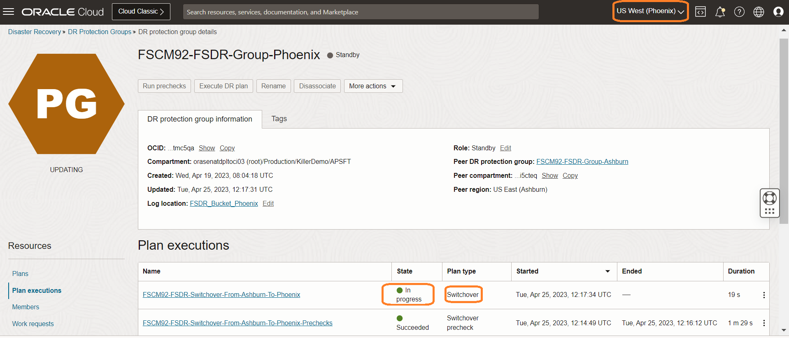
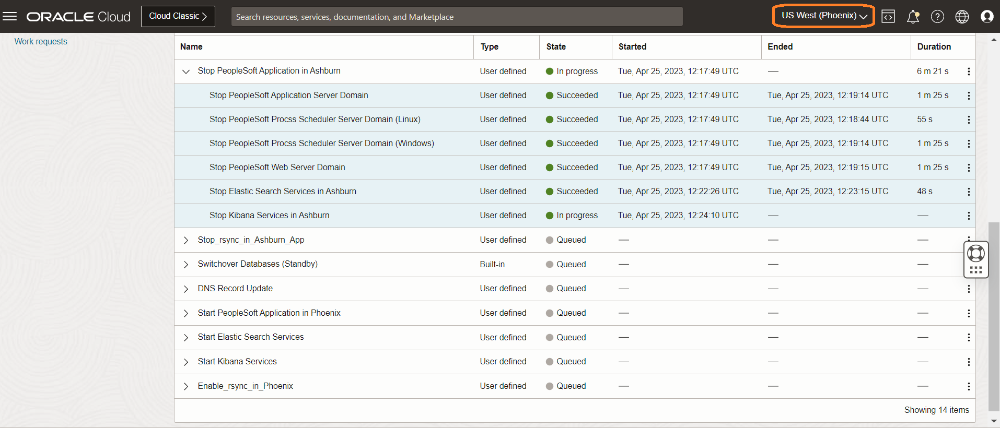
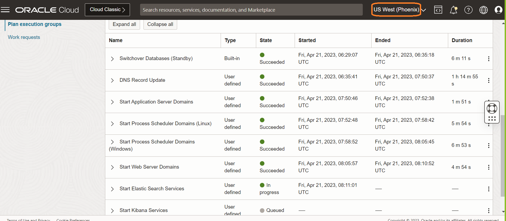

# Perform pre-checks for the DR Switchover Plan

## Introduction

In this lab, we will execute the actual switchover plan for the **mushop-app-switchover** switchover plan, which we have created in lab 4. The switchover plan will execute the series of steps per the switchover plan.

Estimated Time: 20 Minutes

Watch the video below for a quick walkthrough of the lab.

[Perform Switchover](videohub:1_d9ownrzi)

### Objectives

- Execute the switchover plan
- Monitor the executed switchover plan
- Verify the executed switchover plan

## Task 1: Execute switchover for mushop-app-switchover plan

1. Login into OCI Console with your provided Credentials. Select region as **Pheonix**.

  

2. Select Migration and Disaster Recovery from the Hamburger menu, then **Disaster Recovery** -> **DR Protection Groups**. Verify the region is **Phoenix**

  

3. You will land on the Disaster Recovery Protection group home page; make sure you have selected the Phoenix region.

  

4. Select the **mushop-phoenix** DRPG and select **mushop-app-switchover** plan

  

5. Navigate to the **Execute Plan** section, which will be right below the **mushop-app-switchover** plan, and select

  

6. In the **Execute Plan** window

- Provide the Plan execution name as **mushop-app-switchover-execute**
- Uncheck the **Enable prechecks**  (  Prechecks were executed successfully in Lab 5)
- Leave the **Ignore warnings** as it is
- Verify and hit **Execute Plan**

  

## Task 2: Monitor the executed mushop-app-switchover Plan

1. Navigate to **Plan executions** section under **Resources** and select the **mushop-app-switchover-execute** plan execution.Initially, it will show all the steps as *Queued*

  

2. Refresh the page; within a few seconds, the **State** will change from *Queued* to *In Progress*.

  

3. All the *plan groups* will run serially, but steps inside each *plan group* will be parallel. As an example, *Remove Primary Load Balancer Backends* group will start first, and the steps (Remove Primary Backend on Node-0 and Remove Primary Backend on Node-1) are part of this group will run in parallel.

4. Monitor the various plan group and steps which are running. Navigate to the three dots section for the respective plan group step and click. You get the option to view the log and download the log. These logs are stored in the object storage bucket provided during the DRPG creation. You can monitor the Progress and download the log if necessary for troubleshooting.

   

5. Once each plan group is executed successfully, it will move on to the next group for execution. Here you can see  *Remove Primary Load Balancer Backends*  completed successfully (State-Succeeded) and the next group **Stop Compute Instances (Primary)** started running (State: In progress).

   

6. Keep monitoring the rest of the groups and steps; each step will complete depending on the actual task (DB Switchover, VM Stop, Script execution ), etc.). For example, ATP DB Switchover will take more time when compared to stopping VM. You can verify the start and end of each step, total duration, logs, etc.

   

7. Wait for all the steps to complete successfully.  It is important to monitor the progress of each step and take actions in case of any failures.  Switchover Autonomous Databases (Standby) group will run for around 10 minutes. 

**Approximately it will take *20-30* mins to successfully complete the switchover plan**

## Task 3: Verify the executed switchover plan

1. From the plan execution detail, verify the duration of each step, status, duration of the entire switchover plan, etc. *It is essential to have successful completion of all steps*. In this example it took around 27 minutes to complete. These timings will vary.Use the Expand all button to expand all the steps and the Collapse all button for collapsing. Use the view or download log option to see step execution details.

      

You may now **proceed to the next lab**.

Refer to the **Troubleshooting tips** section for known failures and corrective actions.

## Troubleshooting tips

1. If any of the Step fails, verify the log and take necessary actions.
2. If required cancel the plan and run prechecks as per Lab 5.1, verify for successful execution.

## Acknowledgements

- **Author** -  Suraj Ramesh, Principal Product Manager
- **Last Updated By/Date** -  Suraj Ramesh,September 2022
